<p align="center">
    <br><br>
    <strong>Universidad Peruana de Ciencias Aplicadas</strong><br>
    <strong>Facultad de Ingeniería</strong>
</p>
<br>
<p align="center">
    <strong>Curso:</strong> 1ASI0572 - Desarrollo de Soluciones IOT<br>
    <strong>Sección:</strong> 6772
</p>
<br>
<p align="center">
    <strong>Nombre del profesor:</strong> Marco Antonio León Baca
</p>
<br>
<p align="center">
    <strong>"Informe del Trabajo Parcial"</strong>
</p>
<br>
<p align="center">
    <strong>Nombre del grupo:</strong> ParkSense IoT<br>
    <strong>Nombre del producto:</strong> SpotFinder
</p>
<br>
<p align="center"><strong>Integrantes:</strong></p>

<div align="center">

| Código | Apellidos y Nombres |
|:---:|:---:|
| U202310210 | Esteban Román, Henry Kalet |
| U202117475 | Dueñas Canales, Leonardo Manuel |
| U202314186 | Vidal Castro, Miguel Angel |
| U202213241 | Allcca Guerrero, Irving Washington |
| U202311053 | Cruz Ibarra, Victor Andrés |

</div>

<br>
<p align="center">Lima – Abril 2026</p>

<div style="page-break-after: always;"></div>

# Project Report Collaboration Insights
| Versión | Fecha | Autor | Descripción de modificación |
|---|---|---|---|
| 1.0.0 | 2026-04-04 | Esteban Román, Henry Kalet | Creación de estructura base del repositorio, carátula, CONTRIBUTING.md y registro de versiones. |
| 1.1.0 | 2026-04-06 | Esteban Román, Henry Kalet | Redacción de Capítulo I: Startup Profile, Solution Profile (5W+2H, Lean UX Process) y Segmentos Objetivo. |
| 1.2.0 | 2026-04-08 | Vidal Castro, Miguel Angel | Desarrollo de Capítulo II: Competidores (análisis competitivo), estrategias frente a competidores. |
| 1.2.1 | 2026-04-09 | Cruz Ibarra, Victor Andrés | Diseño de entrevistas, registro y análisis de entrevistas del Segmento 2 (Administradores). |
| 1.2.2 | 2026-04-11 | Allcca Guerrero, Irving Washington | Needfinding: User Personas, User Task Matrix, Empathy Mapping. |
| 1.2.3 | 2026-04-11 | Dueñas Canales, Leonardo Manuel | Needfinding: User Journey Mapping. Registro de entrevistas Segmento 1 (Conductores). |
| 1.3.0 | 2026-04-13 | Esteban Román, Henry Kalet | Capítulo II: Big Picture Event Storming (10 pasos), Ubiquitous Language. |
| 1.4.0 | 2026-04-15 | Esteban Román, Henry Kalet | Capítulo III: User Stories (US, TS, SWS, SS), Impact Mapping y Product Backlog. |
| 1.4.1 | 2026-04-16 | Vidal Castro, Miguel Angel | Capítulo III: Technical Stories adicionales (TS22-TS61) integradas al backlog. |
| 1.5.0 | 2026-04-18 | Cruz Ibarra, Victor Andrés | Capítulo IV: Candidate Context Discovery y Domain Message Flows Modeling. |
| 1.5.1 | 2026-04-19 | Allcca Guerrero, Irving Washington | Capítulo IV: Bounded Context Canvases (Parking Monitoring, Access Control, Payment Processing). |
| 1.5.2 | 2026-04-20 | Vidal Castro, Miguel Angel | Capítulo IV: Context Mapping con patrones DDD y análisis de alternativas. |
| 1.5.3 | 2026-04-21 | Dueñas Canales, Leonardo Manuel | Capítulo IV: Software Architecture (System Landscape, Context, Container, Deployment diagrams). |
| 1.6.0 | 2026-04-22 | Esteban Román, Henry Kalet | Capítulo IV: Tactical DDD - Domain Layer, Interface Layer, Application Layer, Infrastructure Layer para los 7 Bounded Contexts. |
| 1.6.1 | 2026-04-22 | Dueñas Canales, Leonardo Manuel | Capítulo IV: Component Level Diagrams para Bounded Contexts. |
| 1.6.2 | 2026-04-23 | Cruz Ibarra, Victor Andrés | Capítulo IV: Database Design Diagrams para Bounded Contexts. |
| 1.7.0 | 2026-04-24 | Esteban Román, Henry Kalet | Integración de Student Outcome, Conclusiones, Bibliografía y Anexos para AV1. |
| 2.0.0 | 2026-04-26 | Allcca Guerrero, Irving Washington | Capítulo V: Style Guidelines (General, Web/Mobile/IoT), Information Architecture (Organization, Labeling, SEO, Searching, Navigation) y Landing Page UI Design (Wireframe, Mock-up). |
| 2.1.0 | 2026-04-29 | Allcca Guerrero, Irving Washington; Vidal Castro, Miguel Angel; Cruz Ibarra, Victor Andrés | Capítulo V: Applications UX/UI Design (Wireframes, Wireflow Diagrams, Mock-ups, User Flow Diagrams) y Applications Prototyping para Web y Mobile. |
| 2.2.0 | 2026-05-01 | Esteban Román, Henry Kalet | Capítulo V: IoT Device Design (5.6) – diagrama de componentes ESP32, esquemático del sensor de ocupación y arquitectura edge-to-cloud. |
| 2.3.0 | 2026-05-04 | Equipo ParkSense | Capítulo VI: Software Configuration Management – Software Development Environment Configuration, Source Code Management, Source Code Style Guide & Conventions, Software Deployment Configuration. |
| 2.4.0 | 2026-05-07 | Equipo ParkSense | Capítulo VI: Sprint 1 – Sprint Planning 1, Aspect Leaders and Collaborators, Sprint Backlog 1. |
| 2.5.0 | 2026-05-11 | Equipo ParkSense | Capítulo VI: Sprint Review Evidence – Development, Testing Suite, Execution, Services Documentation, Software Deployment y Team Collaboration Insights del Sprint 1. |
| 2.6.0 | 2026-05-13 | Esteban Román, Henry Kalet | Actualización de Student Outcome con acciones TB1, Conclusiones, Bibliografía y Anexos para la entrega TB1. |
 
## Project Report Collaboration Insights
 
**URL del repositorio para el Project Report:** [https://github.com/ParkSenseIoT/SpotFinder-Report](https://github.com/ParkSenseIoT/SpotFinder-Report)
 
Se utilizó GitHub como plataforma de control de versiones y colaboración en equipo. Se siguió el flujo de trabajo **GitFlow** con las ramas principales `main` y `develop`, y ramas de trabajo `feature/<sección>` para cada contribución individual.
 
Los integrantes del equipo y sus nombres de usuario en GitHub son los siguientes:
 
| Integrante | Código | Nombre en GitHub |
|---|---|---|
| Esteban Román, Henry Kalet | U202310210 | kalet123-commit |
| Dueñas Canales, Leonardo Manuel | U202117475 | insonnio |
| Vidal Castro, Miguel Angel | U202314186 | gossk |
| Allcca Guerrero, Irving Washington | U202213241 | eviterno17 |
| Cruz Ibarra, Victor Andrés | U202311053 | elandrehs |
 
### AV1
 
#### Tareas asignadas
 
Para el desarrollo del AV1 (TB1), cada participante del equipo realizó las siguientes tareas:
 
| Integrante | Tareas asignadas |
|---|---|
| **Esteban Román, Henry Kalet** | - Capítulo I completo (Startup Profile, Solution Profile, Lean UX, Segmentos Objetivo) - Capítulo II: Big Picture Event Storming (10 pasos), Ubiquitous Language - Capítulo III: User Stories (US, TS, SWS, SS), Impact Mapping, Product Backlog - Capítulo IV: Tactical DDD (Domain Layer, Interface Layer, Application Layer, Infrastructure Layer para 7 BCs), Class Diagrams - Component Level Diagrams (en colaboración con Leonardo) |
| **Dueñas Canales, Leonardo Manuel** | - Capítulo II: User Journey Mapping, registro de entrevistas Segmento 1 - Capítulo IV: Software Architecture (System Landscape, Context, Container, Deployment diagrams) - Component Level Diagrams para Bounded Contexts (en colaboración con Henry) |
| **Vidal Castro, Miguel Angel** | - Capítulo II: Análisis competitivo, estrategias frente a competidores - Capítulo III: Technical Stories adicionales (integración con equipo) - Capítulo IV: Context Mapping con patrones DDD y análisis de alternativas |
| **Allcca Guerrero, Irving Washington** | - Capítulo II: User Personas, User Task Matrix, Empathy Mapping - Capítulo IV: Bounded Context Canvases (Parking Monitoring, Access Control, Payment Processing, Emergency, Analytics, Notification, IAM) |
| **Cruz Ibarra, Victor Andrés** | - Capítulo II: Diseño de entrevistas, registro y análisis de entrevistas Segmento 2 - Capítulo IV: Candidate Context Discovery, Domain Message Flows Modeling - Capítulo IV: Database Design Diagrams para Bounded Contexts |
 
#### GitHub Collaboration Insights
 
En GitHub se presenta un timeline de las principales ramas creadas por cada integrante del equipo, así como los procesos de merge realizados. Todas las ramas fueron gestionadas siguiendo el flujo de trabajo GitFlow.
 
**Gráfico de commits por integrante:**
 

 
**Gráfico de red (network graph) de ramas en el repositorio de GitHub:**
 

 
**Contribuciones de los integrantes:**
 

 
### TB1
 
#### Tareas asignadas
 
Para el desarrollo del TB1, partiendo de los entregables de AV1, cada participante del equipo realizó las siguientes tareas:
 
| Integrante | Tareas asignadas |
|---|---|
| **Esteban Román, Henry Kalet** | - Capítulo V: IoT Device Design (5.6) – diseño del nodo ESP32, esquemático del sensor de ocupación y arquitectura edge-to-cloud. - Capítulo VI: Software Configuration Management, Sprint 1 y evidencias de Sprint Review (en colaboración con el equipo), liderando la integración del backend de los 7 bounded contexts. - Conclusiones, Bibliografía y Anexos actualizados para TB1. |
| **Dueñas Canales, Leonardo Manuel** | - Capítulo VI: Software Configuration Management (entorno de desarrollo y Software Deployment Configuration) y Sprint 1 (Sprint Planning, Aspect Leaders, Sprint Backlog) en colaboración con el equipo. - Sprint Review: evidencia de despliegue (Software Deployment Evidence) y servicios documentados con OpenAPI. |
| **Vidal Castro, Miguel Angel** | - Capítulo V: Applications UX/UI Design (Wireframes, Wireflow Diagrams, Mock-ups, User Flow Diagrams) y Applications Prototyping, en colaboración con Irving y Victor. - Capítulo VI: contribuciones a Source Code Management y Style Guide, Sprint 1 y Sprint Review (Development y Testing Suite Evidence del frontend). |
| **Allcca Guerrero, Irving Washington** | - Capítulo V: Style Guidelines, Information Architecture y Landing Page UI Design (5.1 – 5.3) de forma íntegra. - Capítulo V: Applications UX/UI Design (5.4) y Applications Prototyping (5.5) en colaboración con Miguel y Victor. - Capítulo VI: SCM, Sprint 1 y Sprint Review (Development y Execution Evidence) en colaboración con el equipo. |
| **Cruz Ibarra, Victor Andrés** | - Capítulo V: Applications UX/UI Design (Wireframes, Wireflow Diagrams, Mock-ups, User Flow Diagrams) y Applications Prototyping en colaboración con Irving y Miguel. - Capítulo VI: contribución a Source Code Style Guide & Conventions, Sprint 1 y Sprint Review (Testing Suite y Services Documentation Evidence). |
 
#### GitHub Collaboration Insights
 
Para el TB1 el equipo trabajó en la organización [https://github.com/ParkSenseIoT](https://github.com/ParkSenseIoT), que contiene los repositorios `SpotFinder-Report` (informe), `SpotFinder-Backend` (servicios backend) y `SpotFinder-Flutter` (aplicación móvil), todos gestionados con el flujo **GitFlow** y ramas `feature/<sección>` por integrante.
 
**Gráfico de commits por integrante (TB1):**
 
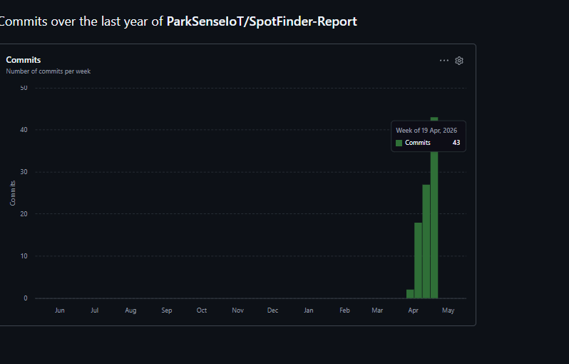
 
**Gráfico de red (network graph) de ramas en el repositorio durante TB1:**
 
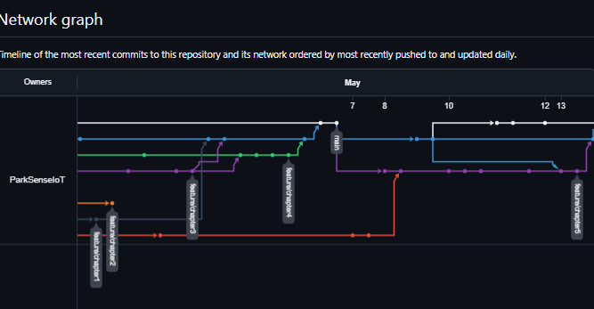
 
**Contribuciones de los integrantes durante TB1:**
 
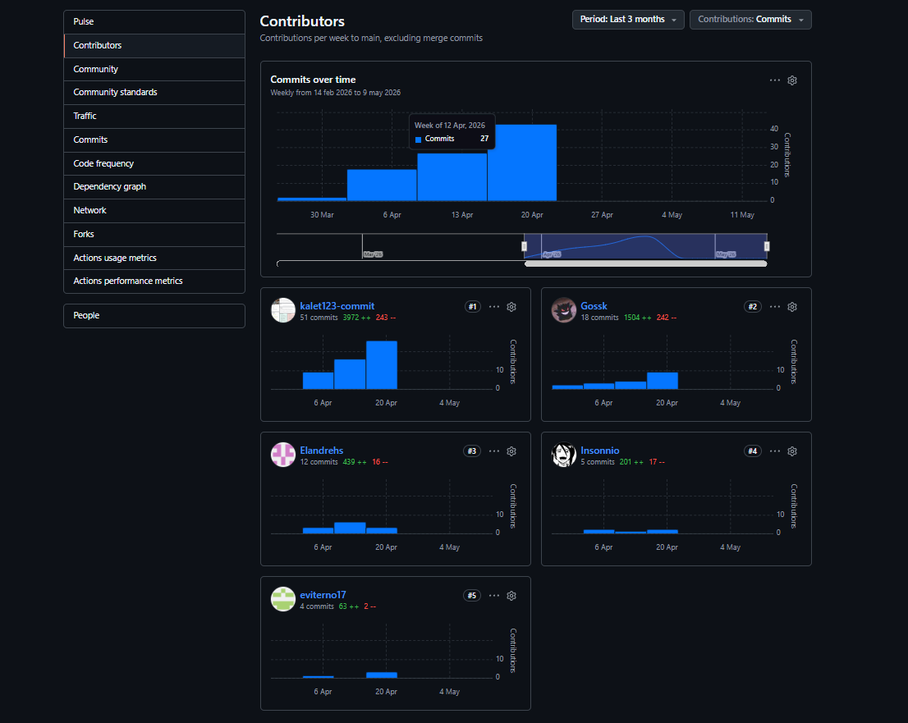

<div style="page-break-after: always;"></div>

---

<div style="page-break-after: always;">

# Contenido

- [Project Report Collaboration Insights](#project-report-collaboration-insights)
  - [Project Report Collaboration Insights](#project-report-collaboration-insights-1)
    - [AV1](#av1)
      - [Tareas asignadas](#tareas-asignadas)
      - [GitHub Collaboration Insights](#github-collaboration-insights)
    - [TB1](#tb1)
      - [Tareas asignadas](#tareas-asignadas-1)
      - [GitHub Collaboration Insights](#github-collaboration-insights-1)
- [Contenido](#contenido)
- [Student Outcome](#student-outcome)
  - [Student Outcome](#student-outcome-1)
- [Capítulo I: Introducción](#capítulo-i-introducción)
  - [1.1. Startup Profile](#11-startup-profile)
    - [1.1.1. Descripción de la Startup](#111-descripción-de-la-startup)
  - [1.1.2. Perfiles de integrantes del equipo](#112-perfiles-de-integrantes-del-equipo)
  - [1.2. Solution Profile](#12-solution-profile)
    - [1.2.1. Antecedentes y problemática](#121-antecedentes-y-problemática)
  - [1.2.2. Lean UX Process](#122-lean-ux-process)
    - [1.2.2.1. Lean UX Problem Statements](#1221-lean-ux-problem-statements)
      - [¿Quién es el usuario?](#quién-es-el-usuario)
      - [¿Dónde encaja nuestro producto en su vida?](#dónde-encaja-nuestro-producto-en-su-vida)
      - [¿Qué problemas tiene nuestro producto y cómo se pueden resolver?](#qué-problemas-tiene-nuestro-producto-y-cómo-se-pueden-resolver)
      - [¿Cómo y cuándo es usado nuestro producto?](#cómo-y-cuándo-es-usado-nuestro-producto)
      - [¿Qué características son importantes?](#qué-características-son-importantes)
      - [¿Cómo debe verse nuestro producto y cómo comportarse?](#cómo-debe-verse-nuestro-producto-y-cómo-comportarse)
    - [1.2.2.2. Lean UX Assumptions](#1222-lean-ux-assumptions)
      - [Business Assumptions](#business-assumptions)
      - [User Assumptions](#user-assumptions)
    - [1.2.2.3. Lean UX Hypothesis Statements](#1223-lean-ux-hypothesis-statements)
      - [1.2.2.4. Lean UX Canvas.](#1224-lean-ux-canvas)
  - [1.3. Segmentos objetivo.](#13-segmentos-objetivo)
      - [Primer segmento Objetivo: Conductores que visitan centros comerciales](#primer-segmento-objetivo-conductores-que-visitan-centros-comerciales)
        - [Perfil del Usuario (Conductor)](#perfil-del-usuario-conductor)
      - [Segundo segmento objetivo: Administradores de Estacionamientos](#segundo-segmento-objetivo-administradores-de-estacionamientos)
        - [Perfil del Cliente (Administrador)](#perfil-del-cliente-administrador)
- [Capítulo II: Requirements Elicitation \& Analysis](#capítulo-ii-requirements-elicitation--analysis)
  - [2.1. Competidores.](#21-competidores)
    - [2.1.1. Análisis competitivo](#211-análisis-competitivo)
      - [Competitive Analysis Landscape](#competitive-analysis-landscape)
    - [2.1.2. Estrategias y tácticas frente a competidores](#212-estrategias-y-tácticas-frente-a-competidores)
      - [**1. Diferenciación por integración IoT completa a bajo costo**](#1-diferenciación-por-integración-iot-completa-a-bajo-costo)
      - [**2. Alianzas estratégicas con operadores existentes**](#2-alianzas-estratégicas-con-operadores-existentes)
      - [**3. Experiencia del conductor como ventaja competitiva**](#3-experiencia-del-conductor-como-ventaja-competitiva)
      - [**4. Modelo de datos como diferenciador frente a Quadra**](#4-modelo-de-datos-como-diferenciador-frente-a-quadra)
      - [**5. Seguridad y respuesta a emergencias como valor agregado**](#5-seguridad-y-respuesta-a-emergencias-como-valor-agregado)
  - [2.2. Entrevistas.](#22-entrevistas)
    - [2.2.1. Diseño de entrevistas.](#221-diseño-de-entrevistas)
    - [Segmento 1: Conductores que visitan centros comerciales](#segmento-1-conductores-que-visitan-centros-comerciales)
      - [**Datos demográficos (para construcción de arquetipos)**](#datos-demográficos-para-construcción-de-arquetipos)
      - [**Preguntas sobre la problemática**](#preguntas-sobre-la-problemática)
      - [**Preguntas sobre la solución**](#preguntas-sobre-la-solución)
    - [Segmento 2: Administradores de estacionamientos de centros comerciales](#segmento-2-administradores-de-estacionamientos-de-centros-comerciales)
      - [**Datos demográficos (para construcción de arquetipos)**](#datos-demográficos-para-construcción-de-arquetipos-1)
      - [**Preguntas sobre la problemática**](#preguntas-sobre-la-problemática-1)
      - [**Preguntas sobre la solución**](#preguntas-sobre-la-solución-1)
    - [2.2.2. Registro de entrevistas](#222-registro-de-entrevistas)
  - [Segmento Objetivo 1](#segmento-objetivo-1)
      - [**Entrevista 1**](#entrevista-1)
      - [**Entrevista 2**](#entrevista-2)
      - [**Entrevista 3**](#entrevista-3)
  - [Segmento Objetivo 2](#segmento-objetivo-2)
    - [2.2.3. Análisis de entrevistas](#223-análisis-de-entrevistas)
  - [Segmento 1: Conductores que visitan centros comerciales](#segmento-1-conductores-que-visitan-centros-comerciales-1)
    - [Perfil demográfico](#perfil-demográfico)
    - [Hallazgos sobre la problemática](#hallazgos-sobre-la-problemática)
    - [Hallazgos sobre la solución propuesta](#hallazgos-sobre-la-solución-propuesta)
    - [Hallazgos clave para el diseño](#hallazgos-clave-para-el-diseño)
  - [Segmento 2: Administradores de estacionamientos](#segmento-2-administradores-de-estacionamientos)
    - [Perfil demográfico](#perfil-demográfico-1)
    - [Hallazgos sobre la problemática](#hallazgos-sobre-la-problemática-1)
    - [Hallazgos sobre la solución propuesta](#hallazgos-sobre-la-solución-propuesta-1)
    - [Hallazgos clave para el diseño](#hallazgos-clave-para-el-diseño-1)
  - [Análisis cruzado: Patrones y convergencias entre segmentos](#análisis-cruzado-patrones-y-convergencias-entre-segmentos)
    - [Convergencias identificadas](#convergencias-identificadas)
    - [Validación de hipótesis del Lean UX](#validación-de-hipótesis-del-lean-ux)
    - [Funcionalidades no consideradas inicialmente (descubiertas en entrevistas)](#funcionalidades-no-consideradas-inicialmente-descubiertas-en-entrevistas)
  - [Conclusiones del análisis](#conclusiones-del-análisis)
  - [2.3. Needfinding](#23-needfinding)
    - [2.3.1. User Personas](#231-user-personas)
    - [2.3.2. User Task Matrix](#232-user-task-matrix)
      - [Análisis de la User Task Matrix](#análisis-de-la-user-task-matrix)
        - [Tareas más críticas](#tareas-más-críticas)
        - [Principales diferencias](#principales-diferencias)
    - [2.3.3. User Journey Mapping](#233-user-journey-mapping)
    - [2.3.4. Empathy Mapping](#234-empathy-mapping)
  - [2.4. Big Picture Event Storming](#24-big-picture-event-storming)
  - [2.4.1. EventStorming](#241-eventstorming)
    - [Antes de la sesión](#antes-de-la-sesión)
    - [Durante la sesión](#durante-la-sesión)
      - [Unstructured Exploration](#unstructured-exploration)
      - [Timelines](#timelines)
      - [Pain Points](#pain-points)
      - [Pivotal Points](#pivotal-points)
      - [Commands](#commands)
      - [Policies](#policies)
      - [Read Models](#read-models)
      - [External Systems](#external-systems)
      - [Aggregates](#aggregates)
      - [Bounded Contexts](#bounded-contexts)
  - [2.5. Ubiquitous Language.](#25-ubiquitous-language)
- [Capítulo III: Requirements Specification](#capítulo-iii-requirements-specification)
  - [3.1. User Stories.](#31-user-stories)
      - [Epics :](#epics-)
      - [User Stories (US) :](#user-stories-us-)
      - [Technical Stories (TS):](#technical-stories-ts)
      - [Spike Stories (SS):](#spike-stories-ss)
  - [3.2. Impact Mapping.](#32-impact-mapping)
  - [3.3. Product Backlog.](#33-product-backlog)
- [Capítulo IV: Solution Software Design](#capítulo-iv-solution-software-design)
  - [4.1. Strategic-Level Domain-Driven Design.](#41-strategic-level-domain-driven-design)
    - [4.1.1. Design-Level EventStorming.](#411-design-level-eventstorming)
      - [4.1.1.1 Candidate Context Discovery.](#4111-candidate-context-discovery)
    - [Preparación de la sesión](#preparación-de-la-sesión)
    - [Candidate Contexts identificados para SpotFinder](#candidate-contexts-identificados-para-spotfinder)
    - [Clasificación estratégica en la matriz](#clasificación-estratégica-en-la-matriz)
    - [Resultados](#resultados)
      - [4.1.1.2 Domain Message Flows Modeling](#4112-domain-message-flows-modeling)
    - [**Descripción**](#descripción)
    - [**Escenarios de Integración**](#escenarios-de-integración)
      - [**Escenario 1: Vehículo registrado ingresa al estacionamiento**](#escenario-1-vehículo-registrado-ingresa-al-estacionamiento)
      - [**Escenario 2: Sensor detecta vehículo y actualiza disponibilidad**](#escenario-2-sensor-detecta-vehículo-y-actualiza-disponibilidad)
      - [**Escenario 3: Conductor paga y sale del estacionamiento**](#escenario-3-conductor-paga-y-sale-del-estacionamiento)
      - [**Escenario 4: Emergencia detectada por sensor de gas**](#escenario-4-emergencia-detectada-por-sensor-de-gas)
      - [4.1.1.3 Bounded Context Canvases.](#4113-bounded-context-canvases)
  - [4.1.2. Context Mapping](#412-context-mapping)
    - [Identificación de relaciones y patrones](#identificación-de-relaciones-y-patrones)
    - [Análisis de decisiones](#análisis-de-decisiones)
    - [Decisión final](#decisión-final)
    - [4.1.3. Software Architecture.](#413-software-architecture)
      - [4.1.3.1. Software Architecture System Landscape Diagram.](#4131-software-architecture-system-landscape-diagram)
      - [4.1.3.2. Software Architecture Context Level Diagrams.](#4132-software-architecture-context-level-diagrams)
      - [4.1.3.3. Software Architecture Container Level Diagrams.](#4133-software-architecture-container-level-diagrams)
      - [4.1.3.4. Software Architecture Deployment Diagrams.](#4134-software-architecture-deployment-diagrams)
- [4.2. Tactical-Level Domain-Driven Design](#42-tactical-level-domain-driven-design)
  - [4.2.1. Bounded Context: Parking Monitoring](#421-bounded-context-parking-monitoring)
    - [4.2.1.1. Domain Layer](#4211-domain-layer)
      - [1. ParkingSlot (Aggregate Root)](#1-parkingslot-aggregate-root)
      - [2. ParkingFacility (Aggregate Root)](#2-parkingfacility-aggregate-root)
      - [3. RegisterParkingSlotCommand (Command)](#3-registerparkingslotcommand-command)
      - [4. UpdateSlotStatusCommand (Command)](#4-updateslotstatuscommand-command)
      - [5. ProcessSensorReadingCommand (Command)](#5-processsensorreadingcommand-command)
      - [6. Queries](#6-queries)
      - [7. SlotStatusChangedEvent (Domain Event)](#7-slotstatuschangedevent-domain-event)
      - [8. ParkingSlotCommandService (Domain Service)](#8-parkingslotcommandservice-domain-service)
      - [9. ParkingSlotQueryService (Domain Service)](#9-parkingslotqueryservice-domain-service)
      - [10. OccupancyCalculationService (Domain Service)](#10-occupancycalculationservice-domain-service)
      - [11. SlotCode (Value Object)](#11-slotcode-value-object)
      - [12. SlotStatus (Value Object)](#12-slotstatus-value-object)
      - [13. SensorId (Value Object)](#13-sensorid-value-object)
      - [14. FacilityId (Value Object)](#14-facilityid-value-object)
    - [4.2.1.2. Interface Layer](#4212-interface-layer)
      - [1. ParkingSlotsController (REST Controller)](#1-parkingslotscontroller-rest-controller)
      - [2. SensorReadingsController (REST Controller)](#2-sensorreadingscontroller-rest-controller)
      - [3. Resources (DTOs)](#3-resources-dtos)
      - [4. Transform (Assemblers)](#4-transform-assemblers)
    - [4.2.1.3. Application Layer](#4213-application-layer)
      - [1. ParkingSlotCommandServiceImpl (Command Service Implementation)](#1-parkingslotcommandserviceimpl-command-service-implementation)
      - [2. ParkingSlotQueryServiceImpl (Query Service Implementation)](#2-parkingslotqueryserviceimpl-query-service-implementation)
      - [3. SlotStatusChangedEventHandler (Domain Event Handler)](#3-slotstatuschangedeventhandler-domain-event-handler)
    - [4.2.1.4. Infrastructure Layer](#4214-infrastructure-layer)
      - [1. ParkingSlotRepository (Repository Interface)](#1-parkingslotrepository-repository-interface)
      - [2. SensorReadingRepository (Repository Interface)](#2-sensorreadingrepository-repository-interface)
      - [3. WebSocketBroadcaster (Infrastructure Service)](#3-websocketbroadcaster-infrastructure-service)
    - [4.2.1.5. Bounded Context Software Architecture Component Level Diagrams](#4215-bounded-context-software-architecture-component-level-diagrams)
    - [4.2.1.6. Bounded Context Software Architecture Code Level Diagrams](#4216-bounded-context-software-architecture-code-level-diagrams)
      - [4.2.1.6.1. Bounded Context Domain Layer Class Diagrams](#42161-bounded-context-domain-layer-class-diagrams)
      - [4.2.1.6.2. Bounded Context Database Design Diagram](#42162-bounded-context-database-design-diagram)
  - [4.2.2. Bounded Context: Access Control](#422-bounded-context-access-control)
    - [4.2.2.1. Domain Layer](#4221-domain-layer)
      - [1. VehicleSession (Aggregate Root)](#1-vehiclesession-aggregate-root)
      - [2. AccessBarrier (Aggregate Root)](#2-accessbarrier-aggregate-root)
      - [3. CreateVehicleSessionCommand (Command)](#3-createvehiclesessioncommand-command)
      - [4. EndVehicleSessionCommand (Command)](#4-endvehiclesessioncommand-command)
      - [5. RecognizePlateCommand (Command)](#5-recognizeplatecommand-command)
      - [6. RegisterEntryCommand (Command)](#6-registerentrycommand-command)
      - [7. RegisterExitCommand (Command)](#7-registerexitcommand-command)
      - [8. OpenAllBarriersCommand (Command)](#8-openallbarrierscommand-command)
      - [9. Queries](#9-queries)
      - [10. VehicleSessionStartedEvent (Domain Event)](#10-vehiclesessionstartedevent-domain-event)
      - [11. VehicleSessionEndedEvent (Domain Event)](#11-vehiclesessionendedevent-domain-event)
      - [12. BarrierOpenedEvent (Domain Event)](#12-barrieropenedevent-domain-event)
      - [13. AccessCommandService (Domain Service)](#13-accesscommandservice-domain-service)
      - [14. VehicleSessionCommandService (Domain Service)](#14-vehiclesessioncommandservice-domain-service)
      - [15. VehicleSessionQueryService (Domain Service)](#15-vehiclesessionqueryservice-domain-service)
      - [16. LicensePlate (Value Object)](#16-licenseplate-value-object)
      - [17. SessionStatus (Value Object)](#17-sessionstatus-value-object)
      - [18. PaymentStatus (Value Object)](#18-paymentstatus-value-object)
      - [19. BarrierPosition (Value Object)](#19-barrierposition-value-object)
      - [20. BarrierStatus (Value Object)](#20-barrierstatus-value-object)
      - [21. BarrierCode (Value Object)](#21-barriercode-value-object)
      - [22. SlotId (Value Object)](#22-slotid-value-object)
      - [23. PlateRecognitionService (Domain Service Interface)](#23-platerecognitionservice-domain-service-interface)
    - [4.2.2.2. Interface Layer](#4222-interface-layer)
      - [1. AccessController (REST Controller)](#1-accesscontroller-rest-controller)
      - [2. ParkingSessionsController (REST Controller)](#2-parkingsessionscontroller-rest-controller)
      - [3. Resources (DTOs)](#3-resources-dtos-1)
      - [4. Transform (Assemblers)](#4-transform-assemblers-1)
    - [4.2.2.3. Application Layer](#4223-application-layer)
      - [1. AccessCommandServiceImpl (Command Service Implementation)](#1-accesscommandserviceimpl-command-service-implementation)
      - [2. VehicleSessionCommandServiceImpl (Command Service Implementation)](#2-vehiclesessioncommandserviceimpl-command-service-implementation)
      - [3. VehicleSessionQueryServiceImpl (Query Service Implementation)](#3-vehiclesessionqueryserviceimpl-query-service-implementation)
      - [4. VehicleSessionStartedEventHandler (Domain Event Handler)](#4-vehiclesessionstartedeventhandler-domain-event-handler)
      - [5. VehicleSessionEndedEventHandler (Domain Event Handler)](#5-vehiclesessionendedeventhandler-domain-event-handler)
      - [6. ExternalIamService (Outbound ACL Service)](#6-externaliamservice-outbound-acl-service)
      - [7. ExternalNotificationService (Outbound ACL Service)](#7-externalnotificationservice-outbound-acl-service)
      - [8. ExternalParkingMonitoringService (Outbound ACL Service)](#8-externalparkingmonitoringservice-outbound-acl-service)
    - [4.2.2.4. Infrastructure Layer](#4224-infrastructure-layer)
      - [1. VehicleSessionRepository (Repository Interface)](#1-vehiclesessionrepository-repository-interface)
      - [2. AccessBarrierRepository (Repository Interface)](#2-accessbarrierrepository-repository-interface)
      - [3. PlateRecognizerClient (Infrastructure Service)](#3-platerecognizerclient-infrastructure-service)
    - [4.2.2.5. Bounded Context Software Architecture Component Level Diagrams](#4225-bounded-context-software-architecture-component-level-diagrams)
    - [4.2.2.6. Bounded Context Software Architecture Code Level Diagrams](#4226-bounded-context-software-architecture-code-level-diagrams)
      - [4.2.2.6.1. Bounded Context Domain Layer Class Diagrams](#42261-bounded-context-domain-layer-class-diagrams)
      - [4.2.2.6.2. Bounded Context Database Design Diagram](#42262-bounded-context-database-design-diagram)
  - [4.2.3. Bounded Context: Payment Processing](#423-bounded-context-payment-processing)
    - [4.2.3.1. Domain Layer](#4231-domain-layer)
      - [1. Payment (Aggregate Root)](#1-payment-aggregate-root)
      - [2. InitiatePaymentCommand (Command)](#2-initiatepaymentcommand-command)
      - [3. CalculateFeeCommand (Command)](#3-calculatefeecommand-command)
      - [4. Queries](#4-queries)
      - [5. PaymentSucceededEvent (Domain Event)](#5-paymentsucceededevent-domain-event)
      - [6. PaymentFailedEvent (Domain Event)](#6-paymentfailedevent-domain-event)
      - [7. PaymentCommandService (Domain Service)](#7-paymentcommandservice-domain-service)
      - [8. PaymentQueryService (Domain Service)](#8-paymentqueryservice-domain-service)
      - [9. FeeCalculationService (Domain Service)](#9-feecalculationservice-domain-service)
      - [10. PaymentGatewayService (Domain Service Interface)](#10-paymentgatewayservice-domain-service-interface)
      - [11. Money (Value Object)](#11-money-value-object)
      - [12. Currency (Value Object)](#12-currency-value-object)
      - [13. PaymentMethod (Value Object)](#13-paymentmethod-value-object)
      - [14. PaymentTransactionStatus (Value Object)](#14-paymenttransactionstatus-value-object)
      - [15. ParkingFee (Value Object)](#15-parkingfee-value-object)
      - [16. SessionId (Value Object)](#16-sessionid-value-object)
      - [17. PaymentGatewayResponse (Value Object)](#17-paymentgatewayresponse-value-object)
    - [4.2.3.2. Interface Layer](#4232-interface-layer)
      - [1. PaymentsController (REST Controller)](#1-paymentscontroller-rest-controller)
      - [2. Resources (DTOs)](#2-resources-dtos)
      - [3. Transform (Assemblers)](#3-transform-assemblers)
    - [4.2.3.3. Application Layer](#4233-application-layer)
      - [1. PaymentCommandServiceImpl (Command Service Implementation)](#1-paymentcommandserviceimpl-command-service-implementation)
      - [2. PaymentQueryServiceImpl (Query Service Implementation)](#2-paymentqueryserviceimpl-query-service-implementation)
      - [3. PaymentSucceededEventHandler (Domain Event Handler)](#3-paymentsucceededeventhandler-domain-event-handler)
      - [4. PaymentFailedEventHandler (Domain Event Handler)](#4-paymentfailedeventhandler-domain-event-handler)
      - [5. ExternalAccessControlService (Outbound ACL Service)](#5-externalaccesscontrolservice-outbound-acl-service)
      - [6. ExternalNotificationService (Outbound ACL Service)](#6-externalnotificationservice-outbound-acl-service)
    - [4.2.3.4. Infrastructure Layer](#4234-infrastructure-layer)
      - [1. PaymentRepository (Repository Interface)](#1-paymentrepository-repository-interface)
      - [2. CulqiPaymentGateway (Infrastructure Service)](#2-culqipaymentgateway-infrastructure-service)
    - [4.2.3.5. Bounded Context Software Architecture Component Level Diagrams](#4235-bounded-context-software-architecture-component-level-diagrams)
    - [4.2.3.6. Bounded Context Software Architecture Code Level Diagrams](#4236-bounded-context-software-architecture-code-level-diagrams)
      - [4.2.3.6.1. Bounded Context Domain Layer Class Diagrams](#42361-bounded-context-domain-layer-class-diagrams)
      - [4.2.3.6.2. Bounded Context Database Design Diagram](#42362-bounded-context-database-design-diagram)
  - [4.2.4. Bounded Context: Emergency \& Safety](#424-bounded-context-emergency--safety)
    - [4.2.4.1. Domain Layer](#4241-domain-layer)
      - [1. EmergencyAlert (Aggregate Root)](#1-emergencyalert-aggregate-root)
      - [2. TriggerEmergencyAlertCommand (Command)](#2-triggeremergencyalertcommand-command)
      - [3. ResolveEmergencyCommand (Command)](#3-resolveemergencycommand-command)
      - [4. ActivateEvacuationCommand (Command)](#4-activateevacuationcommand-command)
      - [5. Queries](#5-queries)
      - [6. EmergencyAlertTriggeredEvent (Domain Event)](#6-emergencyalerttriggeredevent-domain-event)
      - [7. EmergencyResolvedEvent (Domain Event)](#7-emergencyresolvedevent-domain-event)
      - [8. EmergencyCommandService (Domain Service)](#8-emergencycommandservice-domain-service)
      - [9. EmergencyQueryService (Domain Service)](#9-emergencyqueryservice-domain-service)
      - [10. EmergencyThresholdService (Domain Service)](#10-emergencythresholdservice-domain-service)
      - [11. EmergencyType (Value Object)](#11-emergencytype-value-object)
      - [12. EmergencyStatus (Value Object)](#12-emergencystatus-value-object)
      - [13. EmergencySensorId (Value Object)](#13-emergencysensorid-value-object)
      - [14. EmergencyStatusResponse (Value Object)](#14-emergencystatusresponse-value-object)
    - [4.2.4.2. Interface Layer](#4242-interface-layer)
      - [1. EmergencyController (REST Controller)](#1-emergencycontroller-rest-controller)
      - [2. Resources (DTOs)](#2-resources-dtos-1)
      - [3. Transform (Assemblers)](#3-transform-assemblers-1)
    - [4.2.4.3. Application Layer](#4243-application-layer)
      - [1. EmergencyCommandServiceImpl (Command Service Implementation)](#1-emergencycommandserviceimpl-command-service-implementation)
      - [2. EmergencyQueryServiceImpl (Query Service Implementation)](#2-emergencyqueryserviceimpl-query-service-implementation)
      - [3. EmergencyAlertTriggeredEventHandler (Domain Event Handler)](#3-emergencyalerttriggeredeventhandler-domain-event-handler)
      - [4. EmergencyResolvedEventHandler (Domain Event Handler)](#4-emergencyresolvedeventhandler-domain-event-handler)
      - [5. ExternalAccessControlService (Outbound ACL Service)](#5-externalaccesscontrolservice-outbound-acl-service-1)
      - [6. ExternalParkingMonitoringService (Outbound ACL Service)](#6-externalparkingmonitoringservice-outbound-acl-service)
      - [7. ExternalNotificationService (Outbound ACL Service)](#7-externalnotificationservice-outbound-acl-service-1)
    - [4.2.4.4. Infrastructure Layer](#4244-infrastructure-layer)
      - [1. EmergencyAlertRepository (Repository Interface)](#1-emergencyalertrepository-repository-interface)
    - [4.2.4.5. Bounded Context Software Architecture Component Level Diagrams](#4245-bounded-context-software-architecture-component-level-diagrams)
    - [4.2.4.6. Bounded Context Software Architecture Code Level Diagrams](#4246-bounded-context-software-architecture-code-level-diagrams)
      - [4.2.4.6.1. Bounded Context Domain Layer Class Diagrams](#42461-bounded-context-domain-layer-class-diagrams)
      - [4.2.4.6.2. Bounded Context Database Design Diagram](#42462-bounded-context-database-design-diagram)
  - [4.2.5. Bounded Context: Analytics \& Reporting](#425-bounded-context-analytics--reporting)
    - [4.2.5.1. Domain Layer](#4251-domain-layer)
      - [1. Report (Aggregate Root)](#1-report-aggregate-root)
      - [2. GenerateReportCommand (Command)](#2-generatereportcommand-command)
      - [3. Queries](#3-queries)
      - [4. ReportGeneratedEvent (Domain Event)](#4-reportgeneratedevent-domain-event)
      - [5. AnalyticsQueryService (Domain Service)](#5-analyticsqueryservice-domain-service)
      - [6. ReportCommandService (Domain Service)](#6-reportcommandservice-domain-service)
      - [7. ReportQueryService (Domain Service)](#7-reportqueryservice-domain-service)
      - [8. OccupancyAnalyticsService (Domain Service)](#8-occupancyanalyticsservice-domain-service)
      - [9. RevenueAnalyticsService (Domain Service)](#9-revenueanalyticsservice-domain-service)
      - [10. OccupancyMetrics (Value Object)](#10-occupancymetrics-value-object)
      - [11. RevenueMetrics (Value Object)](#11-revenuemetrics-value-object)
      - [12. HeatmapEntry (Value Object)](#12-heatmapentry-value-object)
      - [13. PeakHoursData (Value Object)](#13-peakhoursdata-value-object)
      - [14. SlotStatusSnapshot (Value Object)](#14-slotstatussnapshot-value-object)
      - [15. PaymentSummary (Value Object)](#15-paymentsummary-value-object)
      - [16. ReportType (Value Object)](#16-reporttype-value-object)
      - [17. ReportStatus (Value Object)](#17-reportstatus-value-object)
      - [18. ReportPeriod (Value Object)](#18-reportperiod-value-object)
    - [4.2.5.2. Interface Layer](#4252-interface-layer)
      - [1. AnalyticsController (REST Controller)](#1-analyticscontroller-rest-controller)
      - [2. ReportsController (REST Controller)](#2-reportscontroller-rest-controller)
      - [3. Resources (DTOs)](#3-resources-dtos-2)
      - [4. Transform (Assemblers)](#4-transform-assemblers-2)
    - [4.2.5.3. Application Layer](#4253-application-layer)
      - [1. AnalyticsQueryServiceImpl (Query Service Implementation)](#1-analyticsqueryserviceimpl-query-service-implementation)
      - [2. ReportCommandServiceImpl (Command Service Implementation)](#2-reportcommandserviceimpl-command-service-implementation)
      - [3. ReportQueryServiceImpl (Query Service Implementation)](#3-reportqueryserviceimpl-query-service-implementation)
      - [4. ExternalParkingDataService (Outbound ACL Service)](#4-externalparkingdataservice-outbound-acl-service)
      - [5. ExternalPaymentDataService (Outbound ACL Service)](#5-externalpaymentdataservice-outbound-acl-service)
      - [6. ExternalSessionDataService (Outbound ACL Service)](#6-externalsessiondataservice-outbound-acl-service)
      - [7. PdfGenerationService (Outbound Service Port)](#7-pdfgenerationservice-outbound-service-port)
    - [4.2.5.4. Infrastructure Layer](#4254-infrastructure-layer)
      - [1. ReportRepository (Repository Interface)](#1-reportrepository-repository-interface)
      - [2. PdfGenerationServiceImpl (Infrastructure Service)](#2-pdfgenerationserviceimpl-infrastructure-service)
      - [3. SlotStatusSnapshotRepository (Repository Interface)](#3-slotstatussnapshotrepository-repository-interface)
    - [4.2.5.5. Bounded Context Software Architecture Component Level Diagrams](#4255-bounded-context-software-architecture-component-level-diagrams)
    - [4.2.5.6. Bounded Context Software Architecture Code Level Diagrams](#4256-bounded-context-software-architecture-code-level-diagrams)
      - [4.2.5.6.1. Bounded Context Domain Layer Class Diagrams](#42561-bounded-context-domain-layer-class-diagrams)
      - [4.2.5.6.2. Bounded Context Database Design Diagram](#42562-bounded-context-database-design-diagram)
  - [4.2.6. Bounded Context: Notification Management](#426-bounded-context-notification-management)
    - [4.2.6.1. Domain Layer](#4261-domain-layer)
      - [1. Notification (Aggregate Root)](#1-notification-aggregate-root)
      - [2. NotificationPreference (Entity)](#2-notificationpreference-entity)
      - [3. NotificationTemplate (Entity)](#3-notificationtemplate-entity)
      - [4. SendNotificationCommand (Command)](#4-sendnotificationcommand-command)
      - [5. BroadcastNotificationCommand (Command)](#5-broadcastnotificationcommand-command)
      - [6. MarkNotificationAsReadCommand (Command)](#6-marknotificationasreadcommand-command)
      - [7. UpdatePreferencesCommand (Command)](#7-updatepreferencescommand-command)
      - [8. Queries](#8-queries)
      - [9. NotificationSentEvent (Domain Event)](#9-notificationsentevent-domain-event)
      - [10. NotificationCommandService (Domain Service)](#10-notificationcommandservice-domain-service)
      - [11. NotificationQueryService (Domain Service)](#11-notificationqueryservice-domain-service)
      - [12. PreferenceValidationService (Domain Service)](#12-preferencevalidationservice-domain-service)
      - [13. TemplateResolverService (Domain Service)](#13-templateresolverservice-domain-service)
      - [14. NotificationType (Value Object)](#14-notificationtype-value-object)
      - [15. NotificationStatus (Value Object)](#15-notificationstatus-value-object)
      - [16. NotificationChannel (Value Object)](#16-notificationchannel-value-object)
      - [17. NotificationUserId (Value Object)](#17-notificationuserid-value-object)
      - [18. ResolvedNotification (Value Object)](#18-resolvednotification-value-object)
      - [19. PushMessagingService (Domain Service Interface)](#19-pushmessagingservice-domain-service-interface)
      - [20. FcmTokenService (Domain Service Interface)](#20-fcmtokenservice-domain-service-interface)
    - [4.2.6.2. Interface Layer](#4262-interface-layer)
      - [1. NotificationsController (REST Controller)](#1-notificationscontroller-rest-controller)
      - [2. Resources (DTOs)](#2-resources-dtos-2)
      - [3. Transform (Assemblers)](#3-transform-assemblers-2)
    - [4.2.6.3. Application Layer](#4263-application-layer)
      - [1. NotificationCommandServiceImpl (Command Service Implementation)](#1-notificationcommandserviceimpl-command-service-implementation)
      - [2. NotificationQueryServiceImpl (Query Service Implementation)](#2-notificationqueryserviceimpl-query-service-implementation)
      - [3. DefaultPreferencesInitializer (Application Service)](#3-defaultpreferencesinitializer-application-service)
    - [4.2.6.4. Infrastructure Layer](#4264-infrastructure-layer)
      - [1. NotificationRepository (Repository Interface)](#1-notificationrepository-repository-interface)
      - [2. NotificationPreferenceRepository (Repository Interface)](#2-notificationpreferencerepository-repository-interface)
      - [3. NotificationTemplateRepository (Repository Interface)](#3-notificationtemplaterepository-repository-interface)
      - [4. FirebaseMessagingClient (Infrastructure Service)](#4-firebasemessagingclient-infrastructure-service)
      - [5. IamFcmTokenClient (Infrastructure Service)](#5-iamfcmtokenclient-infrastructure-service)
    - [4.2.6.5. Bounded Context Software Architecture Component Level Diagrams](#4265-bounded-context-software-architecture-component-level-diagrams)
    - [4.2.6.6. Bounded Context Software Architecture Code Level Diagrams](#4266-bounded-context-software-architecture-code-level-diagrams)
      - [4.2.6.6.1. Bounded Context Domain Layer Class Diagrams](#42661-bounded-context-domain-layer-class-diagrams)
      - [4.2.6.6.2. Bounded Context Database Design Diagram](#42662-bounded-context-database-design-diagram)
  - [4.2.7. Bounded Context: Identity \& Access Management](#427-bounded-context-identity--access-management)
    - [4.2.7.1. Domain Layer](#4271-domain-layer)
      - [1. User (Aggregate Root)](#1-user-aggregate-root)
      - [2. Role (Entity)](#2-role-entity)
      - [3. SignUpCommand (Command)](#3-signupcommand-command)
      - [4. SignInCommand (Command)](#4-signincommand-command)
      - [5. Queries](#5-queries-1)
      - [6. UserCommandService (Domain Service)](#6-usercommandservice-domain-service)
      - [7. UserQueryService (Domain Service)](#7-userqueryservice-domain-service)
      - [8. RoleValidationService (Domain Service)](#8-rolevalidationservice-domain-service)
      - [9. Roles (Value Object)](#9-roles-value-object)
      - [10. Domain Exceptions](#10-domain-exceptions)
    - [4.2.7.2. Interface Layer](#4272-interface-layer)
      - [1. UsersController (REST Controller)](#1-userscontroller-rest-controller)
      - [2. Resources (DTOs)](#2-resources-dtos-3)
      - [3. Transform (Assemblers)](#3-transform-assemblers-3)
    - [4.2.7.3. Application Layer](#4273-application-layer)
      - [1. UserCommandServiceImpl (Command Service Implementation)](#1-usercommandserviceimpl-command-service-implementation)
      - [2. UserQueryServiceImpl (Query Service Implementation)](#2-userqueryserviceimpl-query-service-implementation)
      - [3. RoleValidationServiceImpl (Application Service)](#3-rolevalidationserviceimpl-application-service)
      - [4. ApplicationReadyEventHandler (Framework Event Handler)](#4-applicationreadyeventhandler-framework-event-handler)
      - [5. HashingService (Outbound Service Port)](#5-hashingservice-outbound-service-port)
      - [6. TokenService (Outbound Service Port)](#6-tokenservice-outbound-service-port)
    - [4.2.7.4. Infrastructure Layer](#4274-infrastructure-layer)
      - [1. UserRepository (Repository Interface)](#1-userrepository-repository-interface)
      - [2. RoleRepository (Repository Interface)](#2-rolerepository-repository-interface)
      - [3. WebSecurityConfiguration (Security Config)](#3-websecurityconfiguration-security-config)
      - [4. BearerAuthorizationRequestFilter (Security Filter)](#4-bearerauthorizationrequestfilter-security-filter)
      - [5. TokenServiceImpl (JWT Service)](#5-tokenserviceimpl-jwt-service)
      - [6. HashingServiceImpl (BCrypt Service)](#6-hashingserviceimpl-bcrypt-service)
      - [7. UserDetailsServiceImpl (Spring Security UserDetailsService)](#7-userdetailsserviceimpl-spring-security-userdetailsservice)
      - [8. UserDetailsImpl (Security Model)](#8-userdetailsimpl-security-model)
      - [9. UnauthorizedRequestHandlerEntryPoint (Auth EntryPoint)](#9-unauthorizedrequesthandlerentrypoint-auth-entrypoint)
      - [10. OpenApiConfiguration (Swagger Config)](#10-openapiconfiguration-swagger-config)
    - [4.2.7.5. Bounded Context Software Architecture Component Level Diagrams](#4275-bounded-context-software-architecture-component-level-diagrams)
    - [4.2.7.6. Bounded Context Software Architecture Code Level Diagrams](#4276-bounded-context-software-architecture-code-level-diagrams)
      - [4.2.7.6.1. Bounded Context Domain Layer Class Diagrams](#42761-bounded-context-domain-layer-class-diagrams)
      - [4.2.7.6.2. Bounded Context Database Design Diagram](#42762-bounded-context-database-design-diagram)
- [Capítulo V: Solution UI/UX Design](#capítulo-v-solution-uiux-design)
  - [5.1. Style Guidelines](#51-style-guidelines)
    - [5.1.1. General Style Guidelines](#511-general-style-guidelines)
    - [5.1.2. Web, Mobile and IoT Style Guidelines](#512-web-mobile-and-iot-style-guidelines)
    - [5.2. Information Architecture](#52-information-architecture)
    - [5.2.1. Organization Systems](#521-organization-systems)
    - [5.2.2. Labeling Systems](#522-labeling-systems)
    - [5.2.3. SEO Tags and Meta Tags](#523-seo-tags-and-meta-tags)
    - [5.2.4. Searching Systems \& Navigation (Core Flows)](#524-searching-systems--navigation-core-flows)
  - [5.2.5. Navigation Systems.](#525-navigation-systems)
- [Estructura de Navegación del Proyecto](#estructura-de-navegación-del-proyecto)
  - [Landing Page](#landing-page)
  - [App Web (Dashboard)](#app-web-dashboard)
  - [App Móvil](#app-móvil)
  - [5.3. Landing Page UI Design.](#53-landing-page-ui-design)
    - [5.3.1. Landing Page Wireframe.](#531-landing-page-wireframe)
    - [5.3.2. Landing Page Mock-up.](#532-landing-page-mock-up)
  - [5.4. Applications UX/UI Design.](#54-applications-uxui-design)
    - [5.4.1. Applications Wireframes.](#541-applications-wireframes)
      - [Mobile Application Wireframes](#mobile-application-wireframes)
      - [Web Dashboard Wireframes](#web-dashboard-wireframes)
    - [5.4.2. Applications Wireflow Diagrams.](#542-applications-wireflow-diagrams)
    - [5.4.3. Applications Mock-ups.](#543-applications-mock-ups)
      - [Mobile Application Mock-ups](#mobile-application-mock-ups)
      - [Web Dashboard Mock-ups](#web-dashboard-mock-ups)
    - [5.4.4. Applications User Flow Diagrams.](#544-applications-user-flow-diagrams)
      - [Conductores](#conductores)
      - [Administradores](#administradores)
  - [5.5. Applications Prototyping.](#55-applications-prototyping)
    - [Prototype Links](#prototype-links)
      - [Mobile Application Prototype](#mobile-application-prototype)
      - [Web Application Prototype](#web-application-prototype)
      - [Web Application Wireframe Prototype](#web-application-wireframe-prototype)
  - [5.6. IoT Device Design](#56-iot-device-design)
    - [Introducción y Criterios de Diseño](#introducción-y-criterios-de-diseño)
    - [Relación con la Arquitectura de Información y Guía de Estilos](#relación-con-la-arquitectura-de-información-y-guía-de-estilos)
    - [Propuesta de Diseño de Circuito (Hardware Schematic)](#propuesta-de-diseño-de-circuito-hardware-schematic)
      - [Resumen de Conexiones (Pinout Table)](#resumen-de-conexiones-pinout-table)
    - [Flujos de Interacción del Prototipo IoT](#flujos-de-interacción-del-prototipo-iot)
- [Capítulo VI: Product Implementation, Validation \& Deployment](#capítulo-vi-product-implementation-validation--deployment)
  - [6.1. Software Configuration Management](#61-software-configuration-management)
  - [6.1.1 Software Development Environment Configuration](#611-software-development-environment-configuration)
    - [Visual Studio Code](#visual-studio-code)
    - [IntelliJ IDEA](#intellij-idea)
    - [Flutter SDK](#flutter-sdk)
    - [Android Studio](#android-studio)
    - [Git y GitHub](#git-y-github)
    - [PostgreSQL](#postgresql)
    - [Spring Boot](#spring-boot)
    - [Angular](#angular)
    - [Angular Material](#angular-material)
    - [Figma](#figma)
    - [LucidChart](#lucidchart)
    - [Structurizr](#structurizr)
    - [Discord](#discord)
    - [WhatsApp](#whatsapp)
    - [Zoom](#zoom)
    - [Trello](#trello)
    - [Miro](#miro)
    - [Google Docs](#google-docs)
    - [6.1.2. Source Code Management](#612-source-code-management)
    - [6.1.3. Source Code Style Guide \& Conventions](#613-source-code-style-guide--conventions)
  - [HTML](#html)
  - [CSS](#css)
  - [JavaScript / TypeScript](#javascript--typescript)
  - [Java](#java)
  - [Flutter / Dart](#flutter--dart)
  - [Gherkin](#gherkin)
    - [6.1.4. Software Deployment Configuration](#614-software-deployment-configuration)
  - [6.2. Landing Page, Services \& Applications Implementation](#62-landing-page-services--applications-implementation)
    - [6.2.1. Sprint 1](#621-sprint-1)
      - [6.2.1.1. Sprint Planning 1](#6211-sprint-planning-1)
      - [6.2.1.2. Aspect Leaders and Collaborators](#6212-aspect-leaders-and-collaborators)
      - [6.2.1.3. Sprint Backlog 1](#6213-sprint-backlog-1)
- [6.2.1.4. Development Evidence for Sprint Review](#6214-development-evidence-for-sprint-review)
- [6.2.1.5. Testing Suite Evidence for Sprint Review](#6215-testing-suite-evidence-for-sprint-review)
- [6.2.1.6. Execution Evidence for Sprint Review](#6216-execution-evidence-for-sprint-review)
  - [Landing Page - Pantallas principales](#landing-page---pantallas-principales)
    - [Figura 6.2.1.6.1. Landing Page — Hero principal y propuesta de valor.](#figura-62161-landing-page--hero-principal-y-propuesta-de-valor)
    - [Figura 6.2.1.6.2. Landing Page — Funcionalidades principales del sistema.](#figura-62162-landing-page--funcionalidades-principales-del-sistema)
    - [Figura 6.2.1.6.3. Landing Page — Flujo operativo del sistema.](#figura-62163-landing-page--flujo-operativo-del-sistema)
    - [Figura 6.2.1.6.7. Landing Page — Preguntas frecuentes.](#figura-62167-landing-page--preguntas-frecuentes)
    - [Figura 6.2.1.6.8. Landing Page — Formulario de contacto y Footer.](#figura-62168-landing-page--formulario-de-contacto-y-footer)
- [6.2.1.7. Services Documentation Evidence for Sprint Review](#6217-services-documentation-evidence-for-sprint-review)
- [6.2.1.8. Software Deployment Evidence for Sprint Review](#6218-software-deployment-evidence-for-sprint-review)
- [6.2.1.9. Team Collaboration Insights during Sprint](#6219-team-collaboration-insights-during-sprint)
    - [Conclusiones](#conclusiones)
    - [Recomendaciones](#recomendaciones)
- [Bibliografía](#bibliografía)
- [Anexos](#anexos)
    - [Anexo A: Código Fuente](#anexo-a-código-fuente)
    - [Anexo B: Videos](#anexo-b-videos)
    - [Anexo C: Herramientas utilizadas](#anexo-c-herramientas-utilizadas)
    - [Anexo D: Diagramas](#anexo-d-diagramas)
    - [Anexo E: Entrevistas](#anexo-e-entrevistas)
    - [Anexo F: Detalle de Spike Stories](#anexo-f-detalle-de-spike-stories)
  
</div>

---

# Student Outcome

---

## Student Outcome
 
**Criterio:** La capacidad de funcionar efectivamente en un equipo cuyos miembros juntos proporcionan liderazgo, crean un entorno de colaboración e inclusivo, establecen objetivos, planifican tareas y cumplen objetivos.
 
En el siguiente cuadro se describe las acciones realizadas y enunciados de conclusiones por parte del grupo, que permiten sustentar el haber alcanzado el logro del ABET – EAC - Student Outcome 5.
 
| Criterio específico | Acciones realizadas | Conclusiones |
|---------------------|---------------------|--------------|
| **Comunica oralmente con efectividad a diferentes rangos de audiencia** | **Esteban Román, Henry Kalet**<br>_**AV1:** Lideré las sesiones de Event Storming y Candidate Context Discovery con el equipo, explicando la metodología de los 10 pasos y guiando la identificación de bounded contexts. Presenté y justifiqué las decisiones de arquitectura DDD (clasificación Core/Supporting/Generic) utilizando un lenguaje accesible tanto para los integrantes técnicos como para la comprensión general del dominio de estacionamientos._<br>_**TB1:** Expuse al equipo el diseño del IoT Device (ESP32, sensor ultrasónico y arquitectura edge-to-cloud), traduciendo conceptos de hardware a un lenguaje comprensible para los integrantes orientados a software, y coordiné el Sprint Planning 1 alineando objetivos técnicos del backend con los entregables del Sprint Review._ <br><br> **Dueñas Canales, Leonardo Manuel**<br>_**AV1:** Presenté los diagramas de arquitectura C4 (System Landscape, Context, Container, Deployment) al equipo, explicando las decisiones de diseño y las interacciones entre componentes del sistema IoT (ESP32, Edge Server, Cloud Backend). Adapté la explicación para que los compañeros sin experiencia en IoT comprendieran el flujo de datos desde los sensores hasta la app móvil._<br>_**TB1:** Comuniqué al equipo la configuración del entorno de desarrollo y el pipeline de despliegue (Software Deployment Configuration), explicando de forma clara las dependencias entre repositorios (Backend, Flutter, Report) durante las Daily y la Sprint Review._ <br><br> **Vidal Castro, Miguel Angel**<br>_**AV1:** Presenté y expliqué el Context Mapping al equipo, comunicando los patrones DDD elegidos (OHS, Customer/Supplier, ACL, Published Language) y las razones detrás de cada relación entre bounded contexts. Facilité la discusión de alternativas con el equipo, asegurando que todos comprendieran las implicaciones de cada patrón en la arquitectura._<br>_**TB1:** Presenté al equipo los Wireflow Diagrams y los User Flow Diagrams de la aplicación, explicando las decisiones de UX a integrantes con perfil técnico y validando la consistencia con los User Stories priorizados en el Sprint Backlog 1._ <br><br> **Allcca Guerrero, Irving Washington**<br>_**AV1:** Comuniqué los hallazgos del Needfinding (User Personas, Empathy Maps) al equipo, explicando los perfiles de los conductores y administradores identificados en la investigación. Presenté los Bounded Context Canvases de los 3 contextos Core, detallando la comunicación inbound/outbound y las decisiones de negocio de cada contexto._<br>_**TB1:** Lideré la presentación del Style Guidelines y la Information Architecture al equipo, explicando las decisiones de identidad visual, navegación y SEO de la Landing Page y los mock-ups de las aplicaciones para alinear al equipo de frontend e IoT con una misma identidad de producto._ <br><br> **Cruz Ibarra, Victor Andrés**<br>_**AV1:** Conduje y presenté las entrevistas realizadas al segmento de administradores de estacionamientos, comunicando los hallazgos clave sobre la problemática actual (gestión manual, falta de analítica, costos operativos). Expliqué los Domain Message Flows al equipo, detallando los 4 escenarios de interacción entre bounded contexts con un lenguaje claro y orientado al negocio._<br>_**TB1:** Presenté la Testing Suite Evidence y los Services Documentation Evidence del Sprint Review, explicando al equipo el alcance de las pruebas y el contrato de los endpoints expuestos para que tanto frontend como evaluadores comprendieran el estado real del Sprint 1._ | **Conclusiones AV1:** El equipo logró comunicar efectivamente las decisiones técnicas y de diseño a diferentes audiencias. Las sesiones de Event Storming y las presentaciones de arquitectura DDD permitieron que todos los integrantes comprendieran el dominio del problema y las decisiones de diseño, independientemente de su nivel de experiencia previa con DDD o IoT. La comunicación oral efectiva fue clave para alinear criterios en la clasificación de bounded contexts y la definición de patrones de integración.<br><br>**Conclusiones TB1:** Durante TB1 la comunicación oral se trasladó del plano conceptual al plano operativo: el equipo expuso decisiones de UI/UX, IoT Device Design y despliegue de servicios en Sprint Planning y Sprint Review, manteniendo un lenguaje accesible para integrantes con distintos perfiles (frontend, backend, IoT). La alineación constante mediante ceremonias Scrum permitió cumplir los objetivos del Sprint 1 sin malentendidos sobre el alcance de cada bounded context. |
| **Comunica por escrito con efectividad a diferentes rangos de audiencia** | **Esteban Román, Henry Kalet**<br>_**AV1:** Redacté los capítulos I y III del informe, organizando de manera clara la problemática (5W+2H), el proceso Lean UX, las User Stories con formato Gherkin de 7 columnas, y el Product Backlog priorizado por valor de negocio. Documenté el Tactical DDD de los 7 bounded contexts con tablas detalladas de Domain Layer (aggregates, value objects, commands, queries, events, domain services), Interface Layer, Application Layer e Infrastructure Layer, asegurando consistencia y trazabilidad entre la documentación y la implementación._<br>_**TB1:** Redacté la sección 5.6 IoT Device Design (diagrama de componentes, esquemático del sensor y arquitectura edge-to-cloud) y consolidé la actualización del Student Outcome, Conclusiones, Bibliografía y Anexos para TB1, manteniendo la trazabilidad con los entregables previos del AV1._ <br><br> **Dueñas Canales, Leonardo Manuel**<br>_**AV1:** Documenté la arquitectura de software del sistema SpotFinder mediante diagramas C4 en Structurizr DSL, incluyendo código fuente replicable. Redacté las descripciones de los Component Level Diagrams para los bounded contexts, detallando las interacciones entre capas y sistemas externos con nomenclatura técnica precisa._<br>_**TB1:** Redacté las secciones de Software Development Environment Configuration y Software Deployment Configuration del Capítulo VI, documentando con precisión técnica el setup de IDEs, contenedores y pipelines, y contribuí a la evidencia escrita de Software Deployment Evidence del Sprint Review._ <br><br> **Vidal Castro, Miguel Angel**<br>_**AV1:** Redacté la sección de Context Mapping del informe, documentando las 7 relaciones entre bounded contexts con patrones DDD, análisis de alternativas (pros/contras) y decisiones sustentadas. También documenté las Technical Stories adicionales con formato estandarizado de 7 columnas, contribuyendo a la especificación completa de requisitos técnicos del backend._<br>_**TB1:** Documenté los Wireflow Diagrams, User Flow Diagrams y la sección de Applications Prototyping en colaboración con Irving y Victor, además de redactar la Development y Testing Suite Evidence del frontend para el Sprint Review con capturas y descripciones de cada feature implementada._ <br><br> **Allcca Guerrero, Irving Washington**<br>_**AV1:** Redacté las secciones de Needfinding del Capítulo II, documentando los User Personas (Carlos Ramírez y Patricia Vega), User Task Matrix, y Empathy Maps con información extraída de las entrevistas. Documenté los Bounded Context Canvases siguiendo el template oficial de ddd-crew/bounded-context-canvas, detallando comunicación, ubiquitous language y business decisions para cada contexto._<br>_**TB1:** Redacté íntegramente las secciones 5.1 Style Guidelines, 5.2 Information Architecture y 5.3 Landing Page UI Design, y coautoré 5.4 Applications UX/UI Design y 5.5 Applications Prototyping, documentando wireframes, mock-ups y user flows con un formato consistente y orientado tanto a evaluadores como al equipo de desarrollo._ <br><br> **Cruz Ibarra, Victor Andrés**<br>_**AV1:** Redacté el diseño y análisis de entrevistas del Capítulo II, sintetizando los hallazgos de 6 entrevistas (3 por segmento) en un análisis cruzado con validación de hipótesis Lean UX. Documenté el Candidate Context Discovery con la técnica Start-with-Value y los Domain Message Flows de 4 escenarios clave del sistema, además de los Database Design Diagrams con esquemas SQL para cada bounded context._<br>_**TB1:** Coautoré las secciones 5.4 Applications UX/UI Design y 5.5 Applications Prototyping y redacté el Source Code Style Guide & Conventions, la Testing Suite Evidence y la Services Documentation Evidence del Sprint Review, documentando convenciones y contratos de API con un nivel de detalle reproducible._ | **Conclusiones AV1:** La documentación escrita del proyecto refleja un alto nivel de detalle y consistencia técnica. El uso de formatos estandarizados (tablas de 7 columnas para User Stories, templates de Bounded Context Canvas, Structurizr DSL para diagramas C4, PlantUML para class diagrams, SQL para database design) aseguró que la información sea comprensible tanto para el equipo técnico como para evaluadores externos. La trazabilidad entre Event Storming, User Stories, Bounded Contexts y Tactical DDD demuestra coherencia en el diseño del sistema.<br><br>**Conclusiones TB1:** La documentación escrita evolucionó hacia la implementación: el Capítulo V sumó la dimensión UX/UI e IoT Device Design, y el Capítulo VI consolidó la evidencia operativa del Sprint 1 (configuración, código, pruebas, despliegue y colaboración). El equipo mantuvo un estilo de redacción uniforme entre todos los integrantes, lo que permitió que evaluadores y miembros nuevos del proyecto pudieran reconstruir las decisiones de diseño y los resultados del Sprint sin requerir contexto adicional. |
  

<div style="page-break-after: always;"></div>

# Capítulo I: Introducción

## 1.1. Startup Profile
### 1.1.1. Descripción de la Startup
**ParkSense** es una startup conformada por estudiantes de la carrera de Ingeniería de Software de la Universidad Peruana de Ciencias Aplicadas (UPC), enfocada en desarrollar soluciones tecnológicas basadas en **Internet de las Cosas (IoT)** para optimizar la gestión de estacionamientos en centros comerciales.

A través de su producto **SpotFinder**, ParkSense busca resolver la problemática del tiempo desperdiciado y la congestión vehicular que se genera dentro de los estacionamientos cerrados. El sistema proporciona una solución integral que combina:
* Sensores ultrasónicos.
* Reconocimiento automático de placas vehiculares (ANPR) para la automatización de entrada y salida de vehículos.
* Guiado visual por luces.
* Aplicación móvil para conductores.
* Panel de control para administradores de estacionamientos.

La propuesta consiste en el desarrollo de un sistema inteligente que permita monitorear en tiempo real los espacios disponibles y ocupados, brindando información útil tanto a usuarios como a administradores mediante plataformas digitales.

**Misión**
Transformar la experiencia de estacionamiento en centros comerciales del Perú mediante soluciones IoT innovadoras que reduzcan el tiempo de búsqueda de espacios, mejoren la seguridad vehicular y optimicen la operación administrativa de los estacionamientos.

**Visión**
Posicionarnos como una solución innovadora dentro del ámbito de ciudades inteligentes, integrando IoT y plataformas digitales para transformar la gestión de estacionamientos.
## 1.1.2. Perfiles de integrantes del equipo
 
| Foto | Nombres y Apellidos | Código | Carrera | Resumen de Conocimientos y Habilidades |
| :---: | :--- | :---: | :---: | :--- |
|  | Henry Kalet Esteban Román | U202310210 | Ingeniería de Software | Estudiante de 7° ciclo. Posee experiencia en desarrollo fullstack (Angular, Vue.js, Spring Boot, .NET) y aplicaciones móviles. Domina arquitecturas DDD y Clean Architecture, además de metodologías ágiles como Scrum y Lean UX. Cuenta con sólidos conocimientos en Java, TypeScript y bases de datos relacionales. |
|  | Leonardo Manuel Dueñas Canales | U202117475 | Ingeniería de Software | Estudiante de 7° ciclo. Cuenta con experiencia en desarrollo backend con Java y Spring Boot, así como en diseño de arquitecturas de software utilizando C4 Model y Structurizr. Posee conocimientos en bases de datos relacionales (PostgreSQL, MySQL), Docker y despliegue en la nube. Familiarizado con metodologías ágiles y control de versiones con Git/GitHub. |
|  | Miguel Angel Vidal Castro | U202314186 | Ingeniería de Software | Estudiante de 7° ciclo. Experiencia en desarrollo web con Angular y Spring Boot. Conocimientos en diseño orientado al dominio (DDD), patrones de integración entre bounded contexts y documentación técnica. Manejo de herramientas de gestión de proyectos (Trello, Jira) y metodologías Scrum. Habilidades en análisis competitivo y elaboración de estrategias de producto. |
|  | Irving Washington Allcca Guerrero | U202213241 | Ingeniería de Software | Estudiante de 7° ciclo. Posee experiencia en investigación de usuarios y diseño UX, incluyendo la elaboración de User Personas, Empathy Maps y Journey Maps. Conocimientos en desarrollo frontend con Angular y React, además de diseño de interfaces con Figma. Familiarizado con bases de datos relacionales y metodologías ágiles. |
|  | Victor Andrés Cruz Ibarra | U202311053 | Ingeniería de Software | Estudiante de 7° ciclo. Cuenta con experiencia en desarrollo backend con Spring Boot y diseño de bases de datos relacionales (PostgreSQL, MySQL). Conocimientos en modelado de datos, diagramas UML y documentación técnica. Habilidades en investigación cualitativa (entrevistas, análisis de usuarios) y redacción de informes técnicos. Familiarizado con Git/GitHub y Conventional Commits. |
## 1.2. Solution Profile

El proyecto consiste en el desarrollo de un sistema **IoT** para la gestión inteligente de estacionamientos, basado en el monitoreo en tiempo real de los espacios disponibles. El sistema utiliza sensores instalados en cada espacio para detectar si un lugar está ocupado o libre, permitiendo generar un mapa actualizado del estacionamiento que puede ser consultado por los usuarios a través de una aplicación móvil.

Adicionalmente, se incorpora el **reconocimiento de placas vehiculares (ALPR)** como un mecanismo de identificación, el cual permite asociar un vehículo a su ubicación dentro del estacionamiento. Esto facilita un acceso más fluido mediante la automatización de ingreso por barreras anti-intrusión, mientras que los conductores son guiados hacia su lugar de destino a través de indicadores LED.

La solución incluye dos plataformas principales:
* **Aplicación móvil (Usuarios):** Permite visualizar espacios disponibles, recibir notificaciones relacionadas al vehículo y realizar pagos digitales por el tiempo de uso.
* **Plataforma web (Administradores):** Panel para gestionar la información del estacionamiento, visualizar estadísticas de uso (como espacios con mayor demanda) y tomar decisiones basadas en datos.

### 1.2.1. Antecedentes y problemática

**¿Cuál es el problema? (What)**
El problema central es la ausencia de sistemas inteligentes de gestión en los estacionamientos de centros comerciales en Lima. Esto genera tiempos excesivos de búsqueda de espacios, congestión vehicular interna, cuellos de botella en los accesos e inseguridad por falta de trazabilidad. Actualmente, la mayoría opera con sistemas semi-automatizados limitados a tickets físicos, sin ofrecer información en tiempo real.

Según estudios de la Universidad de Piura (2019), los conductores en Lima pierden en promedio **cinco horas a la semana** buscando estacionamiento. Además, el Banco Central de Reserva del Perú (BCR) estima que la congestión genera pérdidas económicas de aproximadamente **S/ 23,300 millones anuales** (2.4% del PBI).

**¿Cuándo ocurre? (When)**
Se presenta de manera continua, intensificándose en horas punta, fines de semana y temporadas de alta afluencia como Navidad, Fiestas Patrias, Black Friday o Cyber Days.

**¿Dónde ocurre? (Where)**
Surge en los estacionamientos cerrados de centros comerciales en Lima Metropolitana, particularmente en aquellos con múltiples niveles subterráneos o estructuras elevadas.

**¿A quién afecta? (Who)**
* **Conductores:** Experimentan frustración, inseguridad y pérdida de tiempo.
* **Administradores y operadores:** Enfrentan altos costos operativos, dificultades para generar reportes de ocupación y limitaciones para responder ante emergencias.

**¿Por qué sucede? (Why)**
La raíz radica en la falta de infraestructura tecnológica IoT. La mayoría de los estacionamientos carece de detección de disponibilidad por espacio individual y de sistemas de guiado visual en tiempo real.

**¿Cómo se utilizará el producto? (How)**
* **Para conductores:** Mediante una aplicación móvil para ver disponibilidad en tiempo real, reserva de espacios, localización del auto y pago digital.
* **Para administradores:** A través de un dashboard web con métricas clave (tasa de ocupación, rotación, ingresos) y control remoto de barreras.
* **Componente IoT:** Nodos **ESP32** con sensores ultrasónicos **HC-SR04**, LEDs **WS2812B**, módulos **ESP32-CAM** para placas y sensores **MQ-2** para detección de gases, comunicados vía protocolo **MQTT**.

**¿Cuán grande es el impacto? (How much)**
* El 30% del tráfico en zonas comerciales proviene de vehículos buscando estacionamiento.
* Se generan **1.3 kg de CO₂** por cada 10 minutos de búsqueda.
* El 51% de los limeños reporta pérdida de calidad de vida debido a la congestión.

## 1.2.2. Lean UX Process

El Lean UX Process es un enfoque ágil centrado en diseñar soluciones que respondan a necesidades reales de los usuarios mediante ciclos cortos de validación, retroalimentación y mejora continua. Para este proyecto, utilizamos este enfoque para analizar los desafíos de la gestión de estacionamientos en centros comerciales de Lima y construir una solución IoT integral que mejore la experiencia del conductor y la eficiencia operativa del estacionamiento.

### 1.2.2.1. Lean UX Problem Statements

En estacionamientos de gran escala, los usuarios tienen dificultades para encontrar espacios disponibles de manera rápida, mientras que los administradores no cuentan con información estructurada sobre el uso del estacionamiento.

Actualmente, no existen soluciones accesibles que integren monitoreo en tiempo real con visualización clara y herramientas de análisis.

¿Cómo podríamos diseñar un sistema que permita conocer en tiempo real la disponibilidad de espacios, mejorar la experiencia del usuario y proporcionar datos útiles para la gestión del estacionamiento?

#### ¿Quién es el usuario?

El sistema está dirigido principalmente a dos tipos de usuarios. Por un lado, los conductores que utilizan estacionamientos de gran tamaño, como centros comerciales, quienes buscan estacionar de manera rápida, sencilla y sin perder tiempo. Por otro lado, los administradores del estacionamiento, quienes requieren herramientas que les permitan monitorear, analizar y gestionar el uso de los espacios de forma eficiente.

#### ¿Dónde encaja nuestro producto en su vida?

Para los conductores, el producto se integra en el momento en que necesita estacionar su vehículo, ayudándolos a identificar espacios disponibles antes o durante su recorrido dentro del estacionamiento. También forma parte de su experiencia al permitirles recibir notificaciones relevantes y realizar el pago de manera digital sin necesidad de desplazarse a puntos físicos.

Para los administradores, el sistema se integra en su flujo de trabajo diario, proporcionando información en tiempo real y datos históricos que facilitan la toma de decisiones, la optimización de recursos y la mejora del servicio.

#### ¿Qué problemas tiene nuestro producto y cómo se pueden resolver?

- Dificultad para encontrar espacios disponibles.  
  Solución: Implementación de un sistema de sensores que detecta la ocupación en tiempo real y lo refleja en un mapa digital accesible desde la aplicación móvil.

- Falta de información estructurada para la gestión.  
  Solución: Desarrollo de una plataforma web con paneles de control que muestran estadísticas como ocupación por zonas, horarios de mayor demanda y uso de espacios.

- Problemas relacionados con el vehículo (mal estacionamiento u otros incidentes).  
  Solución: Uso de reconocimiento de placas para asociar vehículos con espacios y enviar notificaciones al usuario en caso de incidencias.

- Dificultad en el proceso de pago.  
  Solución: Integración de pagos digitales dentro de la aplicación móvil, permitiendo al usuario pagar desde cualquier lugar sin necesidad de acudir a máquinas físicas.

#### ¿Cómo y cuándo es usado nuestro producto?

El sistema se utiliza en diferentes momentos de la experiencia del usuario. Antes o al ingresar al estacionamiento, el conductor puede consultar la disponibilidad de espacios. Durante su permanencia, el sistema puede enviar notificaciones relacionadas con su vehículo. Al finalizar, el usuario puede realizar el pago del tiempo de estacionamiento directamente desde la aplicación.

Por su parte, los administradores utilizan la plataforma de manera continua para supervisar el estado del estacionamiento, revisar reportes, analizar patrones de uso y gestionar la operación.

#### ¿Qué características son importantes?

- Detección de ocupación mediante sensores.
- Mapa en tiempo real de espacios disponibles.
- Reconocimiento de placas.
- Notificaciones al usuario.
- Plataforma web con estadísticas.
- Pago digital desde app móvil.

#### ¿Cómo debe verse nuestro producto y cómo comportarse?

SpotFinder tiene como objetivo proporcionar a los centros comerciales un sistema IoT integral que permita automatizar la gestión de sus estacionamientos, incluyendo la detección de disponibilidad de espacios en tiempo real, el control de acceso vehicular mediante reconocimiento de placas, el guiado visual hacia espacios libres, el procesamiento de pagos digitales y el monitoreo de seguridad.

El problema se manifiesta en la forma ineficiente con la que actualmente se gestionan los estacionamientos en centros comerciales de Lima. La mayoría de estos establecimientos depende de sistemas basados en tickets físicos, personal de orientación manual y barreras mecánicas sin integración digital. Esto genera una cadena de ineficiencias: los conductores pierden tiempo excesivo buscando espacios libres, se forman cuellos de botella en rampas y accesos, no existe trazabilidad del vehículo dentro del estacionamiento, los procesos de cobro son lentos y propensos a errores, y la capacidad de respuesta ante emergencias es limitada.

Hemos identificado que esta deficiencia operativa tiene un impacto directo en tres dimensiones: la experiencia del conductor (frustración, pérdida de tiempo, inseguridad), la rentabilidad del centro comercial (menor rotación de espacios, menor tiempo de permanencia en tiendas, satisfacción del visitante) y el impacto ambiental (emisiones de CO₂ por vehículos circulando innecesariamente). La ausencia de datos en tiempo real también impide a los administradores tomar decisiones informadas sobre tarificación dinámica, asignación de personal y planificación de capacidad.

¿Cómo podríamos optimizar la gestión de estacionamientos en centros comerciales mediante tecnología IoT, proporcionando a los conductores información en tiempo real sobre disponibilidad de espacios y a los administradores herramientas de monitoreo y control?

**Domain:** La gestión de estacionamientos en centros comerciales de Lima sigue siendo un proceso predominantemente manual y desconectado, que genera congestión vehicular, pérdida de tiempo para los conductores y costos operativos elevados para los administradores.

**Customer Segments:**
- Conductores: Personas que visitan centros comerciales y necesitan encontrar estacionamiento de forma rápida, segura y conveniente, con opciones de pago digital.
- Administradores de estacionamiento: Personal operativo y gerencial de centros comerciales u operadores tercerizados que requieren herramientas para monitorear la ocupación, controlar accesos, generar reportes analíticos y responder eficientemente ante emergencias.

**Pain Points:**
- Tiempo excesivo buscando espacios libres dentro del estacionamiento (15-30 minutos en horas punta).
- Congestión en rampas y accesos internos por falta de guiado inteligente hacia zonas con disponibilidad.
- Procesos de cobro manuales que generan colas en las salidas y retardan la evacuación.
- Falta de trazabilidad del vehículo: el conductor olvida dónde estacionó su auto en estructuras de múltiples niveles.
- Incapacidad de los administradores para acceder a métricas de ocupación, rotación e ingresos en tiempo real.
- Respuesta lenta ante emergencias (incendio, fuga de gas) por falta de protocolos automatizados.

**Gap:** Actualmente no existe en el mercado peruano una solución IoT integral y accesible que combine detección de disponibilidad por espacio individual, reconocimiento de placas para control de acceso, guiado visual con LEDs, aplicación móvil para conductores y dashboard analítico para administradores, diseñada específicamente para las condiciones y necesidades de los centros comerciales de Lima.

**Vision/Strategy:** Desarrollar un sistema IoT de gestión inteligente de estacionamientos basado en ESP32, sensores ultrasónicos y reconocimiento de placas vehiculares, que se integre con una aplicación móvil para conductores y un dashboard web para administradores. El sistema será modular, escalable y de bajo costo, diseñado para implementarse de forma progresiva en centros comerciales de Lima.

**Initial Segment:** El lanzamiento se enfocará en centros comerciales medianos y grandes de Lima Metropolitana (500-5,000 espacios de estacionamiento), particularmente aquellos ubicados en distritos con alta congestión vehicular como Santiago de Surco, San Isidro, Miraflores e Independencia.

### 1.2.2.2. Lean UX Assumptions

#### Business Assumptions

- Creemos que nuestros clientes necesitan un sistema IoT que les brinde visibilidad en tiempo real sobre la disponibilidad de espacios y control automatizado del acceso vehicular en sus estacionamientos.
- Estas necesidades se pueden resolver con una plataforma que integre sensores ultrasónicos para detección de espacios, reconocimiento de placas para control de acceso, guiado visual con LEDs, una app móvil para conductores y un dashboard web para administradores.
- Nuestros clientes iniciales serán los centros comerciales medianos y grandes de Lima que actualmente operan con sistemas manuales o semi-automatizados y buscan modernizar su infraestructura de estacionamiento.
- El valor más importante que el cliente (centro comercial) quiere de nuestro servicio es aumentar la rotación de vehículos, reducir la congestión interna y mejorar la satisfacción de sus visitantes, lo que se traduce en mayor tiempo de permanencia en tiendas y mayor consumo.
- El cliente también puede obtener beneficios adicionales como reducción de costos operativos por personal de orientación, datos analíticos para tarificación dinámica, cumplimiento de protocolos de seguridad automatizados y diferenciación competitiva frente a otros centros comerciales.
- Vamos a adquirir la mayoría de nuestros clientes mediante demostraciones piloto en estacionamientos seleccionados, participación en ferias de tecnología y retail, y marketing B2B dirigido a gerentes de operaciones de centros comerciales.
- Generamos ingresos a través de un modelo de suscripción mensual basado en la cantidad de espacios monitoreados, con tres planes: Starter (hasta 200 espacios, sensores + app), Business (hasta 1,000 espacios, sensores + ALPR + analytics), Enterprise (más de 1,000 espacios, solución completa con integraciones personalizadas).
- Nuestra competencia principal en el mercado peruano son los operadores tradicionales como Apparka (con ALPR básico), soluciones internacionales de alto costo como ParkHelp, y los sistemas manuales existentes basados en tickets y personal de orientación.
- Los venceremos debido a que ofrecemos una solución IoT integral de bajo costo, diseñada específicamente para el mercado peruano, con reconocimiento de placas peruanas, integración con pasarelas de pago locales (Culqi, Yape) y soporte técnico local.
- El mayor riesgo del producto es la resistencia al cambio por parte de los operadores de estacionamiento y el costo percibido de la inversión inicial en infraestructura IoT.
- Resolveremos esto a través de un modelo de implementación progresiva (comenzando con una zona piloto), demostración de ROI con métricas de impacto desde el primer mes, y un modelo de suscripción que elimine la necesidad de inversión inicial elevada.

#### User Assumptions

- ¿Quién es el usuario? Conductores que visitan centros comerciales en Lima y buscan una experiencia de estacionamiento rápida, segura y sin fricciones; y administradores de estacionamiento que necesitan herramientas de monitoreo, control y análisis para optimizar la operación diaria.
- ¿Qué problemas tiene nuestro producto que debe resolver? Para los conductores: eliminar el tiempo perdido buscando espacios, ofrecer pago digital sin colas, brindar seguridad mediante trazabilidad del vehículo y facilitar la localización del auto al regresar. Para los administradores: proporcionar visibilidad en tiempo real de la ocupación, automatizar el control de acceso, generar reportes analíticos y habilitar protocolos de emergencia automatizados.
- ¿Qué características son importantes? Mapa interactivo de disponibilidad en tiempo real, reserva anticipada de espacios, guiado visual con LEDs, reconocimiento automático de placas, pago digital integrado (Yape, Culqi), notificaciones push, localización del vehículo, dashboard con métricas de ocupación y rotación, alertas de emergencia y control remoto de barreras.
- ¿Dónde encaja nuestro producto en su trabajo o vida? Los conductores lo usarán cada vez que visiten un centro comercial, desde la planificación del viaje hasta la salida. Los administradores lo usarán durante toda la jornada operativa para monitorear la ocupación, gestionar incidencias y tomar decisiones basadas en datos.
- ¿Cuándo y cómo es nuestro producto usado? Los conductores accederán desde su smartphone (iOS/Android) antes y durante la visita al centro comercial. Los administradores accederán desde el dashboard web en computadoras o tablets en la oficina de operaciones del estacionamiento, con acceso 24/7 a métricas y alertas.
- ¿Cómo debe verse nuestro producto y cómo debe comportarse? Debe ser moderno, intuitivo y responsivo, con respuestas en tiempo real (latencia menor a 2 segundos en la actualización de estados de espacios). La app móvil debe priorizar la simplicidad y la rapidez de uso en contextos de conducción (pantallas grandes, acciones mínimas). El dashboard debe ser profesional, con visualizaciones claras de datos y capacidad de drill-down en métricas.

### 1.2.2.3. Lean UX Hypothesis Statements

- **Hypothesis 01:** Creemos que los conductores que visitan centros comerciales adoptarán la aplicación móvil SpotFinder para consultar la disponibilidad de espacios en tiempo real y recibir guiado hacia espacios libres, reduciendo significativamente su tiempo de búsqueda.  
  Sabremos que hemos tenido éxito cuando al menos el 60% de los conductores que descarguen la app la utilicen activamente durante sus visitas al centro comercial en el primer mes, y el tiempo promedio de búsqueda de estacionamiento se reduzca en al menos un 50%.

- **Hypothesis 02:** Creemos que la implementación del sistema de reconocimiento automático de placas (ALPR) en las barreras de acceso eliminará la necesidad de tickets físicos y agilizará el proceso de ingreso y salida del estacionamiento.  
  Sabremos que hemos tenido éxito cuando el tiempo promedio de procesamiento en barrera se reduzca de 30-45 segundos (sistema de tickets) a menos de 5 segundos (ALPR), y al menos el 90% de las placas peruanas sean reconocidas correctamente en el primer intento.

- **Hypothesis 03:** Creemos que el sistema de guiado visual con LEDs (verde/rojo) instalado sobre cada espacio de estacionamiento reducirá la congestión interna y mejorará la experiencia del conductor al eliminar la incertidumbre sobre la disponibilidad de espacios en cada nivel.  
  Sabremos que hemos tenido éxito cuando la congestión en rampas internas se reduzca en al menos un 40% y el índice de satisfacción de los conductores con la experiencia de estacionamiento aumente en al menos un 30% respecto a la línea base, medido mediante encuestas post-visita.

- **Hypothesis 04:** Creemos que los administradores de estacionamiento adoptarán el dashboard analítico para tomar decisiones basadas en datos sobre tarificación, asignación de personal y planificación de capacidad.  
  Sabremos que hemos tenido éxito cuando al menos el 80% de los administradores consulten el dashboard diariamente y reporten una mejora de al menos 20% en la eficiencia operativa.

- **Hypothesis 05:** Creemos que la integración del pago digital (Yape, Culqi) eliminará las colas en las cabinas de cobro y mejorará la experiencia de salida del estacionamiento.  
  Sabremos que hemos tenido éxito cuando al menos el 50% de los pagos se realicen de forma digital en los primeros tres meses de operación, y el tiempo promedio de salida del estacionamiento se reduzca en al menos un 60%.
#### 1.2.2.4. Lean UX Canvas.


## 1.3. Segmentos objetivo.

En el desarrollo y despliegue de **SpotFinder**, hemos identificado dos grupos clave que se beneficiarán directamente de nuestra solución: los usuarios finales (conductores) y nuestros clientes corporativos (administradores).


#### Primer segmento Objetivo: Conductores que visitan centros comerciales

Los conductores constituyen el segmento principal de usuarios finales de SpotFinder. A nivel de infraestructura y adopción tecnológica, el mercado presenta un escenario ideal para la integración de la app:

> **Datos clave del mercado:**
> * Lima concentra aprox. **2.4 millones de vehículos** (68.6% del parque automotor nacional).
> * El parque automotor creció un **40%** en la última década, frente a un crecimiento vial de solo el **7%** (IPE y AAP).
> * El **93.2%** de los usuarios de internet en Lima Metropolitana accede a través de un smartphone (INEI, 2024).

Esta alta penetración móvil y la popularidad de billeteras digitales (como Yape y Plin) refuerzan la viabilidad de nuestra solución y sus pagos integrados.

##### Perfil del Usuario (Conductor)
* **Edad:** 25 a 55 años (mayor proporción de propietarios de vehículos y visitantes frecuentes).
* **Nivel Socioeconómico:** Segmentos A, B y C. *(Dato: El 70.1% del segmento A considera urgente incrementar la disponibilidad de estacionamientos).*
* **Necesidad Principal:** Encontrar espacio rápidamente, pagos sin fricciones, localización exacta del vehículo al regresar y seguridad/confianza durante su visita.
* **Adopción Tecnológica:** Alta familiaridad con apps de servicio (Yape, Rappi, Uber, Google Maps) y apertura hacia herramientas que simplifiquen su rutina diaria.

#### Segundo segmento objetivo: Administradores de Estacionamientos 

Este segmento engloba al personal operativo de los centros comerciales y a las empresas tercerizadas que gestionan la infraestructura. 

Actualmente, gran parte de los operadores en Perú (como Apparka, que lidera el mercado con ~300 estacionamientos) aún dependen de modelos semi-manuales: personal de orientación, tickets físicos y reportería artesanal. SpotFinder busca digitalizar y optimizar estas operaciones.

##### Perfil del Cliente (Administrador)
* **Edad:** 30 a 55 años (Personal operativo y gerencial).
* **Perfil Profesional:** Gerentes de operaciones, jefes de seguridad, coordinadores de mantenimiento y personal de TI. Formación técnica o universitaria en administración, ingeniería industrial o afines.
* **Necesidad Principal:** * Visibilidad en tiempo real de la ocupación.
  * Automatización del control de accesos.
  * Reducción de costos operativos (personal de orientación).
  * Generación de reportes analíticos para toma de decisiones.
  * Cumplimiento de protocolos de seguridad y emergencia.
* **Adopción Tecnológica:** Conocimiento intermedio/avanzado. Usuarios habituales de *dashboards*, ERPs y sistemas de gestión. Requieren interfaces visuales, intuitivas y accionables en web y tablets.

<div style="page-break-after: always;"></div>

---

# Capítulo II: Requirements Elicitation & Analysis

## 2.1. Competidores.
### 2.1.1. Análisis competitivo
#### Competitive Analysis Landscape

| ¿Por qué llevar a cabo este análisis? | Evaluar el posicionamiento de SpotFinder frente a soluciones existentes de gestión de estacionamientos, identificar brechas en el mercado peruano y definir nuestro diferencial estratégico basado en tecnología IoT con detección por espacio individual, guiado visual y reconocimiento de placas. |
| :--- | :--- |

---

| | **SpotFinder (ParkSense)** | **Apparka (Los Portales)** | **ParkHelp** | **Quadra** |
| :--- | :--- | :--- | :--- | :--- |
| |  |  |  |  |
| **Perfil - Overview** | Sistema IoT integral para gestión inteligente de estacionamientos en centros comerciales, que combina sensores ultrasónicos por espacio, ALPR, guiado visual con LEDs, app móvil para conductores y dashboard analítico para administradores. | Operador líder de estacionamientos en Perú (~300 ubicaciones). Su app permite ubicar estacionamientos, ver disponibilidad general, pagar digitalmente y usar apertura automática de barreras por lectura de placas ("En Una"). | Líder global en sistemas de guiado de estacionamiento con más de 600,000 espacios monitoreados en 700+ ubicaciones en 50+ países. Ofrece sensores ultrasónicos, cámaras LPR, señalización digital y software ParkManager. | Marketplace peruano de estacionamientos peer-to-peer que permite a particulares alquilar sus cocheras privadas por horas. Usa IA para pricing dinámico y LPR para acceso. |
| **Ventaja competitiva** | Solución IoT integral de bajo costo diseñada para el mercado peruano, con detección por espacio individual, guiado visual, ALPR con soporte de placas peruanas e integración con pasarelas de pago locales (Yape, Culqi). | Red de estacionamientos más grande del Perú. Marca establecida con 60+ años de experiencia. App con funcionalidad "En Una" para ingreso/salida sin tickets. Presencia en aeropuertos a nivel nacional. | Tecnología madura con 20+ años de experiencia. Portfolio más amplio de sensores del mercado (ultrasónicos, cámara, wireless, LoRa, LTE-M). Software ParkManager con analytics avanzados. | Modelo innovador peer-to-peer que desbloquea inventario de estacionamiento no utilizado (cocheras privadas). Precio accesible por minuto. |
| **Perfil de Marketing** | | | | |
| **Mercado objetivo** | Centros comerciales medianos y grandes en Lima que buscan modernizar sus estacionamientos con IoT. Conductores que visitan estos centros comerciales. | Centros comerciales, aeropuertos, hospitales y edificios corporativos en Perú. Conductores que buscan estacionamiento en la red de Apparka. | Aeropuertos, centros comerciales, hospitales y universidades a nivel global. Operadores de estacionamiento y municipalidades. | Conductores en Lima que buscan cocheras privadas cerca de su destino. Propietarios de cocheras que desean generar ingresos extra. |
| **Estrategias de marketing** | Demostraciones piloto en centros comerciales, alianzas con operadores, marketing B2B a gerentes de operaciones, contenido técnico sobre IoT y smart parking. | Marketing masivo (TV, digital), alianzas con centros comerciales, presencia en aeropuertos, descarga gratuita de app. | Participación en ferias internacionales (ICSC, IPMI, EPICCA), partners regionales (AccessPark Colombia), cases studies y whitepapers técnicos. | Marketing digital en redes sociales, PR en medios de comunicación (El Comercio, Mercado Negro), alianzas con edificios y condominios. |
| **Perfil de Producto** | | | | |
| **Productos y servicios** | Sensores HC-SR04 por espacio, LEDs WS2812B de guiado, ESP32-CAM + Plate Recognizer para ALPR, sensor MQ-2 para emergencias, app móvil (Flutter), dashboard web (Angular), Edge Server (Flask + MQTT), backend (Spring Boot). | App móvil (iOS/Android) con buscador de estacionamientos, pago digital (tarjeta, Apparka Wallet), LPR para entrada/salida automática, gestión de abonados, integración con Google Maps/Waze. | Sensores U2 ultrasónicos indoor, sensores C2 con cámara LPR, sensores G4/G5 wireless outdoor, señalización digital, software ParkManager, iluminación LED inteligente. | App móvil para reservar cocheras por hora/semana/mes, mapa con cocheras disponibles, perfil de anfitrión con calificaciones, pago digital in-app, stickertag para acceso. |
| **Precios y costos** | Modelo SaaS por espacio monitoreado. Starter: hasta 200 espacios. Business: hasta 1,000 espacios + ALPR + analytics. Enterprise: 1,000+ espacios, solución completa con integraciones. (Precios por definir en validación). | Gratuita para conductores. El centro comercial/operador paga por la integración. Cobro por estacionamiento: S/ 5-20/hora según ubicación. Abonados mensuales disponibles. | Precios enterprise bajo cotización directa. Alto costo de implementación (hardware propietario + instalación + licencia de software). No disponible en modelo self-service. | Gratuita para conductores. Cobro de S/ 0.12/minuto. Los anfitriones reciben un porcentaje del alquiler. Modelo marketplace con comisión por transacción. |
| **Canales de distribución** | App móvil (iOS/Android), dashboard web, hardware IoT instalado en sitio. | App móvil (iOS/Android), presencia física en estacionamientos propios y operados. | Venta directa B2B, red de distribuidores certificados en 50+ países, partners regionales en LATAM. | App móvil (iOS/Android). |
| **Análisis SWOT** | | | | |
| **Fortalezas** | Solución IoT integral de bajo costo. Detección por espacio individual. ALPR con soporte de placas peruanas. Integración con Yape/Culqi. Guiado visual con LEDs. Dashboard analítico. | Red de 300+ estacionamientos. Marca consolidada. App funcional con 50,000+ usuarios. ALPR operativo en ubicaciones selectas. Presencia en aeropuertos nacionales. | Tecnología más madura del mercado (20+ años). Portfolio más amplio de sensores. 600,000+ espacios monitoreados. Presencia global en 50+ países. Software ParkManager robusto. | Modelo peer-to-peer innovador. Precio competitivo (S/ 0.12/min). Desbloquea inventario oculto de estacionamiento. Sin necesidad de infraestructura IoT propia. |
| **Debilidades** | Startup emergente sin track record comercial. Prototipo en desarrollo. Sin base de clientes instalada. Dependencia de WiFi para sensores. | No ofrece detección por espacio individual. Sin guiado visual interno. Disponibilidad mostrada es general (no por zona/nivel específico). App con reportes de crashes frecuentes. | Costo prohibitivo para el mercado peruano. Sin presencia directa en Perú. Implementación compleja que requiere integrador certificado. No cuenta con app para conductores consumer-facing. | No aplica a estacionamientos de centros comerciales. No tiene sensores IoT. Oferta limitada a cocheras privadas. Dependiente del inventario de anitrones. |
| **Oportunidades** | Mercado peruano sin solución IoT integral accesible. Creciente interés de centros comerciales en modernización. Alianzas con operadores como Apparka. Datos de BCR/IPE justifican inversión en smart parking. | Expansión tecnológica hacia detección por espacio. Integración con sistemas IoT de terceros. Expansión internacional (ya inició en Ecuador). | Entrada al mercado peruano vía partners locales. Modelo SaaS para mercados emergentes. Integración con apps locales de pago. | Expansión a estacionamientos comerciales. Alianza con centros comerciales para ofrecer cocheras cercanas como alternativa. |
| **Amenazas** | Entrada de ParkHelp u otros players globales al mercado peruano. Que Apparka desarrolle su propia solución IoT integral. Resistencia al cambio de operadores tradicionales. | Competencia de startups tecnológicas con soluciones IoT más avanzadas. Disrución por modelos peer-to-peer como Quadra. | Competidores locales con soluciones más baratas y adaptadas. Barreras arancelarias para hardware importado. | Regulación de estacionamientos informales. Desconfianza de usuarios en dejar su auto en cocheras privadas. |

### 2.1.2. Estrategias y tácticas frente a competidores

Para competir eficazmente en el mercado de soluciones de gestión inteligente de estacionamientos, ParkSense aplicará las siguientes estrategias y tácticas preliminares:

#### **1. Diferenciación por integración IoT completa a bajo costo**
* **Estrategia:** Posicionar a SpotFinder como la única solución en el mercado peruano que ofrece detección por espacio individual con guiado visual LED, ALPR y analytics en un solo paquete accesible, frente a Apparka (que no tiene detección por espacio) y ParkHelp (cuyo costo es prohibitivo para el mercado local).
* **Tácticas:**  Desarrollar un prototipo funcional con componentes de bajo costo que demuestre ROI medible. 
    * Ofrecer implementación progresiva comenzando con una zona piloto de 50-100 espacios para reducir la barrera de entrada.

#### **2. Alianzas estratégicas con operadores existentes**
* **Estrategia:** En lugar de competir directamente con Apparka por la operación de estacionamientos, posicionar a SpotFinder como un complemento tecnológico que potencia la oferta del operador existente.
* **Tácticas:**  Proponer integraciones API con el ecosistema de Apparka. 
    * Demostrar cómo la detección por espacio individual puede mejorar la experiencia "En Una" de Apparka añadiendo guiado visual hacia el espacio específico. 
    * Ofrecer un modelo *white-label* para que operadores comercialicen la solución bajo su propia marca.

#### **3. Experiencia del conductor como ventaja competitiva**
* **Estrategia:** Aprovechar que ParkHelp no ofrece una app *consumer-facing* y que la app de Apparka tiene reportes de crashes, para posicionar SpotFinder como la app de estacionamiento con la mejor experiencia de usuario para conductores en Lima.
* **Tácticas:**  Diseñar la app con UX enfocada en contexto de conducción (pantallas grandes, acciones mínimas, modo mapa). 
    * Integrar con Yape y Culqi (que Apparka no ofrece como método de pago nativo). 
    * Implementar función "Encuentra tu auto" con ubicación exacta del espacio.

#### **4. Modelo de datos como diferenciador frente a Quadra**
* **Estrategia:** Mientras Quadra resuelve el problema de estacionamiento público en calles con un modelo *peer-to-peer*, **SpotFinder** se diferencia atacando el segmento de centros comerciales con inteligencia basada en datos IoT de sensores propios.
* **Tácticas:** * Ofrecer dashboard con métricas que Quadra no puede proveer (tasa de rotación por espacio, heatmaps de ocupación, predicción de demanda). 
    * Generar reportes de impacto ambiental (CO₂ ahorrado por reducción de tiempo de búsqueda) como argumento de responsabilidad social para centros comerciales.

#### **5. Seguridad y respuesta a emergencias como valor agregado**
* **Estrategia:** Ninguno de los tres competidores ofrece detección de gases/humo integrada al sistema de estacionamiento. Esta funcionalidad diferenciadora responde a una preocupación real de los centros comerciales.
* **Tácticas:** * Implementar sensores MQ-2 conectados al mismo ecosistema IoT. 
    * Configurar protocolos automatizados: alerta a administradores, activación de señalización de evacuación vía LEDs, apertura automática de barreras.

## 2.2. Entrevistas.
En esta sección se aborda la investigación cualitativa realizada mediante entrevistas a representantes de los dos segmentos objetivo del proyecto: conductores que visitan centros comerciales y administradores de estacionamientos. El objetivo es comprender las herramientas, procesos y problemáticas actuales en la gestión de estacionamientos, así como validar las funcionalidades propuestas para SpotFinder.
### 2.2.1. Diseño de entrevistas.
Para diseñar las entrevistas, se elaboraron dos bloques de preguntas diferenciados según el segmento objetivo. Las preguntas buscan obtener tanto información objetiva (frecuencia de uso, herramientas actuales, tiempos) como información subjetiva (percepciones, frustraciones y expectativas). Se incluyen también preguntas para recolectar datos demográficos necesarios para construir los User Personas.

---

### Segmento 1: Conductores que visitan centros comerciales

#### **Datos demográficos (para construcción de arquetipos)**
* ¿Cuál es su nombre, edad y distrito de residencia?
* ¿A qué se dedica profesionalmente?
* ¿Qué tipo de vehículo conduce (auto, camioneta, moto)?
* ¿Qué marca de smartphone utiliza? ¿Con qué sistema operativo (Android/iOS)?
* ¿Qué aplicaciones de servicio usa frecuentemente en su día a día (Yape, Rappi, Uber, Waze, Google Maps, etc.)?

#### **Preguntas sobre la problemática**
* ¿Con qué frecuencia visita centros comerciales en Lima? ¿Cuáles visita más a menudo?
* Cuando va a un centro comercial, ¿cuánto tiempo aproximado le toma encontrar un espacio de estacionamiento?
* ¿Ha experimentado situaciones donde baje a un nivel del estacionamiento solo para descubrir que está lleno? ¿Con qué frecuencia le ocurre?
* ¿Cómo decide en qué zona o nivel del estacionamiento buscar? ¿Sigue alguna estrategia o es aleatorio?
* ¿Alguna vez ha olvidado dónde estacionó su auto dentro de un centro comercial? ¿Cómo lo resolvió?
* ¿Cómo paga actualmente el estacionamiento? ¿Usa ticket físico, app, efectivo? ¿Qué tan satisfecho está con ese proceso?
* ¿Ha tenido algún incidente de seguridad con su vehículo en un estacionamiento (robo de accesorios, rayones, etc.)?
* ¿Qué es lo que más le frustra de la experiencia de estacionamiento en centros comerciales?
* En una escala del 1 al 10, ¿qué tan satisfecho está con la experiencia actual de estacionamiento en los centros comerciales que visita?

#### **Preguntas sobre la solución**
* Si existiera una app que le mostrara en tiempo real los espacios disponibles por zona y nivel antes de entrar al estacionamiento, ¿la usaría? ¿Qué tan útil le parece?
* ¿Qué tan valioso sería para usted que luces LED (verde/rojo) sobre cada espacio le indicaran visualmente dónde hay lugares libres?
* ¿Le interesaría poder reservar un espacio de estacionamiento con anticipación desde su celular?
* Si pudiera pagar el estacionamiento directamente desde su celular con Yape o tarjeta, sin hacer cola en una cabina, ¿lo haría?
* ¿Qué tan importante sería recibir una notificación si se detecta algún movimiento inusual cerca de su vehículo?
* ¿Qué funcionalidad le parecería más valiosa: ver disponibilidad en tiempo real, reservar espacio, pagar desde el celular o localizar su auto al regresar?
* ¿Estaría dispuesto a descargar y usar una nueva app si mejora significativamente su experiencia de estacionamiento?

---

### Segmento 2: Administradores de estacionamientos de centros comerciales

#### **Datos demográficos (para construcción de arquetipos)**
* ¿Cuál es su nombre, edad y cargo actual?
* ¿Cuántos años de experiencia tiene en la gestión de estacionamientos o en operaciones de centros comerciales?
* ¿Cuántos espacios de estacionamiento gestiona actualmente? ¿Cuántos niveles tiene el estacionamiento?
* ¿Qué herramientas digitales utiliza en su trabajo diario (Excel, software de gestión, email, etc.)?

#### **Preguntas sobre la problemática**
* ¿Cómo gestionan actualmente la ocupación del estacionamiento? ¿Utilizan algún sistema automatizado o es manual?
* ¿Tienen visibilidad en tiempo real de cuántos espacios están ocupados y cuántos libres? ¿A nivel general o por zona/nivel?
* ¿Cuántas personas de su equipo se dedican a orientar el tráfico vehicular dentro del estacionamiento?
* ¿Qué problemas enfrentan con más frecuencia en la gestión diaria del estacionamiento?
* ¿Tienen acceso a estadísticas de uso como tasa de ocupación, rotación de espacios, horas punta o ingresos por espacio?
* ¿Cómo manejan el proceso de cobro actualmente? ¿Qué tan eficiente es?
* ¿Han tenido situaciones de emergencia (sismo, incendio, fuga de gas) en el estacionamiento? ¿Cómo fue la evacuación? ¿Qué protocolos tienen?
* ¿Cuáles son los principales costos operativos asociados al estacionamiento?
* ¿Han recibido quejas de clientes respecto a la experiencia de estacionamiento? ¿Cuáles son las más frecuentes?

#### **Preguntas sobre la solución**
* ¿Qué tan valioso sería para ustedes contar con un dashboard que muestre la ocupación en tiempo real de cada espacio del estacionamiento?
* ¿Les interesaría un sistema que genere reportes automáticos de ocupación, rotación e ingresos?
* ¿Considerarían implementar un sistema de guiado visual con LEDs que dirija a los conductores hacia espacios disponibles?
* ¿Qué tan importante es para ustedes que el sistema de control de acceso reconozca automáticamente las placas vehiculares?
* Si un sistema pudiera detectar gases o humo y activar automáticamente protocolos de emergencia (abrir barreras, cambiar LEDs a modo evacuación), ¿lo considerarían un valor agregado significativo?
* ¿Qué funcionalidad priorizarían: detección de disponibilidad por espacio, ALPR en barreras, pago digital, analytics o seguridad?
* ¿Estarían dispuestos a implementar una solución IoT si se demuestra un retorno de inversión medible en reducción de costos y mejora de satisfacción del cliente?
* ¿Qué presupuesto aproximado manejan o manejarían para modernizar el sistema de estacionamiento?
### 2.2.2. Registro de entrevistas

## Segmento Objetivo 1

#### **Entrevista 1**
| Atributo | **Datos Personales** |
| :--- | :--- |
| **Nombres** | Maria Fernanda |
| **Apellidos** | Esteban Román |
| **Distrito** | Surco |
| **Edad** | 21 años |
| **Fecha de entrevista** | 11/04/2026 |
| **Timing**              | 00:00-03:05 |
| **Enlace** | [🔗 Ver grabación de la entrevista](https://1drv.ms/v/c/e7943890401aebc7/IQCsVfJnUhn9RJWEkmDyCX2pAQnBlD9IkX-cMPJdZnQzPF0?e=uymIhe) |

**Evidencia**


**Resumen**
Estudiante universitaria que visita centros comerciales como el Jockey Plaza dos veces por semana. Su principal frustración es la pérdida de tiempo (15-20 minutos) buscando estacionamiento y la falta de información real sobre la disponibilidad en los sótanos. Usuario activo de herramientas tecnológicas como Waze y Yape, considera que un sistema de guiado por luces LED y una app con disponibilidad en tiempo real serían determinantes para mejorar su experiencia y reducir el estrés.

---

#### **Entrevista 2**
|Atributo | **Datos Personales** |
| :--- | :--- |
| **Nombres** | Freddy Carlos |
| **Apellidos** | Alvarez |
| **Distrito** | Miraflores |
| **Edad** | 22 años |
| **Fecha de entrevista** | 11/04/2026 |
| **Timing**              | 03:05-05:38 |
| **Enlace** | [🔗 Ver grabación de la entrevista](https://1drv.ms/v/c/e7943890401aebc7/IQCsVfJnUhn9RJWEkmDyCX2pAQnBlD9IkX-cMPJdZnQzPF0?e=uymIhe) |

**Evidencia**

  
**Resumen**
Usuario frecuente de estacionamientos en centros comerciales que prioriza la seguridad y la eficiencia en el pago. Reporta una alta frustración debido a las largas colas en los cajeros físicos y la dificultad de encontrar espacios en temporadas altas. Valora positivamente la automatización mediante el reconocimiento de placas vehiculares (ALPR) y la posibilidad de realizar pagos digitales a través de la app, lo cual considera una solución necesaria para modernizar el servicio actual.

---

#### **Entrevista 3**
| Atributo | **Datos Personales** |
| :--- | :--- |
| **Nombres** | Diego Ignacio |
| **Apellidos** | Ricra Falla |
| **Distrito** | San Borja |
| **Edad** | 24 años |
| **Fecha de entrevista** | 11/04/2026 |
| **Timing**              | 05:38-09:32|
| **Enlace** | [🔗 Ver grabación de la entrevista](https://1drv.ms/v/c/e7943890401aebc7/IQCsVfJnUhn9RJWEkmDyCX2pAQnBlD9IkX-cMPJdZnQzPF0?e=uymIhe) |

**Evidencia**


**Resumen**
Estudiante  joven que utiliza el vehículo para movilizarse a reuniones y recados, visitando malls hasta tres veces por semana. Su mayor problema es la desorientación dentro del estacionamiento (olvida la ubicación del vehículo) y la falta de métodos de pago prácticos cuando no cuenta con efectivo. [Se muestra muy interesado en las funciones de reserva de espacios con anticipación y en recibir notificaciones de seguridad en su smartphone para mayor tranquilidad durante su estancia.

## Segmento Objetivo 2

**Segmento Administradores de estacionamientos: Entrevistado 1**

| Atributo                | Detalle |
|-------------------------|--------|
| **Nombre**              | Fabian Oliva |
| **Edad**                | 26 |
| **Sexo**                | Masculino |
| **Distrito**            | Surquillo |
| **Ocupación**           | Administrador de estacionamiento (Mall Plaza Angamos) |
| **Fecha de entrevista** | 11/04/2026 |
| **Timing**              | 09:32-12:51|
| **Video**               | [Ver entrevista](https://1drv.ms/v/c/e7943890401aebc7/IQCsVfJnUhn9RJWEkmDyCX2pAQnBlD9IkX-cMPJdZnQzPF0?e=uymIhe) |
| **Captura**             |  |
| **Resumen**             | Fabian gestiona un estacionamiento de aproximadamente 850 espacios distribuidos en 5 niveles. Actualmente, la operación depende en gran medida de procesos manuales y herramientas básicas como Excel y sistemas de tickets, lo que limita la precisión y visibilidad en tiempo real. Enfrenta problemas de congestión en horas pico, dificultad de los usuarios para encontrar espacios y dependencia del personal para orientar el tráfico. No cuenta con analítica avanzada ni reportes automatizados. El sistema de cobro es parcialmente eficiente, pero presenta demoras. Considera valioso implementar soluciones como dashboards en tiempo real, guiado con LEDs, reconocimiento de placas (ALPR) y sistemas de seguridad automatizados. Está dispuesto a invertir si se demuestra un retorno claro. |

---

**Segmento Administradores de estacionamientos: Entrevistado 2**

| Atributo                | Detalle |
|-------------------------|--------|
| **Nombre**              | Nicole Requena Saiwa |
| **Edad**                | 28 |
| **Sexo**                | Femenino |
| **Distrito**            | Yanahuara, Arequipa |
| **Ocupación**           | Administradora de Operaciones de Estacionamiento |
| **Fecha de entrevista** | 9/04/2026 |
| **Timing**              | 12:51	19:36|
| **Video**               | [Ver entrevista](https://1drv.ms/v/c/e7943890401aebc7/IQCsVfJnUhn9RJWEkmDyCX2pAQnBlD9IkX-cMPJdZnQzPF0?e=uymIhe) |
| **Captura**             |  |
| **Resumen**             | Administradora con aproximadamente 7 a 8 años de experiencia en la gestión de estacionamientos. Supervisa operaciones en espacios que superan los mil estacionamientos distribuidos en varios niveles. Actualmente, la gestión es mixta: cuenta con sistemas de conteo en entradas y salidas, pero el control interno sigue siendo mayormente manual, lo que limita la visibilidad en tiempo real por zonas específicas.\n\nEnfrenta problemas frecuentes como congestión en horas pico, dificultad de los conductores para encontrar espacios, desorden en momentos de alta demanda y reclamos constantes de los usuarios. No cuenta con estadísticas detalladas ni herramientas avanzadas de análisis, lo que dificulta la toma de decisiones.\n\nEl proceso de cobro se realiza mediante tickets físicos, generando colas y demoras en horas de alta afluencia. En situaciones de emergencia, la evacuación depende principalmente del personal, ya que no existe un sistema automatizado de guía.\n\nConsidera muy valiosas soluciones tecnológicas como dashboards en tiempo real, reportes automáticos, guiado visual con LEDs y reconocimiento de placas (ALPR), destacando especialmente su impacto en la eficiencia operativa y experiencia del cliente. Está dispuesta a implementar una solución IoT siempre que se demuestre un retorno claro, con un presupuesto estimado entre 20,000 y 50,000 dólares. |

---

**Segmento Administradores de estacionamientos: Entrevistado 3**

| Atributo                | Detalle |
|-------------------------|--------|
| **Nombre**              | Carlos Ramírez |
| **Edad**                | 42 |
| **Sexo**                | Masculino |
| **Distrito**            |  Surco  |
| **Ocupación**           | Jefe de Operaciones de Estacionamiento |
| **Fecha de entrevista** |  12/04/2026  |
| **Timing**              | 19:36-22:56 |
| **Video**               | [Ver entrevista]() |
| **Captura**             |  |
| **Resumen**             | Jefe de operaciones con aproximadamente 12 años de experiencia en la gestión de estacionamientos y flujo vehicular en centros comerciales. Actualmente administra cerca de 850 espacios distribuidos en tres niveles, utilizando herramientas básicas como Excel, sistemas de tickets y correo electrónico para la gestión diaria.\n\nEl control de ocupación es parcialmente manual, apoyado por sensores en accesos, pero sin visibilidad en tiempo real de los espacios disponibles a nivel interno. Esto genera dependencia del personal (entre 4 y 6 personas en horas punta) para la orientación del tráfico.\n\nEntre los principales problemas destacan la congestión interna, dificultad de los usuarios para encontrar espacios, mala distribución del flujo vehicular y quejas frecuentes en horas pico. Además, la falta de estadísticas detalladas limita la toma de decisiones estratégicas.\n\nEl sistema de cobro se basa en tickets físicos y cajeros automáticos, lo que genera colas en momentos de alta demanda. En situaciones de emergencia, la evacuación depende principalmente del personal, sin sistemas automatizados de apoyo.\n\nValora altamente soluciones tecnológicas como dashboards en tiempo real, reportes automáticos, guiado visual con LEDs y reconocimiento de placas (ALPR), priorizando especialmente la disponibilidad por espacio y la automatización del ingreso y salida. También considera relevante la implementación de sistemas de detección de gases o humo.\n\nEstá dispuesto a implementar una solución IoT siempre que exista un retorno de inversión claro, estimando un presupuesto inicial entre 20,000 y 50,000 dólares. |

---


### 2.2.3. Análisis de entrevistas

Se realizaron un total de **6 entrevistas** distribuidas entre los dos segmentos objetivo del proyecto: 3 entrevistas a conductores que visitan centros comerciales (Segmento 1) y 3 entrevistas a administradores de estacionamientos (Segmento 2). Las entrevistas se llevaron a cabo entre el 9 y 12 de abril de 2026, utilizando el diseño de preguntas definido en la sección 2.2.1.

## Segmento 1: Conductores que visitan centros comerciales

### Perfil demográfico

Los tres entrevistados son jóvenes entre 21 y 24 años, residentes de distritos de Lima con alta densidad de centros comerciales (Surco, Miraflores, San Borja). Son estudiantes universitarios con uso intensivo de tecnología móvil. Utilizan aplicaciones de servicio como Yape, Waze y Google Maps de forma cotidiana, lo que indica una alta predisposición a adoptar nuevas herramientas digitales para resolver problemas de movilidad.
 
### Hallazgos sobre la problemática
 
**Tiempo de búsqueda de estacionamiento:** Los tres entrevistados coinciden en que la búsqueda de estacionamiento representa una fuente significativa de frustración. María Fernanda reporta entre 15 y 20 minutos de búsqueda en el Jockey Plaza, mientras que Diego Ignacio indica que visita centros comerciales hasta tres veces por semana y frecuentemente baja a niveles de estacionamiento solo para encontrarlos llenos. Esto confirma el dato estadístico citado en el Capítulo I sobre los conductores limeños perdiendo en promedio 5 horas semanales buscando estacionamiento.
 
**Desorientación dentro del estacionamiento:** Diego Ignacio destacó como problema principal que olvida dónde estacionó su vehículo y no tiene herramientas para localizarlo. Este hallazgo valida directamente la funcionalidad "Find My Car" (US07) como un diferenciador de alto valor percibido para los conductores.
 
**Métodos de pago insatisfactorios:** Freddy Alvarez expresó una alta frustración con las largas colas en los cajeros físicos de pago y la dificultad cuando no cuenta con efectivo. Este dolor confirma la necesidad del pago digital integrado (US05) como funcionalidad core. La familiaridad de los tres entrevistados con Yape refuerza la decisión de integrar Culqi como pasarela de pagos con soporte para Yape.
 
**Seguridad vehicular:** Freddy Alvarez prioriza la seguridad del vehículo y valora la trazabilidad que ofrece el reconocimiento de placas (ALPR). Aunque ninguno reportó incidentes graves, la preocupación por la seguridad es un tema recurrente que justifica las notificaciones de eventos del vehículo (US10).
 
### Hallazgos sobre la solución propuesta
 
**Funcionalidades más valoradas (por orden de mención):**
 
1. **Disponibilidad en tiempo real** — Los tres entrevistados la consideran la funcionalidad más valiosa. María Fernanda indicó que un mapa en tiempo real con LEDs sería "determinante" para mejorar su experiencia.
2. **Pago digital** — Freddy Alvarez lo considera una "solución necesaria para modernizar el servicio actual". Los tres están dispuestos a pagar desde el celular si esto elimina las colas.
3. **Reserva de espacios** — Diego Ignacio mostró alto interés en poder reservar con anticipación, especialmente en temporadas de alta demanda. Esta funcionalidad está vinculada al plan Pro (S/ 9.90/mes).
4. **Localización del vehículo (Find My Car)** — Diego Ignacio la señaló como una necesidad directa basada en su experiencia de desorientación.
5. **Notificaciones de seguridad** — Valorada por los tres pero no como primera prioridad. Diego Ignacio mencionó que le daría "mayor tranquilidad durante su estancia".
**Disposición a adoptar la app:** Los tres entrevistados indicaron que descargarían y usarían una nueva app si mejora significativamente su experiencia de estacionamiento, confirmando la viabilidad de la adopción del producto.
 
### Hallazgos clave para el diseño
 
Los conductores priorizan la inmediatez y la simplicidad. La interfaz debe mostrar la disponibilidad de forma clara y rápida, con mínima interacción necesaria (pantallas grandes, acciones en máximo 2 taps). La integración con Yape es crítica para la adopción en el mercado peruano. La funcionalidad de LEDs (verde/rojo) fue mencionada positivamente por María Fernanda como un complemento visual que reduce la incertidumbre sin depender del celular.
 
---
 
## Segmento 2: Administradores de estacionamientos
 
### Perfil demográfico
 
Los tres entrevistados tienen perfiles profesionales complementarios: Fabián Oliva (26 años, administrador en Mall Plaza Angamos), Nicole Requena (28 años, administradora de operaciones con 7-8 años de experiencia en Arequipa) y Carlos Ramírez (42 años, jefe de operaciones con 12 años de experiencia en Surco). Entre los tres gestionan estacionamientos de entre 850 y más de 1,000 espacios distribuidos en 3 a 5 niveles, lo que representa el perfil exacto de centros comerciales medianos y grandes que SpotFinder busca atender.
 
### Hallazgos sobre la problemática
 
**Gestión predominantemente manual:** Los tres entrevistados reportan una dependencia significativa de procesos manuales. Fabián utiliza Excel y sistemas de tickets, Nicole cuenta con sensores en accesos pero sin visibilidad interna por zonas, y Carlos usa tickets físicos y cajeros automáticos. Ninguno tiene detección de disponibilidad a nivel de espacio individual, confirmando el gap de mercado identificado en el análisis competitivo.
 
**Falta de visibilidad en tiempo real:** Los tres coinciden en que no tienen acceso a información en tiempo real sobre la ocupación por zona o nivel dentro del estacionamiento. Nicole mencionó que el control interno es "mayormente manual", lo que limita la toma de decisiones operativas. Carlos indicó que depende de 4 a 6 personas en horas punta solo para orientar el tráfico vehicular, representando un costo operativo significativo.
 
**Congestión en horas pico:** Es el problema más citado por los tres administradores. La falta de guiado inteligente genera cuellos de botella en rampas y accesos. Carlos reportó "mala distribución del flujo vehicular" como una queja frecuente de los usuarios.
 
**Ausencia de analítica:** Ninguno de los tres tiene acceso a estadísticas detalladas de ocupación, rotación o ingresos por espacio. Fabián indicó que no cuenta con "analítica avanzada ni reportes automatizados". Esta carencia valida el bounded context de Analytics & Reporting y las user stories US12 y US13.
 
**Cobro ineficiente:** Los tres reportan que el sistema de cobro basado en tickets físicos genera colas y demoras, especialmente en horas de alta afluencia. Nicole mencionó que las "colas y demoras en horas de alta afluencia" son un reclamo constante de los usuarios.
 
**Protocolos de emergencia manuales:** Los tres indican que la evacuación en emergencias depende exclusivamente del personal humano, sin sistemas automatizados de apoyo. Este hallazgo valida directamente el bounded context de Emergency & Safety (US14) como diferenciador competitivo, ya que ningún competidor ofrece esta funcionalidad.
 
### Hallazgos sobre la solución propuesta
 
**Funcionalidades priorizadas (por orden de valoración):**
 
1. **Dashboard en tiempo real** — Valorado como "muy valioso" por los tres administradores. La capacidad de ver la ocupación de cada espacio en tiempo real transformaría su capacidad operativa.
2. **Reconocimiento de placas (ALPR)** — Carlos lo priorizó especialmente para automatizar ingreso y salida, eliminando tickets físicos y reduciendo colas. Nicole también lo destacó por su impacto en la eficiencia operativa.
3. **Guiado visual con LEDs** — Los tres lo consideran un complemento valioso que reduciría la necesidad de personal de orientación (actualmente 4-6 personas en horas punta).
4. **Reportes automáticos** — Valorados por su impacto en la toma de decisiones. Fabián mencionó que actualmente no tiene forma de generar reportes de ocupación o ingresos de forma automatizada.
5. **Detección de gases/humo** — Carlos lo consideró "relevante" y Nicole lo destacó por su potencial de salvar vidas. Los tres lo ven como un valor agregado significativo diferenciador.
**Presupuesto y disposición a invertir:** Nicole y Carlos coinciden en un presupuesto estimado de USD 20,000 a 50,000 para modernizar sus estacionamientos, condicionado a demostrar un retorno de inversión claro. Fabián indicó que "está dispuesto a invertir si se demuestra un retorno claro". Esto valida la viabilidad económica del modelo B2B de SpotFinder y sugiere que el modelo de implementación progresiva (zona piloto) es la estrategia correcta para reducir la barrera de entrada.
 
### Hallazgos clave para el diseño
 
Los administradores necesitan un dashboard visualmente claro, con métricas accionables y alertas automáticas. La interfaz debe priorizar la visión general del estacionamiento con drill-down por zona/nivel. Los reportes deben ser exportables en PDF para presentar a gerencia. La implementación debe poder hacerse de forma progresiva (empezar con una zona piloto de 50-100 espacios) para demostrar ROI antes de escalar.
 
---
 
## Análisis cruzado: Patrones y convergencias entre segmentos
 
### Convergencias identificadas
 
1. **La frustración con la búsqueda de estacionamiento es universal.** Tanto conductores como administradores reconocen el problema: los conductores lo sufren directamente (15-20 min de búsqueda) y los administradores lo enfrentan como reclamos constantes y congestión operativa.
2. **El pago digital es una necesidad compartida.** Los conductores quieren eliminar colas y los administradores quieren agilizar el proceso de salida. La integración con Yape es el puente natural para el mercado peruano.
3. **La seguridad es un diferenciador clave.** Tanto conductores (tranquilidad sobre su vehículo) como administradores (protocolos de emergencia automatizados) valoran las funcionalidades de seguridad. El sistema de detección de gas/humo con evacuación automática no tiene equivalente en el mercado peruano.
4. **La información en tiempo real es el core del valor.** Los conductores quieren ver espacios disponibles antes de bajar a un nivel. Los administradores quieren ver la ocupación completa desde su oficina. Ambos necesitan que los datos se actualicen en menos de 3 segundos.
### Validación de hipótesis del Lean UX
 
| Hipótesis | Validación por entrevistas |
|---|---|
| H1: 60% de conductores usarán la app activamente | **Validada.** Los 3 conductores indicaron disposición a descargar y usar la app. La familiaridad con apps como Yape y Waze facilita la adopción. |
| H2: ALPR reducirá tiempo de procesamiento en barrera de 30-45s a < 5s | **Validada indirectamente.** Los administradores confirman que los tickets físicos generan demoras significativas y priorizan el ALPR como solución. |
| H3: LEDs reducirán congestión interna en 40% | **Validada cualitativamente.** Los 3 administradores confirman que la falta de guiado genera congestión. María Fernanda (conductora) calificó los LEDs como "determinantes". |
| H4: 80% de administradores consultarán el dashboard diariamente | **Validada.** Los 3 administradores lo consideran "muy valioso" y actualmente carecen de herramientas equivalentes. |
| H5: 50% de pagos serán digitales en 3 meses | **Validada parcialmente.** Los conductores muestran alta disposición pero la adopción dependerá de la facilidad de uso y la integración con Yape. |
 
### Funcionalidades no consideradas inicialmente (descubiertas en entrevistas)
 
1. **Indicadores de zonas llenas antes de bajar al nivel** — María Fernanda mencionó la frustración de bajar a un nivel solo para encontrarlo lleno. Esto refuerza la necesidad de mostrar la disponibilidad por nivel/zona en la app antes de que el conductor tome la decisión de bajar.
2. **Reducción medible de personal de orientación** — Carlos mencionó que emplea 4-6 personas solo para orientar tráfico. El guiado con LEDs podría reducir este personal a 1-2 personas, generando un ROI directo y cuantificable para la presentación comercial.
3. **Integración con protocolos de emergencia existentes** — Nicole mencionó que la evacuación depende del personal actual. El sistema de emergencia debería complementar (no reemplazar) los protocolos existentes del centro comercial.

## Conclusiones del análisis
 
Las entrevistas confirman que SpotFinder aborda un problema real y reconocido por ambos segmentos objetivo. Los conductores valoran principalmente la reducción del tiempo de búsqueda y el pago digital, mientras que los administradores priorizan la visibilidad en tiempo real y la automatización de procesos manuales.
 
El modelo de negocio B2B con presupuestos de USD 20,000-50,000 es viable según las entrevistas con administradores. La estrategia de implementación progresiva (zona piloto) se confirma como el enfoque correcto para superar la resistencia al cambio.
 
El diferenciador competitivo más fuerte de SpotFinder, validado por ambos segmentos, es la combinación de detección por espacio individual con guiado visual LED, ALPR para entrada/salida sin tickets, y detección de emergencias con protocolo automatizado. Ningún competidor en el mercado peruano ofrece esta integración completa.
 

## 2.3. Needfinding

En la siguiente sección, analizaremos a nuestros segmentos objetivos para identificar sus necesidades y de acuerdo a ello ofrecer una solución óptima a sus problemas.

### 2.3.1. User Personas
**Segmento 1: Conductores que visitan centros comerciales**


<br><br>    

**Segmento 2: Administradores de estacionamientos de centros comerciales**


### 2.3.2. User Task Matrix

Esta sección presenta las tareas que realizan los segmentos objetivo para cumplir sus objetivos dentro del contexto de los estacionamientos en centros comerciales. Las tareas identificadas se basan en el análisis de los User Personas y reflejan la situación actual del mercado. Cada tarea se evalúa según su Frecuencia e Importancia, utilizando las categorías Alta, Media y Baja.

**Segmento 1: Conductores que visitan centros comerciales**

| **Task Matrix**                                                     | **Frecuencia** | **Importancia** |
| ------------------------------------------------------------------- | -------------- | --------------- |
| Supervisar la ocupación de los espacios de estacionamiento          | Alta           | Alta            |
| Coordinar el ingreso y salida de vehículos                          | Alta           | Alta            |
| Gestionar al personal de seguridad y orientación                    | Alta           | Alta            |
| Controlar el uso de tickets y sistemas de cobro                     | Alta           | Alta            |
| Generar reportes de ingresos y ocupación                            | Alta           | Alta            |
| Establecer y actualizar tarifas del estacionamiento                 | Media          | Alta            |
| Supervisar la infraestructura y el mantenimiento de equipos         | Media          | Alta            |
| Resolver incidencias operativas y reclamos de usuarios              | Alta           | Alta            |
| Monitorear la congestión vehicular en horas punta                   | Alta           | Alta            |
| Registrar datos operativos en hojas de cálculo o sistemas básicos   | Media          | Alta            |
| Coordinar con proveedores de tecnología y mantenimiento             | Media          | Media           |
| Implementar mejoras para optimizar la operación del estacionamiento | Media          | Alta            |
| Garantizar el cumplimiento de protocolos de seguridad y emergencia  | Alta           | Alta            |
| Analizar estadísticas para la toma de decisiones estratégicas       | Media          | Alta            |
| Evaluar e implementar nuevas soluciones tecnológicas                | Baja           | Alta            |

<br>

**Segmento 2: Administradores de estacionamientos de centros comerciales**

| **Task Matrix**                                                              | **Frecuencia** | **Importancia** |
| ---------------------------------------------------------------------------- | -------------- | --------------- |
| Coordinar y asignar rutas a los camiones                                     | Alta           | Alta            |
| Cotizar precios y responder solicitudes de transporte                        | Alta           | Alta            |
| Gestionar la documentación de envío (guías de remisión, contratos, facturas) | Alta           | Alta            |
| Supervisar el estado y mantenimiento de los camiones                         | Media          | Alta            |
| Contactar y negociar con nuevos clientes                                     | Alta           | Alta            |
| Hacer seguimiento del transporte y ubicación de las unidades en tiempo real  | Alta           | Alta            |
| Controlar pagos, ingresos y liquidaciones con clientes y transportistas      | Alta           | Alta            |
| Publicar y responder mensajes en Facebook, WhatsApp y otras plataformas      | Alta           | Media           |
| Registrar datos de viajes, pagos y clientes en hojas de cálculo o cuadernos  | Media          | Alta            |
| Capacitarse en nuevas herramientas tecnológicas para optimizar procesos      | Baja           | Alta            |

#### Análisis de la User Task Matrix

##### Tareas más críticas

- Conductores:
    - Buscar espacios disponibles.
    - Estacionar el vehículo.
    - Realizar pagos y salir del estacionamiento.
    - Recordar la ubicación del automóvil.

- Administradores:
    - Supervisar la ocupación del estacionamiento.
    - Controlar accesos e ingresos.
    - Generar reportes operativos.
    - Gestionar incidencias y garantizar la seguridad.

##### Principales diferencias

| Conductores                                                                     | Administradores                                                   |
| ------------------------------------------------------------------------------- | ----------------------------------------------------------------- |
| Se enfocan en encontrar estacionamiento rápidamente y pagar sin complicaciones. | Se enfocan en optimizar la operación y maximizar la rentabilidad. |
| Buscan comodidad y ahorro de tiempo.                                            | Buscan eficiencia operativa y control estratégico.                |
| Interactúan directamente con la infraestructura física.                         | Supervisan y gestionan el sistema en su totalidad.                |


### 2.3.3. User Journey Mapping

A continuación presentamos los User Journey Map que describen las experiencias actuales de nuestros segmentos objetivos. Se presenta el recorrido end-to-end desde la necesidad de visitar el establecimiento hasta la salida del estacionamiento. Este análisis permite identificar puntos críticos, frustraciones y oportunidades de mejora que justifican el desarrollo de SpotFinder.

**Segmento 1: Conductores que visitan centros comerciales**


<br><br>
**Segmento 2: Administradores de estacionamientos de centros comerciales**


  
### 2.3.4. Empathy Mapping

En esta sección se presenta el Empathy Map de nuestros segmentos objetivos. Este artefacto permite comprender sus pensamientos, emociones, necesidades y comportamientos. El análisis se basa en la información obtenida de entrevistas, observación del contexto actual y estudio de soluciones existentes en el mercado. Su propósito es identificar los principales pains y gains, los cuales servirán como base para el diseño de la solución SpotFinder.

**Segmento 1: Conductores que visitan centros comerciales**


<br><br>

**Segmento 2: Administradores de estacionamientos de centros comerciales**


## 2.4. Big Picture Event Storming  

El Big Picture Event Storming es una técnica que permite identificar los eventos más relevantes dentro del sistema, los actores involucrados y la relación entre los distintos componentes. Su propósito es comprender de manera integral el flujo del negocio y detectar oportunidades de mejora en la gestión del estacionamiento.

En el contexto del sistema propuesto, se analizaron los eventos que ocurren desde que el usuario consulta la disponibilidad de espacios hasta que finaliza su experiencia dentro del estacionamiento. Asimismo, se incluyeron procesos adicionales como el monitoreo en tiempo real, la reserva de espacios, el pago digital y la solicitud de servicios.

---

## 2.4.1. EventStorming  

La actividad de Event Storming se realizó de forma colaborativa con la participación de los integrantes del equipo, utilizando un mural digital como soporte visual en la plataforma de Whiteboard. Durante la sesión se emplearon notas adhesivas para representar eventos de dominio, acciones del usuario, actores del sistema y otros elementos clave.

El objetivo principal fue construir una visión global del sistema, comprendiendo cómo interactúan sus componentes a lo largo del tiempo. Además, se buscó identificar puntos críticos del proceso y establecer una base para la definición de bounded contexts en etapas posteriores.

---

### Antes de la sesión  

Se habilitó un espacio de trabajo digital en el cual se organizaron los elementos necesarios para la dinámica. Se definieron lineamientos básicos para fomentar la participación activa y se estableció que todas las ideas propuestas serían consideradas. El enfoque estuvo orientado a promover la exploración libre del dominio.


---

### Durante la sesión  

#### Unstructured Exploration  

Se inició con una fase de exploración libre, en la que los participantes identificaron eventos relevantes sin seguir un orden específico. Entre los eventos destacados se encuentran la detección de vehículos, la ocupación de espacios, el inicio de sesiones de estacionamiento, la generación de pagos y el envío de notificaciones. Esta etapa permitió obtener una visión amplia del sistema.


---

#### Timelines  

Una vez recopilados los eventos, se procedió a organizarlos en una secuencia temporal. Se estructuraron en diferentes etapas del sistema, tales como ingreso, monitoreo de espacios, reserva, pago y salida. Esto permitió visualizar claramente el flujo del proceso y las interacciones entre eventos.


---

#### Pain Points  

Durante el análisis del flujo, se identificaron puntos problemáticos y áreas de incertidumbre. Entre ellos destacan la dificultad para encontrar espacios disponibles, la falta de información en tiempo real, posibles errores en sensores y limitaciones en el proceso de pago. Estos aspectos fueron señalados para su posterior mejora.


---

#### Pivotal Points  

Se identificaron eventos clave que representan cambios significativos en el sistema, como el inicio de la sesión de estacionamiento, la confirmación del pago y la liberación de un espacio. Estos eventos son fundamentales para comprender la dinámica del sistema y definir sus límites funcionales.


---

#### Commands  

Se determinaron las acciones que generan los eventos dentro del sistema. Entre ellas se incluyen consultar disponibilidad, estacionar un vehículo, realizar un pago y solicitar servicios adicionales. Esto permitió entender cómo interactúan los usuarios con la solución.


---

#### Policies  

Se establecieron reglas que controlan el comportamiento del sistema frente a ciertos eventos. Por ejemplo, el envío automático de notificaciones cuando el tiempo de estacionamiento está por finalizar, la validación de pagos antes de permitir la salida y la actualización del estado de los espacios en función de los sensores.


---

#### Read Models  

Se identificaron las vistas necesarias para mostrar información relevante a los usuarios. Estas incluyen el mapa de estacionamiento en tiempo real, el panel del administrador, el resumen de pagos y la visualización de servicios solicitados.


---

#### External Systems  

Se reconocieron los sistemas externos que interactúan con la solución, como las plataformas de pago, los sensores IoT y los servicios adicionales. Esto permitió identificar puntos de integración y dependencia.


---

#### Aggregates  

Se agruparon los elementos del dominio en entidades principales, tales como usuario, vehículo, espacio de estacionamiento, sesión de estacionamiento, pago y servicio. Estas agrupaciones permiten definir unidades de consistencia dentro del sistema.


---

#### Bounded Contexts  

Finalmente, se delimitaron los bounded contexts a partir de los eventos, agregados y relaciones identificadas. Estos contextos representan diferentes áreas del sistema, como ingreso, monitoreo, reserva, pago y gestión administrativa, y servirán como base para el diseño de la arquitectura del software.


## 2.5. Ubiquitous Language.

| Término            | Equivalente                     | Definición                                                                 |
|--------------------|--------------------------------|---------------------------------------------------------------------------|
| Driver             | Conductor                      | Usuario que utiliza el estacionamiento para ubicar, estacionar y pagar.   |
| Administrator      | Administrador                  | Encargado de supervisar y gestionar el sistema de estacionamiento.        |
| Parking Space      | Espacio de estacionamiento     | Espacio físico donde un vehículo puede estacionarse.                      |
| Occupancy          | Estado de ocupación            | Estado de un espacio, indicando si está libre u ocupado.                  |
| Vehicle            | Vehículo                       | Medio de transporte registrado dentro del sistema.                        |
| License Plate      | Placa del vehículo             | Identificador único asociado a cada vehículo.                             |
| Parking Session    | Sesión de estacionamiento      | Periodo de tiempo en el que un vehículo permanece estacionado.            |
| Payment            | Pago del estacionamiento       | Proceso mediante el cual el usuario paga por el tiempo de estacionamiento.|
| Service            | Servicio adicional             | Servicio solicitado para el vehículo, como lavado u otros.                |
| Notification       | Notificación                   | Mensaje enviado al usuario con información relevante del sistema.         |
| IoT Sensor System  | Sistema de sensores IoT        | Dispositivos que detectan la ocupación de los espacios en tiempo real.    |
| Payment System     | Sistema de pagos               | Plataforma externa que procesa los pagos digitales.                       |
| Space Detection    | Detección de espacios          | Proceso de identificación de espacios libres u ocupados mediante sensores.|
| Availability Check | Consulta de disponibilidad     | Acción de verificar los espacios disponibles en el estacionamiento.       |
| Parking Management | Gestión de estacionamiento     | Proceso completo desde el ingreso hasta la salida del vehículo.           |
| Notification Handling | Gestión de notificaciones   | Proceso de envío y recepción de alertas dentro del sistema.               |
| Payment Processing | Procesamiento de pagos         | Gestión de transacciones digitales realizadas por los usuarios.           |
| Service Management | Gestión de servicios           | Proceso de solicitud y ejecución de servicios adicionales.                |
|Push Notification | Notificación push           | Mensaje enviado al dispositivo móvil del conductor a través de Firebase Cloud Messaging para informar sobre eventos del sistema                |
|Notification Channel | Canal de notificación          | Medio por el cual se envía una notificación: push (FCM), email, o in-app.                |
| Notification Template | Plantilla de notificación           | PFormato predefinido de mensaje para cada tipo de evento.                |
| Notification Preference| Preferencia de notificación          | Proceso de solicitud y ejecución de servicios adicionales.                |

<div style="page-break-after: always;"></div>

---

# Capítulo III: Requirements Specification

## 3.1. User Stories.
#### Epics :
 grandes funcionalidades que pueden descomponerse en varias historias más pequeñas.
 #### User Stories (US) :
 funcionalidades específicas que aportan valor directo al usuario.
Static Web Stories (SWS): historias relacionadas con la presentación y navegación en la interfaz web para los diferentes segmentos identificados.
 #### Technical Stories (TS):
 historias que abordan aspectos técnicos necesarios para el correcto funcionamiento del sistema, como la integración con servicios externos, seguridad, rendimiento, entre otros.
  #### Spike Stories (SS):
 historias que representan tareas de investigación o exploración técnica para resolver incertidumbres o evaluar alternativas antes de la implementación. Nota: Las Spike Stories se presentan aquí de manera resumida. Para un detalle completo, incluyendo criterios de aceptación y escenarios específicos, por favor véase el Anexo F: Detalle de Spike Stories.

 | Story ID | User | Title | Description | Acceptance Criteria | Priority | Epic |
|---|---|---|---|---|---|---|
| EP01 | Administrador | Monitoreo de Ocupación IoT | Como administrador, deseo que el sistema detecte automáticamente la ocupación mediante sensores para tener visibilidad en tiempo real. | — | Alta | — |
| EP02 | Administrador | Control de Acceso Vehicular | Como administrador, deseo identificar vehículos mediante ALPR para controlar ingreso y salida sin tickets físicos. | — | Alta | — |
| EP03 | Conductor | Visualización de Estacionamiento | Como conductor, deseo visualizar en tiempo real la disponibilidad de espacios para encontrar lugar rápidamente. | — | Alta | — |
| EP04 | Conductor | Sistema de Pagos | Como conductor, deseo realizar pagos digitales desde la app para evitar colas en cabinas. | — | Alta | — |
| EP05 | Administrador | Gestión Administrativa y Dashboard | Como administrador, deseo gestionar el estacionamiento mediante un dashboard web para controlar la operación. | — | Alta | — |
| EP06 | Administrador | Analítica y Reportes | Como administrador, deseo visualizar estadísticas y métricas para tomar decisiones informadas. | — | Media | — |
| EP07 | Usuario | Notificaciones | Como usuario, deseo recibir notificaciones relevantes sobre mi vehículo y el estacionamiento. | —| Media | — |
| EP08 | Administrador | Seguridad y Emergencias | Como administrador, deseo que el sistema detecte condiciones peligrosas y active protocolos automáticamente. | — | Alta | — |
| EP09 | Conductor | Servicios Adicionales y Wallet | Como conductor Premium, deseo acceder a servicios adicionales y pase digital de estancia. |— | Baja | — |
| EP10 | Usuario | Autenticación y Gestión de Usuarios | Como usuario, deseo registrarme, iniciar sesión y gestionar mi cuenta de forma segura. |— | Alta | — |
| EP11 | Visitante | Experiencia en Landing Page | Como visitante, deseo comprender el propósito del sistema a través de una landing page intuitiva. | — | Baja | — |
| EP12 | Developer | Servicios RESTful API | Como developer, deseo implementar endpoints RESTful para la interacción entre frontend y backend. | — | Alta | — |
| EP13 | Equipo de Desarrollo | Investigación y Prototipado | Como equipo de desarrollo, deseo realizar investigación técnica para resolver incertidumbres antes de implementar. | — | Alta | — |

 | |  | | |  |  |  |
|---|---|---|---|---|---|---|
| US01 | Administrador | Detección de ocupación por sensores | Como administrador, deseo que los sensores ultrasónicos detecten automáticamente si un espacio está ocupado o libre para tener información precisa sin intervención manual. | **Escenario 1: Detección de vehículo**<br>**Given** sensor detecta objeto,<br>**When** edge server procesa,<br>**Then** estado cambia a "Occupied" y LED a rojo.<br><br>**Escenario 2: Liberación de espacio**<br>**Given** sensor detecta ausencia,<br>**When** edge server procesa,<br>**Then** estado cambia a "Available" y LED a verde.<br><br>**Escenario 3: Lectura intermitente (debounce)**<br>**Given** lectura intermitente,<br>**When** edge server procesa,<br>**Then** estado no cambia (debounce). | Alta | EP01 |
| US02 | Conductor | Visualización de espacios en tiempo real | Como conductor, deseo ver  en tiempo real de los espacios disponibles y ocupados en la app móvil para encontrar estacionamiento rápidamente. | **Escenario 1: Visualización inicial de espacios**<br>**Given** conductor accede a la información,<br>**When** carga información,<br>**Then** muestra espacios con colores (verde=libre, rojo=ocupado).<br><br>**Escenario 2: Actualización en tiempo real**<br>**Given** sensor cambia estado,<br>**When** sistema actualiza,<br>**Then** referencia refleja cambio. | Alta | EP03 |
| US03 | Conductor | Ingreso automático con ALPR | Como conductor registrado, deseo que al llegar a la barrera, el sistema reconozca mi placa y abra la barrera sin ticket. | **Escenario 1: Ingreso con placa reconocida**<br>**Given** conductor registrado llega,<br>**When** ALPR reconoce placa,<br>**Then** barrera se abre y sesión inicia.<br><br>**Escenario 2: Placa no reconocida**<br>**Given** placa no reconocida tras 3 intentos,<br>**When** sistema agota reintentos,<br>**Then** emite ticket temporal.<br><br>**Escenario 3: Conductor no registrado**<br>**Given** conductor no registrado,<br>**When** se captura placa,<br>**Then** crea sesión asociada a esa placa. | Alta | EP02 |
| US04 | Conductor | Salida automática con verificación de pago | Como conductor, deseo que al salir, el sistema verifique mi pago y abra la barrera automáticamente. | **Escenario 1: Salida con pago completado**<br>**Given** conductor con pago completado,<br>**When** ALPR reconoce placa y estado "Paid",<br>**Then** barrera se abre y sesión se cierra.<br><br>**Escenario 2: Salida con pago pendiente**<br>**Given** conductor sin pagar,<br>**When** ALPR reconoce placa,<br>**Then** barrera cerrada y envía notificación push con enlace de pago. | Alta | EP02 |
| US05 | Conductor | Pago digital del estacionamiento | Como conductor, deseo pagar desde la app con Yape o tarjeta para evitar colas. | **Escenario 1: Pago exitoso con Yape**<br>**Given** conductor elige Yape,<br>**When** confirma y Culqi procesa,<br>**Then** muestra confirmación con monto y recibo.<br><br>**Escenario 2: Pago fallido**<br>**Given** pago falla,<br>**When** Culqi retorna error,<br>**Then** muestra mensaje y ofrece reintentar.<br><br>**Escenario 3: Pago con tarjeta**<br>**Given** pago con tarjeta,<br>**When** ingresa datos y confirma,<br>**Then** procesa y muestra recibo. | Alta | EP04 |
| US06 | Administrador | Dashboard de monitoreo en tiempo real | Como administrador, deseo un panel con ocupación en tiempo real para supervisar la operación. | **Escenario 1: Visualización del plano interactivo**<br>**Given** admin accede al dashboard,<br>**When** carga,<br>**Then** muestra plano interactivo con espacios y colores.<br><br>**Escenario 2: Actualización en tiempo real**<br>**Given** espacio cambia estado,<br>**When** sensor actualiza,<br>**Then** dashboard refleja sin refrescar.<br><br>**Escenario 3: Métricas de ocupación**<br>**Given** admin accede,<br>**When** carga,<br>**Then** muestra tasa de ocupación, espacios libres y ocupados. | Alta | EP05 |
| US07 | Conductor | Find My Car | Como conductor, deseo localizar mi vehículo en el estacionamiento para encontrarlo al regresar. | **Escenario 1: Localización con sesión activa**<br>**Given** conductor con sesión activa,<br>**When** accede a "Find My Car",<br>**Then** muestra código del espacio.<br><br>**Escenario 2: Sin sesión activa**<br>**Given** sin sesión activa,<br>**When** intenta consultar,<br>**Then** indica que no hay vehículo. | Alta | EP03 |
| US08 | Conductor | Visualización de tiempo y costo estimado | Como conductor, deseo ver el tiempo estacionado y costo acumulado para saber cuánto pagaré. | **Escenario 1: Consulta de detalles de sesión**<br>**Given** sesión activa,<br>**When** consulta detalles,<br>**Then** muestra hora ingreso, duración y monto.<br><br>**Escenario 2: Actualización dinámica del monto**<br>**Given** tiempo avanza,<br>**When** consulta de nuevo,<br>**Then** monto se actualiza dinámicamente. | Media | EP04 |
| US09 | Conductor | Espacios recomendados | Como conductor, deseo que el sistema me sugiera espacios cercanos disponibles para reducir tiempo de búsqueda. | **Escenario 1: Sugerencia de espacios cercanos**<br>**Given** conductor consulta disponibilidad,<br>**When** sistema procesa,<br>**Then** sugiere espacios más cercanos.<br><br>**Escenario 2: Priorización por proximidad**<br>**Given** múltiples espacios,<br>**When** muestra opciones,<br>**Then** prioriza los más próximos. | Media | EP03 |
| US10 | Conductor | Notificaciones de eventos del vehículo | Como conductor, deseo recibir notificaciones push sobre eventos relevantes de mi vehículo. | **Escenario 1: Notificación de ingreso**<br>**Given** vehículo ingresa,<br>**When** ALPR identifica,<br>**Then** recibe notificación de ingreso.<br><br>**Escenario 2: Notificación de pago pendiente**<br>**Given** pago pendiente en salida,<br>**When** sistema detecta,<br>**Then** recibe notificación con enlace de pago.<br><br>**Escenario 3: Alerta de emergencia**<br>**Given** emergencia activa,<br>**When** protocolo se dispara,<br>**Then** todos los conductores reciben alerta. | Media | EP07 |
| US11 | Administrador | Gestión de disponibilidad de espacios | Como administrador, deseo habilitar/deshabilitar espacios para gestionar mantenimientos. | **Escenario 1: Deshabilitar espacio**<br>**Given** admin selecciona espacio,<br>**When** marca "Out of Service",<br>**Then** deja de aparecer disponible y LED se apaga.<br><br>**Escenario 2: Reactivar espacio**<br>**Given** admin reactiva espacio,<br>**When** marca "Active",<br>**Then** vuelve a ser monitoreado. | Media | EP05 |
| US12 | Administrador | Estadísticas de ocupación | Como administrador, deseo visualizar estadísticas para identificar patrones y optimizar gestión. | **Escenario 1: Consulta de estadísticas por rango**<br>**Given** admin accede a estadísticas,<br>**When** selecciona rango de fechas,<br>**Then** muestra gráficos de ocupación, horas punta y rotación.<br><br>**Escenario 2: Comparativos históricos**<br>**Given** datos históricos,<br>**When** consulta,<br>**Then** presenta comparativos con tendencias. | Media | EP06 |
| US13 | Administrador | Generación de reportes | Como administrador, deseo generar reportes de ocupación e ingresos para presentar a gerencia. | **Escenario 1: Generación de reporte PDF**<br>**Given** admin selecciona período,<br>**When** genera reporte,<br>**Then** produce PDF descargable.<br><br>**Escenario 2: Período sin datos**<br>**Given** sin datos para período,<br>**When** intenta,<br>**Then** indica que no hay datos. | Media | EP06 |
| US14 | Administrador | Detección y alerta de emergencia | Como administrador, deseo que el sistema detecte gas/humo y active protocolos automáticamente. | **Escenario 1: Detección de gas/humo**<br>**Given** sensor MQ-2 detecta gas > 900 PPM,<br>**When** edge server procesa,<br>**Then** activa protocolo: LEDs rojo intermitente, barreras abiertas, alerta a admin.<br><br>**Escenario 2: Resolución de emergencia**<br>**Given** emergencia activa,<br>**When** admin marca "Resolved",<br>**Then** restaura operación normal. | Alta | EP08 |
| US15 | Conductor | Historial de pagos | Como conductor, deseo ver mi historial de pagos para llevar registro de gastos. | **Escenario 1: Visualización del historial**<br>**Given** conductor con pagos,<br>**When** accede al historial,<br>**Then** muestra lista con fecha, duración, monto y método.<br><br>**Escenario 2: Historial vacío**<br>**Given** sin pagos,<br>**When** accede,<br>**Then** indica que no hay registros. | Baja | EP04 |
| US16 | Conductor | Generación de pase digital (Google Wallet) | Como conductor Premium, deseo recibir un pase digital en Google Wallet al ingresar para ver info de estancia sin abrir app. | **Escenario 1: Emisión de pase digital**<br>**Given** conductor Premium ingresa,<br>**When** ALPR identifica,<br>**Then** recibe notificación para añadir pase con placa, hora, QR.<br><br>**Escenario 2: Activación de QR tras pago**<br>**Given** pase activo,<br>**When** paga,<br>**Then** pase cambia a verde y QR se activa para salida. | Baja | EP09 |
| US17 | Conductor | Solicitud de servicio de lavado | Como conductor Premium, deseo solicitar lavado desde la app mientras mi auto está estacionado. | **Escenario 1: Solicitud de lavado Premium**<br>**Given** conductor Premium,<br>**When** selecciona "Lavado" y confirma,<br>**Then** registra solicitud con tiempo estimado.<br><br>**Escenario 2: Plan insuficiente**<br>**Given** conductor Free/Pro,<br>**When** intenta,<br>**Then** indica que debe actualizar plan. | Baja | EP09 |
| US18 | Conductor | Registro de usuario conductor | Como conductor nuevo, deseo registrarme proporcionando datos personales y placa para acceder al sistema. | **Escenario 1: Registro exitoso**<br>**Given** datos válidos,<br>**When** envía formulario,<br>**Then** cuenta se crea y recibe email de confirmación.<br><br>**Escenario 2: Email duplicado**<br>**Given** email ya registrado,<br>**When** intenta,<br>**Then** muestra que email está en uso.<br><br>**Escenario 3: Campos vacíos**<br>**Given** campos vacíos,<br>**When** intenta enviar,<br>**Then** muestra errores específicos. | Alta | EP10 |
| US19 | Administrador | Registro de usuario administrador | Como administrador de centro comercial, deseo registrarme para acceder al dashboard. | **Escenario 1: Registro de admin exitoso**<br>**Given** datos válidos,<br>**When** envía,<br>**Then** cuenta con rol admin y confirmación.<br><br>**Escenario 2: Datos inválidos en registro**<br>**Given** datos inválidos,<br>**When** intenta,<br>**Then** muestra errores. | Alta | EP10 |
| US20 | Usuario | Inicio de sesión | Como usuario registrado, deseo iniciar sesión de forma segura. | **Escenario 1: Login exitoso**<br>**Given** credenciales válidas,<br>**When** inicia sesión,<br>**Then** accede según rol.<br><br>**Escenario 2: Credenciales incorrectas**<br>**Given** credenciales incorrectas,<br>**When** intenta,<br>**Then** muestra error genérico. | Alta | EP10 |
| US21 | Usuario | Recuperación de contraseña | Como usuario, deseo recuperar mi contraseña en caso de olvidarla. | **Escenario 1: Solicitud con correo registrado**<br>**Given** correo registrado,<br>**When** solicita,<br>**Then** recibe enlace.<br><br>**Escenario 2: Correo no registrado**<br>**Given** correo no registrado,<br>**When** solicita,<br>**Then** muestra mensaje genérico. | Media | EP10 |
| US22 | Usuario | Edición de perfil | Como usuario, deseo editar mi información personal para mantener cuenta actualizada. | **Escenario 1: Actualización exitosa**<br>**Given** datos válidos,<br>**When** guarda,<br>**Then** perfil se actualiza.<br><br>**Escenario 2: Datos inválidos**<br>**Given** datos inválidos,<br>**When** intenta,<br>**Then** muestra errores. | Baja | EP10 |
| US23 | Conductor | Registro de vehículo adicional | Como conductor, deseo registrar más de un vehículo para usar el sistema con cualquiera de mis autos. | **Escenario 1: Asociación de vehículo**<br>**Given** cuenta activa,<br>**When** agrega vehículo con placa válida,<br>**Then** se asocia.<br><br>**Escenario 2: Placa duplicada**<br>**Given** placa ya registrada,<br>**When** intenta,<br>**Then** indica que placa está en uso. | Baja | EP10 |
| US24 | Usuario | Configuración de preferencias de notificación | Como usuario, deseo configurar qué notificaciones deseo recibir para no ser interrumpido con alertas que no me interesan. | **Escenario 1: Configuración de preferencias**<br>**Given** usuario accede a configuración de notificaciones,<br>**When** activa/desactiva tipos específicos,<br>**Then** el sistema respeta las preferencias y solo envía las notificaciones habilitadas.<br><br>**Escenario 2: Bloqueo de notificaciones de marketing**<br>**Given** usuario desactiva notificaciones de marketing,<br>**When** se genera una,<br>**Then** no se envía al usuario. | Baja | EP07 |

 
| | || |  |  |  |
|---|---|---|---|---|---|---|
| TS01 | Developer | Exponer endpoint para registrar lectura de sensor | Como developer, deseo exponer POST /api/v1/sensor-readings para recibir lecturas de sensores desde el edge server. | **Escenario 1: Registro exitoso de lectura**<br>**Given** datos válidos (sensorId, slotId, distance, timestamp),<br>**When** servidor procesa,<br>**Then** almacena y devuelve 201 Created.<br><br>**Escenario 2: Sensor no registrado**<br>**Given** sensorId no registrado,<br>**When** procesa,<br>**Then** devuelve 404 Not Found.<br><br>**Escenario 3: Datos inválidos**<br>**Given** datos inválidos (distancia negativa),<br>**When** procesa,<br>**Then** devuelve 400 Bad Request. | Alta | EP12 |
| TS02 | Developer | Exponer endpoint para listar espacios de estacionamiento | Como developer, deseo exponer GET /api/v1/parking-slots para obtener lista de espacios con estado actual. | **Escenario 1: Listado de espacios**<br>**Given** espacios registrados,<br>**When** procesa,<br>**Then** devuelve 200 OK con lista (id, slotCode, status, lastUpdated).<br><br>**Escenario 2: Lista vacía**<br>**Given** sin registros,<br>**When** procesa,<br>**Then** devuelve 200 OK con lista vacía. | Alta | EP12 |
| TS03 | Developer | Exponer endpoint para consultar espacios disponibles | Como developer, deseo exponer GET /api/v1/parking-slots/available para obtener solo espacios libres. | **Escenario 1: Listado filtrado por disponibilidad**<br>**Given** espacios disponibles,<br>**When** procesa,<br>**Then** devuelve 200 OK con lista filtrada.<br><br>**Escenario 2: Sin disponibilidad**<br>**Given** sin disponibilidad,<br>**When** procesa,<br>**Then** devuelve 200 OK con lista vacía. | Alta | EP12 |
| TS04 | Developer | Exponer endpoint para actualizar estado de espacio | Como developer, deseo exponer PATCH /api/v1/parking-slots/{id}/status para actualizar el estado de un espacio. | **Escenario 1: Actualización exitosa**<br>**Given** status válido (AVAILABLE, OCCUPIED, OUT_OF_SERVICE),<br>**When** procesa,<br>**Then** actualiza y devuelve 200 OK.<br><br>**Escenario 2: Espacio inexistente**<br>**Given** espacio inexistente,<br>**When** procesa,<br>**Then** devuelve 404 Not Found.<br><br>**Escenario 3: Status inválido**<br>**Given** status inválido,<br>**When** procesa,<br>**Then** devuelve 400 Bad Request. | Alta | EP12 |
| TS05 | Developer | Exponer endpoint para obtener detalles de un espacio | Como developer, deseo exponer GET /api/v1/parking-slots/{id} para obtener detalles de un espacio específico. | **Escenario 1: Detalles del espacio**<br>**Given** espacio existente,<br>**When** procesa,<br>**Then** devuelve 200 OK con detalles (slotCode, status, sensorId, lastUpdated).<br><br>**Escenario 2: Espacio inexistente**<br>**Given** espacio inexistente,<br>**When** procesa,<br>**Then** devuelve 404 Not Found. | Alta | EP12 |
| TS06 | Developer | Exponer endpoint para recomendar espacios | Como developer, deseo exponer GET /api/v1/parking-slots/recommendations para sugerir espacios cercanos disponibles. | **Escenario 1: Recomendaciones por proximidad**<br>**Given** recomendaciones disponibles,<br>**When** procesa,<br>**Then** devuelve 200 OK con lista priorizada por proximidad.<br><br>**Escenario 2: Sin resultados**<br>**Given** sin resultados,<br>**When** procesa,<br>**Then** devuelve 200 OK con lista vacía. | Media | EP12 |
| TS07 | Developer | Exponer endpoint para registrar ingreso vehicular | Como developer, deseo exponer POST /api/v1/access/entries para registrar el ingreso de un vehículo al estacionamiento. | **Escenario 1: Ingreso con placa reconocida**<br>**Given** registro exitoso con placa reconocida,<br>**When** procesa,<br>**Then** devuelve 201 Created con sessionId y entryTimestamp.<br><br>**Escenario 2: Placa no registrada**<br>**Given** placa no registrada en el sistema,<br>**When** procesa,<br>**Then** crea sesión como unidentified y devuelve 201 Created.<br><br>**Escenario 3: Datos inválidos**<br>**Given** datos inválidos (imagen vacía),<br>**When** procesa,<br>**Then** devuelve 400 Bad Request. | Alta | EP12 |
| TS08 | Developer | Exponer endpoint para registrar salida vehicular | Como developer, deseo exponer POST /api/v1/access/exits para registrar la salida de un vehículo del estacionamiento. | **Escenario 1: Salida exitosa**<br>**Given** salida con pago completado,<br>**When** procesa,<br>**Then** devuelve 200 OK, cierra sesión y libera espacio.<br><br>**Escenario 2: Pago pendiente**<br>**Given** pago pendiente,<br>**When** procesa,<br>**Then** devuelve 402 Payment Required con mensaje indicando que debe completar el pago.<br><br>**Escenario 3: Placa sin sesión activa**<br>**Given** placa sin sesión activa,<br>**When** procesa,<br>**Then** devuelve 404 Not Found. | Alta | EP12 |
| TS09 | Developer | Exponer endpoint para reconocimiento de placas | Como developer, deseo exponer POST /api/v1/access/alpr para procesar imagen de placa vehicular. | **Escenario 1: Placa detectada**<br>**Given** imagen válida con placa detectada,<br>**When** procesa,<br>**Then** devuelve 200 OK con licensePlate y confidence.<br><br>**Escenario 2: Imagen inválida**<br>**Given** imagen inválida o ilegible,<br>**When** procesa,<br>**Then** devuelve 400 Bad Request con mensaje de error.<br><br>**Escenario 3: Baja confianza en detección**<br>**Given** placa detectada con confianza < 85%,<br>**When** procesa,<br>**Then** devuelve 200 OK con flag lowConfidence=true. | Alta | EP12 |
| TS10 | Developer | Exponer endpoint para crear sesión de estacionamiento | Como developer, deseo exponer POST /api/v1/parking-sessions para crear una nueva sesión vehicular. | **Escenario 1: Creación exitosa**<br>**Given** datos válidos (licensePlate, entryTimestamp),<br>**When** procesa,<br>**Then** crea sesión con status ACTIVE y devuelve 201 Created.<br><br>**Escenario 2: Sesión duplicada**<br>**Given** sesión activa existente para esa placa,<br>**When** procesa,<br>**Then** devuelve 409 Conflict indicando que ya tiene sesión en curso.<br><br>**Escenario 3: Datos inválidos**<br>**Given** datos inválidos (placa vacía),<br>**When** procesa,<br>**Then** devuelve 400 Bad Request. | Alta | EP12 |
| TS11 | Developer | Exponer endpoint para obtener sesión activa | Como developer, deseo exponer GET /api/v1/parking-sessions/active para consultar la sesión en curso del usuario autenticado. | **Escenario 1: Sesión activa encontrada**<br>**Given** sesión activa existente,<br>**When** procesa,<br>**Then** devuelve 200 OK con sessionId, licensePlate, entryTimestamp, currentDuration, estimatedFee, slotCode.<br><br>**Escenario 2: Sin sesión activa**<br>**Given** sin sesión activa,<br>**When** procesa,<br>**Then** devuelve 404 Not Found. | Alta | EP12 |
| TS12 | Developer | Exponer endpoint para consultar sesión por ID | Como developer, deseo exponer GET /api/v1/parking-sessions/{id} para obtener detalles de una sesión específica. | **Escenario 1: Detalles de sesión**<br>**Given** sesión existente,<br>**When** procesa,<br>**Then** devuelve 200 OK con todos los detalles.<br><br>**Escenario 2: Sesión inexistente**<br>**Given** sesión inexistente,<br>**When** procesa,<br>**Then** devuelve 404 Not Found. | Media | EP12 |
| TS13 | Developer | Exponer endpoint para finalizar sesión | Como developer, deseo exponer PATCH /api/v1/parking-sessions/{id}/end para cerrar una sesión vehicular al momento de la salida. | **Escenario 1: Cierre exitoso de sesión**<br>**Given** sesión activa con pago completado,<br>**When** procesa,<br>**Then** cierra sesión, registra exitTimestamp, libera espacio y devuelve 200 OK.<br><br>**Escenario 2: Cierre con pago pendiente**<br>**Given** sesión activa con pago pendiente,<br>**When** procesa,<br>**Then** devuelve 402 Payment Required.<br><br>**Escenario 3: Sesión inexistente**<br>**Given** sesión inexistente,<br>**When** procesa,<br>**Then** devuelve 404 Not Found. | Alta | EP12 |
| TS14 | Developer | Exponer endpoint para historial de sesiones | Como developer, deseo exponer GET /api/v1/parking-sessions/history para consultar sesiones pasadas del usuario. | **Escenario 1: Historial ordenado**<br>**Given** historial disponible,<br>**When** procesa,<br>**Then** devuelve 200 OK con lista ordenada por fecha descendente.<br><br>**Escenario 2: Historial vacío**<br>**Given** sin registros,<br>**When** procesa,<br>**Then** devuelve 200 OK con lista vacía. | Baja | EP12 |
| TS15 | Developer | Exponer endpoint para registrar pago | Como developer, deseo exponer POST /api/v1/payments para procesar un pago asociado a una sesión vehicular a través de Culqi. | **Escenario 1: Pago exitoso**<br>**Given** datos válidos (sessionId, paymentMethod, amount) y Culqi procesa exitosamente,<br>**When** procesa,<br>**Then** devuelve 201 Created con paymentId, amount, status COMPLETED y receiptUrl.<br><br>**Escenario 2: Error de pasarela**<br>**Given** error de pasarela,<br>**When** Culqi falla,<br>**Then** devuelve 402 Payment Required con detalle del error.<br><br>**Escenario 3: Sesión ya pagada**<br>**Given** sesión ya pagada,<br>**When** intenta pagar,<br>**Then** devuelve 409 Conflict. | Alta | EP12 |
| TS16 | Developer | Exponer endpoint para consultar pago | Como developer, deseo exponer GET /api/v1/payments/{id} para obtener detalles de un pago específico. | **Escenario 1: Detalles del pago**<br>**Given** pago existente,<br>**When** procesa,<br>**Then** devuelve 200 OK con paymentId, amount, method, status, timestamp, receiptUrl.<br><br>**Escenario 2: Pago inexistente**<br>**Given** pago inexistente,<br>**When** procesa,<br>**Then** devuelve 404 Not Found. | Media | EP12 |
| TS17 | Developer | Exponer endpoint para historial de pagos | Como developer, deseo exponer GET /api/v1/payments/history para consultar pagos pasados del usuario autenticado. | **Escenario 1: Historial de pagos**<br>**Given** pagos registrados,<br>**When** procesa,<br>**Then** devuelve 200 OK con lista ordenada por fecha descendente incluyendo amount, method, date, duration.<br><br>**Escenario 2: Historial vacío**<br>**Given** sin pagos,<br>**When** procesa,<br>**Then** devuelve 200 OK con lista vacía. | Baja | EP12 |
| TS18 | Developer | Exponer endpoint para enviar notificación push | Como developer, deseo exponer POST /api/v1/notifications para enviar notificaciones push a usuarios via Firebase Cloud Messaging. | **Escenario 1: Envío exitoso**<br>**Given** datos válidos (userId, title, body, type),<br>**When** FCM procesa,<br>**Then** devuelve 200 OK con notificationId y deliveryStatus.<br><br>**Escenario 2: Usuario sin token FCM**<br>**Given** userId sin token FCM,<br>**When** intenta,<br>**Then** devuelve 404 Not Found.<br><br>**Escenario 3: Datos inválidos**<br>**Given** datos inválidos,<br>**When** procesa,<br>**Then** devuelve 400 Bad Request. | Media | EP12 |
| TS19 | Developer | Exponer endpoint para listar notificaciones de un usuario | Como developer, deseo exponer GET /api/v1/notifications/user/{id} para listar las notificaciones recibidas por un usuario. | **Escenario 1: Listado de notificaciones**<br>**Given** notificaciones existentes,<br>**When** procesa,<br>**Then** devuelve 200 OK con lista ordenada por fecha.<br><br>**Escenario 2: Sin notificaciones**<br>**Given** sin notificaciones,<br>**When** procesa,<br>**Then** devuelve 200 OK con lista vacía. | Baja | EP12 |
| TS20 | Developer | Exponer endpoint para métricas de ocupación | Como developer, deseo exponer GET /api/v1/analytics/occupancy para obtener estadísticas de ocupación del estacionamiento. | **Escenario 1: Métricas disponibles**<br>**Given** datos disponibles y parámetros válidos (startDate, endDate),<br>**When** procesa,<br>**Then** devuelve 200 OK con occupancyRate, peakHours, turnoverRate y datos por hora.<br><br>**Escenario 2: Fechas inválidas**<br>**Given** fechas inválidas (startDate posterior a endDate),<br>**When** procesa,<br>**Then** devuelve 400 Bad Request.<br><br>**Escenario 3: Rango sin datos**<br>**Given** sin datos para el rango,<br>**When** procesa,<br>**Then** devuelve 200 OK con valores en cero. | Media | EP12 |
| TS21 | Developer | Exponer endpoint para métricas de ingresos | Como developer, deseo exponer GET /api/v1/analytics/revenue para obtener estadísticas financieras del estacionamiento. | **Escenario 1: Métricas de ingresos**<br>**Given** datos disponibles y rango válido,<br>**When** procesa,<br>**Then** devuelve 200 OK con totalRevenue, averageTicket, paymentsByMethod y datos por día.<br><br>**Escenario 2: Rango sin datos**<br>**Given** sin datos para el rango,<br>**When** procesa,<br>**Then** devuelve 200 OK con valores en cero. | Media | EP12 |
| TS22 | Developer | Exponer endpoint para generar mapa de calor | Como developer, deseo exponer GET /api/v1/analytics/heatmap para visualizar patrones de ocupación por espacio. | **Escenario 1: Mapa de calor generado**<br>**Given** datos de ocupación disponibles,<br>**When** procesa,<br>**Then** devuelve 200 OK con datos de heatmap por slot y hora.<br><br>**Escenario 2: Datos insuficientes**<br>**Given** sin datos suficientes,<br>**When** procesa,<br>**Then** devuelve 200 OK con mapa vacío. | Baja | EP12 |
| TS23 | Developer | Exponer endpoint para registrar alerta de emergencia | Como developer, deseo exponer POST /api/v1/emergency/alerts para registrar una alerta de emergencia disparada por sensores de gas/humo. | **Escenario 1: Activación de protocolo**<br>**Given** datos válidos (sensorId, gasLevel, type),<br>**When** procesa,<br>**Then** crea alerta, activa protocolo de emergencia y devuelve 201 Created con emergencyId y activatedAt.<br><br>**Escenario 2: Datos inválidos**<br>**Given** datos inválidos (gasLevel negativo),<br>**When** procesa,<br>**Then** devuelve 400 Bad Request. | Alta | EP12 |
| TS24 | Developer | Exponer endpoint para consultar estado de emergencia | Como developer, deseo exponer GET /api/v1/emergency/status para consultar si hay una emergencia activa en el estacionamiento. | **Escenario 1: Emergencia activa**<br>**Given** emergencia activa,<br>**When** procesa,<br>**Then** devuelve 200 OK con emergencyId, type, triggeredAt, sensorLocation.<br><br>**Escenario 2: Sin emergencias**<br>**Given** sin emergencias activas,<br>**When** procesa,<br>**Then** devuelve 200 OK con status "NORMAL". | Alta | EP12 |
| TS25 | Developer | Exponer endpoint para activar protocolo de evacuación | Como developer, deseo exponer POST /api/v1/emergency/evacuate para activar manualmente el protocolo de evacuación. | **Escenario 1: Activación de evacuación**<br>**Given** emergencia activa,<br>**When** admin autorizado solicita,<br>**Then** activa protocolo (abrir barreras, LEDs evacuación) y devuelve 200 OK.<br><br>**Escenario 2: Evacuación sin emergencia**<br>**Given** sin emergencia activa,<br>**When** solicita evacuación,<br>**Then** devuelve 409 Conflict indicando que no hay emergencia que justifique evacuación. | Alta | EP12 |
| TS26 | Developer | Exponer endpoint para resolver emergencia | Como developer, deseo exponer PATCH /api/v1/emergencies/{id}/resolve para marcar una emergencia como resuelta y restaurar operación normal. | **Escenario 1: Resolución exitosa**<br>**Given** emergencia activa,<br>**When** admin envía solicitud de resolución,<br>**Then** marca como RESOLVED, restaura operación normal y devuelve 200 OK.<br><br>**Escenario 2: Emergencia inexistente**<br>**Given** emergencia inexistente,<br>**When** procesa,<br>**Then** devuelve 404 Not Found.<br><br>**Escenario 3: Emergencia ya resuelta**<br>**Given** emergencia ya resuelta,<br>**When** intenta resolver de nuevo,<br>**Then** devuelve 409 Conflict. | Alta | EP12 |
| TS27 | Developer | Exponer endpoint para generar pase digital | Como developer, deseo exponer POST /api/v1/wallet/passes para generar un pase digital de estancia asociado a una sesión vehicular. | **Escenario 1: Pase generado**<br>**Given** sesión activa válida,<br>**When** procesa,<br>**Then** genera pase con placa, hora, QR y devuelve 201 Created con passId y passUrl.<br><br>**Escenario 2: Sesión inexistente**<br>**Given** sesión inexistente,<br>**When** procesa,<br>**Then** devuelve 404 Not Found.<br><br>**Escenario 3: Plan no Premium**<br>**Given** usuario sin plan Premium,<br>**When** solicita,<br>**Then** devuelve 403 Forbidden. | Baja | EP12 |
| TS28 | Developer | Exponer endpoint para obtener pase digital | Como developer, deseo exponer GET /api/v1/wallet/passes/{id} para consultar los detalles de un pase digital existente. | **Escenario 1: Detalles del pase**<br>**Given** pase existente,<br>**When** procesa,<br>**Then** devuelve 200 OK con passId, licensePlate, entryTime, currentAmount, qrCode, status.<br><br>**Escenario 2: Pase inexistente**<br>**Given** pase inexistente,<br>**When** procesa,<br>**Then** devuelve 404 Not Found. | Baja | EP12 |
| TS29 | Developer | Exponer endpoint para generar pase Google Wallet | Como developer, deseo exponer POST /api/v1/wallet/google para crear un pase en Google Wallet del conductor. | **Escenario 1: Generación exitosa**<br>**Given** datos válidos (sessionId, userId),<br>**When** Google Wallet API procesa,<br>**Then** genera pase y devuelve 201 Created con saveUrl para añadir a Wallet.<br><br>**Escenario 2: Datos inválidos**<br>**Given** datos inválidos,<br>**When** procesa,<br>**Then** devuelve 400 Bad Request.<br><br>**Escenario 3: Error de API externa**<br>**Given** error de Google Wallet API,<br>**When** falla,<br>**Then** devuelve 502 Bad Gateway. | Baja | EP12 |
| TS30 | Developer | Exponer endpoint para registrar usuario | Como developer, deseo exponer POST /api/v1/auth/register para permitir el registro de nuevos usuarios en el sistema. | **Escenario 1: Registro exitoso**<br>**Given** datos válidos (name, email, password, role, licensePlate),<br>**When** procesa,<br>**Then** crea cuenta y devuelve 201 Created con userId y role.<br><br>**Escenario 2: Correo duplicado**<br>**Given** correo ya registrado,<br>**When** procesa,<br>**Then** devuelve 409 Conflict.<br><br>**Escenario 3: Datos inválidos**<br>**Given** datos inválidos (email mal formado, contraseña corta),<br>**When** procesa,<br>**Then** devuelve 400 Bad Request con errores específicos. | Alta | EP12 |
| TS31 | Developer | Exponer endpoint para autenticación de usuario | Como developer, deseo exponer POST /api/v1/auth/login para autenticar usuarios y devolver un token JWT. | **Escenario 1: Login exitoso**<br>**Given** credenciales válidas (email, password),<br>**When** procesa,<br>**Then** devuelve 200 OK con accessToken JWT, refreshToken y datos básicos del usuario.<br><br>**Escenario 2: Credenciales inválidas**<br>**Given** credenciales inválidas,<br>**When** procesa,<br>**Then** devuelve 401 Unauthorized con mensaje genérico.<br><br>**Escenario 3: Cuenta no verificada**<br>**Given** cuenta no verificada,<br>**When** intenta login,<br>**Then** devuelve 403 Forbidden indicando que debe verificar su cuenta. | Alta | EP12 |
| TS32 | Developer | Exponer endpoint para obtener perfil de usuario | Como developer, deseo exponer GET /api/v1/users/{id} para obtener los datos del perfil de un usuario. | **Escenario 1: Perfil encontrado**<br>**Given** usuario existente,<br>**When** procesa,<br>**Then** devuelve 200 OK con name, email, role, vehicles, plan.<br><br>**Escenario 2: Usuario inexistente**<br>**Given** usuario inexistente,<br>**When** procesa,<br>**Then** devuelve 404 Not Found. | Media | EP12 |
| TS33 | Developer | Exponer endpoint para actualizar perfil de usuario | Como developer, deseo exponer PUT /api/v1/users/{id} para actualizar los datos del perfil de un usuario. | **Escenario 1: Actualización exitosa**<br>**Given** datos válidos,<br>**When** procesa,<br>**Then** actualiza perfil y devuelve 200 OK con datos actualizados.<br><br>**Escenario 2: Datos inválidos**<br>**Given** datos inválidos (email mal formado),<br>**When** procesa,<br>**Then** devuelve 400 Bad Request.<br><br>**Escenario 3: Usuario inexistente**<br>**Given** usuario inexistente,<br>**When** procesa,<br>**Then** devuelve 404 Not Found. | Media | EP12 |
| TS34 | Developer | Exponer endpoint para recuperación de contraseña | Como developer, deseo exponer POST /api/v1/auth/forgot-password para enviar enlace de recuperación al correo del usuario. | **Escenario 1: Envío de enlace**<br>**Given** correo válido registrado,<br>**When** procesa,<br>**Then** envía enlace de recuperación y devuelve 200 OK.<br><br>**Escenario 2: Correo inexistente**<br>**Given** correo inexistente,<br>**When** procesa,<br>**Then** devuelve 200 OK con mensaje genérico (por seguridad, no revela si el correo existe). | Media | EP12 |
| TS35 | Developer | Exponer endpoint para restablecer contraseña | Como developer, deseo exponer POST /api/v1/auth/reset-password para permitir cambiar la contraseña mediante un token de recuperación. | **Escenario 1: Cambio exitoso**<br>**Given** token válido y contraseña nueva que cumple requisitos,<br>**When** procesa,<br>**Then** actualiza contraseña y devuelve 200 OK.<br><br>**Escenario 2: Token inválido**<br>**Given** token inválido o expirado,<br>**When** procesa,<br>**Then** devuelve 400 Bad Request.<br><br>**Escenario 3: Contraseña débil**<br>**Given** contraseña que no cumple requisitos (< 8 caracteres),<br>**When** procesa,<br>**Then** devuelve 400 Bad Request con detalle. | Media | EP12 |
| TS36 | Developer | Exponer endpoint para registrar vehículo | Como developer, deseo exponer POST /api/v1/users/{id}/vehicles para agregar un vehículo a la cuenta de un usuario. | **Escenario 1: Vehículo registrado**<br>**Given** datos válidos (licensePlate, make, model),<br>**When** procesa,<br>**Then** agrega vehículo y devuelve 201 Created con vehicleId.<br><br>**Escenario 2: Placa duplicada**<br>**Given** placa ya registrada en otra cuenta,<br>**When** procesa,<br>**Then** devuelve 409 Conflict.<br><br>**Escenario 3: Usuario inexistente**<br>**Given** usuario inexistente,<br>**When** procesa,<br>**Then** devuelve 404 Not Found. | Media | EP12 |
| TS37 | Developer | Exponer endpoint para listar vehículos de un usuario | Como developer, deseo exponer GET /api/v1/users/{id}/vehicles para obtener la lista de vehículos registrados por un usuario. | **Escenario 1: Listado de vehículos**<br>**Given** usuario con vehículos registrados,<br>**When** procesa,<br>**Then** devuelve 200 OK con lista (vehicleId, licensePlate, make, model).<br><br>**Escenario 2: Sin vehículos**<br>**Given** usuario sin vehículos,<br>**When** procesa,<br>**Then** devuelve 200 OK con lista vacía.<br><br>**Escenario 3: Usuario inexistente**<br>**Given** usuario inexistente,<br>**When** procesa,<br>**Then** devuelve 404 Not Found. | Media | EP12 |
| TS38 | Developer | Exponer endpoint para eliminar vehículo | Como developer, deseo exponer DELETE /api/v1/users/{userId}/vehicles/{vehicleId} para eliminar un vehículo de la cuenta de un usuario. | **Escenario 1: Eliminación exitosa**<br>**Given** vehículo existente asociado al usuario,<br>**When** procesa,<br>**Then** elimina vehículo y devuelve 204 No Content.<br><br>**Escenario 2: Vehículo inexistente**<br>**Given** vehículo inexistente,<br>**When** procesa,<br>**Then** devuelve 404 Not Found.<br><br>**Escenario 3: Vehículo con sesión activa**<br>**Given** vehículo con sesión activa,<br>**When** intenta eliminar,<br>**Then** devuelve 409 Conflict indicando que debe finalizar la sesión primero. | Media | EP12 |
| TS39 | Developer | Exponer endpoint para marcar notificación como leída | Como developer, deseo exponer PATCH /api/v1/notifications/{id}/read para marcar una notificación como leída. | **Escenario 1: Marca exitosa**<br>**Given** notificación existente no leída,<br>**When** procesa,<br>**Then** marca como leída y devuelve 200 OK.<br><br>**Escenario 2: Notificación inexistente**<br>**Given** notificación inexistente,<br>**When** procesa,<br>**Then** devuelve 404 Not Found. | Baja | EP12 |
| TS40 | Developer | Exponer endpoint para actualizar preferencias de notificación | Como developer, deseo exponer PUT /api/v1/users/{id}/notification-preferences para guardar las preferencias del usuario. | **Escenario 1: Actualización exitosa**<br>**Given** preferencias válidas,<br>**When** procesa,<br>**Then** actualiza y devuelve 200 OK.<br><br>**Escenario 2: Usuario inexistente**<br>**Given** usuario inexistente,<br>**When** procesa,<br>**Then** devuelve 404 Not Found. | Baja | EP12 |

 
| |  |  | || |  |
|---|---|---|---|---|---|---|
| SWS01 | Visitante | Ver sección Hero | Como visitante del segmento conductor, deseo ver la sección Hero para entender rápidamente el propósito de SpotFinder. | **Escenario 1: Visualización del Hero**<br>**Given** visitante accede a landing,<br>**When** carga,<br>**Then** muestra título, descripción y CTA visible.<br><br>**Escenario 2: Adaptación responsive**<br>**Given** acceso móvil,<br>**When** carga,<br>**Then** contenido se adapta responsivamente. | Baja | EP11 |
| SWS02 | Visitante | Ver sección Features | Como visitante del segmento conductor, deseo ver funcionalidades principales para evaluar la solución. | **Escenario 1: Listado de funcionalidades**<br>**Given** visitante navega a Features,<br>**When** visualiza,<br>**Then** encuentra al menos 4 funcionalidades con ícono y descripción. | Baja | EP11 |
| SWS03 | Visitante | Ver sección How It Works | Como visitante del segmento conductor, deseo entender el proceso paso a paso. | **Escenario 1: Flujo numerado**<br>**Given** visitante navega a How It Works,<br>**When** visualiza,<br>**Then** encuentra pasos numerados del flujo completo. | Baja | EP11 |
| SWS04 | Visitante | Ver sección About The Product | Como visitante del segmento administrador, deseo conocer las capacidades del producto. | **Escenario 1: Capacidades del producto**<br>**Given** visitante navega a About The Product,<br>**When** visualiza,<br>**Then** encuentra descripción del dashboard, sensores y métricas. | Baja | EP11 |
| SWS05 | Visitante | Ver sección Pricing | Como visitante, deseo ver planes y precios para decidir cuál me conviene. | **Escenario 1: Tabla comparativa de planes**<br>**Given** visitante navega a Pricing,<br>**When** visualiza,<br>**Then** encuentra tabla comparativa de planes Free, Pro y Premium. | Baja | EP11 |
| SWS06 | Visitante | Ver sección Testimonials | Como visitante, deseo ver testimonios para generar confianza. | **Escenario 1: Listado de testimonios**<br>**Given** visitante navega a Testimonials,<br>**When** visualiza,<br>**Then** encuentra al menos 2 testimonios con nombre, foto y opinión. | Baja | EP11 |
| SWS07 | Visitante | Ver sección About Us y About The Team | Como visitante, deseo conocer al equipo de ParkSense IoT. | **Escenario 1: Información del equipo**<br>**Given** visitante navega a About Us,<br>**When** visualiza,<br>**Then** encuentra misión, visión y equipo con fotos y roles. | Baja | EP11 |
| SWS08 | Visitante | Ver sección FAQ | Como visitante, deseo encontrar respuestas a preguntas frecuentes. | **Escenario 1: Preguntas frecuentes**<br>**Given** visitante navega a FAQ,<br>**When** visualiza,<br>**Then** encuentra al menos 5 preguntas con respuestas expandibles. | Baja | EP11 |
| SWS09 | Visitante | Ver sección Contact | Como visitante, deseo contactar al equipo de SpotFinder. | **Escenario 1: Formulario de contacto**<br>**Given** visitante navega a Contact,<br>**When** visualiza,<br>**Then** encuentra formulario con nombre, email y mensaje. | Baja | EP11 |
| SWS10 | Visitante | Ver sección Footer | Como visitante, deseo acceder a enlaces legales y redes sociales. | **Escenario 1: Enlaces del footer**<br>**Given** visitante visualiza footer,<br>**When** revisa,<br>**Then** encuentra enlaces a términos, privacidad y redes sociales. | Baja | EP11 |
| SWS11 | Visitante | Navegación responsive | Como visitante, deseo navegar fluidamente en desktop y móvil. | **Escenario 1: Navegación en desktop**<br>**Given** visitante en desktop,<br>**When** selecciona sección,<br>**Then** scroll suave.<br><br>**Escenario 2: Navegación en móvil**<br>**Given** visitante en móvil,<br>**When** abre menú hamburguesa y selecciona,<br>**Then** navega y menú se cierra. | Baja | EP11 |
 

 
|  |  |  | |  | |  |
|---|---|---|---|---|---|---|
| SS01 | Equipo de Desarrollo | Investigación de integración de Culqi para pagos | Como equipo de desarrollo, deseo investigar la integración de Culqi para comprender cómo implementar pagos con tarjeta y Yape en SpotFinder. | Tarea 1: Revisar documentación Culqi API. Tarea 2: Analizar compatibilidad con Spring Boot. Tarea 3: Evaluar costos (3.44% + IGV). Tarea 4: PoC con pago de prueba en sandbox. | Media | EP13 |
| SS02 | Equipo de Desarrollo | Investigación de Plate Recognizer API para ALPR | Como equipo de desarrollo, deseo investigar Plate Recognizer para evaluar la precisión del reconocimiento de placas peruanas con ESP32-CAM. | Tarea 1: Revisar documentación y SDK. Tarea 2: Probar con fotos de placas peruanas. Tarea 3: Evaluar tier gratuito (2,500/mes). Tarea 4: PoC con ESP32-CAM. | Media | EP13 |
| SS03 | Equipo de Desarrollo | Investigación de Firebase Cloud Messaging | Como equipo de desarrollo, deseo investigar FCM para implementar notificaciones push en Flutter. | Tarea 1: Revisar docs FCM para Flutter. Tarea 2: Configurar Firebase Console. Tarea 3: PoC envío desde Spring Boot a Flutter. | Media | EP13 |
| SS04 | Equipo de Desarrollo | Investigación de Google Wallet API | Como equipo de desarrollo, deseo investigar Google Wallet API para implementar pase digital de estancia. | Tarea 1: Revisar docs Generic Passes. Tarea 2: Evaluar requisitos (cuenta gratuita). Tarea 3: PoC con pase de prueba. | Media | EP13 |
| SS05 | Equipo de Desarrollo | Prueba de bibliotecas MQTT para ESP32 | Como equipo de desarrollo, deseo probar bibliotecas MQTT para seleccionar la más adecuada para comunicación sensores-edge. | Tarea 1: Comparar PubSubClient vs AsyncMQTTClient. Tarea 2: Probar ESP32→Mosquitto. Tarea 3: Medir latencia. | Media | EP13 |
| SS06 | Equipo de Desarrollo | Prueba de bibliotecas para generación de PDF | Como equipo de desarrollo, deseo probar bibliotecas de PDF para reportes administrativos. | Tarea 1: Investigar iText, JasperReports, PDFBox. Tarea 2: Generar PDF de prueba. Tarea 3: Evaluar licencias. | Media | EP13 |
 
> **Nota:** Para el detalle completo de cada Spike Story (contexto, criterios de aceptación Given-When-Then y Definition of Done), véase el **Anexo F: Detalle de Spike Stories**.
 
---
## 3.2. Impact Mapping.


## 3.3. Product Backlog.

| # Orden | Story ID | Título | Story Points |
|---|---|---|---|
| 1 | US01 | Detección de ocupación por sensores | 8 |
| 2 | US02 | Visualización de espacios en tiempo real | 8 |
| 3 | TS01 | Exponer endpoint para registrar lectura de sensor | 5 |
| 4 | TS02 | Exponer endpoint para listar espacios | 3 |
| 5 | TS03 | Exponer endpoint para consultar espacios disponibles | 3 |
| 6 | TS04 | Exponer endpoint para actualizar estado de espacio | 3 |
| 7 | TS05 | Exponer endpoint para obtener detalles de un espacio | 2 |
| 8 | US03 | Ingreso automático con ALPR | 8 |
| 9 | US04 | Salida automática con verificación de pago | 8 |
| 10 | TS07 | Exponer endpoint para registrar ingreso vehicular | 5 |
| 11 | TS08 | Exponer endpoint para registrar salida vehicular | 5 |
| 12 | TS09 | Exponer endpoint para reconocimiento de placas | 5 |
| 13 | TS10 | Exponer endpoint para crear sesión de estacionamiento | 5 |
| 14 | TS11 | Exponer endpoint para obtener sesión activa | 3 |
| 15 | TS12 | Exponer endpoint para consultar sesión por ID | 2 |
| 16 | TS13 | Exponer endpoint para finalizar sesión | 5 |
| 17 | US05 | Pago digital del estacionamiento | 8 |
| 18 | TS15 | Exponer endpoint para registrar pago | 5 |
| 19 | TS16 | Exponer endpoint para consultar pago | 2 |
| 20 | US06 | Dashboard de monitoreo en tiempo real | 8 |
| 21 | US07 | Find My Car | 5 |
| 22 | US08 | Visualización de tiempo y costo estimado | 3 |
| 23 | US09 | Espacios recomendados | 5 |
| 24 | TS06 | Exponer endpoint para recomendar espacios | 3 |
| 25 | US10 | Notificaciones de eventos del vehículo | 5 |
| 26 | TS18 | Exponer endpoint para enviar notificación push | 3 |
| 27 | TS19 | Exponer endpoint para listar notificaciones | 2 |
| 28 | US11 | Gestión de disponibilidad de espacios | 3 |
| 29 | US12 | Estadísticas de ocupación | 5 |
| 30 | US13 | Generación de reportes | 5 |
| 31 | TS20 | Exponer endpoint para métricas de ocupación | 5 |
| 32 | TS21 | Exponer endpoint para métricas de ingresos | 3 |
| 33 | TS22 | Exponer endpoint para generar mapa de calor | 3 |
| 34 | US14 | Detección y alerta de emergencia | 8 |
| 35 | TS23 | Exponer endpoint para registrar alerta de emergencia | 5 |
| 36 | TS24 | Exponer endpoint para consultar estado de emergencia | 2 |
| 37 | TS25 | Exponer endpoint para activar evacuación | 3 |
| 38 | TS26 | Exponer endpoint para resolver emergencia | 3 |
| 39 | US15 | Historial de pagos | 3 |
| 40 | US24 | Configuración de preferencias de notificación | 3 |
| 41 | US39 | Exponer endpoint para marcar notificación como leída | 2 |
| 42 | US40 | Exponer endpoint para actualizar preferencias de notificación | 3 |
| 43 | TS17 | Exponer endpoint para historial de pagos | 2 |
| 44 | TS14 | Exponer endpoint para historial de sesiones | 2 |
| 45 | US16 | Generación de pase digital (Google Wallet) | 8 |
| 46 | TS27 | Exponer endpoint para generar pase digital | 5 |
| 47 | TS28 | Exponer endpoint para obtener pase digital | 2 |
| 48 | TS29 | Exponer endpoint para generar pase Google Wallet | 5 |
| 49 | US17 | Solicitud de servicio de lavado | 5 |
| 50 | US18 | Registro de usuario conductor | 5 |
| 51 | US19 | Registro de usuario administrador | 5 |
| 52 | US20 | Inicio de sesión | 3 |
| 53 | TS30 | Exponer endpoint para registrar usuario | 3 |
| 54 | TS31 | Exponer endpoint para autenticación | 3 |
| 55 | US21 | Recuperación de contraseña | 3 |
| 56 | US22 | Edición de perfil | 3 |
| 57 | US23 | Registro de vehículo adicional | 3 |
| 58 | TS32 | Exponer endpoint para obtener perfil | 2 |
| 59 | TS33 | Exponer endpoint para actualizar perfil | 3 |
| 60 | TS34 | Exponer endpoint para recuperación de contraseña | 3 |
| 61 | TS35 | Exponer endpoint para restablecer contraseña | 3 |
| 62 | TS36 | Exponer endpoint para registrar vehículo | 3 |
| 63 | TS37 | Exponer endpoint para listar vehículos | 2 |
| 64 | TS38 | Exponer endpoint para eliminar vehículo | 2 |
| 65 | SWS01 | Ver sección Hero | 2 |
| 66 | SWS02 | Ver sección Features | 2 |
| 67 | SWS03 | Ver sección How It Works | 2 |
| 68 | SWS04 | Ver sección About The Product | 3 |
| 69 | SWS05 | Ver sección Pricing | 3 |
| 70 | SWS06 | Ver sección Testimonials | 2 |
| 71 | SWS07 | Ver sección About Us y About The Team | 2 |
| 72 | SWS08 | Ver sección FAQ | 2 |
| 73 | SWS09 | Ver sección Contact | 2 |
| 74 | SWS10 | Ver sección Footer | 2 |
| 75 | SWS11 | Navegación responsive | 3 |
| 76 | SS01 | Investigación de integración de Culqi | 8 |
| 77 | SS02 | Investigación de Plate Recognizer API | 8 |
| 78 | SS03 | Investigación de Firebase Cloud Messaging | 5 |
| 79 | SS04 | Investigación de Google Wallet API | 8 |
| 80 | SS05 | Prueba de bibliotecas MQTT para ESP32 | 5 |
| 81 | SS06 | Prueba de bibliotecas para generación de PDF | 5 |

<div style="page-break-after: always;"></div>

---

# Capítulo IV: Solution Software Design

## 4.1. Strategic-Level Domain-Driven Design.

### 4.1.1. Design-Level EventStorming.

#### 4.1.1.1 Candidate Context Discovery.

### Preparación de la sesión
La sesión de Candidate Context Discovery debe realizarse inmediatamente después del Event Storming, con duración aproximada de 1.5-2 horas. Insumos necesarios: la línea de tiempo de eventos del Event Storming, los aggregates identificados (paso 9), los pivotal events (paso 4), y los bounded contexts preliminares (paso 10).

**Paso 1 — Identificación de valor estratégico:**
Cada miembro del equipo responde en post-its naranjas a la pregunta: **"¿Qué parte del sistema genera directamente valor para los usuarios y diferencia a SpotFinder de otras soluciones?"**


**Paso 2 — Agrupación de eventos en torno al valor:**
Revisar los aggregates del Event Storming y sus eventos asociados. Agrupar por afinidad y preguntar: "¿Este grupo de eventos genera valor directo al negocio o es un soporte necesario?"


**Paso 3 — Clasificación Core, Supporting, Generic:**
Ubicar cada bounded context en la matriz de dos ejes (Business Differentiation vs Model Complexity).


### Candidate Contexts identificados para SpotFinder
 
| Candidate Context | Eventos Clave Asociados | Clasificación | Descripción | Justificación |
|---|---|---|---|---|
| **Parking Monitoring** | Vehicle Presence Detected, Slot Status Changed to Occupied/Available, Sensor Reading Published, Availability Map Updated | **Core** | Detección de ocupación por sensores IoT, actualización de LEDs y mapa de disponibilidad en tiempo real. | Es el corazón tecnológico de SpotFinder. Sin sensores detectando espacios, el sistema no existe. Es lo que diferencia a SpotFinder de Apparka y Quadra. La complejidad del modelo es alta (comunicación MQTT, debounce, real-time updates). |
| **Access Control** | License Plate Captured, Plate Recognized, Entry Barrier Opened, Vehicle Session Started, Exit Barrier Opened, Vehicle Session Ended | **Core** | Gestión del ingreso y salida vehicular mediante ALPR (reconocimiento de placas) y control de barreras. | El ALPR es el segundo diferenciador clave: elimina los tickets físicos. La sesión vehicular que inicia/termina aquí conecta todo el sistema. Alta complejidad por integración con Plate Recognizer API y control de hardware (servomotor barrera). |
| **Payment Processing** | Payment Initiated, Fee Calculated, Payment Succeeded/Failed, Payment Receipt Generated | **Core** | Cálculo de tarifas y procesamiento de pagos digitales vía Culqi (Yape + tarjeta). | El pago digital sin cola es el tercer pilar del valor de negocio. Integración con pasarela externa (Culqi) agrega complejidad. Directamente vinculado a los ingresos del estacionamiento. |
| **Analytics & Reporting** | Occupancy Report Generated, Revenue Report Generated, Peak Hours Analyzed, Turnover Rate Calculated, Heatmap Generated | **Supporting** | Generación de métricas, estadísticas y reportes para la toma de decisiones administrativas. | Aporta valor al administrador pero no es el diferenciador principal frente a competidores. Complejidad media: agregación de datos, cálculos estadísticos. Podría externalizarse con herramientas BI estándar. |
| **Emergency & Safety** | Gas Level Exceeded, Emergency Alert Triggered, Protocol Activated, Barriers Opened, Emergency Resolved | **Supporting** | Detección de gas/humo mediante sensores MQ-2 y activación automática de protocolos de evacuación. | Funcionalidad diferenciadora (ningún competidor la ofrece) pero no es el core del negocio de estacionamiento. Complejidad baja-media: regla simple de umbral + acciones automáticas. |
| **Reservation Management** | Reservation Requested, Confirmed, Grace Period Started/Expired, Cancelled | **Supporting** | Reservas de espacios con grace period y cancelación automática. Disponible solo en planes Pro/Premium. | Agrega valor para usuarios premium pero el sistema funciona sin ella. Complejidad media: manejo de estados temporales y concurrencia. |
| **Identity & Access Management** | Account Created, Vehicle Registered, Logged In, Profile Updated, Password Reset | **Generic** | Registro de usuarios, autenticación JWT, gestión de perfiles y vehículos. | Necesario para operar pero no diferencia a SpotFinder. Existen soluciones estándar (Spring Security, Auth0, Firebase Auth). Baja complejidad relativa. |
| **Notification Management** | Notification Sent, Push Delivered | **Supporting** | Gestiona el envío de notificaciones push (FCM), email y alertas in-app a conductores y administradores. Administra templates de mensajes, preferencias de usuario y registro de notificaciones enviadas. | Aunque las notificaciones son transversales, tienen su propio ciclo de vida, templates específicos por tipo de evento, y preferencias de usuario que requieren persistencia propia. Es más que un simple servicio compartido porque necesita gestionar estado (leída/no leída) y reglas (no enviar si usuario desactivó ese tipo). |

### Clasificación estratégica en la matriz

> - **Eje X:** Business Differentiation (Low → High)
> - **Eje Y:** Model Complexity (Low → High)


### Resultados
 
Se definieron **8 candidate bounded contexts**, de los cuales:
- **3 Core:** Parking Monitoring, Access Control, Payment Processing
- **4 Supporting:** Analytics & Reporting, Emergency & Safety, Reservation Management, Notification Management
- **1 Generic:** Identity & Access Management

La aplicación de la técnica Start-with-Value permitió asegurar que la atención principal del diseño táctico se concentre en **Parking Monitoring, Access Control y Payment Processing**, dado que allí reside la propuesta de valor diferenciadora de SpotFinder frente a competidores como Apparka, ParkHelp y Quadra.


#### 4.1.1.2 Domain Message Flows Modeling

###  **Descripción**

En esta sección se modelan los flujos de mensajes entre los distintos Bounded Contexts del sistema SpotFinder, mostrando cómo colaboran para resolver los principales escenarios del negocio.

A diferencia del Event Storming, que es exploratorio, el Domain Message Flow Modeling define de manera precisa los mensajes que se intercambian entre contextos, incluyendo comandos, eventos y queries, así como los datos transmitidos en cada interacción.

Para la representación visual se utilizó la técnica de Domain Storytelling, la cual permite describir de forma clara y colaborativa la interacción entre actores, sistemas externos y bounded contexts mediante una notación estándar.


###  **Escenarios de Integración**

####  **Escenario 1: Vehículo registrado ingresa al estacionamiento**


<br>

**Flujo de Integración:**
- El Conductor llega a la barrera de entrada, donde la cámara IoT captura la imagen de la placa.
- El dispositivo ESP32-CAM envía la imagen al Access Control BC.
- El sistema externo responde con la placa detectada (Plate Recognized).
- El Access Control BC consulta al IAM BC para verificar si el vehículo está registrado.
- El IAM BC confirma la existencia del vehículo (Vehicle Found).
- El Access Control BC envía el comando para abrir la barrera de entrada (Open Entry Barrier).
- Se genera el evento Vehicle Session Started al crear la sesión de estacionamiento.
- El Access Control BC envía una notificación al Notification Management BC:
    - Send Entry Notification {userId, type: ENTRY_CONFIRMED, data}
    
    Luego:
    - Se validan las preferencias del usuario
    - Se construye el mensaje mediante templates
    - Se envía vía Firebase Cloud Messaging
    - Se almacena la notificación (Notification Stored)


**Bounded Contexts Involucrados:**
- Access Control → IAM → Notification Management → Sistema externo: Plate Recognizer API

---

####  **Escenario 2: Sensor detecta vehículo y actualiza disponibilidad**


<br>

**Flujo de Integración:**
- El sensor ultrasónico ESP32 detecta un objeto y publica la lectura en el MQTT Broker.
- El MQTT Broker reenvía la información al Edge Server.
- El Edge Server aplica una regla de validación (debounce), confirmando la presencia del vehículo (Vehicle Presence Confirmed).
- Se registra la lectura en el Parking Monitoring BC.
- El Parking Monitoring BC actualiza el estado del espacio a ocupado (Parking Slot Status Changed).
- Se envía el comando para cambiar el LED a rojo.
- Se transmite la actualización en tiempo real mediante WebSocket hacia el dashboard y la app móvil.


**Bounded Contexts Involucrados:**
- Parking Monitoring → Edge Processing (Edge Server) → Infraestructura IoT (MQTT, sensores)

---

####  **Escenario 3: Conductor paga y sale del estacionamiento**


<br>

**Flujo de Integración:**
- El Conductor inicia el pago desde la aplicación móvil.
- La App Móvil solicita el cálculo de la tarifa al Payment Processing BC.
- El sistema devuelve el monto calculado (Fee Calculated).
- El conductor confirma el pago.
- La app envía el comando Process Payment.
- El Payment Processing BC realiza el cobro mediante Culqi API.
- Se recibe el evento Payment Succeeded.
- El estado de la sesión se actualiza como pagado en el Access Control BC.
- El conductor llega a la salida y la cámara captura la placa.
- El Access Control BC verifica el estado del pago.
- Al confirmarse el pago, se abre la barrera (Exit Barrier Opened).
- Se finaliza la sesión (Vehicle Session Ended).
- Se libera el espacio en el Parking Monitoring BC (Parking Slot Released).


**Bounded Contexts Involucrados:**
- Payment Processing → Access Control → Parking Monitoring → Sistema externo: Culqi API

---

####  **Escenario 4: Emergencia detectada por sensor de gas**


<br>

**Flujo de Integración:**
- El sensor MQ-2 detecta niveles peligrosos de gas y publica la lectura en el MQTT Broker.
- El Edge Server evalúa el umbral crítico (Gas Level Exceeded Threshold).
- Se registra una alerta en el Emergency & Safety BC (Emergency Alert Triggered).
- Se activa el protocolo de emergencia (Emergency Protocol Activated).
- Se ordena la apertura de todas las barreras mediante el Access Control BC.
- Se configuran todos los LEDs en modo evacuación mediante el Parking Monitoring BC.
- El Emergency & Safety BC envía una alerta masiva al Notification Management BC:
    - Broadcast Emergency {type, data, recipients}
    
    Luego:

    - Se obtiene la lista de usuarios activos desde Access Control BC
    - Se envían notificaciones masivas vía Firebase Cloud Messaging
    - Se genera el evento Emergency Notifications Sent

- Se actualiza el dashboard en el Analytics & Reporting BC mostrando la alerta.


**Bounded Contexts Involucrados:**
- Emergency & Safety → Access Control → Parking Monitoring → Notification Management → Analytics & Reporting


#### 4.1.1.3 Bounded Context Canvases.

En esta sección se presentan los Bounded Context Canvases, los cuales definen los límites, responsabilidades, lenguaje ubicuo y decisiones estratégicas de cada módulo del sistema.

**1. Identity & Access Management (IAM)**
Administra el ciclo de vida de las cuentas de conductores y el registro de vehículos. Es la fuente de la verdad para validar la legitimidad de una placa antes del ingreso.


**2. Parking Monitoring**
Gestiona la disponibilidad de plazas mediante sensores IoT (ESP32). Se encarga de procesar las señales de ocupación y actualizar el mapa de disponibilidad en tiempo real.


**3. Access Control**
El núcleo operativo que gobierna las barreras físicas y las sesiones de vehículos. Implementa la lógica de "Autorización Triple" (Placa + IAM + Espacio) para permitir el acceso.


**4. Reservation Management**
Controla el ciclo de vida de las reservas, gestionando el "Grace Period" de 15 minutos y la liberación automática de plazas en caso de inasistencia (No-show).


**5. Emergency & Safety**
Módulo de alta prioridad que ejecuta protocolos de seguridad. En caso de emergencia, activa el "Safety Override" para la apertura total e inmediata de todas las barreras.


**6. Notification Management**
Hub de comunicaciones encargado de orquestar alertas Push y correos. Valida preferencias de privacidad del usuario y asegura la entrega de mensajes críticos del sistema.


## 4.1.2. Context Mapping

En esta sección se define el context mapping del sistema SpotFinder, con el propósito de representar las relaciones existentes entre los bounded contexts identificados a partir del Event Storming. Este análisis permite comprender cómo interactúan los distintos dominios del sistema y qué patrones de integración son más adecuados para mantener la independencia y coherencia del modelo.

A partir de la identificación de los contextos —Parking Monitoring, Access Control, Reservation Management, Payment Processing, Emergency & Safety, Identity & Access Management y Notifications— se establecieron relaciones utilizando patrones de Domain-Driven Design como Customer/Supplier, Shared Kernel, Conformist, Open Host Service (OHS) y Anti-Corruption Layer (ACL).

---

### Identificación de relaciones y patrones

**Identity & Access Management → Access Control**  
**Patrón: Open Host Service (OHS)**  
**Relación: IAM (U) → Access Control (D)**  
**Tipo de integración: OHS**  
El contexto de Identity & Access Management centraliza la autenticación y gestión de usuarios. Access Control consume estos servicios para validar identidad y permisos en los accesos físicos, utilizando interfaces definidas sin depender del modelo interno.

---

**Identity & Access Management → Reservation Management**  
**Patrón: Open Host Service (OHS)**  
**Relación: IAM (U) → Reservation Management (D)**  
**Tipo de integración: OHS**  
Reservation Management requiere validar usuarios antes de permitir la creación y gestión de reservas. IAM provee estos servicios mediante interfaces desacopladas.

---

**Identity & Access Management → Payment Processing**  
**Patrón: Open Host Service (OHS)**  
**Relación: IAM (U) → Payment Processing (D)**  
**Tipo de integración: OHS**  
Payment Processing utiliza IAM para autenticar usuarios antes de ejecutar transacciones, evitando dependencias directas con el modelo de identidad.

---

**Identity & Access Management → Notifications**  
**Patrón: Open Host Service (OHS)**  
**Relación: IAM (U) → Notifications (D)**  
**Tipo de integración: OHS**  
Notifications obtiene información básica del usuario (identidad/contacto) desde IAM para poder enviar mensajes correctamente.

---

**Access Control → Parking Monitoring**  
**Patrón: Customer/Supplier**  
**Relación: Access Control (U) → Parking Monitoring (D)**  
**Tipo de integración: Directo (eventos)**  
Access Control genera eventos como detección de entrada, lectura de placas o apertura de barreras. Parking Monitoring consume estos eventos para actualizar el estado del estacionamiento.

---

**Parking Monitoring ↔ Reservation Management**  
**Patrón: Shared Kernel**  
**Tipo de integración: Modelo compartido**  
Ambos contextos comparten el concepto de espacio de estacionamiento y disponibilidad, garantizando consistencia en la asignación y reserva de espacios.

---

**Reservation Management → Payment Processing**  
**Patrón: Customer/Supplier + Anti-Corruption Layer (ACL)**  
**Relación: Reservation Management (U) → Payment Processing (D)**  
**Tipo de integración: ACL**  
Reservation Management genera información de sesiones y reservas que es transformada mediante una ACL antes de ser utilizada por Payment Processing, evitando acoplamiento con el dominio financiero.

---

**Parking Monitoring → Payment Processing**  
**Patrón: Conformist**  
**Relación: Parking Monitoring (U) → Payment Processing (D)**  
**Tipo de integración: Directo (Conformist)**  
Payment Processing consume directamente información de ocupación y duración de sesiones, adaptándose al modelo de Parking Monitoring.

---

**Parking Monitoring → Emergency & Safety**  
**Patrón: Anti-Corruption Layer (ACL)**  
**Relación: Parking Monitoring (U) → Emergency & Safety (D)**  
**Tipo de integración: ACL**  
Los datos provenientes de sensores son transformados mediante una ACL para ser interpretados como eventos de seguridad, evitando dependencia del modelo técnico IoT.

---

**Parking Monitoring → Notifications**  
**Patrón: Customer/Supplier**  
**Relación: Parking Monitoring (U) → Notifications (D)**  
**Tipo de integración: Directo (eventos)**  
Eventos como cambios en la ocupación son enviados al sistema de notificaciones.

---

**Reservation Management → Notifications**  
**Patrón: Customer/Supplier**  
**Relación: Reservation Management (U) → Notifications (D)**  
**Tipo de integración: Directo (eventos)**  
Eventos de reservas (confirmaciones, cancelaciones, expiraciones) son comunicados al usuario.

---

**Payment Processing → Notifications**  
**Patrón: Customer/Supplier**  
**Relación: Payment Processing (U) → Notifications (D)**  
**Tipo de integración: Directo (eventos)**  
El estado de las transacciones es enviado al sistema de notificaciones.

---

**Emergency & Safety → Notifications**  
**Patrón: Customer/Supplier**  
**Relación: Emergency & Safety (U) → Notifications (D)**  
**Tipo de integración: Directo (eventos)**  
Las alertas críticas son enviadas al usuario o administrador mediante el sistema de notificaciones.

---

### Análisis de decisiones

Durante el diseño del context mapping se evaluaron distintas alternativas sobre cómo integrar los contextos y qué nivel de acoplamiento permitir entre ellos.

Se decidió mantener Identity & Access Management como un Open Host Service, permitiendo centralizar la autenticación sin generar dependencias directas entre contextos.

Asimismo, se priorizó el uso de Customer/Supplier y Anti-Corruption Layer en la mayoría de relaciones, asegurando independencia entre dominios.

En el caso de Parking Monitoring y Reservation Management, se utilizó Shared Kernel debido a la necesidad de consistencia en el manejo de espacios.

El contexto de Notifications se definió como un consumidor de eventos, centralizando la comunicación con el usuario sin afectar la lógica de otros contextos.

---

### Decisión final

El equipo adoptó una arquitectura basada en bounded contexts independientes conectados mediante patrones de integración bien definidos.

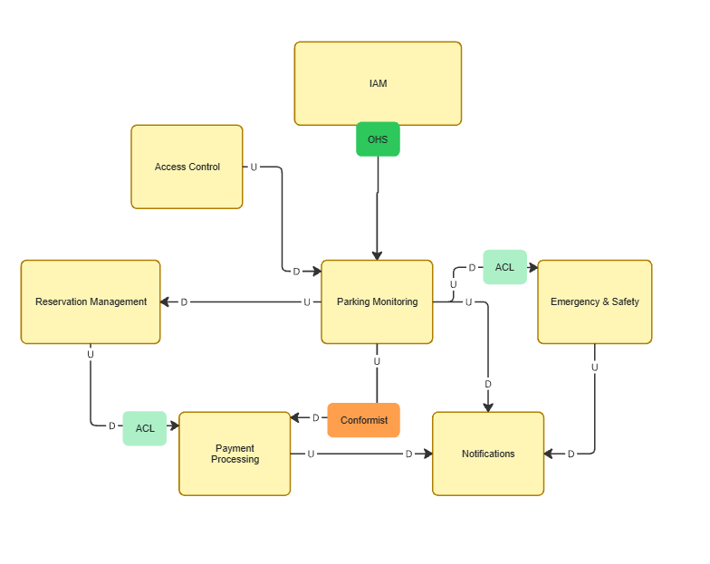


Enlace al Miro: https://miro.com/app/board/uXjVGhyZyRg=/ 

Esta decisión permite:

- Reducir el acoplamiento entre dominios  
- Facilitar la escalabilidad del sistema  
- Permitir la evolución independiente de cada contexto  
- Integrar nuevos servicios de manera sencilla  

El uso de un contexto de notificaciones mejora la experiencia del usuario al centralizar la comunicación.

En conjunto, esta arquitectura proporciona una base sólida, flexible y alineada con Domain-Driven Design.


### 4.1.3. Software Architecture.

A continuación, se presentan los diagramas del modelo C4 que describen la arquitectura del sistema SpotFinder, el cual integra aplicaciones web, móviles y componentes IoT para la gestión inteligente de estacionamientos.

#### 4.1.3.1. Software Architecture System Landscape Diagram.
El diagrama de System Landscape muestra una visión general del ecosistema de SpotFinder, identificando los principales actores y sistemas externos con los que interactúa.

En este contexto, el sistema tiene como usuarios principales al Driver (conductor) y al Parking Administrator (administrador de estacionamientos). Ambos interactúan directamente con la plataforma para consultar disponibilidad, gestionar espacios y monitorear el estado del estacionamiento.

Además, SpotFinder se integra con múltiples sistemas externos que complementan su funcionalidad. Entre ellos se encuentra un Payment Gateway (Yape/Culqi) para el procesamiento de pagos digitales, un servicio de Plate Recognition API para el reconocimiento automático de placas vehiculares, un Notification Service encargado del envío de notificaciones push, y los Mall Systems, que representan los sistemas internos del centro comercial con los que se comparten datos operativos.

Este diagrama permite entender el sistema como parte de un entorno más amplio, donde diferentes servicios externos enriquecen las capacidades de la plataforma.

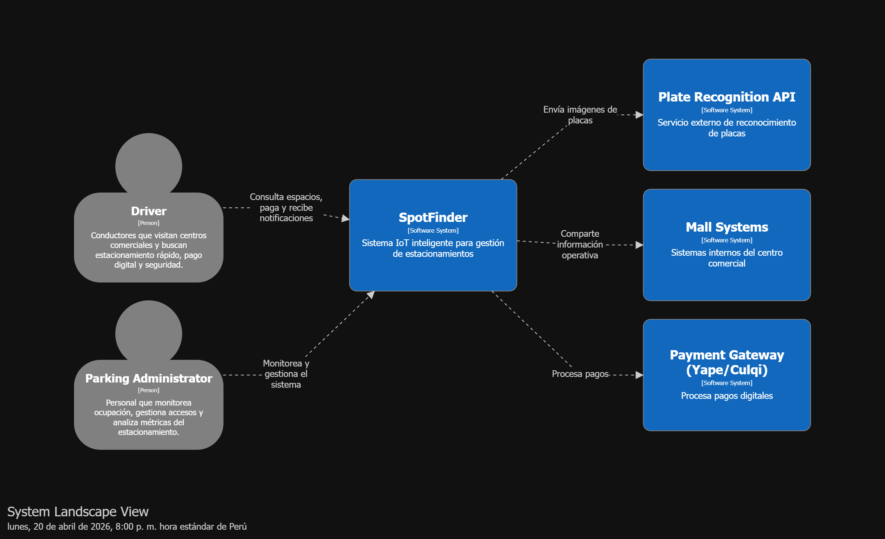
<br>

#### 4.1.3.2. Software Architecture Context Level Diagrams.

El Context Level Diagram presenta cómo el sistema SpotFinder interactúa con sus usuarios y sistemas externos a alto nivel.

Se identifican dos tipos de usuarios principales:

- Driver (Conductor): utiliza el sistema para consultar la disponibilidad de estacionamientos, realizar pagos digitales y recibir notificaciones.
- Parking Administrator (Administrador): se encarga de monitorear la ocupación, gestionar los espacios y supervisar el funcionamiento del sistema.

El sistema central SpotFinder actúa como núcleo de interacción, conectándose con servicios externos clave. Se comunica con el Payment Gateway para procesar pagos, con la Plate Recognition API para el reconocimiento de placas mediante imágenes, y con el Notification Service para el envío de notificaciones a los usuarios. Asimismo, intercambia información con los Mall Systems para mantener actualizados los datos operativos del estacionamiento.

En conjunto, este diagrama permite visualizar claramente los límites del sistema y sus dependencias externas.

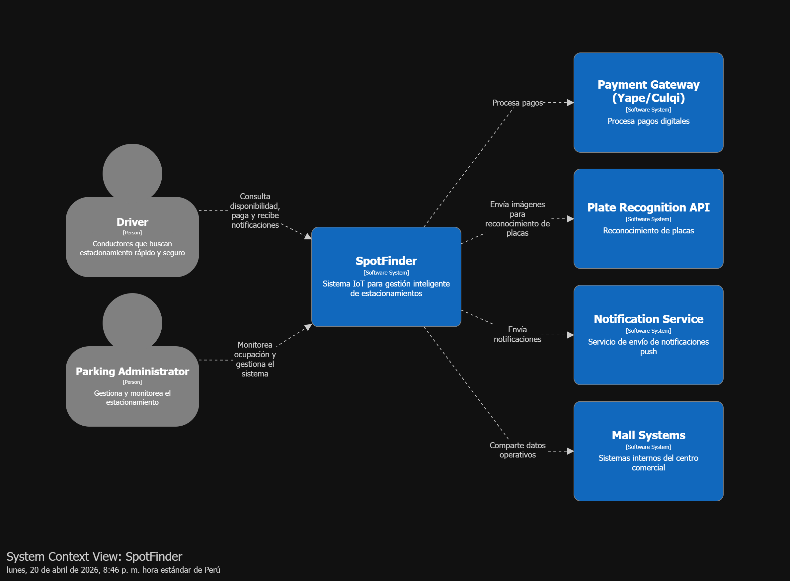
<br>


#### 4.1.3.3. Software Architecture Container Level Diagrams.

El diagrama de Contenedores describe la estructura interna del sistema SpotFinder, mostrando cómo se organizan sus principales componentes y cómo interactúan entre sí.

El sistema está compuesto por los siguientes contenedores:

- Mobile App (Flutter): aplicación móvil utilizada por los conductores para buscar estacionamiento, consultar disponibilidad y realizar pagos.
- Web Dashboard (Angular): aplicación web orientada a administradores, que permite gestionar el estacionamiento y monitorear métricas en tiempo real.
- Backend API (Spring Boot): componente central que expone servicios REST y contiene la lógica de negocio del sistema. Actúa como intermediario entre las aplicaciones cliente, los servicios externos y la base de datos.
- Database (PostgreSQL): almacena la información del sistema, incluyendo usuarios, vehículos, pagos y datos de ocupación.
- IoT Gateway / Edge Server (Flask + MQTT): componente encargado de recibir datos desde sensores IoT (por ejemplo, ocupación de espacios) y enviarlos al backend para su procesamiento.

El Backend API también se encarga de integrarse con servicios externos como el sistema de pagos, el reconocimiento de placas y las notificaciones.

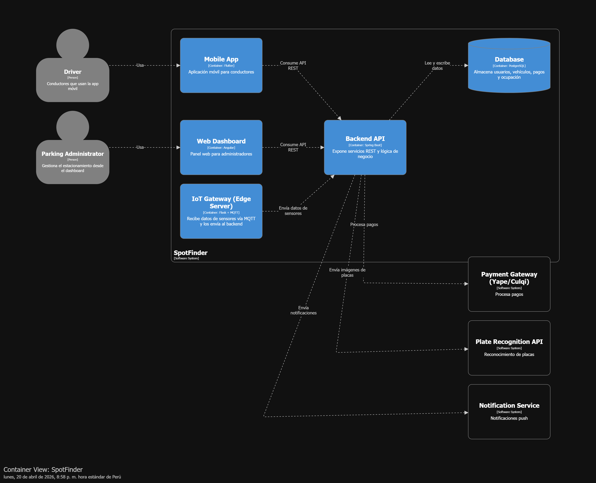
<br>

#### 4.1.3.4. Software Architecture Deployment Diagrams.

El diagrama de Deployment muestra cómo los distintos componentes del sistema SpotFinder se despliegan en la infraestructura física o en la nube.

Los principales nodos de despliegue son:

- User Device (iOS/Android): donde se ejecuta la aplicación móvil utilizada por los conductores.
- Admin Workstation (Browser): dispositivo desde el cual los administradores acceden al sistema mediante un navegador web.
- Frontend Hosting (CDN): infraestructura encargada de servir la aplicación web (Angular SPA) a los usuarios.
- API Hosting Platform (Spring Boot Runtime): entorno donde se despliega el Backend API, encargado de procesar las solicitudes del sistema.
- Database Infrastructure (Managed PostgreSQL Service): servicio gestionado donde se aloja la base de datos del sistema.
- IoT Processing Layer (Edge Gateway Node): nodo donde se ejecuta el servicio IoT (Flask + MQTT), encargado de procesar datos provenientes de sensores en tiempo real.

Las comunicaciones entre componentes se realizan mediante protocolos como HTTPS para las aplicaciones cliente, MQTT para la comunicación con dispositivos IoT y SQL para el acceso a la base de datos.

Este diagrama evidencia una arquitectura distribuida en múltiples capas, combinando dispositivos de usuario, infraestructura en la nube y procesamiento en el borde (edge computing), lo que permite escalabilidad y eficiencia en el manejo de datos en tiempo real.


<br>

# 4.2. Tactical-Level Domain-Driven Design
 
---
 
## 4.2.1. Bounded Context: Parking Monitoring
 
Este bounded context gestiona la detección de ocupación de espacios mediante sensores ultrasónicos IoT, controla el estado de los LEDs indicadores y mantiene el mapa de disponibilidad en tiempo real. Es el contexto core que conecta el mundo físico (sensores ESP32) con el mundo digital (app móvil y dashboard).
 
### 4.2.1.1. Domain Layer
 
En esta sección se describen los elementos del Domain Layer del contexto de Parking Monitoring, que encapsulan la lógica central relacionada con la detección de ocupación y gestión de disponibilidad de espacios.
 
#### 1. ParkingSlot (Aggregate Root)
 
Representa un espacio individual de estacionamiento monitoreado por un sensor ultrasónico.
 
**Atributos principales:**
 
| Atributo | Tipo | Visibilidad | Descripción |
|---|---|---|---|
| id | Long | private | Identificador único del espacio. |
| slotCode | SlotCode | private | Código identificador del espacio (e.g., "A-15", "B-03"). |
| status | SlotStatus | private | Estado actual del espacio (AVAILABLE, OCCUPIED, OUT_OF_SERVICE). |
| sensorId | SensorId | private | Identificador del sensor ultrasónico asignado al espacio. |
| facilityId | FacilityId | private | Identificador del estacionamiento al que pertenece. |
| lastUpdated | LocalDateTime | private | Timestamp de la última actualización de estado. |
 
**Métodos principales:**
 
| Método | Tipo Retorno | Visibilidad | Descripción |
|---|---|---|---|
| ParkingSlot() | Constructor | protected | Constructor protegido para JPA. |
| ParkingSlot(RegisterParkingSlotCommand command) | Constructor | public | Crea un espacio a partir de un comando de registro. |
| occupy() | void | public | Cambia el estado a OCCUPIED y actualiza lastUpdated. Lanza excepción si ya está ocupado o fuera de servicio. |
| release() | void | public | Cambia el estado a AVAILABLE y actualiza lastUpdated. Lanza excepción si ya está disponible. |
| markOutOfService() | void | public | Marca el espacio como fuera de servicio para mantenimiento. |
| markActive() | void | public | Reactiva un espacio que estaba fuera de servicio, cambiando a AVAILABLE. |
| isAvailable() | boolean | public | Devuelve true si el estado es AVAILABLE. |
| isOccupied() | boolean | public | Devuelve true si el estado es OCCUPIED. |
 
#### 2. ParkingFacility (Aggregate Root)
 
Representa el estacionamiento completo de un centro comercial.
 
**Atributos principales:**
 
| Atributo | Tipo | Visibilidad | Descripción |
|---|---|---|---|
| id | Long | private | Identificador único del estacionamiento. |
| name | FacilityName | private | Nombre del estacionamiento (e.g., "Jockey Plaza B2"). |
| totalSlots | int | private | Cantidad total de espacios. |
| address | Address | private | Dirección física del estacionamiento. |
 
**Métodos principales:**
 
| Método | Tipo Retorno | Visibilidad | Descripción |
|---|---|---|---|
| ParkingFacility() | Constructor | protected | Constructor protegido para JPA. |
| ParkingFacility(RegisterFacilityCommand command) | Constructor | public | Crea un estacionamiento a partir de un comando. |
| updateInfo(String name, String address) | ParkingFacility | public | Actualiza nombre y dirección del estacionamiento. |
 
#### 3. RegisterParkingSlotCommand (Command)
 
| Atributo | Tipo | Visibilidad | Descripción |
|---|---|---|---|
| slotCode | String | public | Código del espacio (e.g., "A-15"). |
| sensorId | String | public | Identificador del sensor asignado. |
| facilityId | Long | public | ID del estacionamiento. |
 
#### 4. UpdateSlotStatusCommand (Command)
 
| Atributo | Tipo | Visibilidad | Descripción |
|---|---|---|---|
| slotId | Long | public | ID del espacio a actualizar. |
| newStatus | SlotStatus | public | Nuevo estado (AVAILABLE, OCCUPIED, OUT_OF_SERVICE). |
 
#### 5. ProcessSensorReadingCommand (Command)
 
| Atributo | Tipo | Visibilidad | Descripción |
|---|---|---|---|
| sensorId | String | public | ID del sensor que envía la lectura. |
| slotId | Long | public | ID del espacio monitoreado. |
| distance | double | public | Distancia detectada en centímetros. |
| timestamp | LocalDateTime | public | Momento de la lectura. |
 
#### 6. Queries
 
| Query | Atributos principales | Descripción |
|---|---|---|
| GetAllSlotsQuery | facilityId : Long | Obtiene todos los espacios de un estacionamiento. |
| GetAvailableSlotsQuery | facilityId : Long | Obtiene solo los espacios disponibles. |
| GetSlotByIdQuery | slotId : Long | Obtiene un espacio por su identificador. |
| GetSlotRecommendationsQuery | facilityId : Long | Obtiene espacios recomendados por proximidad. |
 
#### 7. SlotStatusChangedEvent (Domain Event)
 
| Atributo | Tipo | Visibilidad | Descripción |
|---|---|---|---|
| source | Object | private | Objeto origen del evento. |
| slotId | Long | private | ID del espacio que cambió. |
| slotCode | String | private | Código del espacio. |
| previousStatus | SlotStatus | private | Estado anterior. |
| newStatus | SlotStatus | private | Nuevo estado. |
| timestamp | LocalDateTime | private | Momento del cambio. |
 
#### 8. ParkingSlotCommandService (Domain Service)
 
Proporciona métodos para manejar comandos relacionados con la gestión de espacios.
 
| Método | Tipo de Retorno | Visibilidad | Descripción |
|---|---|---|---|
| handle(RegisterParkingSlotCommand command) | Optional\<ParkingSlot> | public | Registra un nuevo espacio en el sistema. |
| handle(UpdateSlotStatusCommand command) | void | public | Actualiza el estado de un espacio (admin: habilitar/deshabilitar). |
| handle(ProcessSensorReadingCommand command) | void | public | Procesa una lectura de sensor y actualiza el estado del espacio si corresponde. |
 
#### 9. ParkingSlotQueryService (Domain Service)
 
| Método | Tipo de Retorno | Visibilidad | Descripción |
|---|---|---|---|
| handle(GetAllSlotsQuery query) | List\<ParkingSlot> | public | Obtiene todos los espacios del estacionamiento. |
| handle(GetAvailableSlotsQuery query) | List\<ParkingSlot> | public | Obtiene solo los espacios con estado AVAILABLE. |
| handle(GetSlotByIdQuery query) | Optional\<ParkingSlot> | public | Obtiene un espacio específico por su ID. |
| handle(GetSlotRecommendationsQuery query) | List\<ParkingSlot> | public | Obtiene espacios disponibles recomendados por proximidad. |
 
#### 10. OccupancyCalculationService (Domain Service)
 
Servicio de dominio que encapsula la lógica de cálculo de ocupación y debounce de sensores.
 
| Método | Tipo de Retorno | Visibilidad | Descripción |
|---|---|---|---|
| evaluateSensorReading(double distance, SlotStatus currentStatus) | Optional\<SlotStatus> | public | Evalúa una lectura de sensor y determina si debe cambiar el estado. Aplica regla de debounce: distancia < 15cm → OCCUPIED, > 50cm → AVAILABLE. |
| calculateOccupancyRate(long totalSlots, long occupiedSlots) | double | public | Calcula la tasa de ocupación como porcentaje. |
| shouldTriggerAlert(double occupancyRate) | boolean | public | Devuelve true si la ocupación supera el 90% (umbral configurable). |
 
#### 11. SlotCode (Value Object)
 
| Atributo | Tipo | Visibilidad | Descripción |
|---|---|---|---|
| code | String | private | Código del espacio (máx. 20 caracteres, formato "LETRA-NÚMERO"). |
 
| Método | Tipo Retorno | Visibilidad | Descripción |
|---|---|---|---|
| SlotCode() | Constructor | public | Constructor requerido por JPA. |
| SlotCode(String code) | Constructor | public | Inicializa y valida el formato del código. |
 
#### 12. SlotStatus (Value Object)
 
| Atributo | Tipo | Visibilidad | Descripción |
|---|---|---|---|
| AVAILABLE | Enum | public | El espacio está libre. |
| OCCUPIED | Enum | public | El espacio está ocupado por un vehículo. |
| OUT_OF_SERVICE | Enum | public | El espacio está fuera de servicio (mantenimiento). |
 
#### 13. SensorId (Value Object)
 
| Atributo | Tipo | Visibilidad | Descripción |
|---|---|---|---|
| sensorId | String | private | Identificador único del sensor (e.g., "ESP32-SLOT-A15"). |
 
| Método | Tipo Retorno | Visibilidad | Descripción |
|---|---|---|---|
| SensorId() | Constructor | public | Constructor requerido por JPA. |
| SensorId(String sensorId) | Constructor | public | Inicializa y valida que no sea vacío. |
 
#### 14. FacilityId (Value Object)
 
| Atributo | Tipo | Visibilidad | Descripción |
|---|---|---|---|
| facilityId | Long | private | ID del estacionamiento; debe ser > 0. |
 
---
 
### 4.2.1.2. Interface Layer
 
#### 1. ParkingSlotsController (REST Controller)
 
Controlador REST que expone endpoints para gestionar y consultar espacios de estacionamiento.
 
| Nombre del método | Ruta base típica | Método HTTP | Descripción |
|---|---|---|---|
| getAllSlots | /api/v1/parking-slots | GET | Obtiene todos los espacios con su estado actual. |
| getAvailableSlots | /api/v1/parking-slots/available | GET | Obtiene solo los espacios disponibles. |
| getSlotById | /api/v1/parking-slots/{id} | GET | Obtiene un espacio específico por su ID. |
| updateSlotStatus | /api/v1/parking-slots/{id}/status | PATCH | Actualiza el estado de un espacio (admin). |
| getRecommendations | /api/v1/parking-slots/recommendations | GET | Obtiene espacios recomendados por proximidad. |
 
#### 2. SensorReadingsController (REST Controller)
 
Controlador REST que recibe las lecturas de sensores desde el edge server.
 
| Nombre del método | Ruta base típica | Método HTTP | Descripción |
|---|---|---|---|
| registerReading | /api/v1/sensor-readings | POST | Recibe y procesa una lectura de sensor ultrasónico. |
 
#### 3. Resources (DTOs)
 
| Resource | Atributos principales | Descripción |
|---|---|---|
| ParkingSlotResource | id: Long, slotCode: String, status: String, sensorId: String, lastUpdated: LocalDateTime | Representación de un espacio para la API. |
| SensorReadingResource | sensorId: String, slotId: Long, distance: double, timestamp: LocalDateTime | Lectura de sensor recibida del edge server. |
| SlotStatusUpdateResource | status: String | Datos para actualizar estado de un espacio. |
 
#### 4. Transform (Assemblers)
 
| Assembler | Entrada | Salida | Descripción |
|---|---|---|---|
| ParkingSlotResourceFromEntityAssembler | ParkingSlot | ParkingSlotResource | Convierte entidad de dominio a DTO de respuesta. |
| ProcessSensorReadingCommandFromResourceAssembler | SensorReadingResource | ProcessSensorReadingCommand | Convierte DTO de lectura en comando de dominio. |
| UpdateSlotStatusCommandFromResourceAssembler | SlotStatusUpdateResource, Long slotId | UpdateSlotStatusCommand | Convierte DTO de actualización en comando. |
 
---
 
### 4.2.1.3. Application Layer
 
#### 1. ParkingSlotCommandServiceImpl (Command Service Implementation)
 
Implementación del servicio de comandos para gestionar espacios de estacionamiento.
 
**Atributos principales:**
 
| Atributo | Tipo | Visibilidad | Descripción |
|---|---|---|---|
| parkingSlotRepository | ParkingSlotRepository | private | Repositorio para persistencia de espacios. |
| occupancyCalculationService | OccupancyCalculationService | private | Servicio de cálculo de ocupación y debounce. |
 
**Métodos principales:**
 
| Método | Tipo de Retorno | Visibilidad | Descripción |
|---|---|---|---|
| handle(RegisterParkingSlotCommand command) | Optional\<ParkingSlot> | public | Crea y persiste un nuevo espacio; valida que el slotCode sea único y el sensorId no esté ya asignado. |
| handle(UpdateSlotStatusCommand command) | void | public | Actualiza el estado de un espacio (admin: habilitar/deshabilitar para mantenimiento); persiste el cambio y publica SlotStatusChangedEvent. |
| handle(ProcessSensorReadingCommand command) | void | public | Procesa lectura del sensor: evalúa con OccupancyCalculationService si debe cambiar el estado, si cambia lo persiste y publica evento. |
 
#### 2. ParkingSlotQueryServiceImpl (Query Service Implementation)
 
**Atributos principales:**
 
| Atributo | Tipo | Visibilidad | Descripción |
|---|---|---|---|
| parkingSlotRepository | ParkingSlotRepository | private | Repositorio para acceso de lectura. |
 
**Métodos principales:**
 
| Método | Tipo de Retorno | Visibilidad | Descripción |
|---|---|---|---|
| handle(GetAllSlotsQuery query) | List\<ParkingSlot> | public | Obtiene todos los espacios del estacionamiento. |
| handle(GetAvailableSlotsQuery query) | List\<ParkingSlot> | public | Obtiene espacios con status AVAILABLE. |
| handle(GetSlotByIdQuery query) | Optional\<ParkingSlot> | public | Obtiene un espacio por su ID. |
| handle(GetSlotRecommendationsQuery query) | List\<ParkingSlot> | public | Obtiene espacios disponibles recomendados, priorizando por proximidad. |
 
#### 3. SlotStatusChangedEventHandler (Domain Event Handler)
 
Maneja el evento de cambio de estado para notificar vía WebSocket a clientes conectados.
 
**Atributos principales:**
 
| Atributo | Tipo | Visibilidad | Descripción |
|---|---|---|---|
| webSocketBroadcaster | WebSocketBroadcaster | private | Servicio para enviar actualizaciones en tiempo real. |
 
**Métodos principales:**
 
| Método | Tipo de Retorno | Visibilidad | Descripción |
|---|---|---|---|
| on(SlotStatusChangedEvent event) | void | public | Envía la actualización de estado del espacio vía WebSocket a dashboard y app móvil. |
 
---
 
### 4.2.1.4. Infrastructure Layer
 
#### 1. ParkingSlotRepository (Repository Interface)
 
Interfaz del repositorio para gestionar espacios de estacionamiento.
 
| Método | Tipo de Retorno | Visibilidad | Descripción |
|---|---|---|---|
| findById(Long id) | Optional\<ParkingSlot> | public | Busca un espacio por su ID. |
| save(ParkingSlot slot) | ParkingSlot | public | Persiste o actualiza un espacio. |
| findByStatus(SlotStatus status) | List\<ParkingSlot> | public | Obtiene espacios por estado. |
| findByFacilityId(FacilityId facilityId) | List\<ParkingSlot> | public | Obtiene todos los espacios de un estacionamiento. |
| countByStatus(SlotStatus status) | long | public | Cuenta espacios por estado (para cálculo de ocupación). |
| existsBySlotCode(SlotCode slotCode) | boolean | public | Verifica si un código de espacio ya existe. |
| existsBySensorId(SensorId sensorId) | boolean | public | Verifica si un sensor ya está asignado. |
| findBySensorId(SensorId sensorId) | Optional\<ParkingSlot> | public | Busca espacio por sensor (para procesar lecturas). |
 
#### 2. SensorReadingRepository (Repository Interface)
 
Interfaz del repositorio para almacenar lecturas históricas de sensores.
 
| Método | Tipo de Retorno | Visibilidad | Descripción |
|---|---|---|---|
| save(SensorReading reading) | SensorReading | public | Persiste una lectura de sensor. |
| findBySensorIdAndTimestampBetween(String sensorId, LocalDateTime start, LocalDateTime end) | List\<SensorReading> | public | Obtiene lecturas de un sensor en un rango de tiempo. |
 
#### 3. WebSocketBroadcaster (Infrastructure Service)
 
Servicio que envía actualizaciones de estado en tiempo real vía WebSocket.
 
| Método | Tipo de Retorno | Visibilidad | Descripción |
|---|---|---|---|
| broadcastSlotUpdate(Long slotId, SlotStatus status, String slotCode) | void | public | Envía actualización de estado a todos los clientes suscritos al canal de disponibilidad. |
| broadcastOccupancySummary(long total, long available, long occupied) | void | public | Envía resumen de ocupación actualizado. |
 
---
 
### 4.2.1.5. Bounded Context Software Architecture Component Level Diagrams
 
En esta sección se presentan los diagramas de nivel componente que ilustran la arquitectura de software del contexto de Parking Monitoring. Se muestra la interacción entre los diferentes componentes, servicios y capas que conforman este bounded context.
 
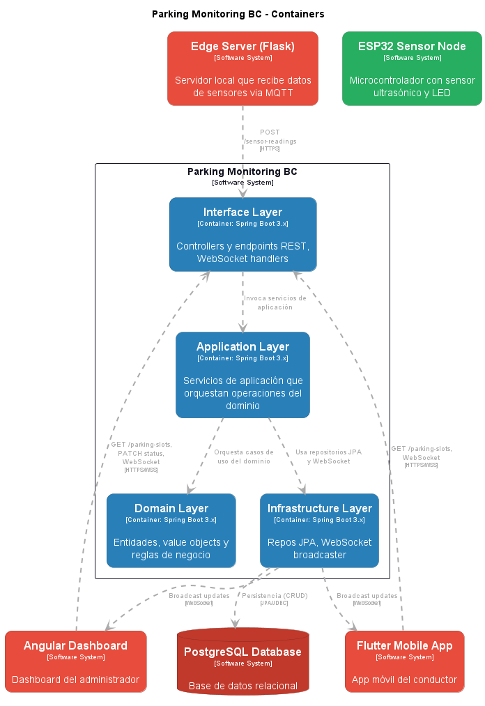

### 4.2.1.6. Bounded Context Software Architecture Code Level Diagrams
 
En esta sección se presentan los diagramas de nivel código que detallan la estructura interna del contexto de Parking Monitoring.
 
#### 4.2.1.6.1. Bounded Context Domain Layer Class Diagrams
 
El diagrama de clases del Domain Layer del contexto de Parking Monitoring ilustra las entidades, objetos de valor y servicios que componen este bounded context.
 
> **Diagrama a crear en LucidChart o PlantUML:**

#### 4.2.1.6.2. Bounded Context Database Design Diagram
 
El diagrama de diseño de base de datos del contexto de Parking Monitoring muestra la estructura de las tablas y sus relaciones en la base de datos relacional.
 
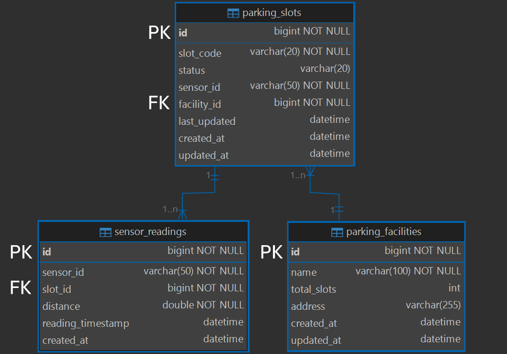
<br>

## 4.2.2. Bounded Context: Access Control
 
Este bounded context gestiona el ingreso y salida vehicular mediante ALPR (reconocimiento automático de placas) y control de barreras. Administra el ciclo de vida completo de las sesiones vehiculares desde el ingreso hasta la salida, incluyendo la verificación del estado de pago antes de autorizar la apertura de la barrera de salida.
 
### 4.2.2.1. Domain Layer
 
En esta sección se describen los elementos del Domain Layer del contexto de Access Control, que encapsulan la lógica central relacionada con el control de acceso vehicular y la gestión de sesiones.
 
#### 1. VehicleSession (Aggregate Root)
 
Representa el período completo desde que un vehículo ingresa al estacionamiento hasta que sale. Es la entidad central del bounded context.
 
**Atributos principales:**
 
| Atributo | Tipo | Visibilidad | Descripción |
|---|---|---|---|
| id | Long | private | Identificador único de la sesión. |
| licensePlate | LicensePlate | private | Placa del vehículo asociado a la sesión. |
| entryTimestamp | LocalDateTime | private | Fecha y hora de ingreso del vehículo. |
| exitTimestamp | LocalDateTime | private | Fecha y hora de salida del vehículo (null mientras está activa). |
| slotId | SlotId | private | Identificador del espacio donde se estacionó el vehículo. |
| paymentStatus | PaymentStatus | private | Estado del pago de la sesión (PENDING o PAID). |
| sessionStatus | SessionStatus | private | Estado de la sesión (ACTIVE o COMPLETED). |
| userId | UserId | private | Identificador del usuario propietario del vehículo (null si no registrado). |
 
**Métodos principales:**
 
| Método | Tipo Retorno | Visibilidad | Descripción |
|---|---|---|---|
| VehicleSession() | Constructor | protected | Constructor protegido para JPA. |
| VehicleSession(CreateVehicleSessionCommand command) | Constructor | public | Crea una sesión a partir de un comando de ingreso. Inicializa con sessionStatus=ACTIVE, paymentStatus=PENDING, exitTimestamp=null. |
| end(LocalDateTime exitTimestamp) | void | public | Finaliza la sesión registrando el timestamp de salida y cambiando sessionStatus a COMPLETED. Lanza excepción si paymentStatus no es PAID. |
| markAsPaid() | void | public | Cambia paymentStatus a PAID. Lanza excepción si ya está pagada o si la sesión no está activa. |
| assignSlot(SlotId slotId) | void | public | Asocia un espacio de estacionamiento a la sesión (para Find My Car). |
| calculateDuration() | Duration | public | Calcula la duración entre entryTimestamp y el momento actual (si activa) o exitTimestamp (si completada). |
| isActive() | boolean | public | Devuelve true si sessionStatus es ACTIVE. |
| isPaid() | boolean | public | Devuelve true si paymentStatus es PAID. |
 
#### 2. AccessBarrier (Aggregate Root)
 
Representa una barrera física motorizada ubicada en un punto de entrada o salida del estacionamiento.
 
**Atributos principales:**
 
| Atributo | Tipo | Visibilidad | Descripción |
|---|---|---|---|
| id | Long | private | Identificador único de la barrera. |
| barrierCode | BarrierCode | private | Código identificador de la barrera (e.g., "ENTRY-01", "EXIT-01"). |
| position | BarrierPosition | private | Posición de la barrera (ENTRY o EXIT). |
| status | BarrierStatus | private | Estado actual de la barrera (OPEN o CLOSED). |
| facilityId | FacilityId | private | Identificador del estacionamiento al que pertenece. |
 
**Métodos principales:**
 
| Método | Tipo Retorno | Visibilidad | Descripción |
|---|---|---|---|
| AccessBarrier() | Constructor | protected | Constructor protegido para JPA. |
| AccessBarrier(RegisterBarrierCommand command) | Constructor | public | Crea una barrera a partir de un comando. |
| open() | void | public | Cambia el estado a OPEN. Publica BarrierOpenedEvent. |
| close() | void | public | Cambia el estado a CLOSED. |
| forceOpen(String reason) | void | public | Abre la barrera forzosamente (emergencia). Ignora validaciones normales. |
 
#### 3. CreateVehicleSessionCommand (Command)
 
| Atributo | Tipo | Visibilidad | Descripción |
|---|---|---|---|
| licensePlate | String | public | Texto de la placa reconocida por ALPR. |
| entryTimestamp | LocalDateTime | public | Momento del ingreso. |
| userId | Long | public | ID del usuario (null si vehículo no registrado). |
 
#### 4. EndVehicleSessionCommand (Command)
 
| Atributo | Tipo | Visibilidad | Descripción |
|---|---|---|---|
| sessionId | Long | public | ID de la sesión a finalizar. |
| exitTimestamp | LocalDateTime | public | Momento de la salida. |
 
#### 5. RecognizePlateCommand (Command)
 
| Atributo | Tipo | Visibilidad | Descripción |
|---|---|---|---|
| imageData | byte[] | public | Imagen capturada por ESP32-CAM. |
| cameraPosition | String | public | Posición de la cámara (ENTRY o EXIT). |
 
#### 6. RegisterEntryCommand (Command)
 
| Atributo | Tipo | Visibilidad | Descripción |
|---|---|---|---|
| imageData | byte[] | public | Imagen de la placa capturada. |
| barrierCode | String | public | Código de la barrera de entrada. |
 
#### 7. RegisterExitCommand (Command)
 
| Atributo | Tipo | Visibilidad | Descripción |
|---|---|---|---|
| imageData | byte[] | public | Imagen de la placa capturada en salida. |
| barrierCode | String | public | Código de la barrera de salida. |
 
#### 8. OpenAllBarriersCommand (Command)
 
| Atributo | Tipo | Visibilidad | Descripción |
|---|---|---|---|
| reason | String | public | Razón de la apertura (e.g., "EMERGENCY"). |
 
#### 9. Queries
 
| Query | Atributos principales | Descripción |
|---|---|---|
| GetActiveSessionQuery | userId : Long | Obtiene la sesión activa del usuario autenticado. |
| GetSessionByIdQuery | sessionId : Long | Obtiene una sesión específica por ID. |
| GetSessionByPlateQuery | licensePlate : String | Obtiene la sesión activa asociada a una placa. |
| GetSessionHistoryQuery | userId : Long | Obtiene las sesiones pasadas del usuario. |
| GetBarrierStatusQuery | barrierCode : String | Obtiene el estado de una barrera. |
 
#### 10. VehicleSessionStartedEvent (Domain Event)
 
| Atributo | Tipo | Visibilidad | Descripción |
|---|---|---|---|
| source | Object | private | Objeto origen del evento. |
| sessionId | Long | private | ID de la sesión creada. |
| licensePlate | String | private | Placa del vehículo. |
| entryTimestamp | LocalDateTime | private | Momento del ingreso. |
| userId | Long | private | ID del usuario (null si no registrado). |
 
#### 11. VehicleSessionEndedEvent (Domain Event)
 
| Atributo | Tipo | Visibilidad | Descripción |
|---|---|---|---|
| source | Object | private | Objeto origen del evento. |
| sessionId | Long | private | ID de la sesión finalizada. |
| licensePlate | String | private | Placa del vehículo. |
| exitTimestamp | LocalDateTime | private | Momento de la salida. |
| slotId | Long | private | ID del espacio que se libera. |
 
#### 12. BarrierOpenedEvent (Domain Event)
 
| Atributo | Tipo | Visibilidad | Descripción |
|---|---|---|---|
| barrierCode | String | private | Código de la barrera que se abrió. |
| position | BarrierPosition | private | Posición (ENTRY o EXIT). |
| reason | String | private | Razón de apertura (PLATE_RECOGNIZED, PAYMENT_VERIFIED, EMERGENCY). |
 
#### 13. AccessCommandService (Domain Service)
 
| Método | Tipo de Retorno | Visibilidad | Descripción |
|---|---|---|---|
| handle(RegisterEntryCommand command) | Optional\<VehicleSession> | public | Procesa ingreso: captura placa via ALPR, verifica registro, abre barrera, crea sesión. |
| handle(RegisterExitCommand command) | void | public | Procesa salida: captura placa, verifica pago, abre barrera, finaliza sesión. |
| handle(RecognizePlateCommand command) | Optional\<LicensePlate> | public | Envía imagen a Plate Recognizer API y retorna la placa reconocida. |
| handle(OpenAllBarriersCommand command) | void | public | Abre todas las barreras (emergencia). |
 
#### 14. VehicleSessionCommandService (Domain Service)
 
| Método | Tipo de Retorno | Visibilidad | Descripción |
|---|---|---|---|
| handle(CreateVehicleSessionCommand command) | Optional\<VehicleSession> | public | Crea una nueva sesión vehicular. Valida que la placa no tenga sesión activa. |
| handle(EndVehicleSessionCommand command) | void | public | Finaliza una sesión. Valida que el pago esté completado. |
 
#### 15. VehicleSessionQueryService (Domain Service)
 
| Método | Tipo de Retorno | Visibilidad | Descripción |
|---|---|---|---|
| handle(GetActiveSessionQuery query) | Optional\<VehicleSession> | public | Obtiene la sesión activa del usuario. |
| handle(GetSessionByIdQuery query) | Optional\<VehicleSession> | public | Obtiene una sesión por ID. |
| handle(GetSessionByPlateQuery query) | Optional\<VehicleSession> | public | Obtiene sesión activa por placa. |
| handle(GetSessionHistoryQuery query) | List\<VehicleSession> | public | Obtiene historial de sesiones del usuario. |
 
#### 16. LicensePlate (Value Object)
 
| Atributo | Tipo | Visibilidad | Descripción |
|---|---|---|---|
| plateText | String | private | Texto alfanumérico de la placa (formato peruano: A0B-123). |
| confidence | double | private | Nivel de confianza del reconocimiento ALPR (0.0 a 1.0). |
 
| Método | Tipo Retorno | Visibilidad | Descripción |
|---|---|---|---|
| LicensePlate() | Constructor | public | Constructor requerido por JPA. |
| LicensePlate(String plateText, double confidence) | Constructor | public | Inicializa y valida formato de placa y confianza > 0. |
| isHighConfidence() | boolean | public | Devuelve true si confidence > 0.85. |
 
#### 17. SessionStatus (Value Object)
 
| Atributo | Tipo | Visibilidad | Descripción |
|---|---|---|---|
| ACTIVE | Enum | public | La sesión está en curso. |
| COMPLETED | Enum | public | La sesión ha finalizado (vehículo salió). |
 
#### 18. PaymentStatus (Value Object)
 
| Atributo | Tipo | Visibilidad | Descripción |
|---|---|---|---|
| PENDING | Enum | public | El pago está pendiente. |
| PAID | Enum | public | El pago ha sido completado. |
 
#### 19. BarrierPosition (Value Object)
 
| Atributo | Tipo | Visibilidad | Descripción |
|---|---|---|---|
| ENTRY | Enum | public | Barrera de entrada. |
| EXIT | Enum | public | Barrera de salida. |
 
#### 20. BarrierStatus (Value Object)
 
| Atributo | Tipo | Visibilidad | Descripción |
|---|---|---|---|
| OPEN | Enum | public | La barrera está abierta. |
| CLOSED | Enum | public | La barrera está cerrada. |
 
#### 21. BarrierCode (Value Object)
 
| Atributo | Tipo | Visibilidad | Descripción |
|---|---|---|---|
| code | String | private | Código identificador de la barrera (e.g., "ENTRY-01"). |
 
#### 22. SlotId (Value Object)
 
| Atributo | Tipo | Visibilidad | Descripción |
|---|---|---|---|
| slotId | Long | private | ID del espacio de estacionamiento asociado. |
 
#### 23. PlateRecognitionService (Domain Service Interface)
 
Interfaz del servicio de reconocimiento de placas. La implementación concreta vive en Infrastructure Layer.
 
| Método | Tipo de Retorno | Visibilidad | Descripción |
|---|---|---|---|
| recognizePlate(byte[] imageData) | Optional\<LicensePlate> | public | Envía imagen a servicio externo y retorna la placa reconocida con nivel de confianza. |
 
---
 
### 4.2.2.2. Interface Layer
 
#### 1. AccessController (REST Controller)
 
Controlador REST que expone endpoints para el control de acceso vehicular (ingreso y salida).
 
| Nombre del método | Ruta base típica | Método HTTP | Descripción |
|---|---|---|---|
| registerEntry | /api/v1/access/entries | POST | Registra el ingreso de un vehículo. Recibe imagen de placa, procesa ALPR, abre barrera y crea sesión. |
| registerExit | /api/v1/access/exits | POST | Registra la salida de un vehículo. Verifica pago, abre barrera y finaliza sesión. |
| recognizePlate | /api/v1/access/alpr | POST | Procesa una imagen para reconocimiento de placa (endpoint auxiliar). |
 
#### 2. ParkingSessionsController (REST Controller)
 
Controlador REST que expone endpoints para gestionar y consultar sesiones vehiculares.
 
| Nombre del método | Ruta base típica | Método HTTP | Descripción |
|---|---|---|---|
| createSession | /api/v1/parking-sessions | POST | Crea una nueva sesión vehicular. |
| getActiveSession | /api/v1/parking-sessions/active | GET | Obtiene la sesión activa del usuario autenticado. |
| getSessionById | /api/v1/parking-sessions/{id} | GET | Obtiene una sesión específica por su ID. |
| endSession | /api/v1/parking-sessions/{id}/end | PATCH | Finaliza una sesión vehicular (requiere pago completado). |
| getSessionHistory | /api/v1/parking-sessions/history | GET | Obtiene el historial de sesiones del usuario. |
 
#### 3. Resources (DTOs)
 
| Resource | Atributos principales | Descripción |
|---|---|---|
| EntryRequestResource | imageData: String (base64), barrierCode: String | Solicitud de ingreso con imagen de placa. |
| ExitRequestResource | imageData: String (base64), barrierCode: String | Solicitud de salida con imagen de placa. |
| PlateRecognitionResource | imageData: String (base64), cameraPosition: String | Imagen para reconocimiento de placa. |
| PlateRecognitionResultResource | licensePlate: String, confidence: double, isHighConfidence: boolean | Resultado del reconocimiento de placa. |
| VehicleSessionResource | id: Long, licensePlate: String, entryTimestamp: LocalDateTime, exitTimestamp: LocalDateTime, slotCode: String, paymentStatus: String, sessionStatus: String, currentDuration: String, estimatedFee: BigDecimal | Representación completa de una sesión. |
| CreateSessionResource | licensePlate: String | Datos para crear sesión manualmente. |
 
#### 4. Transform (Assemblers)
 
| Assembler | Entrada | Salida | Descripción |
|---|---|---|---|
| VehicleSessionResourceFromEntityAssembler | VehicleSession | VehicleSessionResource | Convierte entidad a DTO de respuesta, calcula duración y fee estimado. |
| RegisterEntryCommandFromResourceAssembler | EntryRequestResource | RegisterEntryCommand | Convierte DTO de ingreso en comando. |
| RegisterExitCommandFromResourceAssembler | ExitRequestResource | RegisterExitCommand | Convierte DTO de salida en comando. |
| RecognizePlateCommandFromResourceAssembler | PlateRecognitionResource | RecognizePlateCommand | Convierte imagen en comando de reconocimiento. |
 
---
 
### 4.2.2.3. Application Layer
 
#### 1. AccessCommandServiceImpl (Command Service Implementation)
 
Implementación del servicio de comandos para controlar el acceso vehicular.
 
**Atributos principales:**
 
| Atributo | Tipo | Visibilidad | Descripción |
|---|---|---|---|
| vehicleSessionRepository | VehicleSessionRepository | private | Repositorio para persistencia de sesiones. |
| accessBarrierRepository | AccessBarrierRepository | private | Repositorio para persistencia de barreras. |
| plateRecognitionService | PlateRecognitionService | private | Servicio de reconocimiento de placas (Plate Recognizer API). |
| externalIamService | ExternalIamService | private | Servicio ACL para verificar si la placa está registrada en IAM. |
 
**Métodos principales:**
 
| Método | Tipo de Retorno | Visibilidad | Descripción |
|---|---|---|---|
| handle(RegisterEntryCommand command) | Optional\<VehicleSession> | public | Procesa ingreso completo: (1) envía imagen a PlateRecognitionService, (2) verifica si la placa está registrada via IAM, (3) crea VehicleSession, (4) abre barrera de entrada, (5) publica VehicleSessionStartedEvent. Si ALPR falla tras 3 intentos, crea sesión como "unidentified". |
| handle(RegisterExitCommand command) | void | public | Procesa salida completa: (1) reconoce placa, (2) busca sesión activa por placa, (3) verifica paymentStatus==PAID, (4) si pagado abre barrera y finaliza sesión publicando VehicleSessionEndedEvent; si no pagado devuelve 402. |
| handle(RecognizePlateCommand command) | Optional\<LicensePlate> | public | Envía imagen al PlateRecognitionService y retorna el resultado. |
| handle(OpenAllBarriersCommand command) | void | public | Abre todas las barreras del estacionamiento (recibido desde Emergency BC via evento). |
 
#### 2. VehicleSessionCommandServiceImpl (Command Service Implementation)
 
**Atributos principales:**
 
| Atributo | Tipo | Visibilidad | Descripción |
|---|---|---|---|
| vehicleSessionRepository | VehicleSessionRepository | private | Repositorio para persistencia de sesiones. |
 
**Métodos principales:**
 
| Método | Tipo de Retorno | Visibilidad | Descripción |
|---|---|---|---|
| handle(CreateVehicleSessionCommand command) | Optional\<VehicleSession> | public | Crea sesión; valida que la placa no tenga sesión activa (409 Conflict si existe). |
| handle(EndVehicleSessionCommand command) | void | public | Finaliza sesión; valida pago completado (402 si pendiente). Publica VehicleSessionEndedEvent. |
 
#### 3. VehicleSessionQueryServiceImpl (Query Service Implementation)
 
**Atributos principales:**
 
| Atributo | Tipo | Visibilidad | Descripción |
|---|---|---|---|
| vehicleSessionRepository | VehicleSessionRepository | private | Repositorio para acceso de lectura. |
 
**Métodos principales:**
 
| Método | Tipo de Retorno | Visibilidad | Descripción |
|---|---|---|---|
| handle(GetActiveSessionQuery query) | Optional\<VehicleSession> | public | Obtiene la sesión activa del usuario por su userId. |
| handle(GetSessionByIdQuery query) | Optional\<VehicleSession> | public | Obtiene sesión por ID. |
| handle(GetSessionByPlateQuery query) | Optional\<VehicleSession> | public | Obtiene sesión activa por placa (para el flujo de salida). |
| handle(GetSessionHistoryQuery query) | List\<VehicleSession> | public | Obtiene sesiones completadas del usuario, ordenadas por fecha descendente. |
 
#### 4. VehicleSessionStartedEventHandler (Domain Event Handler)
 
Maneja el evento de inicio de sesión para notificar al conductor.
 
**Atributos principales:**
 
| Atributo | Tipo | Visibilidad | Descripción |
|---|---|---|---|
| externalNotificationService | ExternalNotificationService | private | Servicio ACL para enviar notificaciones al BC de Notification. |
 
**Métodos principales:**
 
| Método | Tipo de Retorno | Visibilidad | Descripción |
|---|---|---|---|
| on(VehicleSessionStartedEvent event) | void | public | Envía notificación push al conductor confirmando el ingreso con hora y placa. Solo envía si userId no es null (vehículo registrado). |
 
#### 5. VehicleSessionEndedEventHandler (Domain Event Handler)
 
Maneja el evento de fin de sesión para liberar el espacio en Parking Monitoring.
 
**Atributos principales:**
 
| Atributo | Tipo | Visibilidad | Descripción |
|---|---|---|---|
| externalParkingMonitoringService | ExternalParkingMonitoringService | private | Servicio ACL para comunicarse con Parking Monitoring BC. |
 
**Métodos principales:**
 
| Método | Tipo de Retorno | Visibilidad | Descripción |
|---|---|---|---|
| on(VehicleSessionEndedEvent event) | void | public | Notifica a Parking Monitoring para liberar el espacio (slotId) asociado a la sesión finalizada. |
 
#### 6. ExternalIamService (Outbound ACL Service)
 
Adaptador de salida hacia IAM para verificar si una placa está registrada.
 
| Método | Tipo de Retorno | Visibilidad | Descripción |
|---|---|---|---|
| findUserByLicensePlate(String licensePlate) | Optional\<Long> | public | Busca en IAM si existe un usuario con la placa indicada. Retorna userId si existe. |
 
#### 7. ExternalNotificationService (Outbound ACL Service)
 
Adaptador de salida hacia Notification Management BC.
 
| Método | Tipo de Retorno | Visibilidad | Descripción |
|---|---|---|---|
| sendEntryNotification(Long userId, String licensePlate, LocalDateTime entryTime) | void | public | Solicita al BC de Notificaciones enviar push de confirmación de ingreso. |
| sendPaymentReminderNotification(Long userId, Long sessionId) | void | public | Solicita enviar recordatorio de pago pendiente cuando el conductor llega a la salida sin pagar. |
 
#### 8. ExternalParkingMonitoringService (Outbound ACL Service)
 
Adaptador de salida hacia Parking Monitoring BC.
 
| Método | Tipo de Retorno | Visibilidad | Descripción |
|---|---|---|---|
| releaseSlot(Long slotId) | void | public | Notifica a Parking Monitoring que el espacio debe liberarse tras la salida del vehículo. |
 
---
 
### 4.2.2.4. Infrastructure Layer
 
#### 1. VehicleSessionRepository (Repository Interface)
 
| Método | Tipo de Retorno | Visibilidad | Descripción |
|---|---|---|---|
| findById(Long id) | Optional\<VehicleSession> | public | Busca una sesión por su ID. |
| save(VehicleSession session) | VehicleSession | public | Persiste o actualiza una sesión. |
| findByLicensePlate_PlateTextAndSessionStatus(String plateText, SessionStatus status) | Optional\<VehicleSession> | public | Busca sesión activa por texto de placa. |
| findByUserIdAndSessionStatus(UserId userId, SessionStatus status) | Optional\<VehicleSession> | public | Busca sesión activa por usuario. |
| findByUserIdOrderByEntryTimestampDesc(UserId userId) | List\<VehicleSession> | public | Obtiene historial de sesiones ordenado por fecha. |
| existsByLicensePlate_PlateTextAndSessionStatus(String plateText, SessionStatus status) | boolean | public | Verifica si existe sesión activa para una placa. |
 
#### 2. AccessBarrierRepository (Repository Interface)
 
| Método | Tipo de Retorno | Visibilidad | Descripción |
|---|---|---|---|
| findById(Long id) | Optional\<AccessBarrier> | public | Busca una barrera por su ID. |
| save(AccessBarrier barrier) | AccessBarrier | public | Persiste o actualiza una barrera. |
| findByBarrierCode(BarrierCode code) | Optional\<AccessBarrier> | public | Busca barrera por código. |
| findByPosition(BarrierPosition position) | List\<AccessBarrier> | public | Obtiene barreras por posición (ENTRY/EXIT). |
| findAll() | List\<AccessBarrier> | public | Obtiene todas las barreras (para abrir todas en emergencia). |
 
#### 3. PlateRecognizerClient (Infrastructure Service)
 
Implementación concreta del servicio de reconocimiento de placas usando Plate Recognizer API.
 
**Atributos principales:**
 
| Atributo | Tipo | Visibilidad | Descripción |
|---|---|---|---|
| apiUrl | String | private | URL del endpoint de Plate Recognizer API (configurado en application.properties). |
| apiToken | String | private | Token de autenticación para la API (tier gratuito: 2,500 consultas/mes). |
| restTemplate | RestTemplate | private | Cliente HTTP para realizar las llamadas a la API. |
 
**Métodos principales:**
 
| Método | Tipo de Retorno | Visibilidad | Descripción |
|---|---|---|---|
| recognizePlate(byte[] imageData) | Optional\<LicensePlate> | public | Envía imagen como multipart/form-data a Plate Recognizer API. Parsea la respuesta JSON y retorna LicensePlate con plateText y confidence. Retorna empty si no se detecta placa. |
 
---
 
### 4.2.2.5. Bounded Context Software Architecture Component Level Diagrams
 
En esta sección se presentan los diagramas de nivel componente que ilustran la arquitectura de software del contexto de Access Control. Se muestra la interacción entre los diferentes componentes, servicios y capas que conforman este bounded context, incluyendo la integración con sistemas externos (Plate Recognizer API, ESP32-CAM).
 
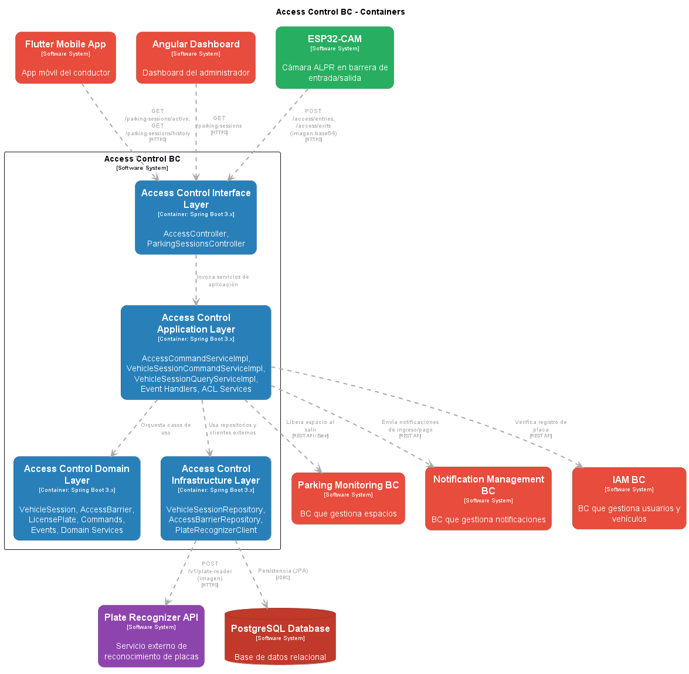
### 4.2.2.6. Bounded Context Software Architecture Code Level Diagrams
 
En esta sección se presentan los diagramas de nivel código que detallan la estructura interna del contexto de Access Control.
 
#### 4.2.2.6.1. Bounded Context Domain Layer Class Diagrams
 
El diagrama de clases del Domain Layer del contexto de Access Control ilustra las entidades, objetos de valor y servicios que componen este bounded context.
 
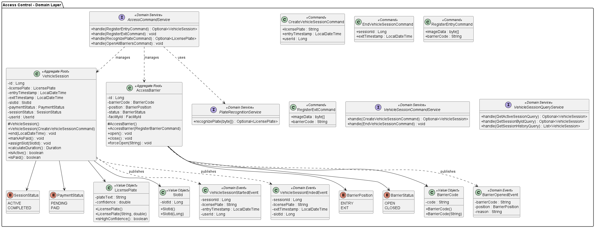
<br>

#### 4.2.2.6.2. Bounded Context Database Design Diagram
 
El diagrama de diseño de base de datos del contexto de Access Control muestra la estructura de las tablas y sus relaciones.
 
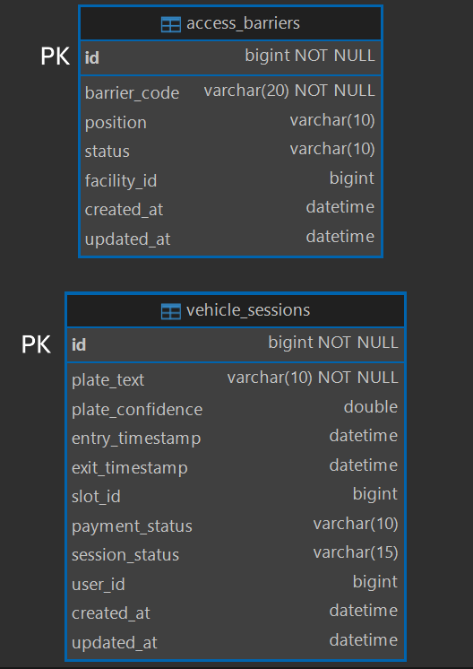
<br>


## 4.2.3. Bounded Context: Payment Processing

Este bounded context gestiona el cálculo de tarifas y el procesamiento de pagos digitales del estacionamiento a través de la pasarela Culqi (tarjeta de crédito/débito y Yape). Genera recibos digitales, mantiene el historial de transacciones y notifica a Access Control cuando un pago se completa para autorizar la salida del vehículo.

### 4.2.3.1. Domain Layer

En esta sección se describen los elementos del Domain Layer del contexto de Payment Processing, que encapsulan la lógica central relacionada con el cálculo de tarifas, procesamiento de pagos y generación de recibos.

#### 1. Payment (Aggregate Root)

Representa una transacción de pago asociada a una sesión vehicular.

**Atributos principales:**

| Atributo | Tipo | Visibilidad | Descripción |
|---|---|---|---|
| id | Long | private | Identificador único del pago. |
| sessionId | SessionId | private | Identificador de la sesión vehicular asociada al pago. |
| amount | Money | private | Monto cobrado por el estacionamiento. |
| currency | Currency | private | Moneda de la transacción (PEN por defecto). |
| paymentMethod | PaymentMethod | private | Método de pago utilizado (YAPE, CREDIT_CARD, DEBIT_CARD). |
| status | PaymentTransactionStatus | private | Estado de la transacción (PENDING, COMPLETED, FAILED). |
| transactionId | String | private | Identificador de la transacción devuelto por Culqi. |
| receiptUrl | String | private | URL del recibo digital generado tras pago exitoso. |
| paidAt | LocalDateTime | private | Fecha y hora en que se completó el pago. |
| parkingFee | ParkingFee | private | Detalle del cálculo de la tarifa (duración, tarifa por hora, monto). |

**Métodos principales:**

| Método | Tipo Retorno | Visibilidad | Descripción |
|---|---|---|---|
| Payment() | Constructor | protected | Constructor protegido para JPA. |
| Payment(InitiatePaymentCommand command) | Constructor | public | Crea un pago a partir de un comando. Inicializa con status=PENDING, paidAt=null, transactionId=null. |
| markAsCompleted(String transactionId, String receiptUrl) | void | public | Marca el pago como completado. Registra transactionId de Culqi, receiptUrl y paidAt. Lanza excepción si ya está completado. Publica PaymentSucceededEvent. |
| markAsFailed(String errorDetail) | void | public | Marca el pago como fallido. Registra el detalle del error. Publica PaymentFailedEvent. |
| isCompleted() | boolean | public | Devuelve true si status es COMPLETED. |
| isFailed() | boolean | public | Devuelve true si status es FAILED. |
| isPending() | boolean | public | Devuelve true si status es PENDING. |

#### 2. InitiatePaymentCommand (Command)

| Atributo | Tipo | Visibilidad | Descripción |
|---|---|---|---|
| sessionId | Long | public | ID de la sesión vehicular a pagar. |
| paymentMethod | String | public | Método de pago ("YAPE", "CREDIT_CARD", "DEBIT_CARD"). |
| token | String | public | Token de pago generado por Culqi Checkout en el frontend. |

#### 3. CalculateFeeCommand (Command)

| Atributo | Tipo | Visibilidad | Descripción |
|---|---|---|---|
| sessionId | Long | public | ID de la sesión para calcular la tarifa. |
| entryTimestamp | LocalDateTime | public | Hora de ingreso del vehículo. |
| exitTimestamp | LocalDateTime | public | Hora actual o de salida (para cálculo). |

#### 4. Queries

| Query | Atributos principales | Descripción |
|---|---|---|
| GetPaymentByIdQuery | paymentId : Long | Obtiene un pago por su identificador. |
| GetPaymentBySessionIdQuery | sessionId : Long | Obtiene el pago asociado a una sesión. |
| GetPaymentHistoryQuery | userId : Long | Obtiene el historial de pagos del usuario. |
| GetPaymentStatusQuery | sessionId : Long | Verifica el estado de pago de una sesión (usado por Access Control). |

#### 5. PaymentSucceededEvent (Domain Event)

| Atributo | Tipo | Visibilidad | Descripción |
|---|---|---|---|
| source | Object | private | Objeto origen del evento. |
| paymentId | Long | private | ID del pago completado. |
| sessionId | Long | private | ID de la sesión vehicular pagada. |
| amount | BigDecimal | private | Monto cobrado. |
| paymentMethod | String | private | Método de pago utilizado. |
| transactionId | String | private | ID de transacción de Culqi. |
| paidAt | LocalDateTime | private | Momento del pago. |

#### 6. PaymentFailedEvent (Domain Event)

| Atributo | Tipo | Visibilidad | Descripción |
|---|---|---|---|
| source | Object | private | Objeto origen del evento. |
| paymentId | Long | private | ID del pago fallido. |
| sessionId | Long | private | ID de la sesión vehicular. |
| errorDetail | String | private | Detalle del error retornado por Culqi. |

#### 7. PaymentCommandService (Domain Service)

Proporciona métodos para manejar comandos relacionados con el procesamiento de pagos.

| Método | Tipo de Retorno | Visibilidad | Descripción |
|---|---|---|---|
| handle(InitiatePaymentCommand command) | Optional\<Payment> | public | Inicia el proceso de pago: calcula tarifa, envía a pasarela Culqi, marca como completado o fallido según respuesta. |
| handle(CalculateFeeCommand command) | ParkingFee | public | Calcula la tarifa de estacionamiento basada en la duración de la sesión. |

#### 8. PaymentQueryService (Domain Service)

| Método | Tipo de Retorno | Visibilidad | Descripción |
|---|---|---|---|
| handle(GetPaymentByIdQuery query) | Optional\<Payment> | public | Obtiene un pago por su ID. |
| handle(GetPaymentBySessionIdQuery query) | Optional\<Payment> | public | Obtiene el pago asociado a una sesión. |
| handle(GetPaymentHistoryQuery query) | List\<Payment> | public | Obtiene historial de pagos del usuario. |
| handle(GetPaymentStatusQuery query) | Optional\<PaymentTransactionStatus> | public | Retorna el estado del pago de una sesión (para verificación de Access Control en la salida). |

#### 9. FeeCalculationService (Domain Service)

Servicio de dominio que encapsula la lógica de cálculo de tarifas de estacionamiento.

| Método | Tipo de Retorno | Visibilidad | Descripción |
|---|---|---|---|
| calculateFee(LocalDateTime entryTimestamp, LocalDateTime currentTimestamp, BigDecimal ratePerHour) | ParkingFee | public | Calcula la tarifa usando la regla: monto = ceil(horas) × tarifa_por_hora. Ejemplo: 2h 15min → 3 horas × S/ 5.00 = S/ 15.00. |
| getDefaultRatePerHour() | BigDecimal | public | Retorna la tarifa por hora configurada por defecto (S/ 5.00, configurable). |

#### 10. PaymentGatewayService (Domain Service Interface)

Interfaz del servicio de pasarela de pagos. La implementación concreta vive en Infrastructure Layer.

| Método | Tipo de Retorno | Visibilidad | Descripción |
|---|---|---|---|
| processPayment(BigDecimal amount, String currency, String token, PaymentMethod method) | PaymentGatewayResponse | public | Envía la solicitud de cobro a la pasarela y retorna la respuesta con transactionId y status. |

#### 11. Money (Value Object)

Representa un monto monetario con precisión decimal.

| Atributo | Tipo | Visibilidad | Descripción |
|---|---|---|---|
| amount | BigDecimal | private | Monto monetario con precisión de 2 decimales. |

| Método | Tipo Retorno | Visibilidad | Descripción |
|---|---|---|---|
| Money() | Constructor | public | Constructor requerido por JPA (valor 0.00). |
| Money(BigDecimal amount) | Constructor | public | Inicializa y valida que el monto sea >= 0. |
| Money(double amount) | Constructor | public | Inicializa desde double, convierte a BigDecimal con escala 2. |
| add(Money other) | Money | public | Suma dos montos y retorna nuevo Money. |
| isGreaterThan(Money other) | boolean | public | Compara si es mayor que otro monto. |

#### 12. Currency (Value Object)

| Atributo | Tipo | Visibilidad | Descripción |
|---|---|---|---|
| PEN | Enum | public | Sol peruano (moneda por defecto). |
| USD | Enum | public | Dólar americano (futuro soporte). |

#### 13. PaymentMethod (Value Object)

| Atributo | Tipo | Visibilidad | Descripción |
|---|---|---|---|
| YAPE | Enum | public | Pago via Yape (procesado a través de Culqi). |
| CREDIT_CARD | Enum | public | Pago con tarjeta de crédito. |
| DEBIT_CARD | Enum | public | Pago con tarjeta de débito. |

#### 14. PaymentTransactionStatus (Value Object)

| Atributo | Tipo | Visibilidad | Descripción |
|---|---|---|---|
| PENDING | Enum | public | El pago está en proceso. |
| COMPLETED | Enum | public | El pago se completó exitosamente. |
| FAILED | Enum | public | El pago falló (error de pasarela, fondos insuficientes, etc.). |

#### 15. ParkingFee (Value Object)

Representa el detalle del cálculo de la tarifa de estacionamiento.

| Atributo | Tipo | Visibilidad | Descripción |
|---|---|---|---|
| amount | BigDecimal | private | Monto total a pagar. |
| duration | Duration | private | Duración de la estancia (entre entrada y momento del cálculo). |
| ratePerHour | BigDecimal | private | Tarifa por hora aplicada. |
| hoursCharged | int | private | Número de horas cobradas (ceil de la duración). |

| Método | Tipo Retorno | Visibilidad | Descripción |
|---|---|---|---|
| ParkingFee(BigDecimal amount, Duration duration, BigDecimal ratePerHour, int hoursCharged) | Constructor | public | Inicializa con todos los valores del cálculo. |
| getFormattedDuration() | String | public | Retorna la duración formateada como "Xh Ymin". |

#### 16. SessionId (Value Object)

| Atributo | Tipo | Visibilidad | Descripción |
|---|---|---|---|
| sessionId | Long | private | ID de la sesión vehicular asociada; debe ser > 0. |

#### 17. PaymentGatewayResponse (Value Object)

Respuesta de la pasarela de pagos tras procesar una transacción.

| Atributo | Tipo | Visibilidad | Descripción |
|---|---|---|---|
| success | boolean | private | Indica si la transacción fue exitosa. |
| transactionId | String | private | ID de transacción asignado por Culqi. |
| errorDetail | String | private | Detalle del error (null si fue exitosa). |
| receiptUrl | String | private | URL del recibo generado por Culqi (null si falló). |

---

### 4.2.3.2. Interface Layer

#### 1. PaymentsController (REST Controller)

Controlador REST que expone endpoints para gestionar pagos de estacionamiento.

| Nombre del método | Ruta base típica | Método HTTP | Descripción |
|---|---|---|---|
| initiatePayment | /api/v1/payments | POST | Procesa un pago asociado a una sesión vehicular. Recibe sessionId, paymentMethod y token de Culqi. |
| getPaymentById | /api/v1/payments/{id} | GET | Obtiene los detalles de un pago específico por su ID. |
| getPaymentBySessionId | /api/v1/payments/session/{sessionId} | GET | Obtiene el pago asociado a una sesión vehicular. |
| getPaymentHistory | /api/v1/payments/history | GET | Obtiene el historial de pagos del usuario autenticado. |
| calculateFee | /api/v1/payments/calculate-fee/{sessionId} | GET | Calcula y retorna la tarifa estimada para una sesión activa. |

#### 2. Resources (DTOs)

| Resource | Atributos principales | Descripción |
|---|---|---|
| InitiatePaymentResource | sessionId: Long, paymentMethod: String, token: String | Datos para iniciar un pago. El token es generado por Culqi Checkout en el frontend. |
| PaymentResource | id: Long, sessionId: Long, amount: BigDecimal, currency: String, paymentMethod: String, status: String, transactionId: String, receiptUrl: String, paidAt: LocalDateTime, duration: String, hoursCharged: int | Representación completa de un pago para la API. |
| ParkingFeeResource | amount: BigDecimal, duration: String, ratePerHour: BigDecimal, hoursCharged: int, currency: String | Detalle del cálculo de tarifa para mostrar al conductor. |
| PaymentStatusResource | sessionId: Long, paymentStatus: String | Estado del pago de una sesión (para verificación en salida). |

#### 3. Transform (Assemblers)

| Assembler | Entrada | Salida | Descripción |
|---|---|---|---|
| PaymentResourceFromEntityAssembler | Payment | PaymentResource | Convierte entidad Payment a DTO de respuesta. Incluye duración formateada y horas cobradas. |
| InitiatePaymentCommandFromResourceAssembler | InitiatePaymentResource | InitiatePaymentCommand | Convierte DTO de pago en comando de dominio. |
| ParkingFeeResourceFromValueObjectAssembler | ParkingFee | ParkingFeeResource | Convierte value object ParkingFee a DTO de respuesta. |

---

### 4.2.3.3. Application Layer

#### 1. PaymentCommandServiceImpl (Command Service Implementation)

Implementación del servicio de comandos para gestionar pagos de estacionamiento.

**Atributos principales:**

| Atributo | Tipo | Visibilidad | Descripción |
|---|---|---|---|
| paymentRepository | PaymentRepository | private | Repositorio para persistencia de pagos. |
| paymentGatewayService | PaymentGatewayService | private | Servicio de pasarela de pagos (Culqi). |
| feeCalculationService | FeeCalculationService | private | Servicio de cálculo de tarifas. |
| externalAccessControlService | ExternalAccessControlService | private | Servicio ACL para comunicarse con Access Control BC. |

**Métodos principales:**

| Método | Tipo de Retorno | Visibilidad | Descripción |
|---|---|---|---|
| handle(InitiatePaymentCommand command) | Optional\<Payment> | public | Procesa pago completo: (1) obtiene datos de sesión via ACL a Access Control, (2) calcula tarifa con FeeCalculationService, (3) crea entidad Payment, (4) envía a Culqi via PaymentGatewayService, (5) si exitoso marca como COMPLETED y publica PaymentSucceededEvent, (6) si falla marca como FAILED y publica PaymentFailedEvent. Valida que la sesión no haya sido pagada previamente (409 Conflict). |
| handle(CalculateFeeCommand command) | ParkingFee | public | Calcula la tarifa para una sesión activa sin procesar el pago. Obtiene timestamps de la sesión y aplica la regla de cálculo. |

#### 2. PaymentQueryServiceImpl (Query Service Implementation)

**Atributos principales:**

| Atributo | Tipo | Visibilidad | Descripción |
|---|---|---|---|
| paymentRepository | PaymentRepository | private | Repositorio para acceso de lectura. |

**Métodos principales:**

| Método | Tipo de Retorno | Visibilidad | Descripción |
|---|---|---|---|
| handle(GetPaymentByIdQuery query) | Optional\<Payment> | public | Obtiene un pago por su ID. |
| handle(GetPaymentBySessionIdQuery query) | Optional\<Payment> | public | Obtiene el pago asociado a una sesión. |
| handle(GetPaymentHistoryQuery query) | List\<Payment> | public | Obtiene pagos del usuario ordenados por fecha descendente. |
| handle(GetPaymentStatusQuery query) | Optional\<PaymentTransactionStatus> | public | Retorna el estado del pago de una sesión. Usado por Access Control para verificar si puede abrir la barrera de salida. |

#### 3. PaymentSucceededEventHandler (Domain Event Handler)

Maneja el evento de pago exitoso para notificar a Access Control y al conductor.

**Atributos principales:**

| Atributo | Tipo | Visibilidad | Descripción |
|---|---|---|---|
| externalAccessControlService | ExternalAccessControlService | private | Servicio ACL para notificar a Access Control. |
| externalNotificationService | ExternalNotificationService | private | Servicio ACL para enviar notificación al conductor. |

**Métodos principales:**

| Método | Tipo de Retorno | Visibilidad | Descripción |
|---|---|---|---|
| on(PaymentSucceededEvent event) | void | public | (1) Notifica a Access Control que la sesión fue pagada (actualiza paymentStatus a PAID en VehicleSession). (2) Envía notificación push al conductor confirmando el pago con monto y recibo. |

#### 4. PaymentFailedEventHandler (Domain Event Handler)

**Métodos principales:**

| Método | Tipo de Retorno | Visibilidad | Descripción |
|---|---|---|---|
| on(PaymentFailedEvent event) | void | public | Envía notificación push al conductor informando que el pago falló y debe reintentar. |

#### 5. ExternalAccessControlService (Outbound ACL Service)

Adaptador de salida hacia Access Control BC.

| Método | Tipo de Retorno | Visibilidad | Descripción |
|---|---|---|---|
| getSessionDetails(Long sessionId) | Optional\<SessionDetailsDto> | public | Obtiene los datos de la sesión (entryTimestamp, licensePlate, userId) para calcular la tarifa. |
| markSessionAsPaid(Long sessionId) | void | public | Notifica a Access Control que la sesión ha sido pagada, actualizando el paymentStatus. |

#### 6. ExternalNotificationService (Outbound ACL Service)

| Método | Tipo de Retorno | Visibilidad | Descripción |
|---|---|---|---|
| sendPaymentSuccessNotification(Long userId, BigDecimal amount, String receiptUrl) | void | public | Envía notificación push de confirmación de pago al conductor. |
| sendPaymentFailedNotification(Long userId, String errorDetail) | void | public | Envía notificación push informando que el pago falló. |

---

### 4.2.3.4. Infrastructure Layer

#### 1. PaymentRepository (Repository Interface)

Interfaz del repositorio para gestionar pagos.

| Método | Tipo de Retorno | Visibilidad | Descripción |
|---|---|---|---|
| findById(Long id) | Optional\<Payment> | public | Busca un pago por su ID. |
| save(Payment payment) | Payment | public | Persiste o actualiza un pago. |
| findBySessionId(SessionId sessionId) | Optional\<Payment> | public | Busca el pago asociado a una sesión vehicular. |
| findBySessionId_SessionIdAndStatus(Long sessionId, PaymentTransactionStatus status) | Optional\<Payment> | public | Busca pago por sesión y estado (para verificar si ya existe pago completado). |
| findByUserIdOrderByPaidAtDesc(Long userId) | List\<Payment> | public | Obtiene historial de pagos del usuario ordenado por fecha de pago descendente. |
| existsBySessionId(SessionId sessionId) | boolean | public | Verifica si ya existe un pago para la sesión. |

#### 2. CulqiPaymentGateway (Infrastructure Service)

Implementación concreta de PaymentGatewayService usando la API de Culqi como pasarela de pagos.

**Atributos principales:**

| Atributo | Tipo | Visibilidad | Descripción |
|---|---|---|---|
| culqiPublicKey | String | private | Clave pública de Culqi (configurada en application.properties). |
| culqiPrivateKey | String | private | Clave privada de Culqi para procesar cargos. |
| culqiApiUrl | String | private | URL base de la API de Culqi (https://api.culqi.com/v2). |
| restTemplate | RestTemplate | private | Cliente HTTP para realizar llamadas a la API de Culqi. |

**Métodos principales:**

| Método | Tipo de Retorno | Visibilidad | Descripción |
|---|---|---|---|
| processPayment(BigDecimal amount, String currency, String token, PaymentMethod method) | PaymentGatewayResponse | public | Envía solicitud POST /v2/charges a Culqi con amount (en céntimos: S/ 15.00 → 1500), currency_code ("PEN"), source_id (token de Culqi Checkout) y email del usuario. Parsea la respuesta y retorna PaymentGatewayResponse con transactionId, success y receiptUrl. Si Culqi retorna error, retorna success=false con errorDetail. |

---

### 4.2.3.5. Bounded Context Software Architecture Component Level Diagrams

En esta sección se presentan los diagramas de nivel componente que ilustran la arquitectura de software del contexto de Payment Processing. Se muestra la interacción entre los componentes internos y la integración con la pasarela de pagos Culqi.

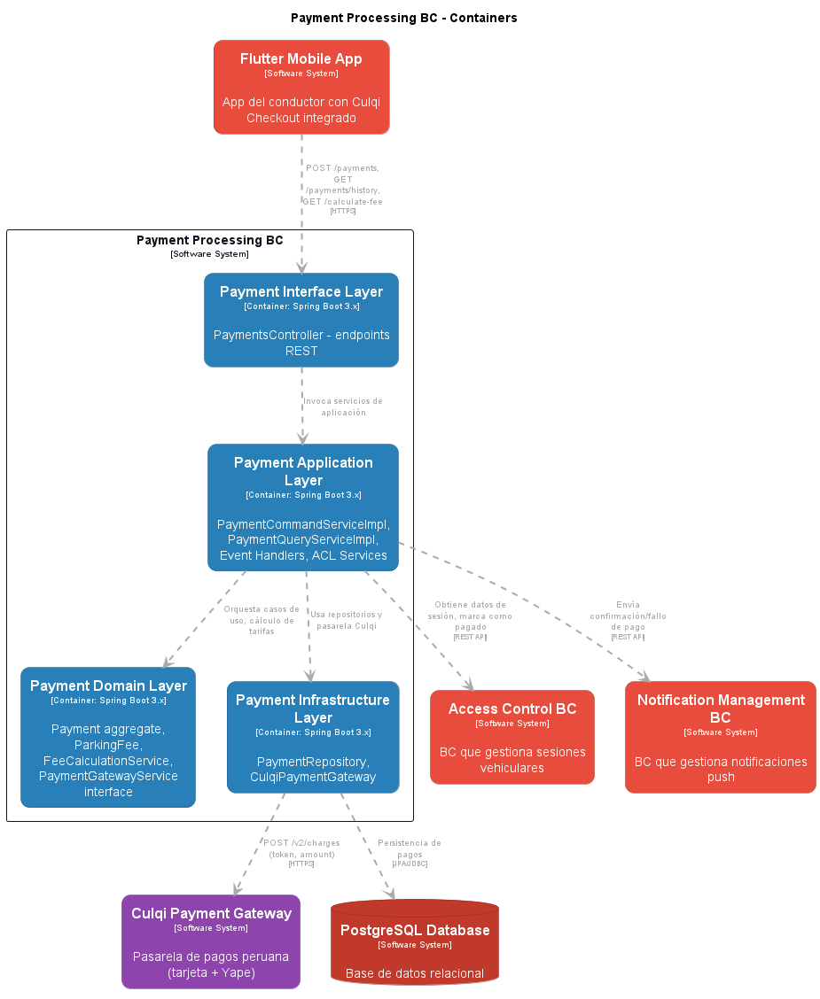
<br>

### 4.2.3.6. Bounded Context Software Architecture Code Level Diagrams

En esta sección se presentan los diagramas de nivel código que detallan la estructura interna del contexto de Payment Processing.

#### 4.2.3.6.1. Bounded Context Domain Layer Class Diagrams

El diagrama de clases del Domain Layer del contexto de Payment Processing ilustra las entidades, objetos de valor y servicios que componen este bounded context.

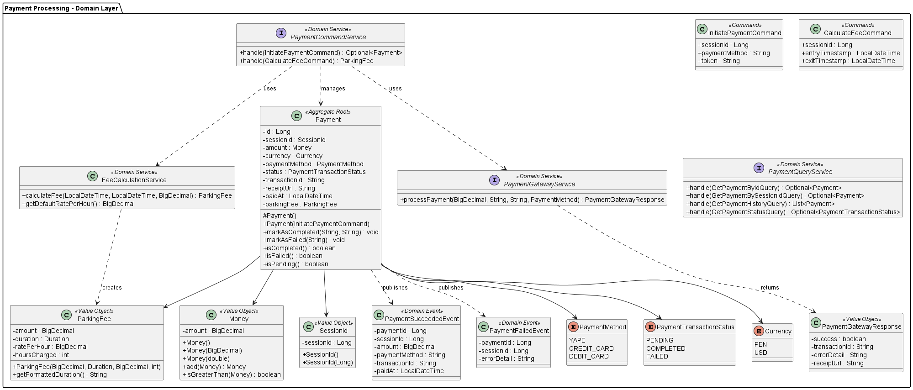
<br>
#### 4.2.3.6.2. Bounded Context Database Design Diagram

El diagrama de diseño de base de datos del contexto de Payment Processing muestra la estructura de las tablas y sus relaciones.

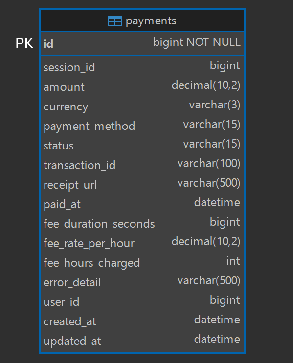
<br>


## 4.2.4. Bounded Context: Emergency & Safety

Este bounded context gestiona la detección de condiciones peligrosas (fuga de gas, humo) mediante sensores MQ-2 y la activación automática de protocolos de emergencia. Cuando se detecta una condición peligrosa, el sistema abre todas las barreras, cambia todos los LEDs a modo evacuación y notifica a administradores y conductores. Es un bounded context Supporting que, cuando se activa, sobrescribe el comportamiento normal de los bounded contexts Core (Access Control y Parking Monitoring).

### 4.2.4.1. Domain Layer

En esta sección se describen los elementos del Domain Layer del contexto de Emergency & Safety, que encapsulan la lógica central relacionada con la detección de emergencias y la activación de protocolos de evacuación.

#### 1. EmergencyAlert (Aggregate Root)

Representa una alerta de emergencia detectada por los sensores de gas/humo del estacionamiento. Tiene su propio ciclo de vida: TRIGGERED → ACTIVE → RESOLVED.

**Atributos principales:**

| Atributo | Tipo | Visibilidad | Descripción |
|---|---|---|---|
| id | Long | private | Identificador único de la alerta. |
| sensorId | EmergencySensorId | private | Identificador del sensor MQ-2 que disparó la alerta. |
| gasLevel | int | private | Nivel de gas detectado en PPM (partes por millón). |
| type | EmergencyType | private | Tipo de emergencia (GAS o SMOKE). |
| status | EmergencyStatus | private | Estado actual de la alerta (ACTIVE o RESOLVED). |
| triggeredAt | LocalDateTime | private | Fecha y hora en que se disparó la alerta. |
| resolvedAt | LocalDateTime | private | Fecha y hora de resolución (null mientras está activa). |
| resolvedBy | Long | private | ID del administrador que resolvió la emergencia (null mientras está activa). |
| sensorLocation | String | private | Ubicación física del sensor dentro del estacionamiento (e.g., "Nivel B2, Zona A"). |

**Métodos principales:**

| Método | Tipo Retorno | Visibilidad | Descripción |
|---|---|---|---|
| EmergencyAlert() | Constructor | protected | Constructor protegido para JPA. |
| EmergencyAlert(TriggerEmergencyAlertCommand command) | Constructor | public | Crea una alerta a partir de un comando. Inicializa con status=ACTIVE, resolvedAt=null, resolvedBy=null. Publica EmergencyAlertTriggeredEvent. |
| resolve(Long adminUserId) | void | public | Marca la emergencia como RESOLVED, registra resolvedAt y resolvedBy. Lanza excepción si ya está resuelta. Publica EmergencyResolvedEvent. |
| isActive() | boolean | public | Devuelve true si status es ACTIVE. |
| isResolved() | boolean | public | Devuelve true si status es RESOLVED. |
| exceedsThreshold() | boolean | public | Devuelve true si gasLevel supera el umbral de peligro (900 PPM por defecto). |

#### 2. TriggerEmergencyAlertCommand (Command)

| Atributo | Tipo | Visibilidad | Descripción |
|---|---|---|---|
| sensorId | String | public | ID del sensor MQ-2 que detectó la condición peligrosa. |
| gasLevel | int | public | Nivel de gas en PPM. |
| type | String | public | Tipo de emergencia ("GAS" o "SMOKE"). |
| sensorLocation | String | public | Ubicación del sensor en el estacionamiento. |

#### 3. ResolveEmergencyCommand (Command)

| Atributo | Tipo | Visibilidad | Descripción |
|---|---|---|---|
| emergencyId | Long | public | ID de la alerta a resolver. |
| adminUserId | Long | public | ID del administrador que resuelve la emergencia. |

#### 4. ActivateEvacuationCommand (Command)

| Atributo | Tipo | Visibilidad | Descripción |
|---|---|---|---|
| emergencyId | Long | public | ID de la emergencia que justifica la evacuación. |

#### 5. Queries

| Query | Atributos principales | Descripción |
|---|---|---|
| GetEmergencyStatusQuery | (sin atributos) | Obtiene el estado actual de emergencia del estacionamiento (NORMAL o detalle de emergencia activa). |
| GetEmergencyByIdQuery | emergencyId : Long | Obtiene una alerta específica por su ID. |
| GetActiveEmergenciesQuery | (sin atributos) | Obtiene todas las emergencias activas. |
| GetEmergencyHistoryQuery | startDate : LocalDate, endDate : LocalDate | Obtiene historial de emergencias en un rango de fechas. |

#### 6. EmergencyAlertTriggeredEvent (Domain Event)

| Atributo | Tipo | Visibilidad | Descripción |
|---|---|---|---|
| source | Object | private | Objeto origen del evento. |
| emergencyId | Long | private | ID de la alerta creada. |
| type | EmergencyType | private | Tipo de emergencia (GAS o SMOKE). |
| gasLevel | int | private | Nivel de gas detectado. |
| sensorLocation | String | private | Ubicación del sensor. |
| triggeredAt | LocalDateTime | private | Momento de la detección. |

#### 7. EmergencyResolvedEvent (Domain Event)

| Atributo | Tipo | Visibilidad | Descripción |
|---|---|---|---|
| source | Object | private | Objeto origen del evento. |
| emergencyId | Long | private | ID de la alerta resuelta. |
| resolvedAt | LocalDateTime | private | Momento de la resolución. |
| resolvedBy | Long | private | ID del administrador que resolvió. |

#### 8. EmergencyCommandService (Domain Service)

| Método | Tipo de Retorno | Visibilidad | Descripción |
|---|---|---|---|
| handle(TriggerEmergencyAlertCommand command) | Optional\<EmergencyAlert> | public | Crea una alerta de emergencia y activa el protocolo de evacuación. Valida que el gasLevel supere el umbral de 900 PPM. |
| handle(ResolveEmergencyCommand command) | void | public | Resuelve una emergencia activa y restaura la operación normal del estacionamiento. |
| handle(ActivateEvacuationCommand command) | void | public | Activa manualmente el protocolo de evacuación (requiere emergencia activa). |

#### 9. EmergencyQueryService (Domain Service)

| Método | Tipo de Retorno | Visibilidad | Descripción |
|---|---|---|---|
| handle(GetEmergencyStatusQuery query) | EmergencyStatusResponse | public | Retorna el estado actual: si hay emergencia activa retorna sus detalles, si no retorna status "NORMAL". |
| handle(GetEmergencyByIdQuery query) | Optional\<EmergencyAlert> | public | Obtiene una alerta por su ID. |
| handle(GetActiveEmergenciesQuery query) | List\<EmergencyAlert> | public | Obtiene todas las emergencias activas (normalmente 0 o 1). |
| handle(GetEmergencyHistoryQuery query) | List\<EmergencyAlert> | public | Obtiene historial de emergencias en un rango de fechas. |

#### 10. EmergencyThresholdService (Domain Service)

Servicio de dominio que encapsula la lógica de evaluación de umbrales de peligro.

| Método | Tipo de Retorno | Visibilidad | Descripción |
|---|---|---|---|
| isGasLevelDangerous(int gasPPM) | boolean | public | Evalúa si el nivel de gas supera el umbral de peligro (900 PPM configurable). |
| isDangerousCondition(int gasPPM, EmergencyType type) | boolean | public | Evalúa según el tipo de emergencia si la condición es peligrosa. |
| getGasThreshold() | int | public | Retorna el umbral actual de gas en PPM (configurable). |

#### 11. EmergencyType (Value Object)

| Atributo | Tipo | Visibilidad | Descripción |
|---|---|---|---|
| GAS | Enum | public | Emergencia por fuga de gas. |
| SMOKE | Enum | public | Emergencia por detección de humo. |

#### 12. EmergencyStatus (Value Object)

| Atributo | Tipo | Visibilidad | Descripción |
|---|---|---|---|
| ACTIVE | Enum | public | La emergencia está activa. |
| RESOLVED | Enum | public | La emergencia ha sido resuelta. |

#### 13. EmergencySensorId (Value Object)

| Atributo | Tipo | Visibilidad | Descripción |
|---|---|---|---|
| sensorId | String | private | Identificador del sensor MQ-2 (e.g., "MQ2-B2-A01"). |

| Método | Tipo Retorno | Visibilidad | Descripción |
|---|---|---|---|
| EmergencySensorId() | Constructor | public | Constructor requerido por JPA. |
| EmergencySensorId(String sensorId) | Constructor | public | Inicializa y valida que no sea vacío. |

#### 14. EmergencyStatusResponse (Value Object)

Respuesta que encapsula el estado actual de emergencia del estacionamiento.

| Atributo | Tipo | Visibilidad | Descripción |
|---|---|---|---|
| isEmergencyActive | boolean | private | Indica si hay una emergencia activa. |
| emergencyId | Long | private | ID de la emergencia activa (null si no hay). |
| type | EmergencyType | private | Tipo de emergencia (null si no hay). |
| gasLevel | int | private | Nivel de gas (0 si no hay emergencia). |
| sensorLocation | String | private | Ubicación del sensor (null si no hay). |
| triggeredAt | LocalDateTime | private | Momento de la detección (null si no hay). |
| overallStatus | String | private | "NORMAL" o "EMERGENCY". |

---

### 4.2.4.2. Interface Layer

#### 1. EmergencyController (REST Controller)

Controlador REST que expone endpoints para gestionar alertas de emergencia.

| Nombre del método | Ruta base típica | Método HTTP | Descripción |
|---|---|---|---|
| triggerAlert | /api/v1/emergency/alerts | POST | Registra una nueva alerta de emergencia disparada por el sensor MQ-2 (llamado desde el edge server). |
| getEmergencyStatus | /api/v1/emergency/status | GET | Consulta el estado actual de emergencia del estacionamiento. |
| activateEvacuation | /api/v1/emergency/evacuate | POST | Activa manualmente el protocolo de evacuación (solo admin). |
| resolveEmergency | /api/v1/emergencies/{id}/resolve | PATCH | Marca una emergencia como resuelta y restaura operación normal (solo admin). |
| getEmergencyById | /api/v1/emergencies/{id} | GET | Obtiene detalles de una alerta específica. |
| getEmergencyHistory | /api/v1/emergencies/history | GET | Obtiene historial de emergencias con filtros de fecha. |

#### 2. Resources (DTOs)

| Resource | Atributos principales | Descripción |
|---|---|---|
| TriggerAlertResource | sensorId: String, gasLevel: int, type: String, sensorLocation: String | Datos de la alerta recibida del edge server. |
| EmergencyAlertResource | id: Long, sensorId: String, gasLevel: int, type: String, status: String, triggeredAt: LocalDateTime, resolvedAt: LocalDateTime, resolvedBy: Long, sensorLocation: String | Representación completa de una alerta. |
| EmergencyStatusResource | isEmergencyActive: boolean, emergencyId: Long, type: String, gasLevel: int, sensorLocation: String, triggeredAt: LocalDateTime, overallStatus: String | Estado actual de emergencia del estacionamiento. |
| ResolveEmergencyResource | adminUserId: Long | Datos para resolver una emergencia. |

#### 3. Transform (Assemblers)

| Assembler | Entrada | Salida | Descripción |
|---|---|---|---|
| EmergencyAlertResourceFromEntityAssembler | EmergencyAlert | EmergencyAlertResource | Convierte entidad a DTO de respuesta. |
| TriggerEmergencyAlertCommandFromResourceAssembler | TriggerAlertResource | TriggerEmergencyAlertCommand | Convierte DTO del edge server en comando. |
| ResolveEmergencyCommandFromResourceAssembler | ResolveEmergencyResource, Long id | ResolveEmergencyCommand | Convierte DTO de resolución en comando. |
| EmergencyStatusResourceFromResponseAssembler | EmergencyStatusResponse | EmergencyStatusResource | Convierte response del dominio a DTO. |

---

### 4.2.4.3. Application Layer

#### 1. EmergencyCommandServiceImpl (Command Service Implementation)

Implementación del servicio de comandos para gestionar alertas de emergencia.

**Atributos principales:**

| Atributo | Tipo | Visibilidad | Descripción |
|---|---|---|---|
| emergencyAlertRepository | EmergencyAlertRepository | private | Repositorio para persistencia de alertas. |
| emergencyThresholdService | EmergencyThresholdService | private | Servicio de evaluación de umbrales de peligro. |

**Métodos principales:**

| Método | Tipo de Retorno | Visibilidad | Descripción |
|---|---|---|---|
| handle(TriggerEmergencyAlertCommand command) | Optional\<EmergencyAlert> | public | Procesa alerta: (1) evalúa umbral con EmergencyThresholdService, (2) si es peligroso crea EmergencyAlert, (3) persiste y publica EmergencyAlertTriggeredEvent. Si gasLevel no supera umbral, retorna empty sin crear alerta. |
| handle(ResolveEmergencyCommand command) | void | public | Resuelve emergencia: (1) busca alerta activa, (2) marca como RESOLVED con adminUserId, (3) persiste y publica EmergencyResolvedEvent. Lanza 404 si no existe o 409 si ya está resuelta. |
| handle(ActivateEvacuationCommand command) | void | public | Activa evacuación manual: verifica que exista emergencia activa (409 si no existe), luego publica evento de evacuación. |

#### 2. EmergencyQueryServiceImpl (Query Service Implementation)

**Atributos principales:**

| Atributo | Tipo | Visibilidad | Descripción |
|---|---|---|---|
| emergencyAlertRepository | EmergencyAlertRepository | private | Repositorio para acceso de lectura. |

**Métodos principales:**

| Método | Tipo de Retorno | Visibilidad | Descripción |
|---|---|---|---|
| handle(GetEmergencyStatusQuery query) | EmergencyStatusResponse | public | Busca emergencias activas. Si existe al menos una, retorna detalles con overallStatus="EMERGENCY". Si no hay, retorna overallStatus="NORMAL". |
| handle(GetEmergencyByIdQuery query) | Optional\<EmergencyAlert> | public | Obtiene alerta por ID. |
| handle(GetActiveEmergenciesQuery query) | List\<EmergencyAlert> | public | Obtiene todas las emergencias con status ACTIVE. |
| handle(GetEmergencyHistoryQuery query) | List\<EmergencyAlert> | public | Obtiene alertas en un rango de fechas, ordenadas por triggeredAt descendente. |

#### 3. EmergencyAlertTriggeredEventHandler (Domain Event Handler)

Maneja el evento de alerta disparada para activar el protocolo de emergencia en otros bounded contexts.

**Atributos principales:**

| Atributo | Tipo | Visibilidad | Descripción |
|---|---|---|---|
| externalAccessControlService | ExternalAccessControlService | private | Servicio ACL para abrir todas las barreras. |
| externalParkingMonitoringService | ExternalParkingMonitoringService | private | Servicio ACL para cambiar LEDs a modo evacuación. |
| externalNotificationService | ExternalNotificationService | private | Servicio ACL para enviar notificaciones masivas. |

**Métodos principales:**

| Método | Tipo de Retorno | Visibilidad | Descripción |
|---|---|---|---|
| on(EmergencyAlertTriggeredEvent event) | void | public | Ejecuta el protocolo de emergencia en paralelo: (1) envía comando a Access Control para abrir TODAS las barreras, (2) envía comando a Parking Monitoring para cambiar TODOS los LEDs a rojo intermitente (evacuación), (3) envía notificación push a TODOS los conductores con sesión activa via Notification BC, (4) envía alerta al dashboard del administrador. |

#### 4. EmergencyResolvedEventHandler (Domain Event Handler)

**Atributos principales:**

| Atributo | Tipo | Visibilidad | Descripción |
|---|---|---|---|
| externalAccessControlService | ExternalAccessControlService | private | Servicio ACL para restaurar barreras. |
| externalParkingMonitoringService | ExternalParkingMonitoringService | private | Servicio ACL para restaurar LEDs. |

**Métodos principales:**

| Método | Tipo de Retorno | Visibilidad | Descripción |
|---|---|---|---|
| on(EmergencyResolvedEvent event) | void | public | Restaura operación normal: (1) notifica a Access Control para restaurar control normal de barreras, (2) notifica a Parking Monitoring para restaurar LEDs según estado actual de sensores. |

#### 5. ExternalAccessControlService (Outbound ACL Service)

| Método | Tipo de Retorno | Visibilidad | Descripción |
|---|---|---|---|
| openAllBarriers(String reason) | void | public | Envía comando a Access Control BC para abrir todas las barreras del estacionamiento. |
| restoreBarrierControl() | void | public | Notifica a Access Control que restaure el control normal de barreras. |

#### 6. ExternalParkingMonitoringService (Outbound ACL Service)

| Método | Tipo de Retorno | Visibilidad | Descripción |
|---|---|---|---|
| setAllLedsToEvacuationMode() | void | public | Envía comando a Parking Monitoring para cambiar todos los LEDs a rojo intermitente. |
| restoreLedsToNormalMode() | void | public | Notifica a Parking Monitoring que restaure los LEDs según el estado actual de los sensores. |

#### 7. ExternalNotificationService (Outbound ACL Service)

| Método | Tipo de Retorno | Visibilidad | Descripción |
|---|---|---|---|
| broadcastEmergencyAlert(String message, String sensorLocation) | void | public | Envía notificación push a TODOS los conductores con sesión activa alertando sobre la emergencia. Ignora preferencias de notificación del usuario (regla de negocio: alertas de emergencia siempre se envían). |
| sendAdminEmergencyAlert(String message, String sensorLocation, int gasLevel) | void | public | Envía alerta al dashboard del administrador con detalles de la emergencia. |

---

### 4.2.4.4. Infrastructure Layer

#### 1. EmergencyAlertRepository (Repository Interface)

| Método | Tipo de Retorno | Visibilidad | Descripción |
|---|---|---|---|
| findById(Long id) | Optional\<EmergencyAlert> | public | Busca una alerta por su ID. |
| save(EmergencyAlert alert) | EmergencyAlert | public | Persiste o actualiza una alerta. |
| findByStatus(EmergencyStatus status) | List\<EmergencyAlert> | public | Obtiene alertas por estado (ACTIVE o RESOLVED). |
| findByTriggeredAtBetween(LocalDateTime start, LocalDateTime end) | List\<EmergencyAlert> | public | Obtiene alertas en un rango de fechas. |
| existsByStatus(EmergencyStatus status) | boolean | public | Verifica si existe alguna emergencia con el estado indicado. |
| findFirstByStatusOrderByTriggeredAtDesc(EmergencyStatus status) | Optional\<EmergencyAlert> | public | Obtiene la emergencia activa más reciente. |

---

### 4.2.4.5. Bounded Context Software Architecture Component Level Diagrams

En esta sección se presentan los diagramas de nivel componente que ilustran la arquitectura de software del contexto de Emergency & Safety. Se muestra la interacción entre los componentes internos y la comunicación con los bounded contexts que deben reaccionar ante una emergencia.

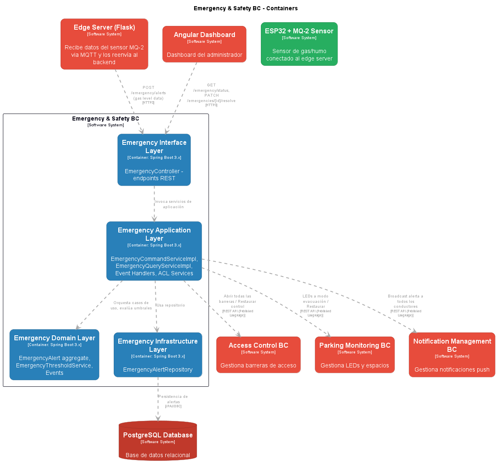
<br>


### 4.2.4.6. Bounded Context Software Architecture Code Level Diagrams

En esta sección se presentan los diagramas de nivel código que detallan la estructura interna del contexto de Emergency & Safety.

#### 4.2.4.6.1. Bounded Context Domain Layer Class Diagrams

El diagrama de clases del Domain Layer del contexto de Emergency & Safety ilustra las entidades, objetos de valor y servicios que componen este bounded context.

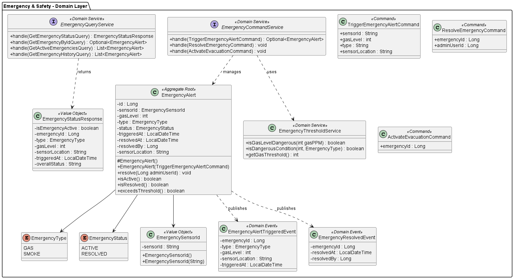
<br>


#### 4.2.4.6.2. Bounded Context Database Design Diagram

El diagrama de diseño de base de datos del contexto de Emergency & Safety muestra la estructura de las tablas y sus relaciones.

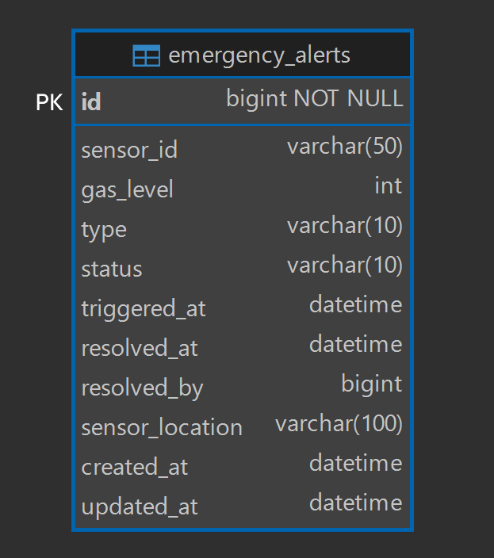
<br>


## 4.2.5. Bounded Context: Analytics & Reporting

Este bounded context gestiona la generación de métricas, estadísticas y reportes para la toma de decisiones administrativas. Consume datos de otros bounded contexts (Parking Monitoring, Access Control, Payment Processing) para calcular tasas de ocupación, rotación, horas punta, ingresos y mapas de calor. Es un bounded context Supporting de naturaleza predominantemente de lectura, ya que no modifica datos de otros contexts sino que los agrega y transforma en información accionable.

### 4.2.5.1. Domain Layer

En esta sección se describen los elementos del Domain Layer del contexto de Analytics & Reporting, que encapsulan la lógica relacionada con el cálculo de métricas y la generación de reportes.

#### 1. Report (Aggregate Root)

Representa un reporte generado por el sistema, que puede ser descargado en formato PDF por el administrador.

**Atributos principales:**

| Atributo | Tipo | Visibilidad | Descripción |
|---|---|---|---|
| id | Long | private | Identificador único del reporte. |
| reportType | ReportType | private | Tipo de reporte (OCCUPANCY, REVENUE, COMBINED). |
| reportPeriod | ReportPeriod | private | Período cubierto por el reporte (fecha inicio y fin). |
| generatedAt | LocalDateTime | private | Fecha y hora de generación del reporte. |
| generatedBy | Long | private | ID del administrador que generó el reporte. |
| fileUrl | String | private | URL del archivo PDF generado. |
| status | ReportStatus | private | Estado del reporte (GENERATING, COMPLETED, FAILED). |
| facilityId | Long | private | ID del estacionamiento al que pertenece el reporte. |

**Métodos principales:**

| Método | Tipo Retorno | Visibilidad | Descripción |
|---|---|---|---|
| Report() | Constructor | protected | Constructor protegido para JPA. |
| Report(GenerateReportCommand command) | Constructor | public | Crea un reporte a partir de un comando. Inicializa con status=GENERATING, fileUrl=null. |
| markAsCompleted(String fileUrl) | void | public | Marca el reporte como completado y asigna la URL del archivo PDF generado. |
| markAsFailed(String errorDetail) | void | public | Marca el reporte como fallido. |
| isCompleted() | boolean | public | Devuelve true si status es COMPLETED. |

#### 2. GenerateReportCommand (Command)

| Atributo | Tipo | Visibilidad | Descripción |
|---|---|---|---|
| reportType | String | public | Tipo de reporte ("OCCUPANCY", "REVENUE", "COMBINED"). |
| startDate | LocalDate | public | Fecha de inicio del período. |
| endDate | LocalDate | public | Fecha de fin del período. |
| generatedBy | Long | public | ID del administrador que solicita el reporte. |
| facilityId | Long | public | ID del estacionamiento. |

#### 3. Queries

| Query | Atributos principales | Descripción |
|---|---|---|
| GetOccupancyMetricsQuery | startDate : LocalDate, endDate : LocalDate, facilityId : Long | Obtiene métricas de ocupación para un rango de fechas. |
| GetRevenueMetricsQuery | startDate : LocalDate, endDate : LocalDate, facilityId : Long | Obtiene métricas de ingresos para un rango de fechas. |
| GetHeatmapDataQuery | startDate : LocalDate, endDate : LocalDate, facilityId : Long | Obtiene datos para el mapa de calor de uso por espacio. |
| GetPeakHoursQuery | startDate : LocalDate, endDate : LocalDate, facilityId : Long | Obtiene las horas punta del estacionamiento. |
| GetReportByIdQuery | reportId : Long | Obtiene un reporte específico por su ID. |
| GetReportsByFacilityQuery | facilityId : Long | Obtiene todos los reportes de un estacionamiento. |

#### 4. ReportGeneratedEvent (Domain Event)

| Atributo | Tipo | Visibilidad | Descripción |
|---|---|---|---|
| source | Object | private | Objeto origen del evento. |
| reportId | Long | private | ID del reporte generado. |
| reportType | ReportType | private | Tipo de reporte. |
| fileUrl | String | private | URL del PDF generado. |
| generatedBy | Long | private | ID del administrador. |

#### 5. AnalyticsQueryService (Domain Service)

Proporciona métodos para consultar métricas calculadas a partir de datos de otros bounded contexts.

| Método | Tipo de Retorno | Visibilidad | Descripción |
|---|---|---|---|
| handle(GetOccupancyMetricsQuery query) | OccupancyMetrics | public | Calcula y retorna métricas de ocupación: tasa promedio, horas punta, tasa de rotación, datos por hora. |
| handle(GetRevenueMetricsQuery query) | RevenueMetrics | public | Calcula y retorna métricas de ingresos: total, ticket promedio, pagos por método, datos por día. |
| handle(GetHeatmapDataQuery query) | List\<HeatmapEntry> | public | Calcula datos del mapa de calor: uso por espacio (cuántas veces fue ocupado y duración promedio). |
| handle(GetPeakHoursQuery query) | PeakHoursData | public | Identifica las horas con mayor ocupación promedio. |

#### 6. ReportCommandService (Domain Service)

| Método | Tipo de Retorno | Visibilidad | Descripción |
|---|---|---|---|
| handle(GenerateReportCommand command) | Optional\<Report> | public | Inicia la generación de un reporte PDF. Crea entidad Report, genera el PDF y lo almacena, actualiza status a COMPLETED. |

#### 7. ReportQueryService (Domain Service)

| Método | Tipo de Retorno | Visibilidad | Descripción |
|---|---|---|---|
| handle(GetReportByIdQuery query) | Optional\<Report> | public | Obtiene un reporte por su ID. |
| handle(GetReportsByFacilityQuery query) | List\<Report> | public | Obtiene todos los reportes de un estacionamiento. |

#### 8. OccupancyAnalyticsService (Domain Service)

Servicio de dominio que encapsula la lógica de cálculo de métricas de ocupación.

| Método | Tipo de Retorno | Visibilidad | Descripción |
|---|---|---|---|
| calculateAverageOccupancyRate(List\<SlotStatusSnapshot> snapshots) | double | public | Calcula la tasa de ocupación promedio a partir de snapshots históricos. |
| calculateTurnoverRate(long totalSessions, long totalSlots, int days) | double | public | Calcula la tasa de rotación: sesiones / (espacios × días). |
| identifyPeakHours(List\<SlotStatusSnapshot> snapshots) | List\<Integer> | public | Identifica las horas del día con mayor ocupación promedio. |

#### 9. RevenueAnalyticsService (Domain Service)

| Método | Tipo de Retorno | Visibilidad | Descripción |
|---|---|---|---|
| calculateTotalRevenue(List\<PaymentSummary> payments) | BigDecimal | public | Suma el monto total de pagos en el período. |
| calculateAverageTicket(List\<PaymentSummary> payments) | BigDecimal | public | Calcula el ticket promedio (total / cantidad de pagos). |
| groupByPaymentMethod(List\<PaymentSummary> payments) | Map\<String, BigDecimal> | public | Agrupa ingresos por método de pago (YAPE, CREDIT_CARD, DEBIT_CARD). |
| groupByDay(List\<PaymentSummary> payments) | Map\<LocalDate, BigDecimal> | public | Agrupa ingresos por día. |

#### 10. OccupancyMetrics (Value Object)

| Atributo | Tipo | Visibilidad | Descripción |
|---|---|---|---|
| averageOccupancyRate | double | private | Tasa de ocupación promedio en porcentaje (0-100). |
| peakHours | List\<Integer> | private | Horas del día con mayor ocupación (e.g., [12, 13, 18, 19]). |
| turnoverRate | double | private | Tasa de rotación (sesiones por espacio por día). |
| dataByHour | Map\<Integer, Double> | private | Ocupación promedio desglosada por hora del día (0-23). |
| totalSlots | int | private | Total de espacios en el estacionamiento. |
| periodStart | LocalDate | private | Inicio del período analizado. |
| periodEnd | LocalDate | private | Fin del período analizado. |

#### 11. RevenueMetrics (Value Object)

| Atributo | Tipo | Visibilidad | Descripción |
|---|---|---|---|
| totalRevenue | BigDecimal | private | Ingresos totales en el período. |
| averageTicket | BigDecimal | private | Ticket promedio por sesión. |
| totalTransactions | int | private | Cantidad total de transacciones. |
| paymentsByMethod | Map\<String, BigDecimal> | private | Ingresos desglosados por método de pago. |
| dataByDay | Map\<LocalDate, BigDecimal> | private | Ingresos desglosados por día. |
| currency | String | private | Moneda (PEN). |

#### 12. HeatmapEntry (Value Object)

| Atributo | Tipo | Visibilidad | Descripción |
|---|---|---|---|
| slotId | Long | private | ID del espacio. |
| slotCode | String | private | Código del espacio (e.g., "A-15"). |
| usageCount | int | private | Cantidad de veces que fue ocupado en el período. |
| averageDurationMinutes | double | private | Duración promedio de ocupación en minutos. |
| totalOccupiedMinutes | long | private | Tiempo total que estuvo ocupado en minutos. |

#### 13. PeakHoursData (Value Object)

| Atributo | Tipo | Visibilidad | Descripción |
|---|---|---|---|
| peakHours | List\<Integer> | private | Horas con mayor ocupación (e.g., [12, 13, 18, 19, 20]). |
| occupancyByHour | Map\<Integer, Double> | private | Porcentaje de ocupación promedio por hora (0-23). |
| busiestDay | String | private | Día de la semana con mayor ocupación promedio. |

#### 14. SlotStatusSnapshot (Value Object)

Snapshot del estado de un espacio en un momento dado (usado para cálculos históricos).

| Atributo | Tipo | Visibilidad | Descripción |
|---|---|---|---|
| slotId | Long | private | ID del espacio. |
| status | String | private | Estado en ese momento (AVAILABLE, OCCUPIED). |
| timestamp | LocalDateTime | private | Momento del snapshot. |

#### 15. PaymentSummary (Value Object)

Resumen de un pago (proyección de datos del BC Payment Processing).

| Atributo | Tipo | Visibilidad | Descripción |
|---|---|---|---|
| paymentId | Long | private | ID del pago. |
| amount | BigDecimal | private | Monto del pago. |
| paymentMethod | String | private | Método de pago utilizado. |
| paidAt | LocalDateTime | private | Momento del pago. |

#### 16. ReportType (Value Object)

| Atributo | Tipo | Visibilidad | Descripción |
|---|---|---|---|
| OCCUPANCY | Enum | public | Reporte de ocupación. |
| REVENUE | Enum | public | Reporte de ingresos. |
| COMBINED | Enum | public | Reporte combinado (ocupación + ingresos). |

#### 17. ReportStatus (Value Object)

| Atributo | Tipo | Visibilidad | Descripción |
|---|---|---|---|
| GENERATING | Enum | public | El reporte se está generando. |
| COMPLETED | Enum | public | El reporte se generó exitosamente. |
| FAILED | Enum | public | La generación del reporte falló. |

#### 18. ReportPeriod (Value Object)

| Atributo | Tipo | Visibilidad | Descripción |
|---|---|---|---|
| startDate | LocalDate | private | Fecha de inicio del período. |
| endDate | LocalDate | private | Fecha de fin del período. |

| Método | Tipo Retorno | Visibilidad | Descripción |
|---|---|---|---|
| ReportPeriod(LocalDate start, LocalDate end) | Constructor | public | Inicializa y valida que startDate sea anterior a endDate. |
| getDurationInDays() | long | public | Retorna la cantidad de días del período. |
| includes(LocalDate date) | boolean | public | Verifica si una fecha está dentro del período. |

---

### 4.2.5.2. Interface Layer

#### 1. AnalyticsController (REST Controller)

Controlador REST que expone endpoints para consultar métricas y estadísticas del estacionamiento.

| Nombre del método | Ruta base típica | Método HTTP | Descripción |
|---|---|---|---|
| getOccupancyMetrics | /api/v1/analytics/occupancy | GET | Obtiene métricas de ocupación (tasa promedio, rotación, horas punta). Parámetros: startDate, endDate. |
| getRevenueMetrics | /api/v1/analytics/revenue | GET | Obtiene métricas de ingresos (total, ticket promedio, por método). Parámetros: startDate, endDate. |
| getHeatmapData | /api/v1/analytics/heatmap | GET | Obtiene datos del mapa de calor de uso por espacio. Parámetros: startDate, endDate. |
| getPeakHours | /api/v1/analytics/peak-hours | GET | Obtiene las horas punta del estacionamiento. Parámetros: startDate, endDate. |

#### 2. ReportsController (REST Controller)

Controlador REST que expone endpoints para generar y consultar reportes.

| Nombre del método | Ruta base típica | Método HTTP | Descripción |
|---|---|---|---|
| generateReport | /api/v1/reports | POST | Genera un nuevo reporte PDF de ocupación o ingresos. |
| getReportById | /api/v1/reports/{id} | GET | Obtiene un reporte específico por su ID. |
| getReportsByFacility | /api/v1/reports | GET | Obtiene todos los reportes del estacionamiento. |
| downloadReport | /api/v1/reports/{id}/download | GET | Descarga el archivo PDF del reporte. |

#### 3. Resources (DTOs)

| Resource | Atributos principales | Descripción |
|---|---|---|
| OccupancyMetricsResource | averageOccupancyRate: double, peakHours: List\<Integer>, turnoverRate: double, dataByHour: Map\<Integer, Double>, totalSlots: int, periodStart: String, periodEnd: String | Métricas de ocupación formateadas. |
| RevenueMetricsResource | totalRevenue: BigDecimal, averageTicket: BigDecimal, totalTransactions: int, paymentsByMethod: Map\<String, BigDecimal>, dataByDay: Map\<String, BigDecimal>, currency: String | Métricas de ingresos formateadas. |
| HeatmapEntryResource | slotId: Long, slotCode: String, usageCount: int, averageDurationMinutes: double | Entrada del mapa de calor. |
| PeakHoursResource | peakHours: List\<Integer>, occupancyByHour: Map\<Integer, Double>, busiestDay: String | Datos de horas punta. |
| ReportResource | id: Long, reportType: String, periodStart: String, periodEnd: String, generatedAt: LocalDateTime, status: String, fileUrl: String | Representación de un reporte. |
| GenerateReportResource | reportType: String, startDate: String, endDate: String | Datos para solicitar generación de reporte. |

#### 4. Transform (Assemblers)

| Assembler | Entrada | Salida | Descripción |
|---|---|---|---|
| OccupancyMetricsResourceFromValueObjectAssembler | OccupancyMetrics | OccupancyMetricsResource | Convierte VO a DTO. |
| RevenueMetricsResourceFromValueObjectAssembler | RevenueMetrics | RevenueMetricsResource | Convierte VO a DTO. |
| HeatmapEntryResourceFromValueObjectAssembler | HeatmapEntry | HeatmapEntryResource | Convierte VO a DTO. |
| ReportResourceFromEntityAssembler | Report | ReportResource | Convierte entidad a DTO. |
| GenerateReportCommandFromResourceAssembler | GenerateReportResource | GenerateReportCommand | Convierte DTO en comando. |

---

### 4.2.5.3. Application Layer

#### 1. AnalyticsQueryServiceImpl (Query Service Implementation)

Implementación del servicio de consultas que calcula métricas agregando datos de otros bounded contexts.

**Atributos principales:**

| Atributo | Tipo | Visibilidad | Descripción |
|---|---|---|---|
| occupancyAnalyticsService | OccupancyAnalyticsService | private | Servicio de cálculo de métricas de ocupación. |
| revenueAnalyticsService | RevenueAnalyticsService | private | Servicio de cálculo de métricas de ingresos. |
| externalParkingDataService | ExternalParkingDataService | private | Servicio ACL para obtener datos de Parking Monitoring BC. |
| externalPaymentDataService | ExternalPaymentDataService | private | Servicio ACL para obtener datos de Payment Processing BC. |
| externalSessionDataService | ExternalSessionDataService | private | Servicio ACL para obtener datos de Access Control BC. |

**Métodos principales:**

| Método | Tipo de Retorno | Visibilidad | Descripción |
|---|---|---|---|
| handle(GetOccupancyMetricsQuery query) | OccupancyMetrics | public | Obtiene snapshots de estado de espacios via ACL, calcula ocupación promedio, rotación y horas punta usando OccupancyAnalyticsService. |
| handle(GetRevenueMetricsQuery query) | RevenueMetrics | public | Obtiene datos de pagos via ACL, calcula total, ticket promedio y agrupaciones usando RevenueAnalyticsService. |
| handle(GetHeatmapDataQuery query) | List\<HeatmapEntry> | public | Obtiene datos de sesiones por espacio via ACL, calcula frecuencia de uso y duración promedio por slot. |
| handle(GetPeakHoursQuery query) | PeakHoursData | public | Obtiene snapshots de ocupación por hora via ACL, identifica las horas con mayor demanda. |

#### 2. ReportCommandServiceImpl (Command Service Implementation)

**Atributos principales:**

| Atributo | Tipo | Visibilidad | Descripción |
|---|---|---|---|
| reportRepository | ReportRepository | private | Repositorio para persistencia de reportes. |
| analyticsQueryService | AnalyticsQueryService | private | Servicio de consulta de métricas (para incluir en el PDF). |
| pdfGenerationService | PdfGenerationService | private | Servicio de generación de archivos PDF. |

**Métodos principales:**

| Método | Tipo de Retorno | Visibilidad | Descripción |
|---|---|---|---|
| handle(GenerateReportCommand command) | Optional\<Report> | public | Genera reporte: (1) crea entidad Report con status GENERATING, (2) obtiene métricas via AnalyticsQueryService, (3) genera PDF via PdfGenerationService, (4) almacena archivo y actualiza fileUrl, (5) marca como COMPLETED. Si falla, marca como FAILED. |

#### 3. ReportQueryServiceImpl (Query Service Implementation)

**Atributos principales:**

| Atributo | Tipo | Visibilidad | Descripción |
|---|---|---|---|
| reportRepository | ReportRepository | private | Repositorio para acceso de lectura. |

**Métodos principales:**

| Método | Tipo de Retorno | Visibilidad | Descripción |
|---|---|---|---|
| handle(GetReportByIdQuery query) | Optional\<Report> | public | Obtiene un reporte por su ID. |
| handle(GetReportsByFacilityQuery query) | List\<Report> | public | Obtiene todos los reportes del estacionamiento, ordenados por generatedAt descendente. |

#### 4. ExternalParkingDataService (Outbound ACL Service)

| Método | Tipo de Retorno | Visibilidad | Descripción |
|---|---|---|---|
| getSlotStatusSnapshots(LocalDate start, LocalDate end, Long facilityId) | List\<SlotStatusSnapshot> | public | Obtiene snapshots históricos de estados de espacios desde Parking Monitoring BC. |
| getTotalSlots(Long facilityId) | int | public | Obtiene el total de espacios del estacionamiento. |

#### 5. ExternalPaymentDataService (Outbound ACL Service)

| Método | Tipo de Retorno | Visibilidad | Descripción |
|---|---|---|---|
| getPaymentSummaries(LocalDate start, LocalDate end) | List\<PaymentSummary> | public | Obtiene resúmenes de pagos completados desde Payment Processing BC. |

#### 6. ExternalSessionDataService (Outbound ACL Service)

| Método | Tipo de Retorno | Visibilidad | Descripción |
|---|---|---|---|
| getCompletedSessionCount(LocalDate start, LocalDate end) | long | public | Obtiene cantidad de sesiones completadas desde Access Control BC. |
| getSessionsBySlot(LocalDate start, LocalDate end) | Map\<Long, List\<SessionSummary>> | public | Obtiene sesiones agrupadas por slotId para cálculo de heatmap. |

#### 7. PdfGenerationService (Outbound Service Port)

Interfaz para la generación de archivos PDF. La implementación concreta vive en Infrastructure.

| Método | Tipo de Retorno | Visibilidad | Descripción |
|---|---|---|---|
| generateOccupancyReport(OccupancyMetrics metrics, ReportPeriod period) | byte[] | public | Genera PDF de reporte de ocupación con tablas y gráficos. |
| generateRevenueReport(RevenueMetrics metrics, ReportPeriod period) | byte[] | public | Genera PDF de reporte de ingresos. |
| generateCombinedReport(OccupancyMetrics occ, RevenueMetrics rev, ReportPeriod period) | byte[] | public | Genera PDF de reporte combinado. |

---

### 4.2.5.4. Infrastructure Layer

#### 1. ReportRepository (Repository Interface)

| Método | Tipo de Retorno | Visibilidad | Descripción |
|---|---|---|---|
| findById(Long id) | Optional\<Report> | public | Busca un reporte por su ID. |
| save(Report report) | Report | public | Persiste o actualiza un reporte. |
| findByFacilityIdOrderByGeneratedAtDesc(Long facilityId) | List\<Report> | public | Obtiene reportes de un estacionamiento ordenados por fecha. |
| findByReportTypeAndFacilityId(ReportType type, Long facilityId) | List\<Report> | public | Obtiene reportes por tipo. |

#### 2. PdfGenerationServiceImpl (Infrastructure Service)

Implementación concreta del servicio de generación de PDF usando iText o Apache PDFBox.

**Atributos principales:**

| Atributo | Tipo | Visibilidad | Descripción |
|---|---|---|---|
| fileStoragePath | String | private | Ruta de almacenamiento de archivos PDF generados. |

**Métodos principales:**

| Método | Tipo de Retorno | Visibilidad | Descripción |
|---|---|---|---|
| generateOccupancyReport(OccupancyMetrics metrics, ReportPeriod period) | byte[] | public | Genera PDF con tablas de ocupación por hora, gráfico de barras de horas punta y resumen ejecutivo. |
| generateRevenueReport(RevenueMetrics metrics, ReportPeriod period) | byte[] | public | Genera PDF con tabla de ingresos por día, gráfico de ingresos por método de pago y totales. |
| generateCombinedReport(OccupancyMetrics occ, RevenueMetrics rev, ReportPeriod period) | byte[] | public | Genera PDF combinado con ambas secciones. |

#### 3. SlotStatusSnapshotRepository (Repository Interface)

Repositorio para acceder a los snapshots históricos de estado de espacios (datos que se almacenan periódicamente desde Parking Monitoring para análisis histórico).

| Método | Tipo de Retorno | Visibilidad | Descripción |
|---|---|---|---|
| findByTimestampBetween(LocalDateTime start, LocalDateTime end) | List\<SlotStatusSnapshot> | public | Obtiene snapshots en un rango de tiempo. |
| findBySlotIdAndTimestampBetween(Long slotId, LocalDateTime start, LocalDateTime end) | List\<SlotStatusSnapshot> | public | Obtiene snapshots de un espacio específico. |

---

### 4.2.5.5. Bounded Context Software Architecture Component Level Diagrams

En esta sección se presentan los diagramas de nivel componente que ilustran la arquitectura de software del contexto de Analytics & Reporting.

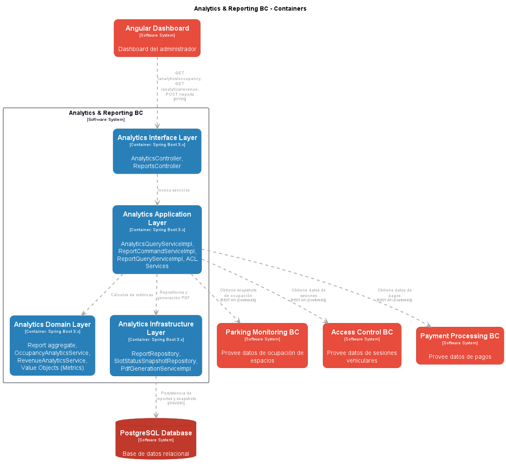
<br>


### 4.2.5.6. Bounded Context Software Architecture Code Level Diagrams

#### 4.2.5.6.1. Bounded Context Domain Layer Class Diagrams

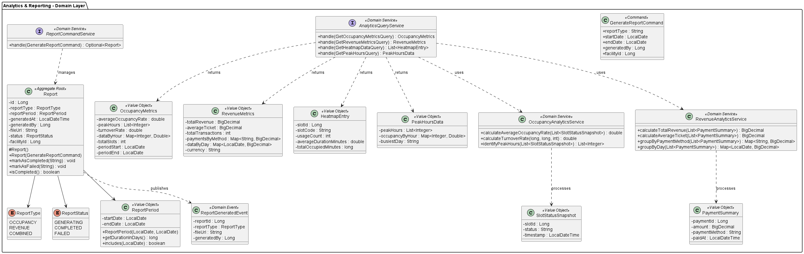
<br>
#### 4.2.5.6.2. Bounded Context Database Design Diagram

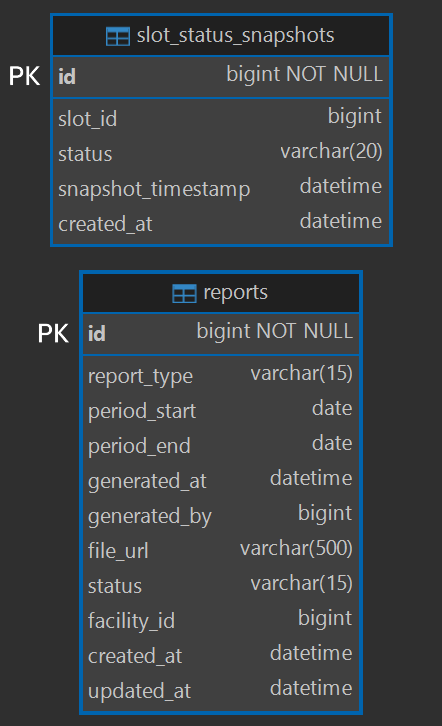
<br>

## 4.2.6. Bounded Context: Notification Management

Este bounded context gestiona el envío de notificaciones push, alertas in-app y la administración de preferencias de notificación por usuario. Recibe solicitudes de envío desde otros bounded contexts (Access Control, Payment Processing, Emergency & Safety) y las procesa a través de Firebase Cloud Messaging (FCM). Administra templates de mensajes, el registro histórico de notificaciones enviadas con su estado (enviada/leída) y respeta las preferencias de cada usuario, con la excepción de las alertas de emergencia que siempre se envían.

### 4.2.6.1. Domain Layer

En esta sección se describen los elementos del Domain Layer del contexto de Notification Management, que encapsulan la lógica central relacionada con el envío, almacenamiento y gestión de notificaciones.

#### 1. Notification (Aggregate Root)

Representa una notificación enviada a un usuario del sistema. Tiene su propio ciclo de vida: PENDING → SENT → DELIVERED → READ (o FAILED).

**Atributos principales:**

| Atributo | Tipo | Visibilidad | Descripción |
|---|---|---|---|
| id | Long | private | Identificador único de la notificación. |
| userId | NotificationUserId | private | Identificador del usuario destinatario. |
| type | NotificationType | private | Tipo de notificación (ENTRY_CONFIRMED, PAYMENT_REMINDER, PAYMENT_SUCCESS, EMERGENCY_ALERT, SESSION_END). |
| title | String | private | Título de la notificación mostrado al usuario. |
| body | String | private | Contenido del mensaje de la notificación. |
| data | String | private | Datos adicionales en formato JSON (e.g., sessionId, amount, slotCode). |
| status | NotificationStatus | private | Estado actual de la notificación (PENDING, SENT, DELIVERED, READ, FAILED). |
| channel | NotificationChannel | private | Canal de envío utilizado (PUSH, IN_APP). |
| createdAt | LocalDateTime | private | Fecha y hora de creación de la notificación. |
| sentAt | LocalDateTime | private | Fecha y hora de envío (null si aún no se envió). |
| readAt | LocalDateTime | private | Fecha y hora en que el usuario la leyó (null si no leída). |
| errorDetail | String | private | Detalle del error si el envío falló (null si exitoso). |

**Métodos principales:**

| Método | Tipo Retorno | Visibilidad | Descripción |
|---|---|---|---|
| Notification() | Constructor | protected | Constructor protegido para JPA. |
| Notification(SendNotificationCommand command) | Constructor | public | Crea una notificación a partir de un comando. Inicializa con status=PENDING, sentAt=null, readAt=null. |
| markAsSent() | void | public | Cambia status a SENT y registra sentAt. |
| markAsDelivered() | void | public | Cambia status a DELIVERED. |
| markAsRead() | void | public | Cambia status a READ y registra readAt. Lanza excepción si ya fue leída. |
| markAsFailed(String errorDetail) | void | public | Cambia status a FAILED y registra el detalle del error. |
| isRead() | boolean | public | Devuelve true si status es READ. |
| isPending() | boolean | public | Devuelve true si status es PENDING. |

#### 2. NotificationPreference (Entity)

Representa la preferencia de un usuario sobre un tipo específico de notificación (si desea recibirla o no).

**Atributos principales:**

| Atributo | Tipo | Visibilidad | Descripción |
|---|---|---|---|
| id | Long | private | Identificador único de la preferencia. |
| userId | NotificationUserId | private | Identificador del usuario. |
| notificationType | NotificationType | private | Tipo de notificación al que aplica la preferencia. |
| enabled | boolean | private | Indica si el usuario desea recibir este tipo de notificación. |

**Métodos principales:**

| Método | Tipo Retorno | Visibilidad | Descripción |
|---|---|---|---|
| NotificationPreference() | Constructor | protected | Constructor protegido para JPA. |
| NotificationPreference(Long userId, NotificationType type, boolean enabled) | Constructor | public | Crea una preferencia con valores iniciales. |
| enable() | void | public | Habilita la recepción de este tipo de notificación. |
| disable() | void | public | Deshabilita la recepción de este tipo de notificación. |
| isEnabled() | boolean | public | Devuelve el estado actual de la preferencia. |

#### 3. NotificationTemplate (Entity)

Representa una plantilla predefinida de mensaje para cada tipo de notificación, con placeholders que se resuelven con datos del evento.

**Atributos principales:**

| Atributo | Tipo | Visibilidad | Descripción |
|---|---|---|---|
| id | Long | private | Identificador único de la plantilla. |
| type | NotificationType | private | Tipo de notificación al que corresponde la plantilla. |
| titleTemplate | String | private | Plantilla del título (e.g., "Ingreso confirmado"). |
| bodyTemplate | String | private | Plantilla del cuerpo con placeholders (e.g., "Tu vehículo {{licensePlate}} ingresó a las {{entryTime}}"). |
| language | String | private | Idioma de la plantilla (es_PE por defecto). |

**Métodos principales:**

| Método | Tipo Retorno | Visibilidad | Descripción |
|---|---|---|---|
| NotificationTemplate() | Constructor | protected | Constructor protegido para JPA. |
| resolveTitle(Map\<String, String> data) | String | public | Resuelve los placeholders del título con los datos proporcionados. |
| resolveBody(Map\<String, String> data) | String | public | Resuelve los placeholders del cuerpo con los datos proporcionados. |

#### 4. SendNotificationCommand (Command)

| Atributo | Tipo | Visibilidad | Descripción |
|---|---|---|---|
| userId | Long | public | ID del usuario destinatario. |
| type | String | public | Tipo de notificación ("ENTRY_CONFIRMED", "PAYMENT_REMINDER", etc.). |
| title | String | public | Título de la notificación (puede ser null si se usa template). |
| body | String | public | Cuerpo del mensaje (puede ser null si se usa template). |
| data | Map\<String, String> | public | Datos adicionales para resolver template y enviar como payload. |

#### 5. BroadcastNotificationCommand (Command)

| Atributo | Tipo | Visibilidad | Descripción |
|---|---|---|---|
| type | String | public | Tipo de notificación (típicamente "EMERGENCY_ALERT"). |
| title | String | public | Título del mensaje. |
| body | String | public | Cuerpo del mensaje. |
| data | Map\<String, String> | public | Datos adicionales (sensorLocation, gasLevel). |
| recipientUserIds | List\<Long> | public | Lista de IDs de usuarios destinatarios. |

#### 6. MarkNotificationAsReadCommand (Command)

| Atributo | Tipo | Visibilidad | Descripción |
|---|---|---|---|
| notificationId | Long | public | ID de la notificación a marcar como leída. |

#### 7. UpdatePreferencesCommand (Command)

| Atributo | Tipo | Visibilidad | Descripción |
|---|---|---|---|
| userId | Long | public | ID del usuario. |
| preferences | Map\<String, Boolean> | public | Mapa de tipo → habilitado (e.g., {"ENTRY_CONFIRMED": true, "PAYMENT_REMINDER": false}). |

#### 8. Queries

| Query | Atributos principales | Descripción |
|---|---|---|
| GetNotificationsByUserQuery | userId : Long | Obtiene todas las notificaciones de un usuario. |
| GetUnreadNotificationsQuery | userId : Long | Obtiene solo las notificaciones no leídas de un usuario. |
| GetNotificationByIdQuery | notificationId : Long | Obtiene una notificación específica. |
| GetPreferencesByUserQuery | userId : Long | Obtiene las preferencias de notificación del usuario. |

#### 9. NotificationSentEvent (Domain Event)

| Atributo | Tipo | Visibilidad | Descripción |
|---|---|---|---|
| source | Object | private | Objeto origen del evento. |
| notificationId | Long | private | ID de la notificación enviada. |
| userId | Long | private | ID del usuario destinatario. |
| type | NotificationType | private | Tipo de notificación. |
| channel | NotificationChannel | private | Canal utilizado (PUSH, IN_APP). |
| sentAt | LocalDateTime | private | Momento del envío. |

#### 10. NotificationCommandService (Domain Service)

| Método | Tipo de Retorno | Visibilidad | Descripción |
|---|---|---|---|
| handle(SendNotificationCommand command) | Optional\<Notification> | public | Envía una notificación individual a un usuario. Verifica preferencias antes de enviar (excepto EMERGENCY_ALERT que siempre se envía). |
| handle(BroadcastNotificationCommand command) | List\<Notification> | public | Envía notificaciones masivas a múltiples usuarios (usado para emergencias). |
| handle(MarkNotificationAsReadCommand command) | void | public | Marca una notificación como leída. |
| handle(UpdatePreferencesCommand command) | void | public | Actualiza las preferencias de notificación del usuario. |

#### 11. NotificationQueryService (Domain Service)

| Método | Tipo de Retorno | Visibilidad | Descripción |
|---|---|---|---|
| handle(GetNotificationsByUserQuery query) | List\<Notification> | public | Obtiene todas las notificaciones del usuario, ordenadas por createdAt descendente. |
| handle(GetUnreadNotificationsQuery query) | List\<Notification> | public | Obtiene solo notificaciones no leídas (status != READ). |
| handle(GetNotificationByIdQuery query) | Optional\<Notification> | public | Obtiene una notificación por ID. |
| handle(GetPreferencesByUserQuery query) | List\<NotificationPreference> | public | Obtiene las preferencias del usuario. |

#### 12. PreferenceValidationService (Domain Service)

Servicio de dominio que encapsula la lógica de validación de preferencias antes del envío.

| Método | Tipo de Retorno | Visibilidad | Descripción |
|---|---|---|---|
| shouldSendNotification(Long userId, NotificationType type, List\<NotificationPreference> preferences) | boolean | public | Evalúa si una notificación debe enviarse. Retorna true siempre para EMERGENCY_ALERT (ignora preferencias). Para otros tipos, verifica si el usuario tiene la preferencia habilitada. Si no tiene preferencia configurada, retorna true por defecto. |
| isEmergencyType(NotificationType type) | boolean | public | Devuelve true si el tipo es EMERGENCY_ALERT. |

#### 13. TemplateResolverService (Domain Service)

Servicio de dominio que resuelve los templates de notificación con datos concretos.

| Método | Tipo de Retorno | Visibilidad | Descripción |
|---|---|---|---|
| resolveTemplate(NotificationType type, Map\<String, String> data) | ResolvedNotification | public | Busca el template para el tipo dado, resuelve los placeholders con los datos proporcionados y retorna título y cuerpo resueltos. |

#### 14. NotificationType (Value Object)

| Atributo | Tipo | Visibilidad | Descripción |
|---|---|---|---|
| ENTRY_CONFIRMED | Enum | public | Confirmación de ingreso del vehículo al estacionamiento. |
| PAYMENT_REMINDER | Enum | public | Recordatorio de pago pendiente (enviado cuando el conductor llega a la salida sin pagar). |
| PAYMENT_SUCCESS | Enum | public | Confirmación de pago exitoso. |
| EMERGENCY_ALERT | Enum | public | Alerta de emergencia (gas/humo). Ignora preferencias del usuario. |
| SESSION_END | Enum | public | Notificación de fin de sesión (vehículo salió del estacionamiento). |
| PAYMENT_FAILED | Enum | public | Notificación de pago fallido. |

#### 15. NotificationStatus (Value Object)

| Atributo | Tipo | Visibilidad | Descripción |
|---|---|---|---|
| PENDING | Enum | public | La notificación está pendiente de envío. |
| SENT | Enum | public | La notificación fue enviada a FCM. |
| DELIVERED | Enum | public | La notificación fue entregada al dispositivo. |
| READ | Enum | public | El usuario leyó la notificación. |
| FAILED | Enum | public | El envío de la notificación falló. |

#### 16. NotificationChannel (Value Object)

| Atributo | Tipo | Visibilidad | Descripción |
|---|---|---|---|
| PUSH | Enum | public | Notificación push via Firebase Cloud Messaging. |
| IN_APP | Enum | public | Notificación almacenada solo en la app (cuando no hay token FCM). |

#### 17. NotificationUserId (Value Object)

| Atributo | Tipo | Visibilidad | Descripción |
|---|---|---|---|
| userId | Long | private | ID del usuario destinatario; debe ser > 0. |

| Método | Tipo Retorno | Visibilidad | Descripción |
|---|---|---|---|
| NotificationUserId() | Constructor | public | Constructor requerido por JPA. |
| NotificationUserId(Long userId) | Constructor | public | Inicializa y valida que userId > 0. |

#### 18. ResolvedNotification (Value Object)

Resultado de resolver un template con datos concretos.

| Atributo | Tipo | Visibilidad | Descripción |
|---|---|---|---|
| title | String | private | Título resuelto de la notificación. |
| body | String | private | Cuerpo resuelto del mensaje. |

#### 19. PushMessagingService (Domain Service Interface)

Interfaz del servicio de mensajería push. La implementación concreta vive en Infrastructure Layer.

| Método | Tipo de Retorno | Visibilidad | Descripción |
|---|---|---|---|
| sendPushNotification(String fcmToken, String title, String body, Map\<String, String> data) | boolean | public | Envía una notificación push individual via FCM. Retorna true si fue exitoso. |
| sendBulkPushNotifications(List\<String> fcmTokens, String title, String body, Map\<String, String> data) | int | public | Envía notificaciones push masivas. Retorna la cantidad de envíos exitosos. |

#### 20. FcmTokenService (Domain Service Interface)

Interfaz para obtener los tokens FCM de los usuarios. La implementación consulta al BC IAM.

| Método | Tipo de Retorno | Visibilidad | Descripción |
|---|---|---|---|
| getFcmToken(Long userId) | Optional\<String> | public | Obtiene el token FCM registrado para un usuario. |
| getFcmTokens(List\<Long> userIds) | Map\<Long, String> | public | Obtiene los tokens FCM de múltiples usuarios. |

---

### 4.2.6.2. Interface Layer

#### 1. NotificationsController (REST Controller)

Controlador REST que expone endpoints para gestionar notificaciones y preferencias.

| Nombre del método | Ruta base típica | Método HTTP | Descripción |
|---|---|---|---|
| sendNotification | /api/v1/notifications | POST | Envía una notificación a un usuario específico. |
| getNotificationsByUser | /api/v1/notifications/user/{userId} | GET | Obtiene todas las notificaciones de un usuario. |
| getUnreadNotifications | /api/v1/notifications/user/{userId}/unread | GET | Obtiene solo las notificaciones no leídas. |
| markAsRead | /api/v1/notifications/{id}/read | PATCH | Marca una notificación como leída. |
| getPreferences | /api/v1/users/{userId}/notification-preferences | GET | Obtiene las preferencias de notificación del usuario. |
| updatePreferences | /api/v1/users/{userId}/notification-preferences | PUT | Actualiza las preferencias de notificación del usuario. |

#### 2. Resources (DTOs)

| Resource | Atributos principales | Descripción |
|---|---|---|
| SendNotificationResource | userId: Long, type: String, title: String, body: String, data: Map\<String, String> | Datos para enviar una notificación. |
| NotificationResource | id: Long, userId: Long, type: String, title: String, body: String, status: String, channel: String, createdAt: LocalDateTime, readAt: LocalDateTime | Representación de una notificación. |
| NotificationPreferenceResource | notificationType: String, enabled: boolean | Preferencia individual de un tipo de notificación. |
| UpdatePreferencesResource | preferences: List\<NotificationPreferenceResource> | Lista de preferencias a actualizar. |
| UnreadCountResource | userId: Long, unreadCount: int | Cantidad de notificaciones no leídas. |

#### 3. Transform (Assemblers)

| Assembler | Entrada | Salida | Descripción |
|---|---|---|---|
| NotificationResourceFromEntityAssembler | Notification | NotificationResource | Convierte entidad a DTO. |
| SendNotificationCommandFromResourceAssembler | SendNotificationResource | SendNotificationCommand | Convierte DTO en comando. |
| NotificationPreferenceResourceFromEntityAssembler | NotificationPreference | NotificationPreferenceResource | Convierte entidad de preferencia a DTO. |
| UpdatePreferencesCommandFromResourceAssembler | UpdatePreferencesResource, Long userId | UpdatePreferencesCommand | Convierte DTO de preferencias en comando. |

---

### 4.2.6.3. Application Layer

#### 1. NotificationCommandServiceImpl (Command Service Implementation)

Implementación del servicio de comandos para gestionar notificaciones.

**Atributos principales:**

| Atributo | Tipo | Visibilidad | Descripción |
|---|---|---|---|
| notificationRepository | NotificationRepository | private | Repositorio para persistencia de notificaciones. |
| preferenceRepository | NotificationPreferenceRepository | private | Repositorio para persistencia de preferencias. |
| templateRepository | NotificationTemplateRepository | private | Repositorio para acceso a templates. |
| pushMessagingService | PushMessagingService | private | Servicio de envío push (FCM). |
| fcmTokenService | FcmTokenService | private | Servicio para obtener tokens FCM. |
| preferenceValidationService | PreferenceValidationService | private | Servicio de validación de preferencias. |
| templateResolverService | TemplateResolverService | private | Servicio de resolución de templates. |

**Métodos principales:**

| Método | Tipo de Retorno | Visibilidad | Descripción |
|---|---|---|---|
| handle(SendNotificationCommand command) | Optional\<Notification> | public | Proceso completo de envío: (1) verifica preferencias del usuario con PreferenceValidationService (EMERGENCY_ALERT ignora preferencias), (2) si título/body son null, resuelve template con TemplateResolverService, (3) obtiene token FCM del usuario, (4) si tiene token envía via PushMessagingService y marca como SENT, si no tiene token almacena como IN_APP, (5) persiste y publica NotificationSentEvent. Si envío falla, marca como FAILED con errorDetail. |
| handle(BroadcastNotificationCommand command) | List\<Notification> | public | Envío masivo: (1) obtiene tokens FCM de todos los recipientUserIds, (2) envía bulk push via PushMessagingService, (3) crea una entidad Notification por cada usuario, (4) persiste todas. No verifica preferencias para EMERGENCY_ALERT. |
| handle(MarkNotificationAsReadCommand command) | void | public | Busca notificación, marca como READ con readAt. Lanza 404 si no existe. |
| handle(UpdatePreferencesCommand command) | void | public | Para cada entrada en el mapa de preferencias: si existe la preferencia la actualiza, si no existe la crea. No permite deshabilitar EMERGENCY_ALERT (siempre se ignora). |

#### 2. NotificationQueryServiceImpl (Query Service Implementation)

**Atributos principales:**

| Atributo | Tipo | Visibilidad | Descripción |
|---|---|---|---|
| notificationRepository | NotificationRepository | private | Repositorio para acceso de lectura de notificaciones. |
| preferenceRepository | NotificationPreferenceRepository | private | Repositorio para acceso de lectura de preferencias. |

**Métodos principales:**

| Método | Tipo de Retorno | Visibilidad | Descripción |
|---|---|---|---|
| handle(GetNotificationsByUserQuery query) | List\<Notification> | public | Obtiene todas las notificaciones del usuario, ordenadas por createdAt descendente. |
| handle(GetUnreadNotificationsQuery query) | List\<Notification> | public | Obtiene notificaciones con status distinto de READ, ordenadas por createdAt descendente. |
| handle(GetNotificationByIdQuery query) | Optional\<Notification> | public | Obtiene una notificación por su ID. |
| handle(GetPreferencesByUserQuery query) | List\<NotificationPreference> | public | Obtiene todas las preferencias del usuario. Si el usuario no tiene preferencias configuradas, retorna defaults (todas habilitadas). |

#### 3. DefaultPreferencesInitializer (Application Service)

Servicio que inicializa las preferencias por defecto cuando un usuario nuevo se registra.

| Método | Tipo de Retorno | Visibilidad | Descripción |
|---|---|---|---|
| initializeDefaultPreferences(Long userId) | void | public | Crea una entrada de NotificationPreference por cada NotificationType con enabled=true para el nuevo usuario. |

---

### 4.2.6.4. Infrastructure Layer

#### 1. NotificationRepository (Repository Interface)

| Método | Tipo de Retorno | Visibilidad | Descripción |
|---|---|---|---|
| findById(Long id) | Optional\<Notification> | public | Busca una notificación por su ID. |
| save(Notification notification) | Notification | public | Persiste o actualiza una notificación. |
| saveAll(List\<Notification> notifications) | List\<Notification> | public | Persiste múltiples notificaciones (broadcast). |
| findByUserId_UserIdOrderByCreatedAtDesc(Long userId) | List\<Notification> | public | Obtiene notificaciones del usuario ordenadas por fecha. |
| findByUserId_UserIdAndStatusNot(Long userId, NotificationStatus status) | List\<Notification> | public | Obtiene notificaciones no leídas del usuario. |
| countByUserId_UserIdAndStatusNot(Long userId, NotificationStatus status) | int | public | Cuenta notificaciones no leídas. |

#### 2. NotificationPreferenceRepository (Repository Interface)

| Método | Tipo de Retorno | Visibilidad | Descripción |
|---|---|---|---|
| findByUserId_UserId(Long userId) | List\<NotificationPreference> | public | Obtiene todas las preferencias del usuario. |
| findByUserId_UserIdAndNotificationType(Long userId, NotificationType type) | Optional\<NotificationPreference> | public | Obtiene una preferencia específica. |
| save(NotificationPreference preference) | NotificationPreference | public | Persiste o actualiza una preferencia. |
| existsByUserId_UserId(Long userId) | boolean | public | Verifica si el usuario tiene preferencias configuradas. |

#### 3. NotificationTemplateRepository (Repository Interface)

| Método | Tipo de Retorno | Visibilidad | Descripción |
|---|---|---|---|
| findByType(NotificationType type) | Optional\<NotificationTemplate> | public | Obtiene el template para un tipo de notificación. |
| findByTypeAndLanguage(NotificationType type, String language) | Optional\<NotificationTemplate> | public | Obtiene template por tipo e idioma. |

#### 4. FirebaseMessagingClient (Infrastructure Service)

Implementación concreta del servicio de mensajería push usando Firebase Cloud Messaging.

**Atributos principales:**

| Atributo | Tipo | Visibilidad | Descripción |
|---|---|---|---|
| firebaseMessaging | FirebaseMessaging | private | Instancia del cliente de Firebase Admin SDK para envío de mensajes. |

**Métodos principales:**

| Método | Tipo de Retorno | Visibilidad | Descripción |
|---|---|---|---|
| sendPushNotification(String fcmToken, String title, String body, Map\<String, String> data) | boolean | public | Construye un Message de Firebase con notification (title, body) y data payload, lo envía al token FCM indicado. Retorna true si Firebase responde con éxito, false si falla. |
| sendBulkPushNotifications(List\<String> fcmTokens, String title, String body, Map\<String, String> data) | int | public | Construye un MulticastMessage de Firebase con los tokens y lo envía en batch. Retorna la cantidad de envíos exitosos. |

#### 5. IamFcmTokenClient (Infrastructure Service)

Implementación de FcmTokenService que consulta al BC IAM para obtener tokens FCM.

| Método | Tipo de Retorno | Visibilidad | Descripción |
|---|---|---|---|
| getFcmToken(Long userId) | Optional\<String> | public | Consulta al BC IAM via REST el token FCM registrado para el usuario. |
| getFcmTokens(List\<Long> userIds) | Map\<Long, String> | public | Consulta en batch los tokens FCM de múltiples usuarios. |

---

### 4.2.6.5. Bounded Context Software Architecture Component Level Diagrams

En esta sección se presentan los diagramas de nivel componente que ilustran la arquitectura de software del contexto de Notification Management.

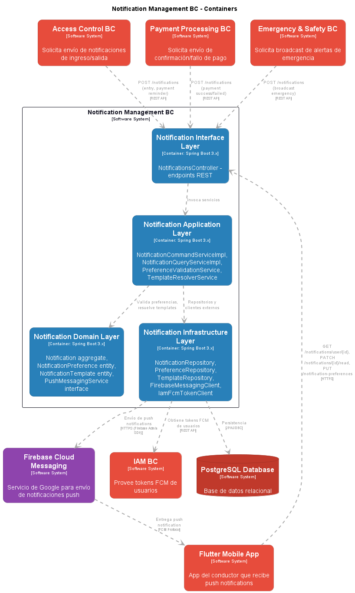
<br>


### 4.2.6.6. Bounded Context Software Architecture Code Level Diagrams

#### 4.2.6.6.1. Bounded Context Domain Layer Class Diagrams

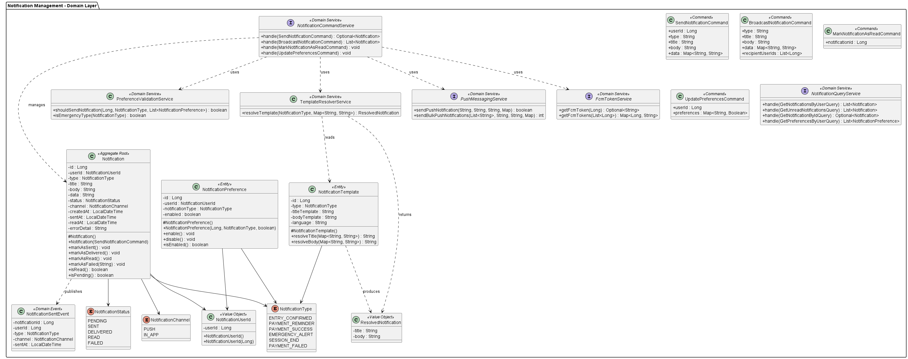
<br>


#### 4.2.6.6.2. Bounded Context Database Design Diagram

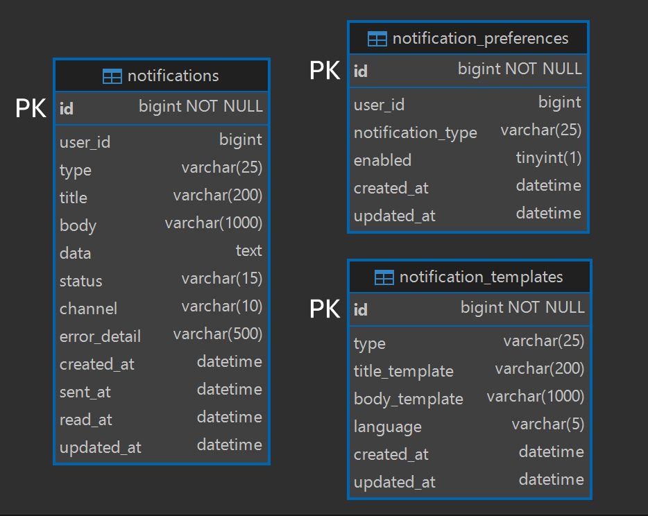
<br>

## 4.2.7. Bounded Context: Identity & Access Management

Este bounded context gestiona la identidad y los accesos de todos los usuarios del sistema. Provee registro y autenticación de usuarios mediante JWT, gestión de contraseñas, asignación de roles (ADMIN, CAR_OWNER) y gestión de perfiles. Es un bounded context Generic ya que la autenticación no es específica del dominio de estacionamiento y podría resolverse con soluciones estándar, pero se implementa de forma personalizada para adaptarse a los requisitos específicos de SpotFinder (registro con placa vehicular, roles de conductor y administrador). Este bounded context ya se encuentra implementado en el código del proyecto.

### 4.2.7.1. Domain Layer

En esta sección se describen los elementos del Domain Layer del contexto de IAM, que encapsulan las reglas y lógica del dominio relacionadas con la gestión de identidades y accesos.

#### 1. User (Aggregate Root)

Representa al usuario del sistema con sus credenciales, estado y roles asignados. Es la entidad central del bounded context.

**Atributos principales:**

| Atributo | Tipo | Visibilidad | Descripción |
|---|---|---|---|
| id | Long | private | Identificador único del usuario (autogenerado). |
| email | String | private | Correo electrónico del usuario (único en el sistema). |
| passwordHash | String | private | Contraseña hasheada con BCrypt. |
| firstName | String | private | Nombre del usuario. |
| lastName | String | private | Apellido del usuario. |
| isVerified | boolean | private | Indica si el usuario ha verificado su cuenta por email. |
| active | Boolean | private | Indica si la cuenta está activa (true por defecto). |
| roles | List\<Role> | private | Lista de roles asignados al usuario (relación ManyToMany). |

**Métodos principales:**

| Método | Tipo Retorno | Visibilidad | Descripción |
|---|---|---|---|
| User() | Constructor | protected | Constructor protegido para JPA. Inicializa roles como lista vacía. |
| User(String email, String passwordHash, String firstName, String lastName, boolean isVerified) | Constructor | public | Crea un usuario con sus datos de autenticación. Inicializa roles vacíos y active=true. |
| addRole(Role role) | void | public | Agrega un rol al usuario si no lo tiene ya asignado. Valida que role no sea null. |
| getFullName() | String | public | Retorna el nombre completo formateado como "firstName lastName". |

#### 2. Role (Entity)

Define un rol específico que puede ser asignado a un usuario dentro del sistema.

**Atributos principales:**

| Atributo | Tipo | Visibilidad | Descripción |
|---|---|---|---|
| id | Long | private | Identificador único del rol (autogenerado). |
| name | Roles | private | Nombre del rol como enum (ADMIN, CAR_OWNER). Almacenado como String en BD. |

**Métodos principales:**

| Método | Tipo Retorno | Visibilidad | Descripción |
|---|---|---|---|
| Role() | Constructor | protected | Constructor vacío para JPA. |
| Role(Roles name) | Constructor | public | Inicializa rol con el enum correspondiente. |
| from(String name) | Role (static) | public | Crea un Role a partir del nombre en String, convirtiendo a mayúsculas. |

#### 3. SignUpCommand (Command)

Comando para registrar un nuevo usuario en el sistema.

| Atributo | Tipo | Visibilidad | Descripción |
|---|---|---|---|
| email | String | public | Correo electrónico del usuario. No puede ser vacío. |
| password | String | public | Contraseña en texto plano (se hashea en el servicio). No puede ser vacía. |
| firstName | String | public | Nombre del usuario. No puede ser vacío. |
| lastName | String | public | Apellido del usuario. No puede ser vacío. |
| requestedRole | Roles | public | Rol solicitado (ADMIN o CAR_OWNER). No puede ser null. |

> Validaciones en el constructor del record: lanza BadRequestException si algún campo es vacío o null.

#### 4. SignInCommand (Command)

Comando para autenticar un usuario con sus credenciales.

| Atributo | Tipo | Visibilidad | Descripción |
|---|---|---|---|
| email | String | public | Correo de acceso. No puede ser vacío. |
| password | String | public | Contraseña provista por el usuario. No puede ser vacía. |

#### 5. Queries

| Query | Atributos principales | Descripción |
|---|---|---|
| GetUserByEmailQuery | email : String | Obtiene un usuario por su correo electrónico. |
| GetAllUsersQuery | (sin atributos) | Obtiene todos los usuarios registrados en el sistema. |

#### 6. UserCommandService (Domain Service)

Maneja comandos relacionados con la gestión de usuarios.

| Método | Tipo de Retorno | Visibilidad | Descripción |
|---|---|---|---|
| handle(SignUpCommand command) | void | public | Registra un nuevo usuario: valida que el email no exista, hashea la contraseña, asigna rol y persiste. |
| handle(SignInCommand command) | void | public | Autentica: verifica credenciales, valida que la cuenta esté activa. |

#### 7. UserQueryService (Domain Service)

Maneja consultas relacionadas con usuarios.

| Método | Tipo de Retorno | Visibilidad | Descripción |
|---|---|---|---|
| handle(GetUserByEmailQuery query) | Optional\<User> | public | Obtiene un usuario por su email. |
| handle(GetAllUsersQuery query) | List\<User> | public | Obtiene la lista completa de usuarios. |

#### 8. RoleValidationService (Domain Service)

Servicio de dominio que valida operaciones relacionadas con roles.

| Método | Tipo de Retorno | Visibilidad | Descripción |
|---|---|---|---|
| canRequestRole(Roles role) | boolean | public | Valida si un rol puede ser solicitado durante el registro. Retorna true si el rol no es null. |
| getAvailableRolesForRegistration() | Roles[] | public | Retorna todos los roles disponibles para el registro. |

#### 9. Roles (Value Object)

Enumera los distintos roles disponibles en el sistema.

| Atributo | Tipo | Visibilidad | Descripción |
|---|---|---|---|
| ADMIN | Enum | public | Rol de administrador de estacionamiento. Acceso al dashboard web con métricas, gestión de espacios y emergencias. |
| CAR_OWNER | Enum | public | Rol de conductor/propietario de vehículo. Acceso a la app móvil con mapa, pagos, Find My Car y notificaciones. |

> **Nota:** El código actual solo tiene ADMIN. Se debe agregar CAR_OWNER para representar al conductor.

#### 10. Domain Exceptions

| Exception | Extiende | Descripción |
|---|---|---|
| InvalidCredentialsException | UnauthorizedException | Credenciales de email o contraseña incorrectas. Retorna 401. |
| UserAlreadyExistsException | ConflictException | El email ya está registrado en el sistema. Retorna 409. |
| UserNotFoundException | NotFoundException | No se encontró un usuario con el email o ID indicado. Retorna 404. |
| UserAccountDeactivatedException | BusinessRuleException | La cuenta del usuario está desactivada. Retorna 422. |
| RoleNotFoundException | NotFoundException | El rol solicitado no existe en la base de datos. Retorna 404. |

---

### 4.2.7.2. Interface Layer

#### 1. UsersController (REST Controller)

Controlador REST que expone endpoints para registro, autenticación y gestión de usuarios.

| Nombre del método | Ruta base típica | Método HTTP | Descripción |
|---|---|---|---|
| signUp | /api/v1/users/signup | POST | Registra un nuevo usuario. Recibe email, password, firstName, lastName y requestedRole. Retorna 201 Created si exitoso, 409 Conflict si el email ya existe. |
| signIn | /api/v1/users/signin | POST | Autentica un usuario. Retorna JWT token, tipo "Bearer", expiración y datos del usuario. Retorna 401 si credenciales inválidas, 403 si cuenta desactivada. |
| getUserByEmail | /api/v1/users/by-email | GET | Obtiene un usuario por su email (requiere autenticación). |
| getAllUsers | /api/v1/users | GET | Obtiene la lista de todos los usuarios (requiere autenticación). |
| getAvailableRoles | /api/v1/users/available-roles | GET | Obtiene los roles disponibles para registro (endpoint público). |

#### 2. Resources (DTOs)

| Resource | Atributos principales | Descripción |
|---|---|---|
| SignUpResource | email: String (@NotBlank, @Email), password: String (@NotBlank, @Size min=8), firstName: String (@NotBlank, @Size 2-50), lastName: String (@NotBlank, @Size 2-50), requestedRole: Roles (@NotNull) | Datos de registro con validaciones de Bean Validation. |
| SignInResource | email: String, password: String | Credenciales para inicio de sesión. |
| AuthenticationResponseResource | token: String, tokenType: String ("Bearer"), expiresIn: Long (604800 segundos = 7 días), user: UserResource | Respuesta de autenticación exitosa con JWT. |
| UserResource | id: Long, email: String, firstName: String, lastName: String, isVerified: boolean, active: boolean, roles: List\<String>, createdAt: LocalDateTime, updatedAt: LocalDateTime | Representación del usuario sin datos sensibles (sin passwordHash). |

#### 3. Transform (Assemblers)

| Assembler | Entrada | Salida | Descripción |
|---|---|---|---|
| SignUpCommandFromResourceAssembler | SignUpResource | SignUpCommand | Convierte DTO de registro en comando de dominio. |
| SignInCommandFromResourceAssembler | SignInResource | SignInCommand | Convierte DTO de login en comando de dominio. |
| UserResourceFromEntityAssembler | User | UserResource | Convierte entidad User a DTO de respuesta. Mapea roles a lista de strings con nombre del enum. No expone passwordHash. |
| AuthenticationResponseResource.of() | String token, Long expiresIn, UserResource user | AuthenticationResponseResource | Factory method estático que crea la respuesta de autenticación con tokenType="Bearer". |

---

### 4.2.7.3. Application Layer

#### 1. UserCommandServiceImpl (Command Service Implementation)

Implementación del servicio de comandos para registro y autenticación de usuarios.

**Atributos principales:**

| Atributo | Tipo | Visibilidad | Descripción |
|---|---|---|---|
| userRepository | UserRepository | private | Repositorio para persistencia de usuarios. |
| roleRepository | RoleRepository | private | Repositorio para acceso a roles. |
| hashingService | HashingService | private | Servicio de hashing de contraseñas (BCrypt). |
| tokenService | TokenService | private | Servicio de generación y validación de JWT. |
| roleValidationService | RoleValidationService | private | Servicio de validación de roles. |

**Métodos principales:**

| Método | Tipo de Retorno | Visibilidad | Descripción |
|---|---|---|---|
| handle(SignUpCommand command) | void | public | Proceso de registro: (1) verifica que el email no exista (UserAlreadyExistsException si existe), (2) valida que el rol pueda ser solicitado, (3) hashea la contraseña con BCrypt, (4) crea entidad User, (5) busca el rol en BD y lo asigna, (6) persiste el usuario. |
| handle(SignInCommand command) | void | public | Proceso de autenticación: (1) busca usuario por email (InvalidCredentialsException si no existe), (2) verifica que la cuenta esté activa (UserAccountDeactivatedException si no), (3) compara contraseña con hash (InvalidCredentialsException si no coincide). |
| generateTokenForUser(User user) | String | public | Genera JWT token para un usuario autenticado. Extrae el rol principal del usuario y lo incluye como claim en el token. |

#### 2. UserQueryServiceImpl (Query Service Implementation)

**Atributos principales:**

| Atributo | Tipo | Visibilidad | Descripción |
|---|---|---|---|
| userRepository | UserRepository | private | Repositorio para acceso de lectura. |

**Métodos principales:**

| Método | Tipo de Retorno | Visibilidad | Descripción |
|---|---|---|---|
| handle(GetUserByEmailQuery query) | Optional\<User> | public | Busca un usuario por su email en el repositorio. |
| handle(GetAllUsersQuery query) | List\<User> | public | Obtiene la lista completa de usuarios registrados. |

#### 3. RoleValidationServiceImpl (Application Service)

| Método | Tipo de Retorno | Visibilidad | Descripción |
|---|---|---|---|
| canRequestRole(Roles role) | boolean | public | Valida que el rol no sea null. En el futuro puede extenderse con reglas más complejas. |
| getAvailableRolesForRegistration() | Roles[] | public | Retorna Roles.values() (todos los roles disponibles). |

#### 4. ApplicationReadyEventHandler (Framework Event Handler)

Maneja el evento de inicio de la aplicación para sembrar roles por defecto.

| Método | Tipo de Retorno | Visibilidad | Descripción |
|---|---|---|---|
| handleApplicationReady(ApplicationReadyEvent event) | void | public | Al arrancar la aplicación, verifica si cada rol del enum Roles existe en la BD. Si no existe, lo crea y persiste. Esto asegura que ADMIN y CAR_OWNER siempre existan. |

#### 5. HashingService (Outbound Service Port)

Interfaz para hashing de contraseñas.

| Método | Tipo de Retorno | Visibilidad | Descripción |
|---|---|---|---|
| encode(CharSequence rawPassword) | String | public | Genera hash BCrypt de la contraseña. |
| matches(CharSequence rawPassword, String encodedPassword) | boolean | public | Verifica si la contraseña cruda coincide con el hash almacenado. |

#### 6. TokenService (Outbound Service Port)

Interfaz para generación y validación de tokens JWT.

| Método | Tipo de Retorno | Visibilidad | Descripción |
|---|---|---|---|
| generateToken(Long userId, String userRole) | String | public | Genera un JWT con userId como subject y userRole como claim. Expira en 7 días (configurable). |
| getUserIdFromToken(String token) | Long | public | Extrae el userId del subject del token. |
| validateToken(String token) | boolean | public | Valida la firma, estructura y fecha de expiración del token. |

---

### 4.2.7.4. Infrastructure Layer

#### 1. UserRepository (Repository Interface)

| Método | Tipo de Retorno | Visibilidad | Descripción |
|---|---|---|---|
| findById(Long id) | Optional\<User> | public | Busca un usuario por su ID. |
| findByEmail(String email) | Optional\<User> | public | Busca un usuario por su correo electrónico. |
| existsByEmail(String email) | boolean | public | Verifica si existe un usuario con el email indicado. |
| save(User user) | User | public | Persiste o actualiza un usuario. |
| findAll() | List\<User> | public | Obtiene todos los usuarios. |

#### 2. RoleRepository (Repository Interface)

| Método | Tipo de Retorno | Visibilidad | Descripción |
|---|---|---|---|
| findByName(Roles name) | Optional\<Role> | public | Busca un rol por su nombre (enum). |
| existsByName(Roles name) | boolean | public | Verifica si un rol existe por su nombre. |
| save(Role role) | Role | public | Persiste o actualiza un rol. |

#### 3. WebSecurityConfiguration (Security Config)

Configuración de Spring Security para la API.

| Configuración | Descripción |
|---|---|
| CORS | Permite orígenes de http://localhost:4200 (Angular dashboard). Métodos: GET, POST, PUT, DELETE, PATCH, OPTIONS. |
| CSRF | Deshabilitado (API stateless con JWT). |
| Session Management | STATELESS (sin sesiones HTTP, todo via JWT). |
| Public Endpoints | /api/v1/users/signup, /api/v1/users/signin, /api/v1/users/available-roles, /swagger-ui/**, /v3/api-docs/** |
| Protected Endpoints | Todos los demás requieren JWT válido en header Authorization: Bearer {token}. |
| Authentication Filter | BearerAuthorizationRequestFilter se ejecuta antes de UsernamePasswordAuthenticationFilter. |
| Password Encoder | BCryptPasswordEncoder via BCryptHashingService. |

#### 4. BearerAuthorizationRequestFilter (Security Filter)

Filtro que intercepta todas las peticiones HTTP para validar el JWT.

| Método | Tipo de Retorno | Visibilidad | Descripción |
|---|---|---|---|
| doFilterInternal(request, response, chain) | void | protected | Para cada request: (1) si es OPTIONS o endpoint público, permite sin validar. (2) Extrae token del header Authorization. (3) Si tiene token y es válido, extrae userId, carga UserDetails, establece autenticación en SecurityContext. (4) Continúa la cadena de filtros. |

#### 5. TokenServiceImpl (JWT Service)

Implementación de TokenService usando la biblioteca JJWT.

| Configuración | Valor |
|---|---|
| Algoritmo | HMAC-SHA (HS256) |
| Secret | Configurado en application.properties (authorization.jwt.secret) |
| Expiración | 7 días (authorization.jwt.expiration.days) |
| Claims | subject: userId (String), role: userRole (String) |

| Método | Tipo de Retorno | Visibilidad | Descripción |
|---|---|---|---|
| generateToken(Long userId, String userRole) | String | public | Genera JWT con subject=userId.toString(), claim "role"=userRole, issuedAt=now, expiration=now+7days. Firma con HMAC-SHA key. |
| getUserIdFromToken(String token) | Long | public | Parsea el token, extrae subject y lo convierte a Long. |
| validateToken(String token) | boolean | public | Verifica firma y expiración. Lanza JwtException si inválido. |
| getBearerTokenFrom(HttpServletRequest request) | String | public | Extrae el token del header Authorization quitando el prefijo "Bearer ". |

#### 6. HashingServiceImpl (BCrypt Service)

| Método | Tipo de Retorno | Visibilidad | Descripción |
|---|---|---|---|
| encode(CharSequence rawPassword) | String | public | Genera hash BCrypt. |
| matches(CharSequence rawPassword, String encodedPassword) | boolean | public | Compara contraseña con hash BCrypt. |

#### 7. UserDetailsServiceImpl (Spring Security UserDetailsService)

| Método | Tipo de Retorno | Visibilidad | Descripción |
|---|---|---|---|
| loadUserByUsername(String email) | UserDetails | public | Busca usuario por email y construye UserDetailsImpl con authorities basadas en roles (ROLE_ADMIN, ROLE_CAR_OWNER). |
| loadUserById(Long userId) | UserDetails | public | Busca usuario por ID (usado por el filtro JWT después de extraer userId del token). |

#### 8. UserDetailsImpl (Security Model)

Adaptador que convierte la entidad User a UserDetails de Spring Security.

| Método | Tipo de Retorno | Visibilidad | Descripción |
|---|---|---|---|
| build(User user) | UserDetailsImpl (static) | public | Construye desde entidad User: mapea roles a authorities con prefijo "ROLE_", establece enabled según active. |
| getAuthorities() | Collection\<GrantedAuthority> | public | Retorna las authorities del usuario. |
| getUsername() | String | public | Retorna el email como username. |
| isEnabled() | boolean | public | Retorna el estado active del usuario. |

#### 9. UnauthorizedRequestHandlerEntryPoint (Auth EntryPoint)

| Método | Tipo de Retorno | Visibilidad | Descripción |
|---|---|---|---|
| commence(request, response, authException) | void | public | Responde con 401 Unauthorized y un cuerpo JSON con status, error, message, path y timestamp. |

#### 10. OpenApiConfiguration (Swagger Config)

Configuración de la documentación OpenAPI/Swagger de la API.

| Configuración | Descripción |
|---|---|
| Security Scheme | Bearer JWT (tipo HTTP, scheme "bearer", formato "JWT"). |
| Info | Nombre, descripción y versión de la aplicación desde application.properties. |
| Endpoints Swagger UI | /swagger-ui.html, /swagger-ui/**, /v3/api-docs/** |

---

### 4.2.7.5. Bounded Context Software Architecture Component Level Diagrams

En esta sección se presentan los diagramas de nivel componente que ilustran la arquitectura de software del contexto de IAM. Se muestra la interacción entre los diferentes componentes, servicios y capas que conforman este bounded context.

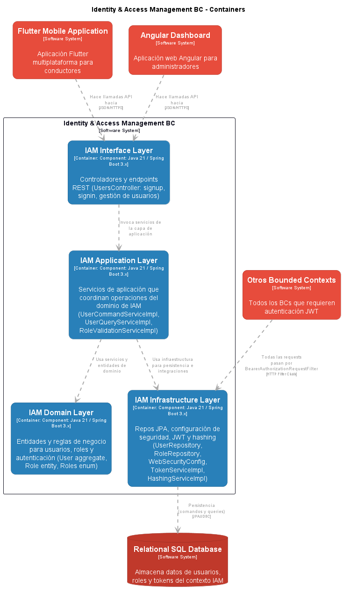
<br>


### 4.2.7.6. Bounded Context Software Architecture Code Level Diagrams

#### 4.2.7.6.1. Bounded Context Domain Layer Class Diagrams

El diagrama de clases del Domain Layer del contexto de IAM ilustra las entidades, value objects y servicios que componen este bounded context, reflejando el código ya implementado.

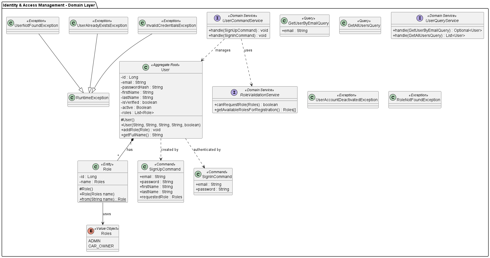
<br>

#### 4.2.7.6.2. Bounded Context Database Design Diagram

El diagrama de diseño de base de datos del contexto de IAM muestra la estructura de las tablas y sus relaciones, generadas automáticamente por JPA/Hibernate a partir de las entidades del dominio.

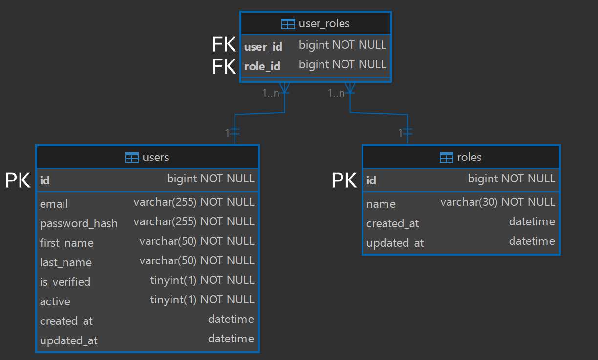
<br>

<div style="page-break-after: always;"></div>

---
# Capítulo V: Solution UI/UX Design

## 5.1. Style Guidelines

En esta sección, se establecen los cimientos del **Design System** de SpotFinder. El objetivo es centralizar los *Design Tokens* (variables de diseño) y componentes UI en un repositorio de uso común, garantizando la consistencia visual y de interacción a través de un ecosistema multiplataforma (Web, Mobile y Hardware IoT). Esta estandarización reduce la fricción cognitiva del usuario, acelera el flujo de desarrollo en el frontend y asegura que las decisiones de diseño sean escalables y mantenibles a largo plazo, alineándose con los principios heurísticos de usabilidad y la metodología Lean UX.

### 5.1.1. General Style Guidelines

Esta subsección documenta las decisiones estructurales fundamentales: color, tipografía, espaciado y *UX Writing*. Las decisiones están sustentadas en la reducción de la carga cognitiva (*cognitive load*) del usuario, especialmente en contextos de alta demanda de atención (como la conducción vehicular).

**A. Branding y Paleta de Colores (Color Tokens)**
La identidad cromática se ha extraído estrictamente de los valores hexadecimales del imagotipo de SpotFinder. Se ha construido un sistema de colores accesible (cumpliendo con el ratio de contraste WCAG 2.1 AA/AAA) que guía la atención del usuario mediante jerarquía visual.

* **Brand Colors (Identidad Principal):**
    * **Action Blue (`#1A82FF`):** Color interactivo primario. Aplicado de forma exclusiva a elementos accionables de alta prioridad (*Primary Buttons*, *Floating Action Buttons*, *Active Tabs*) y enlaces. Representa la fiabilidad del flujo de software y guía al usuario hacia la conversión.
    * **Highlight Orange (`#FF9100`):** Color de acento (*Accent*). Reservado para focalizar la atención en micro-interacciones críticas o datos relevantes que rompen el patrón de lectura, como la ubicación exacta del vehículo en el módulo "Find My Car", notificaciones *push* de pago o *badges* de estado.
    * **Deep Black (`#000000`):** Color ancla y estructural. Empleado en tipografía de alto énfasis (*Headers*), bordes divisorios y como base absoluta para la superficie del *Dark Mode* de la aplicación móvil (evitando el deslumbramiento y la fatiga visual del conductor en entornos con baja iluminación como estacionamientos techados).
* **Semantic Colors (Feedback y Hardware):**
    * **Success/Available (`#10B981`):** Feedback positivo en la UI (pagos procesados, *snackbars* de éxito) e indicador IoT del LED en estado `AVAILABLE`.
    * **Error/Occupied (`#EF4444`):** Feedback de error en formularios, estados de emergencia y correlación directa con el indicador IoT del LED en estado `OCCUPIED`.

**B. Tipografía (Typographic Scale)**
Se ha definido un sistema tipográfico basado en la fuente **Inter**, optimizada para interfaces de usuario por su alta legibilidad (altura de la "x" pronunciada y kerning equilibrado) tanto en *displays* móviles como en paneles de datos (Web).
* **Display & Headings:** Uso en pesos *Bold* (700) y *SemiBold* (600) para lectura rápida de números de espacios, contadores de tiempo y títulos de sección.
* **Body & UI Text:** Peso *Regular* (400) para lectura prolongada y *Medium* (500) para etiquetas de botones. El tamaño base (*Body 1*) es de 16px (1rem) con un interlineado (*line-height*) del 150% para maximizar la legibilidad en pantallas de alto contraste.

**C. Spacing & Grid System**
Para asegurar una estructura armónica y modular, se implementa una **grilla espacial basada en 8pt** (*8-point grid system*).
* Márgenes y *paddings* operan en incrementos de 8 (8px, 16px, 24px, 32px), creando un ritmo visual predecible.
* Los iconos y elementos modulares se construyen en cajas delimitadas de 24x24px o 32x32px para mantener simetría a nivel de píxel (*pixel-perfect*).

**D. Tone of Communication y UX Writing**
El lenguaje (*microcopy*) de SpotFinder está diseñado bajo la premisa funcional:
* **Formal/Casual:** *Casual, directo y conciso.* (Ej. "Espacio A-12 libre" en lugar de "Le informamos que el espacio A-12 se encuentra disponible").
* **Entusiasta/Sereno:** *Estrictamente Sereno y de Control.* El sistema debe mitigar la ansiedad inherente a la búsqueda de estacionamiento y el procesamiento de pagos, ofreciendo instrucciones unívocas, mensajes de error constructivos y retroalimentación clara de los estados del sistema.


### 5.1.2. Web, Mobile and IoT Style Guidelines

Aquí se detalla la aplicación del sistema de diseño en los diferentes puntos de contacto (*touchpoints*) del usuario, adaptando los patrones de interacción a las limitaciones y *affordances* de cada dispositivo.

**A. Web Style Guidelines (Admin Dashboard & Landing Page)**
* **Grid Responsive:** Se emplea una grilla fluida de 12 columnas. En el área del *Dashboard*, el diseño se optimiza para grandes resoluciones (Desktop), priorizando la visualización de alta densidad de datos.
* **Data Visualization UI:** El panel de administración utiliza *Data Tables* con interactividad de *hover* (cambio de estado en la fila usando un matiz sutil del Action Blue `#1A82FF` al 10% de opacidad) para no saturar la vista. Las tarjetas de métricas (*Metric Cards*) utilizan elevación (*drop-shadow* de 2dp a 4dp) para generar jerarquía en el eje Z frente a un fondo neutro.
* **Navegación:** Un *Sidebar Navigation* anclado a la izquierda para cambiar de módulos rápidamente, manteniendo los filtros y herramientas de búsqueda siempre visibles y accesibles en la parte superior (*Top Bar*).

**B. Mobile Style Guidelines (App Conductor)**
La interfaz móvil está rigurosamente diseñada para escenarios de movilidad (uso a una mano y atención dividida).
* **Ergonomía Táctil (Thumb Zone):** Todo elemento accionable primario (CTAs) posee un área táctil mínima (*Touch Target*) de **48x48 dp** (estándar de accesibilidad de Apple HIG y Material Design). Las acciones críticas se sitúan en el tercio inferior de la pantalla para fácil acceso del pulgar.
* **Dark Mode por Defecto:** Al interactuar primariamente dentro del habitáculo del vehículo y en zonas de parqueo, el fondo Negro absoluto (`#000000`) se usa como base, mejorando el contraste de los textos en blanco y los acentos Naranja (`#FF9100`), además de optimizar el consumo de batería en pantallas OLED.
* **Retroalimentación Háptica (Haptic Feedback):** Las micro-interacciones clave, como la validación de un pago o la confirmación de la apertura de barrera (ALPR), se acompañan de una vibración háptica del dispositivo, confirmando al usuario el éxito de la operación sin depender exclusivamente de la lectura visual.

**C. IoT Style Guidelines (Interfaz Física de Hardware)**
El diseño en IoT trasciende la pantalla para convertirse en un diseño espacial o "Zero-UI" (interfaz de fricción cero), donde el entorno físico es el que comunica el estado.
* **Affordance Visual (Sensores y LEDs):** La comunicación es binaria y directa. La luz Verde (`#10B981`) comunica permisibilidad (espacio libre), mientras que la luz Roja (`#EF4444`) comunica restricción (espacio ocupado).
* **Alertas Cognitivas (Protocolo de Emergencia):** En un estado crítico (detección de gas MQ-2), el patrón lumínico cambia a parpadeo estroboscópico rojo, una señal universal de alarma diseñada para capturar inmediatamente el sistema visual periférico del conductor y detonar la acción de evacuación.
* **Interacción Invisible (ALPR):** En los puntos de acceso, el usuario no interactúa con tótems o botones físicos. La interacción se basa en la presencia física (la cámara detecta la placa y el Edge Server acciona el relé de la barrera). El diseño delega la interfaz gráfica al móvil (notificación *push*) y mantiene la interfaz física orientada puramente al flujo ininterrumpido del vehículo.

### 5.2. Information Architecture

La Arquitectura de Información (IA) de SpotFinder está diseñada para optimizar la carga cognitiva de los usuarios y garantizar la escalabilidad del código. Se estructuró bajo la premisa de *Zero-Friction* para los conductores en movilidad (App Móvil) y *Maximum Observability* para los operadores (App Web). A continuación, se detallan los sistemas que rigen la organización, el etiquetado, el posicionamiento (SEO/ASO) y la navegación del ecosistema.

### 5.2.1. Organization Systems

La organización del contenido dicta cómo se estructuran los módulos a nivel de desarrollo (Lazy Loading en Angular y GoRouter en Flutter).

**A. Landing Page (Web Estática)**
* **Jerárquica (Visual Hierarchy):** La estructura es vertical (*Top-Down*), ordenada por relevancia para la conversión B2B: Propuesta de valor (*Hero*) → Funcionalidades (*Features*) → Proceso operativo (*How It Works*) → Ventaja competitiva (*Admin Dashboard*) → Precios (*Pricing*) → Credibilidad (*Testimonials/FAQ*) → Acción (*Contact*).
* **Secuencial (Step-by-step):** La sección "How It Works" guía al visitante de forma lineal por el *Core Flow*: `1. Detección ALPR` → `2. Guiado LED` → `3. Pago Digital` → `4. Salida Automática`.
* **Matricial (Bento Grid):** La sección "Features" organiza las capacidades en celdas asimétricas, priorizando visualmente el renderizado del mapa en tiempo real frente a funciones complementarias.

**B. App Web (Dashboard Administrativo - Angular)**
* **Jerárquica (Shell Pattern):** El *layout* utiliza un patrón *App Shell* de Angular: `Sidebar (Navegación Primaria)` > `Top Bar (Contexto Global/Búsqueda)` > `Router Outlet (Contenido Dinámico)` > `Widgets/Data Tables`. El mapa de ocupación en vivo ocupa el cuadrante superior izquierdo, siendo el primer punto de fijación visual.
* **Por Tópicos (Feature Modules):** El menú lateral define los módulos de carga diferida (*Lazy-loaded modules*): *Monitoreo*, *Analítica*, *Finanzas*, *Seguridad* (Protocolos de Emergencia) y *Configuración*.
* **Matricial y Cronológico:** Los paneles de *Analytics* cruzan múltiples KPIs (ingresos vs. ocupación) en cuadrículas simultáneas, mientras que el *Log* de eventos (ingresos/salidas/alertas del sensor MQ-2) se organiza en orden cronológico inverso estricto.

**C. App Móvil (Conductores - Flutter)**
* **Por Tópicos (Bottom Nav):** La experiencia raíz se divide en 4 pilares de navegación (*IndexedStack* en Flutter para mantener el estado): `Map` (ubicación), `My Stay` (sesión activa), `Pay` (transacciones) y `Profile` (gestión de cuenta y vehículos).
* **Secuencial (Checkout Flow):** El proceso de pago es un túnel cerrado sin distracciones: `Revisar Estancia` → `Seleccionar Método (Yape/Tarjeta)` → `Validar Gateway (Culqi)` → `Emitir Recibo Digital`.
* **Por Audiencia:** La arquitectura condicional utiliza *Feature Flags* vinculados al JWT del usuario para habilitar o destruir vistas de servicios Premium (ej. pase Google Wallet).


### 5.2.2. Labeling Systems

El sistema de etiquetado (Microcopy) está centralizado en archivos de internacionalización (i18n) para asegurar consistencia. Las etiquetas son concisas (máximo 2 palabras), descriptivas y evitan la jerga de ingeniería.

**A. Landing Page Labels (Conversión)**
| Etiqueta | Componente | Propósito / Destino |
| :--- | :--- | :--- |
| **Get Started** | Primary CTA | Inicia el embudo de captación / Formulario de registro B2B. |
| **Book a Demo** | Secondary CTA | Despliega modal de calendario (ej. Calendly) para agendar pruebas. |
| **Dashboard** | Nav Link | Ancla explicativa sobre el panel de control administrativo. |
| **Hardware** | Nav Link | Detalla la infraestructura IoT (Edge Server, ALPR, Sensores). |

**B. App Web Labels (Dashboard Operativo)**
| Etiqueta | Componente | Propósito / Destino |
| :--- | :--- | :--- |
| **Live Map** | Sidebar Item | Renderizado de ocupación mediante WebSockets (`AVAILABLE`/`OCCUPIED`). |
| **Occupancy** | Metric Card | KPI porcentual de la Tasa de Ocupación actual e histórica. |
| **OOS** | Status Badge | "Out of Service" - Etiqueta roja/naranja para espacio inhabilitado manualmente. |
| **Heatmap** | Tab Link | Representación térmica de las zonas con mayor rotación vehicular. |

**C. App Móvil Labels (Conductor)**
| Etiqueta | Componente | Propósito / Destino |
| :--- | :--- | :--- |
| **My Stay** | Bottom Nav | Vista del tiempo transcurrido, costo acumulado dinámico y código asignado. |
| **Find My Car** | Action Button | Localiza el vehículo enlazado a la sesión (evita términos técnicos como *Vehicle Locator*). |
| **Garage** | Profile Item | CRUD para gestionar múltiples placas vinculadas a una sola cuenta. |


### 5.2.3. SEO Tags and Meta Tags

El ecosistema requiere estrategias distintas: indexación agresiva para la Landing Page, ofuscación total para el Dashboard Administrativo y optimización de tienda para la App Móvil.

**A. Web Meta Tags: Landing Page (Public Marketing Site)**
Orientado a la indexación de motores de búsqueda (SEO) y correcta previsualización en redes sociales (Open Graph / Twitter Cards).
```html
<title>SpotFinder | Advanced IoT Parking Systems for Malls</title>
<meta name="title" content="SpotFinder | Advanced IoT Parking Systems">
<meta name="description" content="Transform your parking facility with real-time IoT monitoring, ALPR entry automation, and advanced analytics. Reduce congestion and increase revenue up to 15%.">
<meta name="keywords" content="smart parking, IoT parking system, ALPR, parking management, shopping mall parking, SpotFinder Peru">
<meta name="author" content="SpotFinder Team">
<link rel="canonical" href="[https://spotfinder.com](https://spotfinder.com)">

<meta property="og:type" content="website">
<meta property="og:url" content="[https://spotfinder.com/](https://spotfinder.com/)">
<meta property="og:title" content="SpotFinder | Advanced IoT Parking Systems">
<meta property="og:description" content="Real-time parking intelligence for shopping malls and commercial facilities.">
<meta property="og:image" content="[https://spotfinder.com/assets/og-image.png](https://spotfinder.com/assets/og-image.png)">

<meta property="twitter:card" content="summary_large_image">
<meta property="twitter:url" content="[https://spotfinder.com/](https://spotfinder.com/)">
<meta property="twitter:title" content="SpotFinder | Advanced IoT Parking Systems">
```
**B. Web Meta Tags: App Web / Admin Dashboard (Private SPA)**

Orientado a la seguridad y privacidad. Al ser un portal administrativo, los motores de búsqueda no deben indexar estas rutas ni cachear contenido sensible.

```html
<title>SpotFinder Dashboard</title>
<meta name="robots" content="noindex, nofollow, noarchive, nosnippet">
<meta name="googlebot" content="noindex, nofollow">

<meta http-equiv="Cache-Control" content="no-cache, no-store, must-revalidate">
<meta http-equiv="Pragma" content="no-cache">
<meta http-equiv="Expires" content="0">

<meta name="viewport" content="width=device-width, initial-scale=1.0, maximum-scale=1.0, user-scalable=no">
```

**C. ASO Elements (Mobile App Store Optimization)**

Metadatos estructurados para el algoritmo de búsqueda de Google Play Store y Apple App Store.

* **App Title:** `SpotFinder – Smart Parking & Find My Car` *(Combina el brand con la función más buscada).*
* **App Subtitle (iOS):** `IoT Parking, Pay & Locate`
* **App Keywords (Ocultas):** `smart parking, find my car, parking payment, ALPR, IoT parking, contactless payment, SpotFinder, Yape, mall parking.`
* **App Description:** *SpotFinder revolutionizes your parking experience. Find available spaces in real-time, pay digitally via Culqi or Yape without queues, and never lose your car again with our "Find My Car" locator. Receive instant push notifications for your sessions and enjoy premium services like Google Wallet passes. Built for leading shopping malls powered by advanced IoT technology.*

### 5.2.4. Searching Systems & Navigation (Core Flows)

Para garantizar que el usuario encuentre los datos sin esfuerzo, se implementan los siguientes patrones de búsqueda y enrutamiento funcional:

* **Búsqueda Global (Dashboard Web):** Uso de un *Omnibox* en el Top Bar que permite al administrador realizar consultas transversales (búsqueda por número de placa `ABC-123`, ID de espacio `A-12` o ID de transacción de pasarela). Los resultados redirigen dinámicamente al módulo correspondiente.
* **Deep Linking (App Móvil):** La navegación de la app soporta enlaces profundos manejados por Firebase Cloud Messaging (FCM). Al tocar una notificación de "Pago Pendiente", la arquitectura de navegación enruta al usuario saltando el menú principal, llevándolo directamente a la pantalla `Checkout_Screen`.

## 5.2.5. Navigation Systems.

# Estructura de Navegación del Proyecto

## Landing Page

| Elemento de navegación | Descripción |
| :--- | :--- |
| **Top Navigation Bar (sticky)** | Fija en la parte superior. Contiene logo, enlaces a secciones principales (Dashboard, Analytics, Hardware, Enterprise) y CTAs (Get Started). En móvil, colapsa a menú hamburguesa. |
| **Scroll to anchors** | Los enlaces del menú desplazan suavemente a las secciones correspondientes dentro de la misma página (#features, #how-it-works, etc.). |
| **Botones CTA** | Guían al usuario fuera de la landing: "Registrar Centro Comercial" lleva a formulario de registro; "Book a Demo" abre modal de calendario; "Contact Sales" redirige al formulario de contacto al final de la página. |
| **Footer** | Enlaces secundarios a páginas legales (Privacy Policy, Terms of Service), documentación técnica (API Documentation) y soporte (Contact Support). |

## App Web (Dashboard)

| Elemento de navegación | Descripción |
| :--- | :--- |
| **Sidebar navigation** | Panel lateral izquierdo con íconos y etiquetas. Secciones: Live Map, Analytics, Finances, Security, Settings. Colapsable a modo ícono en pantallas pequeñas. Indica activo con highlight primary y borde izquierdo. |
| **Breadcrumbs** | Barra superior: Home > Analytics > Heatmap. Permite regresar a niveles superiores con un clic. |
| **Top bar utilities** | Búsqueda global, notificaciones (campana con badge de alertas no leídas), avatar de usuario con dropdown (Profile, Logout). |
| **Tabs dentro de secciones** | Ej. en Analytics: Overview, Trends, Heatmap. Navegación horizontal sin recargar página. |
| **Modales y drawers** | Para acciones contextuales: marcar espacio OOS, confirmar activación de emergencia, vista previa de PDF. |
| **Paginación y scroll infinito** | Tablas con paginación numérica; listas de eventos con carga progresiva al hacer scroll. |

## App Móvil

| Elemento de navegación | Descripción |
| :--- | :--- |
| **Bottom Navigation Bar** | 4 destinos fijos: Mapa (icono map), Estancia (icono timer), Pagos (icono credit_card), Perfil (icono person). Visible en todas las pantallas principales. El ítem activo se resalta en primary. |
| **Top App Bar** | Título de la pantalla actual, botón de retroceso en pantallas secundarias, accesos contextuales (filtro, notificaciones). |
| **Deep linking desde push notifications** | Al tocar una notificación FCM, la app se abre directamente en la pantalla relevante (ej. recordatorio de pago → pantalla de pago). |
| **Gestos** | Swipe horizontal para cambiar entre niveles del mapa. Swipe hacia abajo para cerrar modales. Long press en vehículo del garaje para editar o eliminar. |
| **Onboarding guiado** | Primera ejecución: breve tutorial con swipe de tarjetas que explica las 4 funciones principales antes de llegar al mapa. |

## 5.3. Landing Page UI Design.
### 5.3.1. Landing Page Wireframe.


### 5.3.2. Landing Page Mock-up.

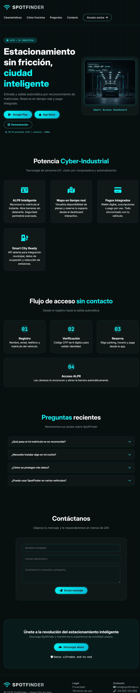

## 5.4. Applications UX/UI Design.

El diseño UX/UI de SpotFinder fue desarrollado con el objetivo de ofrecer una experiencia intuitiva, moderna y eficiente tanto para conductores como para administradores del sistema de estacionamiento inteligente. 

La propuesta visual prioriza:
- Simplicidad de uso.
- Navegación intuitiva.
- Acceso rápido a funcionalidades críticas.
- Consistencia visual entre plataformas.
- Diseño responsive y mobile-first.
- Reducción de carga cognitiva del usuario.

El ecosistema UX/UI contempla:
- Aplicación móvil para conductores.
- Dashboard web administrativo.
- Integración visual con dispositivos IoT.

---

### 5.4.1. Applications Wireframes.

Los wireframes fueron desarrollados para definir la estructura funcional y distribución de componentes antes de la implementación visual final. 

Se diseñaron wireframes tanto para:
- Aplicación móvil.
- Dashboard web administrativo.

Las vistas consideran:
- Pantallas de autenticación.
- Dashboard principal.
- Visualización de estacionamientos disponibles.
- Gestión de pagos.
- Notificaciones.
- Gestión de perfil.
- Paneles administrativos y monitoreo IoT.

#### Mobile Application Wireframes


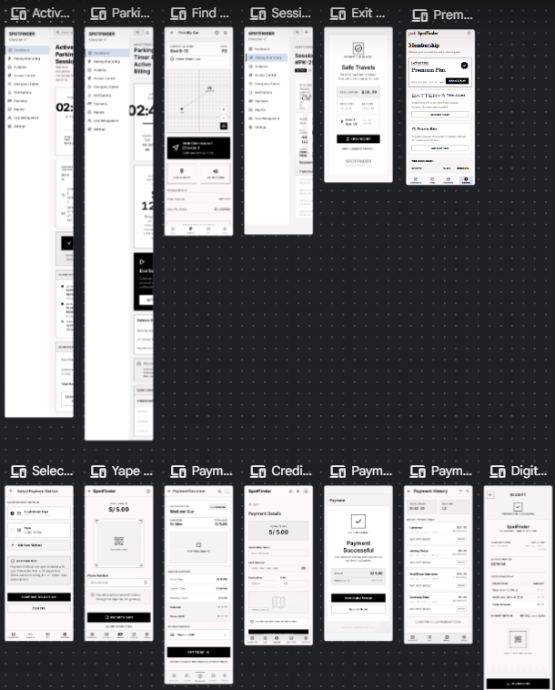


#### Web Dashboard Wireframes

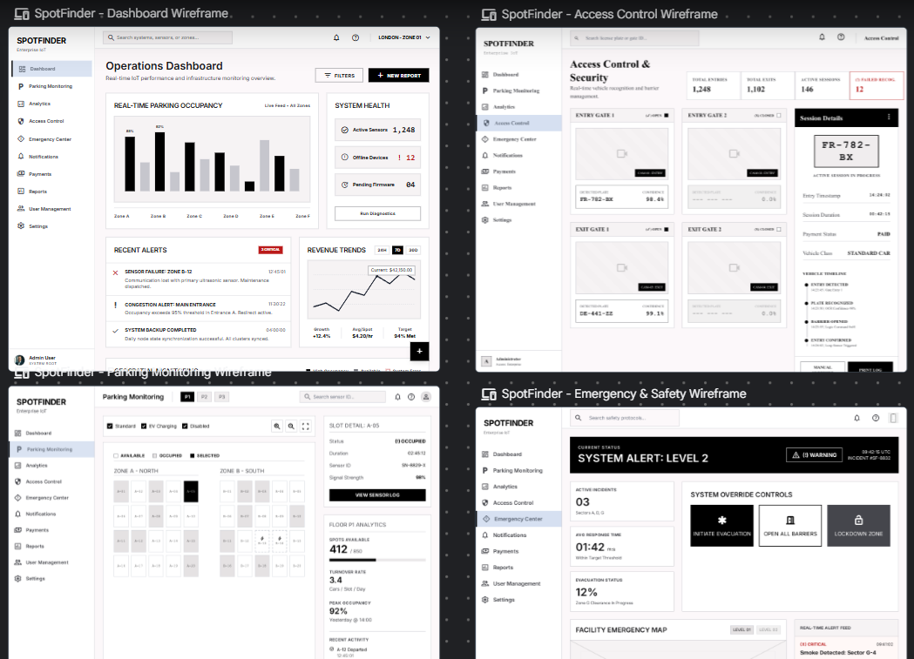

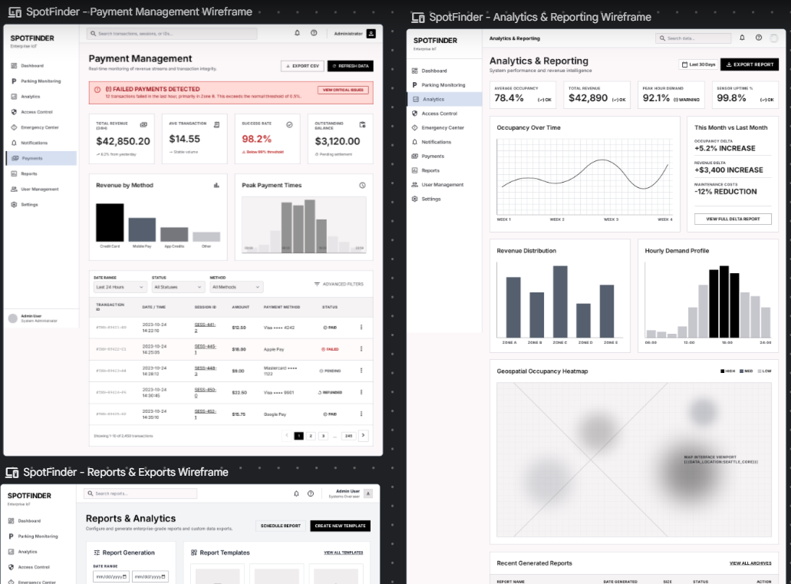


---

### 5.4.2. Applications Wireflow Diagrams.

Los Wireflow Diagrams representan el flujo de navegación y transición entre pantallas dentro del sistema SpotFinder. 

Estos diagramas permiten visualizar:
- Interacciones del usuario.
- Rutas de navegación.
- Flujo de autenticación.
- Flujo de búsqueda de estacionamiento.
- Flujo de pagos digitales.
- Flujo de monitoreo administrativo.
- Navegación entre módulos principales.

El diseño de navegación fue desarrollado siguiendo principios de:
- Navegación contextual.
- Accesibilidad.
- Reducción de pasos.
- Optimización de tareas frecuentes.

---

### 5.4.3. Applications Mock-ups.

Los mock-ups representan la versión visual de alta fidelidad del sistema SpotFinder, incorporando el sistema de diseño previamente definido en las Style Guidelines.

Las interfaces fueron desarrolladas manteniendo:
- Consistencia visual.
- Componentes reutilizables.
- Jerarquía visual clara.
- Diseño moderno y minimalista.
- Experiencia centrada en el usuario.

#### Mobile Application Mock-ups


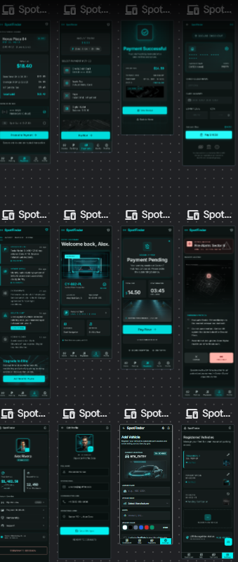

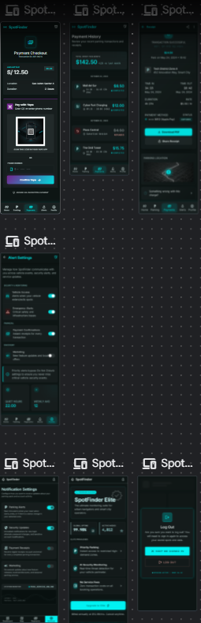

#### Web Dashboard Mock-ups

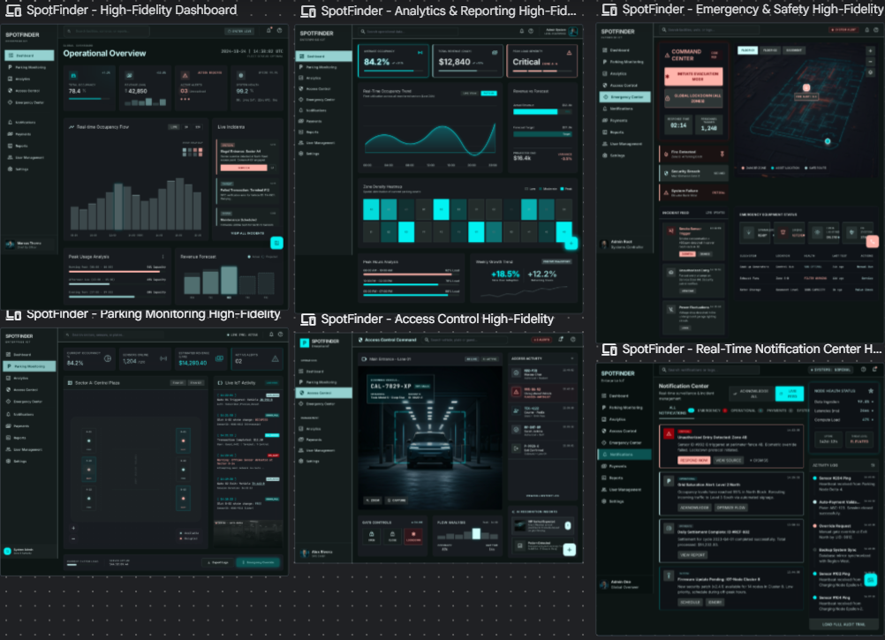

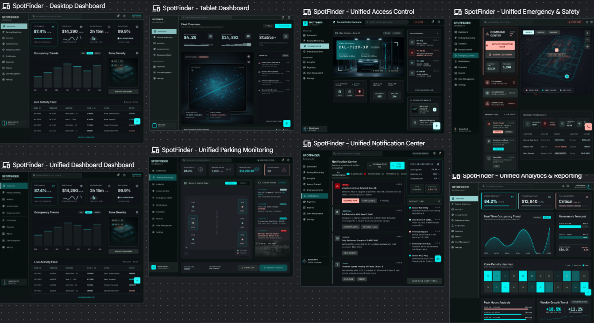

---

### 5.4.4. Applications User Flow Diagrams.

Los User Flow Diagrams modelan el recorrido completo del usuario dentro de la plataforma SpotFinder, identificando acciones, decisiones y resultados esperados.

Los principales flujos diseñados incluyen:

#### Conductores
- Registro e inicio de sesión.
- Visualización de espacios disponibles.
- Recomendación de estacionamiento.
- Pago digital.
- Localización del vehículo.
- Gestión de notificaciones.

#### Administradores
- Monitoreo de ocupación.
- Gestión de espacios.
- Visualización de métricas.
- Gestión de alertas y emergencias.
- Generación de reportes.

Los diagramas permiten validar:
- Fluidez de interacción.
- Eficiencia de navegación.
- Optimización de tareas.
- Reducción de fricción en la experiencia del usuario.

---

## 5.5. Applications Prototyping.

El prototipado de SpotFinder fue desarrollado con el objetivo de validar tempranamente la experiencia de usuario y comprobar el comportamiento de navegación de la plataforma antes de la implementación final.
 
Los prototipos interactivos permiten simular:
- Navegación entre pantallas.
- Interacción con componentes.
- Flujo de autenticación.
- Flujo de búsqueda de estacionamiento.
- Flujo de pagos.
- Gestión de notificaciones.
- Navegación administrativa.

El proceso de prototipado permitió:
- Detectar mejoras de usabilidad.
- Optimizar tiempos de interacción.
- Validar jerarquías visuales.
- Refinar la experiencia mobile-first.
- Verificar consistencia visual entre plataformas.

Asimismo, los prototipos facilitaron la validación de:
- Diseño responsive.
- Navegación intuitiva.
- Escalabilidad visual del sistema.
- Integración entre módulos funcionales.

### Prototype Links

#### Mobile Application Prototype
- https://stitch.withgoogle.com/preview/4437756468570998234?node-id=d5d266e0e79a42eea72522a5cd4632e0

#### Web Application Prototype
- https://stitch.withgoogle.com/preview/4437756468570998234?node-id=b845ebb0307f4022b9df819e8fad79ab

#### Web Application Wireframe Prototype
- https://stitch.withgoogle.com/preview/4437756468570998234?node-id=ae88b4b92bf34458b32e6b46efc3cd79

## 5.6. IoT Device Design

### Introducción y Criterios de Diseño

Esta sección presenta la propuesta de diseño físico y de circuito para los **Parking Spot Nodes** (nodos de espacio de parqueo) que componen el hardware de la solución SpotFinder. El objetivo principal de estos dispositivos es la **detección en tiempo real de la ocupación de cada espacio individual de estacionamiento** dentro de los centros comerciales objetivo, complementada con guiado visual mediante LEDs y monitoreo ambiental de gases/humo para protocolos de emergencia.

Los principales criterios para las decisiones de diseño del hardware son:

- **Precisión en la Detección de Ocupación:** Se utiliza un sensor ultrasónico **HC-SR04**, montado a 50–60 cm sobre el piso del espacio (techo del nivel de parqueo). El sensor emite pulsos ultrasónicos de 40 kHz y mide el tiempo de retorno del eco. Una distancia umbral configurable (por ejemplo, < 100 cm sostenido por > 2 segundos) determina el estado **Occupied**; valores superiores y estables determinan el estado **Available**. El filtrado por umbral temporal evita falsos positivos por peatones que cruzan momentáneamente.

- **Procesamiento Eficiente (Edge Computing):** El diseño se basa en un microcontrolador **ESP32 (DevKit V1)**, seleccionado por su Wi-Fi integrado, soporte nativo del protocolo MQTT, sus 38 pines GPIO, su bajo consumo en modo Deep Sleep y su precio accesible para escalabilidad por espacio. El ESP32 realiza la validación local de la lectura ultrasónica (suavizado, debouncing temporal) antes de publicar el evento `SensorReading` al MQTT Broker, reduciendo el tráfico de red.

- **Guiado Visual Inmediato (Affordance Zero-UI):** Cada nodo integra un **LED WS2812B** (Neopixel direccionable) montado en la parte inferior de la carcasa, visible desde el corredor del estacionamiento. El color es controlado vía un único pin de datos por protocolo serial de un solo hilo, lo que permite encadenar varios LEDs en zonas adyacentes con un solo GPIO si se desea optimizar el cableado en una sub-zona.

- **Seguridad y Detección de Emergencias:** Se incorpora opcionalmente (en nodos cabecera de pasillo) un sensor **MQ-2** para la detección de gases combustibles (GLP, metano, propano) y humo. El sensor entrega una señal analógica leída por el ADC del ESP32 (GPIO 34). Cuando la concentración supera el umbral de 900 PPM, el nodo publica un evento `EmergencyAlertTriggered` que desencadena el cambio coordinado de todos los LEDs del piso a parpadeo rojo estroboscópico.

- **Realimentación Acústica de Emergencia:** Un **buzzer pasivo (3.3 V)** conectado al GPIO 25 emite tonos de alerta cuando el nodo recibe el comando `BroadcastEvacuationSignal` desde el Edge Server, complementando la señal lumínica del LED en escenarios donde la visibilidad pueda estar comprometida por humo.

- **Mantenibilidad Operativa:** Un **botón pulsador físico** conectado al GPIO 13 (con resistencia interna Pull-up) permite al personal técnico forzar el modo de emparejamiento Wi-Fi (provisioning) y el reseteo del nodo sin necesidad de retirarlo del techo del estacionamiento.

### Relación con la Arquitectura de Información y Guía de Estilos

El diseño de la interfaz física del dispositivo IoT (*IoT Device Physical Interfaces*) es una extensión coherente de la propuesta de experiencia de usuario y arquitectura de información definida en la sección 5.1.2 (*IoT Style Guidelines*) y de los Bounded Contexts de **Parking Monitoring** y **Emergency Management**.

- **Semántica Cromática Consistente (Affordance Visual):** Los LEDs WS2812B respetan estrictamente la paleta semántica de SpotFinder. El color **Verde `#10B981` (Success/Available)** comunica permisibilidad: el espacio está libre y disponible para ocupación. El color **Rojo `#EF4444` (Error/Occupied)** comunica restricción: el espacio está ocupado por un vehículo. El color **Azul `#1A82FF` (Action Blue)** se utiliza únicamente durante el estado de provisioning Wi-Fi y emparejamiento MQTT, en coherencia con su uso en la app móvil como color interactivo de alta prioridad.

- **Alerta Cognitiva Estroboscópica:** En estado crítico de emergencia (detección de gas/humo por MQ-2 o broadcast desde el Edge Server), el patrón lumínico de todos los LEDs cambia a **parpadeo estroboscópico rojo a 2 Hz**, una señal universal de alarma diseñada para capturar inmediatamente el sistema visual periférico del conductor y detonar la acción de evacuación, alineado con el principio Zero-UI declarado en el style guide.

- **Interacción Invisible (Zero-Friction):** El nodo no expone interfaz gráfica al conductor: la interacción es por presencia (el vehículo entra y el sensor lo detecta) y la retroalimentación es exclusivamente espacial (luz LED). La interfaz gráfica se delega a la app móvil (notificación push de espacio reservado) y al dashboard web (mapa de ocupación en tiempo real), respetando la premisa **Zero-Friction para conductores en movilidad** y **Maximum Observability para operadores**.

- **Consistencia con la Aplicación Móvil:** El estado físico del LED se sincroniza con el color del marker correspondiente en el mapa de ocupación del Bounded Context *Parking Monitoring*, garantizando que un conductor que ve "verde" en su app encuentre "verde" en el espacio físico al llegar.

### Propuesta de Diseño de Circuito (Hardware Schematic)

Para la validación lógica de los componentes electrónicos y sus conexiones, se elaboró un diagrama esquemático utilizando la herramienta **Wokwi**. Este circuito demuestra la viabilidad técnica del Parking Spot Node antes de su implementación en placa de desarrollo y posterior fabricación de carcasa.

Los componentes integrados y sus nodos de conexión son los siguientes:

1. **Microcontrolador ESP32 (DevKit V1):** Actúa como cerebro del sistema, gestor de la lógica de detección y módulo de comunicación Wi-Fi/MQTT. Alimentación a 5 V por USB micro-B o a 3.3 V por pin VIN en despliegue en techo. Mantiene una conexión persistente al broker MQTT del Edge Server publicando en el topic `parksense/floor/{floorId}/spot/{spotId}/status`.

2. **Sensor Ultrasónico HC-SR04:** Componente principal de detección de ocupación. Alimentado a **5 V**. Cuatro conexiones:
   - **VCC** → 5V del ESP32 (cable **rojo**)
   - **GND** → GND del ESP32 (cable **negro**)
   - **Trig** (disparo del pulso) → **GPIO 5** del ESP32 (cable **amarillo**)
   - **Echo** (retorno del pulso) → **GPIO 18** del ESP32 (cable **azul**)

3. **LED WS2812B (Neopixel direccionable):** Indicador de estado del espacio. Tres conexiones:
   - **VCC** → 5V (cable **rojo**)
   - **GND** → GND (cable **negro**)
   - **DIN** (data in) → **GPIO 4** del ESP32 a través de una resistencia de 330 Ω (cable **verde**)

   Se recomienda un capacitor de 100 µF entre VCC y GND del LED para estabilizar la corriente en transiciones de color. *Nota sobre la simulación:* en Wokwi se puede representar con el componente `neopixel` o, como alternativa equivalente para la lógica de control, con un LED RGB cátodo común a tres resistencias de 220 Ω en GPIO 4 (Rojo), GPIO 2 (Verde) y GPIO 15 (Azul).

4. **Sensor de Gas MQ-2:** Detector de gases combustibles y humo para el protocolo de emergencia (presente solo en nodos cabecera de pasillo). Cuatro conexiones:
   - **VCC** → 5V (cable **rojo**)
   - **GND** → GND (cable **negro**)
   - **AO** (analog output) → **GPIO 34** del ESP32 (entrada ADC1, solo lectura — cable **morado**)
   - **DO** (digital output, threshold trip) → **GPIO 35** del ESP32 (cable **naranja**)

   *Nota sobre la simulación:* debido a que Wokwi no provee el sensor MQ-2 en su biblioteca de componentes, este sensor se representa en el diagrama mediante un potenciómetro analógico conectado al GPIO 34, que permite simular la variación del nivel de gas (de 0 a 4095 unidades ADC) para validar la lógica de disparo del evento `EmergencyAlertTriggered`. En el ensamblaje físico, el potenciómetro será reemplazado directamente por el sensor MQ-2 sin cambios en el firmware.

5. **Buzzer Pasivo (3.3 V):** Actuador de alerta acústica para emergencias. Dos conexiones:
   - Pin positivo → **GPIO 25** del ESP32 (cable **marrón**)
   - Pin negativo → GND (cable **negro**)

   El GPIO 25 soporta DAC, lo que permite generar tonos de frecuencia variable (sirena ascendente/descendente) en vez de un beep monótono.

6. **Botón Pulsador (Provisioning / Reset):** Interfaz de entrada para operaciones de mantenimiento. Dos conexiones:
   - Un terminal → **GPIO 13** del ESP32, utilizando la resistencia interna Pull-Up del ESP32 (`INPUT_PULLUP`) — cable **blanco**
   - Otro terminal → GND (cable **negro**)

   Una pulsación corta (< 2 s) fuerza una republicación del estado al broker MQTT. Una pulsación larga (> 5 s) entra en modo provisioning Wi-Fi y enciende el LED en **Azul `#1A82FF`** parpadeando.

#### Resumen de Conexiones (Pinout Table)

| Componente | Pin del componente | Pin del ESP32 | Color de cable | Notas |
|---|---|---|---|---|
| HC-SR04 | VCC | 5V (VIN) | Rojo | Alimentación |
| HC-SR04 | GND | GND | Negro | Tierra común |
| HC-SR04 | Trig | GPIO 5 | Amarillo | Salida digital |
| HC-SR04 | Echo | GPIO 18 | Azul | Entrada digital |
| WS2812B | VCC | 5V (VIN) | Rojo | Alimentación |
| WS2812B | GND | GND | Negro | Tierra común |
| WS2812B | DIN | GPIO 4 | Verde | Datos seriales (con R=330 Ω) |
| MQ-2 (potenciómetro en sim.) | VCC | 5V (VIN) | Rojo | Alimentación |
| MQ-2 (potenciómetro en sim.) | GND | GND | Negro | Tierra común |
| MQ-2 (potenciómetro en sim.) | AO | GPIO 34 | Morado | Solo entrada ADC |
| MQ-2 | DO | GPIO 35 | Naranja | Trip digital |
| Buzzer | + | GPIO 25 | Marrón | DAC para tonos |
| Buzzer | – | GND | Negro | Tierra común |
| Botón | Pin 1 | GPIO 13 | Blanco | INPUT_PULLUP interno |
| Botón | Pin 2 | GND | Negro | Tierra común |

> *Convención de colores:* sigue el estándar industrial de prototipado (rojo = +V, negro = GND, amarillo/naranja = señales de salida, azul/verde = señales de entrada o datos, morado/marrón = sensores analógicos/actuadores).

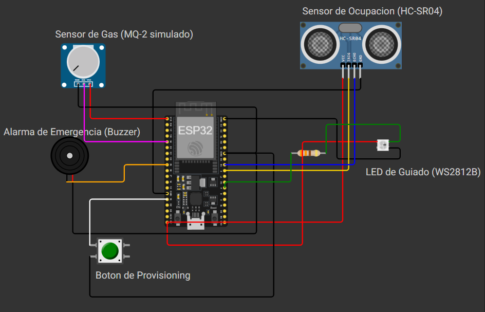

*[Link del wokwi: https://wokwi.com/projects/464031382788279297]*


### Flujos de Interacción del Prototipo IoT

El hardware cubre interacciones físicas que se sincronizan con las vistas de la aplicación móvil del conductor, el dashboard web del administrador y el Edge Server, definiendo los siguientes flujos principales de Wireflow físico:

**1. Flujo de Inicialización y Provisioning del Nodo:**

- **Paso 1:** El técnico instala el nodo en el techo del espacio de parqueo y conecta la alimentación.
- **Paso 2:** El ESP32 arranca y el LED WS2812B parpadea en **Azul `#1A82FF`** indicando estado de provisioning (búsqueda de red Wi-Fi).
- **Paso 3:** Una vez conectado al broker MQTT del Edge Server, el LED se apaga momentáneamente y luego enciende en **Verde `#10B981`** fijo, indicando que el nodo está operativo y el espacio fue reportado como `Available`.

**2. Flujo de Detección de Ocupación (Happy Path):**

- **Paso 1:** Un vehículo entra al espacio y el HC-SR04 detecta una distancia < 100 cm de forma sostenida durante > 2 segundos.
- **Paso 2:** El ESP32 publica el evento `SensorReadingProcessed` al topic MQTT correspondiente con el estado `Occupied`.
- **Paso 3:** El LED WS2812B cambia inmediatamente a **Rojo `#EF4444`** fijo.
- **Paso 4:** El Edge Server consolida la lectura, la reenvía al backend Cloud y el espacio se refleja como ocupado en el mapa de la app móvil y el dashboard web.

**3. Flujo de Liberación del Espacio (Happy Path):**

- **Paso 1:** El vehículo sale del espacio y el HC-SR04 detecta una distancia estable > 100 cm durante > 2 segundos.
- **Paso 2:** El ESP32 publica el evento con estado `Available`.
- **Paso 3:** El LED retorna a **Verde `#10B981`** fijo, y la app móvil notifica a conductores que hayan filtrado por espacios cercanos disponibles.

**4. Flujo de Emergencia por Detección de Gases (Unhappy Path):**

- **Paso 1:** El sensor MQ-2 lee una concentración > 900 PPM por más de 3 segundos.
- **Paso 2:** El ESP32 publica el evento `EmergencyAlertTriggered` en el topic `parksense/emergency/floor/{floorId}`.
- **Paso 3:** El Edge Server propaga el comando `BroadcastEvacuationSignal` a todos los nodos del piso.
- **Paso 4:** Todos los LEDs WS2812B del piso cambian a **parpadeo estroboscópico rojo a 2 Hz** y los buzzers emiten una sirena ascendente/descendente, guiando físicamente la evacuación de los conductores presentes.
- **Paso 5:** El dashboard web del administrador muestra una alerta crítica con la ubicación del sensor que detectó el evento.

**5. Flujo de Mantenimiento Manual (Provisioning Reset):**

- **Paso 1:** El técnico mantiene presionado el botón pulsador durante más de 5 segundos.
- **Paso 2:** El nodo borra las credenciales Wi-Fi almacenadas y reinicia en modo provisioning.
- **Paso 3:** El LED parpadea en **Azul `#1A82FF`** hasta que el técnico complete el emparejamiento desde la app de configuración.

<div style="page-break-after: always;"></div>

---

# Capítulo VI: Product Implementation, Validation \& Deployment

## 6.1. Software Configuration Management
## 6.1.1 Software Development Environment Configuration

Utilizaremos principalmente como IDEs: Visual Studio Code y IntelliJ IDEA, cada una con su configuración correspondiente para evitar conflictos entre extensiones, dependencias y carpetas personalizadas de desarrollo. Visual Studio Code será utilizado principalmente para el desarrollo frontend, mobile y landing page, mientras que IntelliJ IDEA será empleado para el desarrollo de las Web APIs y servicios backend con Spring Boot.

Como herramientas de desarrollo se hará uso de la última versión estable de Node.js. Para el frontend web se utilizará Angular como framework SPA, acompañado de Angular Material como biblioteca de componentes UI basada en Material Design. Para el backend se utilizará Java con el framework Spring Boot para la construcción de APIs RESTful.

Como IDE de desarrollo para la aplicación móvil se utilizará Visual Studio Code junto con el SDK más reciente de Flutter y Android Studio como emulador de dispositivos Android. Flutter permitirá el desarrollo multiplataforma de la aplicación móvil utilizando Dart como lenguaje de programación.

Como base de datos principal se utilizará PostgreSQL para el almacenamiento de usuarios, reservas, pagos, ocupación y demás información del sistema.

Como herramientas SaaS y de colaboración se utilizará GitHub para el control de versiones y trabajo colaborativo. Además, se empleará Trello para la gestión del Product Backlog y seguimiento de tareas. Para la elaboración de diagramas y modelado se utilizarán LucidChart y Structurizr.

Como herramienta de diseño UX/UI se utilizará Figma para la creación de wireframes, mockups y prototipos interactivos de la aplicación móvil y dashboard web.

Como herramienta de desarrollo para el componente IoT y Edge Computing se utilizará Visual Studio Code junto con Python/Flask y el protocolo MQTT para la comunicación con sensores y dispositivos IoT.

Para el desarrollo de la landing page se utilizarán HTML5, CSS3 y JavaScript, debido a la facilidad de implementación y compatibilidad con despliegues estáticos modernos.

Las herramientas tecnológicas seleccionadas para el proyecto son las siguientes:

### Visual Studio Code
Es un editor de código gratuito, moderno y altamente configurable mediante extensiones. Será utilizado para el desarrollo frontend, mobile, landing page e integración IoT.

### IntelliJ IDEA
IDE especializado para desarrollo backend en Java y Spring Boot. Facilita la gestión de dependencias, debugging y arquitectura de APIs REST.

### Flutter SDK
Framework multiplataforma utilizado para el desarrollo de la aplicación móvil SpotFinder utilizando Dart.

### Android Studio
Herramienta utilizada para la ejecución de emuladores Android y pruebas de la aplicación móvil Flutter.

### Git y GitHub
Se utilizarán para el control de versiones, manejo de ramas, colaboración entre desarrolladores y almacenamiento de repositorios.

### PostgreSQL
Sistema de gestión de bases de datos relacional utilizado para almacenar la información principal del sistema.

### Spring Boot
Framework backend utilizado para el desarrollo de servicios RESTful y lógica de negocio del sistema.

### Angular
Framework frontend utilizado para el desarrollo del dashboard web administrativo.

### Angular Material
Biblioteca de componentes UI basada en Material Design utilizada para mejorar la experiencia visual de la aplicación web.

### Figma
Herramienta de diseño UI/UX para la creación de prototipos y mockups del sistema.

### LucidChart
Herramienta utilizada para la creación de diagramas UML, diagramas de arquitectura y modelados adicionales.

### Structurizr
Herramienta utilizada para la elaboración de diagramas C4 del sistema.

### Discord
Herramienta de comunicación utilizada para coordinación y reuniones rápidas entre los integrantes del equipo.

### WhatsApp
Aplicación de mensajería utilizada para comunicación inmediata y coordinación rápida del equipo.

### Zoom
Plataforma utilizada para reuniones virtuales, sustentaciones y coordinación remota del proyecto.

### Trello
Herramienta utilizada para la gestión ágil del proyecto y organización del Product Backlog.

### Miro
Plataforma colaborativa utilizada para brainstorming, ideación y modelado de flujos del sistema.

### Google Docs
Herramienta utilizada para documentación colaborativa del proyecto y redacción de entregables.

### 6.1.2. Source Code Management
Como mencionamos anteriormente, se utilizará GitHub para llevar un control de las versiones de desarrollo y poder trabajar de forma colaborativa. Para ello, se creó una organización llamada:

Repositorio de Landing Page: https://github.com/ParkSenseIoT/SpotFinder-LandingPage

Repositorio de pruebas de aceptación:

Repositorio frontend: https://github.com/ParkSenseIoT/SpotFinder-Frontend
### 6.1.3. Source Code Style Guide \& Conventions

A continuación, se presentan las convenciones, estilos y buenas prácticas utilizadas en los lenguajes y tecnologías empleadas en la solución: HTML, CSS, JavaScript/TypeScript, Java, Dart y Gherkin.

## HTML

Se seguirá la guía **“HTML Style Guide and Coding”** de W3Schools. Las principales convenciones consideradas son:

- Declarar siempre el tipo de documento HTML.
- Utilizar nombres de etiquetas y atributos en minúscula.
- Cerrar correctamente todas las etiquetas.
- Usar comillas en todos los atributos.
- Definir atributos `alt`, `width` y `height` en imágenes.
- Mantener correctamente definidos los metadatos y etiquetas SEO.

## CSS

Se utilizará la guía **“Google HTML/CSS Style Guide”**. Las principales recomendaciones consideradas son:

- Utilizar nombres de clases descriptivos y cortos.
- Separar nombres mediante guiones.
- Evitar selectores por ID.
- Utilizar propiedades abreviadas cuando sea posible.
- Mantener estilos reutilizables y organizados.

## JavaScript / TypeScript

Se seguirán buenas prácticas basadas en la guía de W3C y Angular Style Guide:

- Utilizar nombres claros y legibles.
- Evitar variables globales innecesarias.
- Modularizar componentes y servicios.
- Documentar funciones complejas.
- Utilizar tipado fuerte mediante TypeScript.

## Java

Para el backend desarrollado en Spring Boot se utilizarán convenciones estándar de Java:

- Uso de CamelCase para clases y métodos.
- Separación por capas (`Controller`, `Service`, `Repository`).
- Uso de DTOs para transferencia de datos.
- Documentación de endpoints REST.
- Manejo centralizado de excepciones.

## Flutter / Dart

Para el desarrollo mobile con Flutter se seguirán las convenciones oficiales de Dart:

- Uso de widgets reutilizables.
- Separación de pantallas, servicios y modelos.
- Uso de nombres descriptivos en clases y variables.
- Organización modular del proyecto.
- Aplicación de principios de diseño responsive.

## Gherkin

Se utilizará Gherkin para pruebas de aceptación siguiendo las convenciones:

- Uso correcto de bloques `Given-When-Then`.
- Uso de indentación adecuada.
- Separación clara de escenarios.
- Uso de tablas para datos complejos.
- Redacción legible y entendible para negocio y desarrollo.

En resumen, las convenciones y estilos de programación seguirán las guías oficiales de Google, Angular, Flutter y Spring Boot para garantizar mantenibilidad, escalabilidad y consistencia del código.

Para el control de versiones se utilizará **GitFlow Workflow** junto con **Conventional Commits** y **Semantic Versioning**.

El lenguaje visual del sistema estará basado en **Material Design**, utilizando Angular Material para el dashboard web y componentes adaptativos en Flutter para la aplicación móvil.

Para el desarrollo de Web Services se utilizará **RESTful API Architectural Style** mediante Spring Boot Framework y Java.

Para el desarrollo de la Mobile App se utilizará **Flutter/Dart** consumiendo las APIs REST del backend.

### 6.1.4. Software Deployment Configuration

Para el despliegue de la landing page y aplicación web se utilizará **Netlify** y/o **Vercel** como plataformas de hosting frontend.

Para el despliegue del backend API se utilizará **Render**, **Railway** o **Zeabur** mediante contenedores y servicios cloud compatibles con Spring Boot.

Para la base de datos PostgreSQL se utilizará **Railway** o **Supabase** como servicio administrado.

Para el despliegue de la aplicación móvil se utilizará **Android Studio** para generación de builds APK y **Google Play Console** para distribución futura.

Para los servicios IoT y Edge Processing se utilizarán servidores Linux o servicios cloud compatibles con MQTT y Flask.

El despliegue seguirá los siguientes pasos:

1. Iniciar sesión en la plataforma de despliegue utilizando GitHub.
2. Conectar el repositorio correspondiente.
3. Configurar variables de entorno necesarias.
4. Configurar comandos de build y directorios de salida.
5. Realizar despliegue automático mediante integración continua.
6. Verificar funcionamiento y disponibilidad del sistema desplegado.

## 6.2. Landing Page, Services \& Applications Implementation

<div style="page-break-after: always;"></div>

### 6.2.1. Sprint 1

#### 6.2.1.1. Sprint Planning 1

En esta sección se presentan los aspectos principales abordados durante la reunión de planificación del Sprint 1. Se detallan elementos como la fecha, participantes, objetivo del sprint, velocidad estimada y cantidad de story points comprometidos para esta iteración del proyecto SpotFinder.

<table>
  <tr>
    <th>Sprint #</th>
    <th>Sprint 1</th>
  </tr>

  <tr>
    <th colspan="2">Sprint Planning Background</th>
  </tr>

  <tr>
    <td>Date</td>
    <td>2026-05-05</td>
  </tr>

  <tr>
    <td>Time</td>
    <td>10:20 PM</td>
  </tr>

  <tr>
    <td>Location</td>
    <td>Reunión virtual a través de Discord</td>
  </tr>

  <tr>
    <td>Prepared by</td>
    <td>Cruz Ibarra, Victor Andres</td>
  </tr>

  <tr>
    <td>Attendees (to planning meeting)</td>
    <td>
      Cruz Ibarra, Victor Andres; Dueñas Canales, Leonardo Manuel; Vidal Castro, Miguel Angel; Allcca Guerrero, Irving Washington;
      Roman Esteban, Henry Kalet
    </td>
  </tr>

  <tr>
    <td>Sprint n – 1 Review Summary</td>
    <td>No existe sprint previo</td>
  </tr>

  <tr>
    <th colspan="2">Sprint Goal & User Stories</th>
  </tr>

<tr>
  <td><strong>Sprint 1 Goal</strong></td>
  <td>
    <strong>Our focus is on</strong> delivering the first integrated version of the SpotFinder ecosystem.<br><br>
    <strong>We believe it delivers</strong> a faster and more accessible way to locate IoT devices and available spots for users and administrators.<br><br>
    <strong>This will be confirmed when</strong> users can successfully register, visualize, and interact with available spots through the platform without critical issues.
  </td>
</tr>

  <tr>
    <td>Sprint 1 Velocity</td>
    <td> 76 story points</td>
  </tr>

  <tr>
    <td>Sum of story points</td>
    <td> 76 story points</td>
  </tr>
</table>

#### 6.2.1.2. Aspect Leaders and Collaborators

En esta sección se presenta la matriz de liderazgo y colaboración (Leadership-and-Collaboration Matrix - LACX) correspondiente al Sprint 1 del proyecto SpotFinder. El objetivo de esta matriz es identificar los principales aspectos funcionales y técnicos abordados durante el Sprint, así como definir qué integrantes del equipo asumieron roles de liderazgo y cuáles participaron como colaboradores en cada aspecto. Esta organización permite mejorar la coordinación, distribución de responsabilidades y comunicación interna del equipo durante el desarrollo del Sprint.

Los aspectos considerados para este Sprint incluyen el desarrollo del backend, frontend, modelado de dominio, integración IoT y documentación técnica, debido a que representan las áreas principales necesarias para la construcción de la primera versión integrada del ecosistema SpotFinder.

| Team Member (Last Name, First Name) | GitHub Username | Backend Development | Frontend Development | Domain Modeling | Documentation |
|---|---|---|---|---|---|
| Cruz Ibarra, Victor Andres | Elandrehss | L | C | L | C |
| Dueñas Canales, Leonardo Manuel | Insonnio | C | C | C | L |
| Vidal Castro, Miguel Angel | Gossk | C | L | L | C |
| Allcca Guerrero, Irving Washington | eviterno17 | C | L | C | C |
| Roman Esteban, Henry Kalet | kalet123-commit | C | C | C | L |

**Legend:**  
- **L** = Leader  
- **C** = Collaborator

#### 6.2.1.3. Sprint Backlog 1

En esta sección se presenta el Sprint Backlog correspondiente al Sprint 1 del proyecto SpotFinder. Durante este Sprint, el equipo se enfocó en desarrollar la primera versión funcional de la arquitectura backend basada en bounded contexts, así como la implementación inicial de la Landing Page institucional del producto. Además, se desarrollaron los primeros endpoints principales relacionados con monitoreo de estacionamiento, sesiones, autenticación, analíticas y gestión vehicular.

A continuación, se muestra el tablero de trabajo utilizado para la gestión de tareas del Sprint:


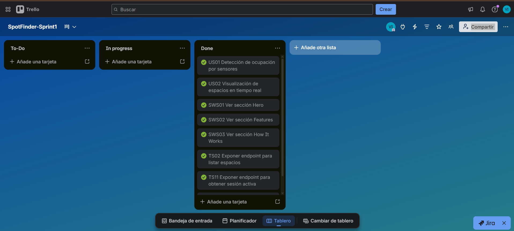
<br><br>

Link Trello: [SpotFinder - Trello]()

<table border="1" cellpadding="6" cellspacing="0">
  <thead>
    <tr>
      <th>Sprint #</th>
      <th colspan="8">Sprint 1</th>
    </tr>
    <tr>
      <th colspan="2">User Story</th>
      <th colspan="7">Work Item / Task</th>
    </tr>
    <tr>
      <th>ID</th>
      <th>Title</th>
      <th>ID</th>
      <th>Title</th>
      <th>Description</th>
      <th>Estimation (hours)</th>
      <th>Assigned To</th>
      <th>Status</th>
      <th>Story Points</th>
    </tr>
  </thead>
  <tbody>
    <tr>
  <td rowspan="2">US01</td>
  <td rowspan="2">Detección de ocupación por sensores</td>
  <td>T01</td>
  <td>Diseño de entidades de Parking Monitoring</td>
  <td>Modelar entidades y agregados relacionados a espacios y sensores.</td>
  <td>4</td>
  <td>Cruz Ibarra, Victor Andres</td>
  <td>Done</td>
  <td rowspan="2">8</td>
</tr>
<tr>
  <td>T02</td>
  <td>Implementación de endpoints de ocupación</td>
  <td>Desarrollar endpoints REST para registrar y consultar ocupación.</td>
  <td>6</td>
  <td>Cruz Ibarra, Victor Andres</td>
  <td>Done</td>
</tr>
<tr>
  <td rowspan="2">US02</td>
  <td rowspan="2">Visualización de espacios en tiempo real</td>

  <td>T03</td>
  <td>Implementación de consultas de espacios</td>
  <td>Desarrollar lógica de consulta de espacios disponibles.</td>
  <td>4</td>
  <td>Cruz Ibarra, Victor Andres</td>
  <td>Done</td>
  <td rowspan="2">8</td>
</tr>
<tr>
  <td>T04</td>
  <td>Implementación de actualización de estados</td>
  <td>Implementar actualización dinámica del estado de espacios.</td>
  <td>4</td>
  <td>Cruz Ibarra, Victor Andres</td>
  <td>Done</td>
</tr>
<tr>
  <td rowspan="2">US03</td>
  <td rowspan="2">Ingreso automático con ALPR</td>
  <td>T05</td>
  <td>Implementación base de Access Control</td>
  <td>Desarrollar bounded context inicial para control de acceso.</td>
  <td>4</td>
  <td>Cruz Ibarra, Victor Andres</td>
  <td>Done</td>
  <td rowspan="2">8</td>
</tr>
<tr>
  <td>T06</td>
  <td>Implementación de endpoints de ingreso vehicular</td>
  <td>Desarrollar endpoints REST para registrar ingresos vehiculares.</td>
  <td>4</td>
  <td>Cruz Ibarra, Victor Andres</td>
  <td>Done</td>
</tr>
<tr>
  <td rowspan="2">US04</td>
  <td rowspan="2">Salida automática con verificación de pago</td>
  <td>T07</td>
  <td>Diseño de Parking Sessions</td>
  <td>Modelar sesiones activas y flujo de salida vehicular.</td>
  <td>4</td>
  <td>Cruz Ibarra, Victor Andres</td>
  <td>Done</td>
  <td rowspan="2">8</td>
</tr>
<tr>
  <td>T08</td>
  <td>Endpoints de sesiones activas</td>
  <td>Implementar endpoints para gestión y finalización de sesiones.</td>
  <td>4</td>
  <td>Cruz Ibarra, Victor Andres</td>
  <td>Done</td>
</tr>
<tr>
  <td rowspan="2">US06</td>
  <td rowspan="2">Dashboard de monitoreo en tiempo real</td>

  <td>T09</td>
  <td>Diseño del bounded context Analytics</td>
  <td>Definir estructura y componentes del módulo Analytics.</td>
  <td>4</td>
  <td>Cruz Ibarra, Victor Andres</td>
  <td>Done</td>
  <td rowspan="2">8</td>
</tr>
<tr>
  <td>T10</td>
  <td>Endpoints de métricas y monitoreo</td>
  <td>Implementar endpoints REST para métricas de ocupación.</td>
  <td>4</td>
  <td>Cruz Ibarra, Victor Andres</td>
  <td>Done</td>
</tr>
<tr>
  <td rowspan="2">US18</td>
  <td rowspan="2">Registro de usuario conductor</td>

  <td>T11</td>
  <td>Diseño de entidades IAM</td>
  <td>Definir entidades y lógica inicial de autenticación.</td>
  <td>3</td>
  <td>Cruz Ibarra, Victor Andres</td>
  <td>Done</td>
  <td rowspan="2">5</td>
</tr>
<tr>
  <td>T12</td>
  <td>Endpoints de registro de usuarios</td>
  <td>Implementar endpoints para registro de usuarios conductores.</td>
  <td>3</td>
  <td>Cruz Ibarra, Victor Andres</td>
  <td>Done</td>
</tr>
<tr>
  <td rowspan="2">US20</td>
  <td rowspan="2">Inicio de sesión</td>

  <td>T13</td>
  <td>Diseño del flujo de autenticación</td>
  <td>Definir flujo de login y validación de credenciales para usuarios.</td>
  <td>2</td>
  <td>Cruz Ibarra, Victor Andres</td>
  <td>Done</td>
  <td rowspan="2">3</td>
</tr>

<tr>
  <td>T14</td>
  <td>Implementación de autenticación JWT</td>
  <td>Implementar generación y validación de tokens JWT para autenticación.</td>
  <td>3</td>
  <td>Cruz Ibarra, Victor Andres</td>
  <td>Done</td>
</tr>
<tr>
  <td rowspan="2">US23</td>
  <td rowspan="2">Registro de vehículo adicional</td>
  <td>T15</td>
  <td>Diseño de entidades Vehicle</td>
  <td>Modelar entidades y atributos relacionados a vehículos registrados.</td>
  <td>2</td>
  <td>Cruz Ibarra, Victor Andres</td>
  <td>Done</td>
  <td rowspan="2">3</td>
</tr>
<tr>
  <td>T16</td>
  <td>Implementación de endpoints de vehículos</td>
  <td>Desarrollar endpoints REST para registrar y gestionar vehículos.</td>
  <td>3</td>
  <td>Cruz Ibarra, Victor Andres</td>
  <td>Done</td>
</tr>
<tr>
  <td rowspan="2">SWS01</td>
  <td rowspan="2">Ver sección Hero</td>
  <td>T13</td>
  <td>Diseño visual de Hero Section</td>
  <td>Crear estructura visual y contenido principal del Hero.</td>
  <td>2</td>
  <td>Allcca Guerrero, Irving Washington</td>
  <td>Done</td>
  <td rowspan="2">2</td>
</tr>
<tr>
  <td>T14</td>
  <td>Implementación responsive de Hero</td>
  <td>Adaptar Hero Section para desktop y dispositivos móviles.</td>
  <td>1</td>
  <td>Allcca Guerrero, Irving Washington</td>
  <td>Done</td>
</tr>
<tr>
  <td rowspan="2">SWS02</td>
  <td rowspan="2">Ver sección Features</td>
  <td>T17</td>
  <td>Diseño visual de sección Features</td>
  <td>Crear estructura visual para mostrar funcionalidades principales.</td>
  <td>1</td>
  <td>Allcca Guerrero, Irving Washington</td>
  <td>Done</td>
  <td rowspan="2">2</td>
</tr>
<tr>
  <td>T18</td>
  <td>Implementación responsive de Features</td>
  <td>Adaptar sección Features para desktop y dispositivos móviles.</td>
  <td>2</td>
  <td>Allcca Guerrero, Irving Washington</td>
  <td>Done</td>
</tr>
<tr>
  <td rowspan="2">SWS03</td>
  <td rowspan="2">Ver sección How It Works</td>

  <td>T19</td>
  <td>Diseño de flujo explicativo</td>
  <td>Definir estructura visual y contenido explicativo del sistema.</td>
  <td>1</td>
  <td>Dueñas Canales, Leonardo Manuel</td>
  <td>Done</td>
  <td rowspan="2">2</td>
</tr>
<tr>
  <td>T20</td>
  <td>Implementación sección How It Works</td>
  <td>Desarrollar componentes visuales y responsive de la sección.</td>
  <td>2</td>
  <td>Dueñas Canales, Leonardo Manuel</td>
  <td>Done</td>
</tr>
<tr>
  <td rowspan="2">SWS04</td>
  <td rowspan="2">Ver sección About The Product</td>
  <td>T21</td>
  <td>Redacción de contenido institucional</td>
  <td>Preparar contenido descriptivo e información principal del producto.</td>
  <td>2</td>
  <td>Dueñas Canales, Leonardo Manuel</td>
  <td>Done</td>
  <td rowspan="2">3</td>
</tr>
<tr>
  <td>T22</td>
  <td>Implementación sección About Product</td>
  <td>Desarrollar componentes visuales y responsive de la sección.</td>
  <td>2</td>
  <td>Dueñas Canales, Leonardo Manuel</td>
  <td>Done</td>
</tr>
<tr>
  <td rowspan="2">SWS05</td>
  <td rowspan="2">Ver sección Pricing</td>

  <td>T23</td>
  <td>Diseño de cards de precios</td>
  <td>Diseñar estructura visual de planes y beneficios del servicio.</td>
  <td>2</td>
  <td>Roman Esteban, Henry Kalet</td>
  <td>Done</td>
  <td rowspan="2">3</td>
</tr>
<tr>
  <td>T24</td>
  <td>Implementación responsive de Pricing</td>
  <td>Implementar sección de precios adaptable para múltiples dispositivos.</td>
  <td>2</td>
  <td>Roman Esteban, Henry Kalet</td>
  <td>Done</td>
</tr>
<tr>
  <td rowspan="2">SWS06</td>
  <td rowspan="2">Ver sección Testimonials</td>

  <td>T25</td>
  <td>Diseño visual de Testimonials</td>
  <td>Crear diseño de testimonios y experiencias de usuarios.</td>
  <td>1</td>
  <td>Roman Esteban, Henry Kalet</td>
  <td>Done</td>
  <td rowspan="2">2</td>
</tr>
<tr>
  <td>T26</td>
  <td>Implementación sección Testimonials</td>
  <td>Desarrollar estructura responsive de testimonios.</td>
  <td>2</td>
  <td>Roman Esteban, Henry Kalet</td>
  <td>Done</td>
</tr>
<tr>
  <td rowspan="2">SWS07</td>
  <td rowspan="2">Ver sección About Us y About The Team</td>
  <td>T27</td>
  <td>Diseño sección Team</td>
  <td>Diseñar estructura visual para presentación del equipo.</td>
  <td>1</td>
  <td>Vidal Castro, Miguel Angel</td>
  <td>Done</td>
  <td rowspan="2">2</td>
</tr>
<tr>
  <td>T28</td>
  <td>Implementación sección Team</td>
  <td>Implementar componentes responsive de presentación del equipo.</td>
  <td>2</td>
  <td>Vidal Castro, Miguel Angel</td>
  <td>Done</td>
</tr>
<tr>
  <td rowspan="2">SWS08</td>
  <td rowspan="2">Ver sección FAQ</td>
  <td>T29</td>
  <td>Redacción de preguntas frecuentes</td>
  <td>Preparar contenido FAQ relacionado al funcionamiento del sistema.</td>
  <td>1</td>
  <td>Vidal Castro, Miguel Angel</td>
  <td>Done</td>
  <td rowspan="2">2</td>
</tr>
<tr>
  <td>T30</td>
  <td>Implementación sección FAQ</td>
  <td>Desarrollar diseño responsive de preguntas frecuentes.</td>
  <td>2</td>
  <td>Vidal Castro, Miguel Angel</td>
  <td>Done</td>
</tr>
<tr>
  <td rowspan="2">SWS09</td>
  <td rowspan="2">Ver sección Contact</td>

  <td>T31</td>
  <td>Diseño formulario de contacto</td>
  <td>Diseñar formulario y estructura de contacto institucional.</td>
  <td>1</td>
  <td>Allcca Guerrero, Irving Washington</td>
  <td>Done</td>
  <td rowspan="2">2</td>
</tr>
<tr>
  <td>T32</td>
  <td>Implementación sección Contact</td>
  <td>Desarrollar sección responsive de contacto.</td>
  <td>2</td>
  <td>Allcca Guerrero, Irving Washington</td>
  <td>Done</td>
</tr>
<tr>
  <td rowspan="2">SWS10</td>
  <td rowspan="2">Ver sección Footer</td>
  <td>T33</td>
  <td>Diseño del Footer</td>
  <td>Definir estructura visual y enlaces principales del footer.</td>
  <td>1</td>
  <td>Allcca Guerrero, Irving Washington</td>
  <td>Done</td>
  <td rowspan="2">2</td>
</tr>
<tr>
  <td>T34</td>
  <td>Implementación responsive del Footer</td>
  <td>Desarrollar footer adaptable para dispositivos móviles y desktop.</td>
  <td>1</td>
  <td>Allcca Guerrero, Irving Washington</td>
  <td>Done</td>
</tr>
<tr>
  <td rowspan="2">SWS11</td>
  <td rowspan="2">Navegación responsive</td>
  <td>T35</td>
  <td>Diseño de navbar responsive</td>
  <td>Diseñar navegación adaptable para distintos tamaños de pantalla.</td>
  <td>2</td>
  <td>Dueñas Canales, Leonardo Manuel</td>
  <td>Done</td>
  <td rowspan="2">3</td>
</tr>
<tr>
  <td>T36</td>
  <td>Implementación de navegación responsive</td>
  <td>Desarrollar comportamiento responsive de la barra de navegación.</td>
  <td>2</td>
  <td>Dueñas Canales, Leonardo Manuel</td>
  <td>Done</td>
</tr>
  </tbody>
</table>

# 6.2.1.4. Development Evidence for Sprint Review

Durante el Sprint 1 del proyecto SpotFinder se desarrolló la primera versión funcional de la Landing Page institucional del producto, enfocada en presentar la propuesta de valor del sistema y captar potenciales clientes mediante una experiencia visual moderna, responsive e intuitiva.

La Landing Page fue estructurada siguiendo los principios definidos en la Arquitectura de Información del proyecto, utilizando una organización jerárquica, secuencial y matricial para optimizar la navegación y reducir la carga cognitiva de los usuarios.

El desarrollo frontend se realizó utilizando componentes responsive adaptables a dispositivos desktop, tablets y smartphones. Asimismo, se implementó una estructura visual moderna basada en grids, tarjetas informativas y secciones organizadas verticalmente.

Durante este Sprint se desarrollaron las siguientes secciones principales:

* Hero Section
* Features
* How It Works
* About The Product
* Pricing
* Testimonials
* FAQ
* Contact
* Footer
* Navbar Responsive

La sección Hero fue diseñada para comunicar rápidamente la propuesta principal de SpotFinder mediante llamados a la acción orientados a conversión.

La sección Features implementó una estructura visual tipo Bento Grid para destacar funcionalidades clave como monitoreo en tiempo real, reconocimiento vehicular ALPR y analíticas operativas.

Por otro lado, la sección How It Works fue diseñada siguiendo una estructura secuencial que explica el flujo operativo del sistema desde la detección de ocupación hasta la salida automatizada.

Además, se desarrollaron componentes responsive para navegación adaptable, formularios de contacto, visualización de planes comerciales y presentación del equipo.

Todo el desarrollo frontend fue preparado para despliegue en Netlify como plataforma de hosting del proyecto.

[Enlace al Landing Page: https://venerable-banoffee-0b773a.netlify.app/#](https://venerable-banoffee-0b773a.netlify.app/#)

---

# 6.2.1.5. Testing Suite Evidence for Sprint Review

Para este Sprint el alcance de pruebas automatizadas se concentra en **Unit Tests** sobre la **Web Application (PWA) SpotFinder**, implementados con **Karma + Jasmine** sobre el builder oficial `@angular-devkit/build-angular:karma` y **Angular TestBed**. Las pruebas cubren las capas de **dominio** (utilidades y reglas de negocio del bounded context de Payments y Notifications) y **aplicación** (stores con `@ngrx/signals` y `computed`), además de la **infraestructura** (`TokenStorageService` y `authGuard`), aplicando el patrón de mocks vía `TestBed.configureTestingModule({ providers: [{ provide: …, useValue: … }] })` y `jasmine.createSpyObj(...)` para aislar las dependencias de `HttpClient`, `Router` y `localStorage`. Los **Integration Tests** y **Acceptance Tests** bajo el enfoque **BDD** (archivos `.feature` con Gherkin y Steps) no aplican en el Sprint 1 y se incorporarán en el Sprint 2 cuando se conecte la Web App al backend monolítico REST API en escenarios end-to-end.

## Unit Tests — Web Application (PWA)

| Test File | Clase / Componente bajo prueba | Comportamientos verificados |
|---|---|---|
| `iam/infrastructure/storage/token-storage.service.spec.ts` | `TokenStorageService` (Infrastructure Service) | Persistencia del JWT y del usuario en `localStorage` vía `saveSession`; sobreescritura cuando se guarda una segunda sesión; retorno `null` para `getToken`/`getUser` cuando no hay sesión; limpieza completa de `localStorage` en `clearSession` (logout). |
| `iam/application/guards/auth.guard.spec.ts` | `authGuard` (CanActivateFn) | Acceso concedido cuando `TokenStorageService.getToken()` retorna un JWT; redirección a `/auth/login` y retorno `false` cuando no hay token; mocks de `Router` y `TokenStorageService` provistos vía `TestBed`. |
| `iam/application/store/auth.store.spec.ts` | `AuthStore` (Application Store con `signalStore` de NgRx) | Estado signed-out por defecto (`user=null`, `isAuthenticated=false`); `login()` persiste el mock JWT, marca `isAuthenticated=true` y redirige a `/dashboard`; `logout()` limpia la sesión, resetea el estado y redirige a `/auth/login`. |
| `parking-monitoring/application/store/monitoring.store.spec.ts` | `MonitoringStore` (Application Store con `withComputed`) | Estado inicial con fleet vacío y sin sector seleccionado; cómputo del computed signal `sectorGroups` que agrupa los slots de 6 en 6 (`SECTOR A`, `SECTOR B`…) y calcula `occupiedCount`/`totalCount` por sector a partir de los slots cargados por `loadAllSlots`; `selectSector()` y `clearSelection()` mutan correctamente el sector seleccionado. |
| `payments/domain/utils/payment-filter.utils.spec.ts` | `applyPaymentFilters` (Domain Utility) | Resultado completo y ordenado por `paidAt` descendente con los filtros por defecto; filtrado por `paymentMethod`, por `status` y por `transactionQuery` (case-insensitive sobre `transactionId`); ventana `dateFrom`/`dateTo` aplicada sobre `paidAt` (descarta pagos fuera del rango y los que tengan `paidAt=null` cuando se aplica rango). |
| `notifications/domain/utils/notification-display.utils.spec.ts` | `notification-display.utils` (Domain Utility) | `isUnreadStatus`: trata `PENDING`, `SENT` y `DELIVERED` como no leídas (alimenta el badge del topbar) y descarta `READ`/`FAILED`; `severityFromNotificationType`: mapea `EMERGENCY_ALERT→CRITICAL`, `PAYMENT_FAILED`/`PAYMENT_REMINDER`/`SYSTEM_ALERT→WARNING`, `PAYMENT_SUCCESS→SUCCESS` y eventos operacionales→`INFO`; `isActivitySystemType`: identifica los tipos que alimentan el Activity Feed (`ENTRY_CONFIRMED`, `SESSION_END`, `SYSTEM_ALERT`). |
| `app.component.spec.ts` | `AppComponent` (root component) | Creación del componente raíz con `provideRouter([])`; expone el `title='spotfinder-web'` usado como nombre de la PWA; renderiza el `<router-outlet>` que monta las rutas de los bounded contexts (IAM, Parking Monitoring, Payments, Notifications). |

**Resultado del último run:** **27 tests pasando en 7 spec files** (`npx ng test --watch=false --browsers=ChromeHeadless` ejecuta el builder `@angular-devkit/build-angular:karma` con Karma 6.4.4 y Jasmine 5.6.0 sobre Chrome Headless 148).

```text
TOTAL: 27 SUCCESS
✔ Browser application bundle generation complete.
```

## Commits relacionados con Testing — Web Application (PWA)

**URL del repositorio:** [https://github.com/ParkSenseIoT/SpotFinder-Frontend](https://github.com/ParkSenseIoT/SpotFinder-Frontend)

| Repository | Branch | Commit Id | Commit Message | Commit Message Body | Committed on (Date) |
|---|---|---|---|---|---|
| ParkSenseIoT/SpotFinder-Frontend | feature/testing | - | `test(iam): cover token storage, auth guard and auth store` | Añade unit tests del bounded context IAM: persistencia del JWT y usuario en `TokenStorageService`, redirección de `authGuard` cuando no hay sesión, y comportamiento del `AuthStore` para los flujos de login/logout. Los specs mockean `TokenStorageService` y `Router` vía `TestBed` para no depender de `localStorage` real ni de la navegación de Angular. | 2026-05-14 |
| ParkSenseIoT/SpotFinder-Frontend | feature/testing | - | `test(parking-monitoring): cover sector grouping computed signal` | Añade unit tests del bounded context Parking Monitoring: estado inicial del `MonitoringStore`, agrupación automática de slots en sectores de 6 (computed `sectorGroups`) con `occupiedCount`/`totalCount` correctos, y los métodos `selectSector`/`clearSelection`. El spec mockea `MonitoringHttpService` con `jasmine.createSpyObj` para entregar un fleet determinístico de 8 slots. | 2026-05-14 |
| ParkSenseIoT/SpotFinder-Frontend | feature/testing | - | `test(payments): cover applyPaymentFilters pipeline` | Añade unit tests sobre la utilidad de dominio `applyPaymentFilters` del bounded context Payments: filtros por método de pago (YAPE, CREDIT_CARD, DEBIT_CARD), por status (PENDING/COMPLETED/FAILED), búsqueda case-insensitive sobre `transactionId`, ventana `dateFrom`/`dateTo` sobre `paidAt`, y ordenamiento descendente por fecha de pago. | 2026-05-14 |
| ParkSenseIoT/SpotFinder-Frontend | feature/testing | - | `test(notifications): cover display utils mapping` | Añade unit tests sobre las utilidades de presentación de `Notifications`: `isUnreadStatus` para el badge del topbar, `severityFromNotificationType` (mapeo a CRITICAL/WARNING/SUCCESS/INFO) y `isActivitySystemType` que alimenta el Activity Feed. | 2026-05-14 |
| ParkSenseIoT/SpotFinder-Frontend | feature/testing | - | `test(app): fix root spec to match router-outlet template` | El spec raíz fallaba porque la plantilla de `AppComponent` ya no renderiza `Hello, spotfinder-web` sino sólo `<router-outlet />` y el componente requiere `Router`. Provee `provideRouter([])` en el módulo de test y reemplaza el assertion obsoleto por uno que verifica que el `<router-outlet>` se monta en el DOM. | 2026-05-14 |
| ParkSenseIoT/SpotFinder-Frontend | feature/testing → develop | - | `Merge branch 'feature/testing' into develop` | Incorpora la suite de Unit Tests del Sprint 1 cubriendo IAM (`TokenStorageService`, `authGuard`, `AuthStore`), Parking Monitoring (sector grouping computed), Payments (`applyPaymentFilters`) y Notifications (display utils), más el fix del spec raíz para dejar la suite completa en verde (27 tests / 7 spec files). | 2026-05-14 |


# 6.2.1.6. Execution Evidence for Sprint Review

Durante el Sprint 1 del proyecto SpotFinder se desarrolló una primera versión navegable de la Landing Page institucional del producto. La plataforma presenta información relacionada a la automatización inteligente de estacionamientos, monitoreo vehicular en tiempo real, integración IoT y control de acceso automatizado.

La Landing Page fue diseñada con un enfoque moderno y responsive, priorizando la experiencia de usuario y la claridad visual de la información presentada.

A continuación, se presentan las capturas correspondientes a las principales vistas desarrolladas durante este Sprint.


## Landing Page - Pantallas principales

### Figura 6.2.1.6.1. Landing Page — Hero principal y propuesta de valor.

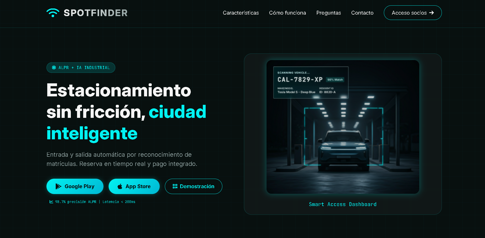

La sección Hero presenta la propuesta principal de SpotFinder enfocada en la automatización inteligente de estacionamientos mediante sensores IoT, reconocimiento vehicular ALPR y monitoreo en tiempo real.

---

### Figura 6.2.1.6.2. Landing Page — Funcionalidades principales del sistema.

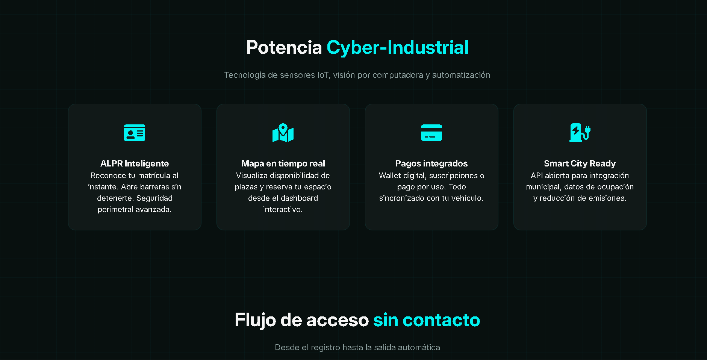

La sección Features muestra las funcionalidades principales de la plataforma organizadas mediante una estructura visual tipo Bento Grid, destacando monitoreo en tiempo real, control de acceso y analíticas operativas.

---

### Figura 6.2.1.6.3. Landing Page — Flujo operativo del sistema.

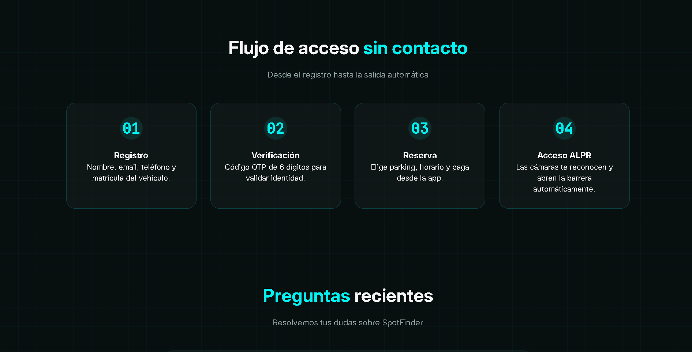

La sección “How It Works” explica de forma secuencial el funcionamiento del sistema desde la detección vehicular hasta la salida automatizada.

---

### Figura 6.2.1.6.7. Landing Page — Preguntas frecuentes.

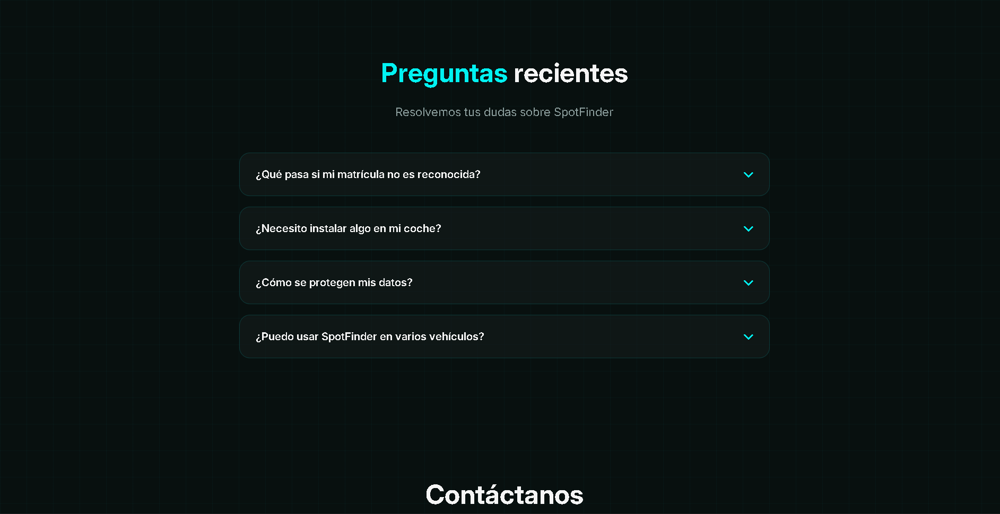

La sección FAQ responde preguntas relacionadas al funcionamiento, integración tecnológica y operación general del sistema.

---

### Figura 6.2.1.6.8. Landing Page — Formulario de contacto y Footer.

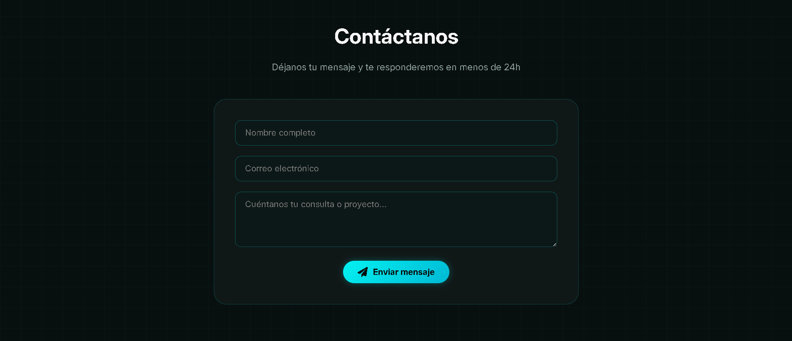

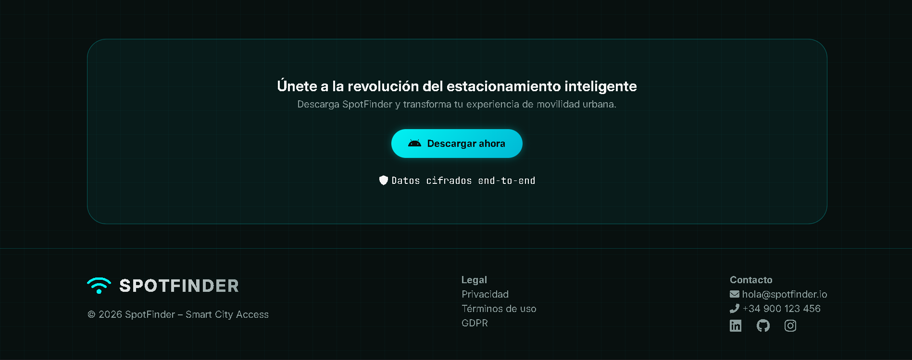

La sección Contact incorpora formularios y canales institucionales para consultas comerciales y solicitudes de demostración del producto, además antes del footer se tiene la instalación de la applicación android.

---

# 6.2.1.7. Services Documentation Evidence for Sprint Review

Durante el Sprint 1 se documentaron los principales componentes y secciones desarrolladas para la Landing Page de SpotFinder.

La documentación incluyó:

* Estructura de navegación.
* Organización de componentes visuales.
* Arquitectura responsive.
* Distribución de secciones.
* Diseño de experiencia de usuario.
* Estructura de formularios y navegación.

Asimismo, se definieron los lineamientos visuales utilizados para mantener consistencia entre componentes y facilitar futuras iteraciones del frontend.

La documentación sirvió como referencia para el desarrollo colaborativo y mantenimiento de la Landing Page.

---

# 6.2.1.8. Software Deployment Evidence for Sprint Review

Para el despliegue de la Landing Page se utilizó Netlify como plataforma de hosting frontend.

El despliegue permitió publicar una primera versión funcional y accesible de la plataforma, facilitando pruebas de navegación, validaciones visuales y revisiones colaborativas del sistema.

Asimismo, el proyecto fue gestionado mediante GitHub utilizando control de versiones basado en ramas feature y commits asociados a las tareas del Sprint.

La estrategia de despliegue implementada permitió mantener integración continua básica y simplificar futuras actualizaciones del frontend.

---

# 6.2.1.9. Team Collaboration Insights during Sprint

Durante el Sprint 1 el equipo trabajó colaborativamente utilizando Trello como herramienta principal para la gestión y seguimiento


En esta sección se presentan las conclusiones y recomendaciones derivadas del desarrollo del proyecto **SpotFinder**.


### Conclusiones

* La revisión del informe evidencia que **SpotFinder** responde a una necesidad real y documentada en el contexto peruano: la ineficiencia en la gestión de estacionamientos de centros comerciales en Lima, donde los conductores pierden en promedio cinco horas semanales buscando espacio y la congestión vehicular genera pérdidas de S/ 23,300 millones anuales según el BCR. El problema está sustentado tanto por fuentes estadísticas oficiales (IPE, AAP, INEI, Lima Cómo Vamos) como por la investigación cualitativa con seis entrevistas a conductores y administradores, quienes confirmaron la frustración con los sistemas manuales actuales y la necesidad de automatización.
* La propuesta de solución está correctamente orientada al integrar hardware IoT accesible (ESP32, sensores HC-SR04, LEDs WS2812B, ESP32-CAM, sensor MQ-2) con una arquitectura de software basada en Domain-Driven Design. El uso de Lean UX permitió conectar cinco hipótesis de valor con métricas concretas (reducción del 50% del tiempo de búsqueda, 90% de precisión ALPR, 50% de pagos digitales en tres meses), y la validación mediante entrevistas confirmó que las funcionalidades priorizadas coinciden con las necesidades de ambos segmentos.
* El diseño técnico presenta una base sólida para escalar el producto, gracias a la identificación de ocho bounded contexts
(tres Core, cuatro Supporting, uno Generic) y la definición de patrones de integración (OHS, Customer/Supplier, ACL, Published Language, Conformist). El Tactical DDD documenta siete bounded contexts completos con sus cuatro capas, class diagrams y database design, dejando una arquitectura consistente y lista para implementación.

### Recomendaciones

* Se recomienda priorizar un piloto controlado en un centro comercial de Lima (50-100 espacios) para validar las hipótesis del Lean UX. 
* Desarrollar las Spike Stories (Culqi, Plate Recognizer, FCM, Google Wallet, MQTT, PDF) en las primeras semanas del Sprint 2 para mitigar riesgos técnicos tempranamente.
* Implementar el modelo de suscripción diferenciado (Free, Pro, Premium) desde el piloto para medir la disposición de pago real. Los administradores entrevistados indicaron presupuestos de USD 20,000-50,000, validando la viabilidad financiera del modelo B2B.

<div style="page-break-after: always;"></div>

---

# Bibliografía

Asociación Automotriz del Perú. (2024). *Crisis del parque automotor: impacto en salud y economía*. AAP. https://aap.org.pe/crisis-parque-automotor-salud-economia-salud/
 
Banco Central de Reserva del Perú. (2024). Congestión vehicular en Lima genera pérdidas de S/ 23,300 millones anuales. *Índice.pe*. https://indice.pe/bcr-congestion-vehicular-en-lima-hace-que-economia-pierda-s-23-300-millones-por-ano/
 
BusinessWire. (2025). ParkHelp completes acquisition of Cleverciti. *BusinessWire*. https://www.businesswire.com/news/home/20251103685043/en/
 
Cleverciti. (2024). *Reduce unnecessary emissions with smart parking*. https://www.cleverciti.com/en/why-cleverciti/reduce-unnecessary-emissions
 
El Comercio. (2024). Parqueo vehicular en Lima: apps permiten encontrar y reservar espacios libres. *El Comercio*. https://elcomercio.pe/lima/sucesos/parqueo-vehicular-en-lima-apps-permiten-encontrar-y-reservar-espacios-libres-de-estacionamiento-noticia/
 
Evans, E. (2003). *Domain-Driven Design: Tackling Complexity in the Heart of Software*. Addison-Wesley Professional.
 
Firebase. (2026). *Firebase Cloud Messaging documentation*. Google. https://firebase.google.com/docs/cloud-messaging
 
Gestión. (2024). Parque automotor en Lima creció 40% pero red vial se quedó muy lejos de seguirle el paso. *Gestión*. https://gestion.pe/economia/parque-automotor-en-lima-crecio-40-pero-red-vial-se-quedo-muy-lejos-de-seguirle-el-paso-en-ultimos-10-anos-noticia/
 
Global Growth Insights. (2025). *Who are the top 7 smart parking companies in 2025?* https://www.globalgrowthinsights.com/blog/who-are-the-top-7-smart-parking-companies-in-2025--934
 
Google. (2026). *Google Wallet API — Generic Passes*. https://developers.google.com/wallet/generic
 
Infobae. (2024). Perú pierde S/ 20 mil millones por congestión vehicular en Lima. *Infobae Perú*. https://www.infobae.com/peru/2024/12/26/peru-pierde-s20-mil-millones-por-congestion-vehicular-en-lima-segun-bcr-las-razones-detras-del-caos/
 
Infomarketing. (2023). Jockey Plaza implementa nuevo sistema tecnológico para mejorar la experiencia en sus estacionamientos. *Infomarketing*. https://infomarketing.pe/marketing/noticias/jockey-plaza-implementa-nuevo-sistema-tecnologico-para-mejorar-la-experiencia-en-sus-estacionamientos/
 
Instituto Nacional de Estadística e Informática. (2024). El 91,3% de la población que usa internet accedió a través de un teléfono celular. *INEI*. https://m.inei.gob.pe/prensa/noticias/el-913-de-la-poblacion-de-6-y-mas-anos-de-edad-que-usa-internet-accedio-a-traves-de-un-telefono-celular-14458/
 
Instituto Peruano de Economía. (2024). En los últimos diez años, el parque automotor en Lima creció 40% pero la red vial apenas 7%. *IPE*. https://ipe.org.pe/en-los-ultimos-diez-anos-el-parque-automotor-en-lima-crecio-40-pero-la-red-vial-apenas-7/
 
Lima Cómo Vamos. (2018). *Encuesta Lima Cómo Vamos 2018*. https://www.limacomovamos.org/
 
Los Portales Corporativo. (2020). *Smart Parking Apparka*. https://www.losportalescorporativo.com.pe/enterate/smart-parking-apparka/
 
Los Portales Corporativo. (2023). Apparka se renueva a través de una experiencia de usuario más personalizada. https://www.losportalescorporativo.com.pe/enterate/apparka-se-renueva-a-traves-de-una-experiencia-de-usuario-mas-personalizada/
 
Mercado Negro. (2019). Aplicativo para encontrar estacionamiento de forma inmediata llegó a Perú. *Mercado Negro*. https://www.mercadonegro.pe/marketing/aplicativo-para-encontrar-estacionamiento-de-forma-inmediata-llego-a-peru/
 
ParkHelp. (2025). *Parking guidance technologies*. https://www.parkhelp.com/parking-guidance-technologies/
 
Perú Retail. (2025). Apparka apuesta por tecnología y expansión internacional en 2025. *Perú Retail*. https://www.peru-retail.com/apparka-ex-los-portales-estacionamientos-apuesta-por-tecnologia-y-expansion-internacional-en-2025/
 
Plate Recognizer. (2026). *API documentation — Snapshot API*. https://platerecognizer.com/docs/
 
Quadra. (2026). *Estacionamiento inteligente en Lima*. https://quadra.com.pe/

Tapia, L., et al. (2022). Impacto de la congestión vehicular en la salud y calidad de vida en Lima. *Scielo Colombia*. http://www.scielo.org.co/scielo.php?script=sci_arttext&pid=S1794-44492022000100152
 
TOUCH Consulting. (2023). *Caso de éxito: Jockey Plaza Easy Parking*. https://www.touchconsulting.es/en/caso-de-exito/transformamos-la-experiencia-de-busqueda-y-pago-de-parking-2/
 
Urbiotica. (2024). *Smart parking: the pollution solution*. https://urbiotica.com/us/blog/smart-parking-pollution-solution/
 

<div style="page-break-after: always;"></div>

# Anexos

### Anexo A: Código Fuente
 
- **Organización GitHub:** https://github.com/ParkSenseIoT
- **Repositorio del reporte:** https://github.com/ParkSenseIoT/SpotFinder-Report
- **Backend (Spring Boot):** https://github.com/ParkSenseIoT/SpotFinder-Backend
- [Enlace Backend desplegado: https://spotfinder-backend-ozsh.onrender.com/swagger-ui/index.html#/](https://spotfinder-backend-ozsh.onrender.com/swagger-ui/index.html#/)
- [Enlace Landing Page desplegado: https://venerable-banoffee-0b773a.netlify.app/#features](https://venerable-banoffee-0b773a.netlify.app/#features)
- 
### Anexo B: Videos
 
- **Entrevistas Needfinding:** [Ver video](https://1drv.ms/v/c/e7943890401aebc7/IQCsVfJnUhn9RJWEkmDyCX2pAQnBlD9IkX-cMPJdZnQzPF0?e=uymIhe)
- **Exposición AV1:** [https://www.canva.com/design/DAHHz_faBIs/RAaPGfTnPY3Jkz9IVJ5uLA/edit]
### Anexo C: Herramientas utilizadas
 
| Herramienta | Propósito |
|---|---|
| Figma | Wireframes, mock-ups, prototipos |
| UXPressia | User Personas, Journey Maps, Impact Maps |
| Microsoft Whiteboard | Event Storming |
| LucidChart | UML, Domain Message Flows, Context Maps |
| Structurizr | Diagramas C4 |
| Vertabelo | Database Design Diagrams |
| PlantUML | Class Diagrams |
| Trello | Product Backlog, Sprint Planning |
| GitHub | Control de versiones, GitFlow |
 
### Anexo D: Diagramas
 
Los diagramas están en `assets/diagrams/` del repositorio del reporte, organizados en `c4/`, `uml/`, `ddd/` y `db/`.
 
### Anexo E: Entrevistas
 
El diseño (21 preguntas por segmento), registro y análisis se encuentran en las secciones 2.2.1, 2.2.2 y 2.2.3.
 
### Anexo F: Detalle de Spike Stories
 
| ID | Título | Objetivo |
|---|---|---|
| SS01 | Integración de Culqi | Evaluar API de Culqi para pagos con tarjeta y Yape en Spring Boot |
| SS02 | Plate Recognizer API | Evaluar precisión ALPR con placas peruanas y ESP32-CAM |
| SS03 | Firebase Cloud Messaging | Implementar notificaciones push desde Spring Boot a Flutter |
| SS04 | Google Wallet API | Implementar pase digital de estancia para plan Premium |
| SS05 | Bibliotecas MQTT para ESP32 | Comparar PubSubClient vs AsyncMQTTClient |
| SS06 | Generación de PDF | Evaluar iText, JasperReports y PDFBox para reportes |
 
---
