

     
    <strong>Universidad Peruana de Ciencias Aplicadas</strong> 
     
    <strong>Facultad de Ingeniería</strong> 
    <strong>Carrera de Ingeniería de Software</strong> 
    <strong>Ciclo 2026-10</strong>

 

  <strong>Código del curso: </strong>1ASI0572 
  <strong>Curso: </strong>Desarrollo de Soluciones IOT

 

  <strong>NRC: 6772</strong>

 

    <strong>Profesor: </strong>Marco Antonio León Baca

 

    <strong>Informe de Trabajo Final</strong>

 

    <strong>Nombre del startup: </strong> ParkSense IoT

 

    <strong>Nombre del producto: </strong> SpotFinder

 

    <strong>Abril, 2026</strong>

# Project Report Collaboration Insights
| Versión | Fecha | Autor | Descripción de modificación |
|---|---|---|---|
| 1.0.0 | 2026-04-04 | Esteban Román, Henry Kalet | Creación de estructura base del repositorio, carátula, CONTRIBUTING.md y registro de versiones. |
| 1.1.0 | 2026-04-06 | Esteban Román, Henry Kalet | Redacción de Capítulo I: Startup Profile, Solution Profile (5W+2H, Lean UX Process) y Segmentos Objetivo. |
| 1.2.0 | 2026-04-08 | Vidal Castro, Miguel Angel | Desarrollo de Capítulo II: Competidores (análisis competitivo), estrategias frente a competidores. |
| 1.2.1 | 2026-04-09 | Cruz Ibarra, Victor Andrés | Diseño de entrevistas, registro y análisis de entrevistas del Segmento 2 (Administradores). |
| 1.2.2 | 2026-04-11 | Allcca Guerrero, Irving Washington | Needfinding: User Personas, User Task Matrix, Empathy Mapping. |
| 1.2.3 | 2026-04-11 | Dueñas Canales, Leonardo Manuel | Needfinding: User Journey Mapping. Registro de entrevistas Segmento 1 (Conductores). |
| 1.3.0 | 2026-04-13 | Esteban Román, Henry Kalet | Capítulo II: Big Picture Event Storming (10 pasos), Ubiquitous Language. |
| 1.4.0 | 2026-04-15 | Esteban Román, Henry Kalet | Capítulo III: User Stories (US, TS, SWS, SS), Impact Mapping y Product Backlog. |
| 1.4.1 | 2026-04-16 | Vidal Castro, Miguel Angel | Capítulo III: Technical Stories adicionales (TS22-TS61) integradas al backlog. |
| 1.5.0 | 2026-04-18 | Cruz Ibarra, Victor Andrés | Capítulo IV: Candidate Context Discovery y Domain Message Flows Modeling. |
| 1.5.1 | 2026-04-19 | Allcca Guerrero, Irving Washington | Capítulo IV: Bounded Context Canvases (Parking Monitoring, Access Control, Payment Processing). |
| 1.5.2 | 2026-04-20 | Vidal Castro, Miguel Angel | Capítulo IV: Context Mapping con patrones DDD y análisis de alternativas. |
| 1.5.3 | 2026-04-21 | Dueñas Canales, Leonardo Manuel | Capítulo IV: Software Architecture (System Landscape, Context, Container, Deployment diagrams). |
| 1.6.0 | 2026-04-22 | Esteban Román, Henry Kalet | Capítulo IV: Tactical DDD - Domain Layer, Interface Layer, Application Layer, Infrastructure Layer para los 7 Bounded Contexts. |
| 1.6.1 | 2026-04-22 | Dueñas Canales, Leonardo Manuel | Capítulo IV: Component Level Diagrams para Bounded Contexts. |
| 1.6.2 | 2026-04-23 | Cruz Ibarra, Victor Andrés | Capítulo IV: Database Design Diagrams para Bounded Contexts. |
| 1.7.0 | 2026-04-24 | Esteban Román, Henry Kalet | Integración de Student Outcome, Conclusiones, Bibliografía y Anexos para AV1. |
 
## Project Report Collaboration Insights
 
**URL del repositorio para el Project Report:** [https://github.com/ParkSenseIoT/SpotFinder-Report](https://github.com/ParkSenseIoT/SpotFinder-Report)
 
Se utilizó GitHub como plataforma de control de versiones y colaboración en equipo. Se siguió el flujo de trabajo **GitFlow** con las ramas principales `main` y `develop`, y ramas de trabajo `feature/<sección>` para cada contribución individual.
 
Los integrantes del equipo y sus nombres de usuario en GitHub son los siguientes:
 
| Integrante | Código | Nombre en GitHub |
|---|---|---|
| Esteban Román, Henry Kalet | U202310210 | kalet123-commit |
| Dueñas Canales, Leonardo Manuel | U202117475 | insonnio |
| Vidal Castro, Miguel Angel | U202314186 | gossk |
| Allcca Guerrero, Irving Washington | U202213241 | eviterno17 |
| Cruz Ibarra, Victor Andrés | U202311053 | elandrehs |
 
### AV1
 
#### Tareas asignadas
 
Para el desarrollo del AV1 (TB1), cada participante del equipo realizó las siguientes tareas:
 
| Integrante | Tareas asignadas |
|---|---|
| **Esteban Román, Henry Kalet** | - Capítulo I completo (Startup Profile, Solution Profile, Lean UX, Segmentos Objetivo) - Capítulo II: Big Picture Event Storming (10 pasos), Ubiquitous Language - Capítulo III: User Stories (US, TS, SWS, SS), Impact Mapping, Product Backlog - Capítulo IV: Tactical DDD (Domain Layer, Interface Layer, Application Layer, Infrastructure Layer para 7 BCs), Class Diagrams - Component Level Diagrams (en colaboración con Leonardo) |
| **Dueñas Canales, Leonardo Manuel** | - Capítulo II: User Journey Mapping, registro de entrevistas Segmento 1 - Capítulo IV: Software Architecture (System Landscape, Context, Container, Deployment diagrams) - Component Level Diagrams para Bounded Contexts (en colaboración con Henry) |
| **Vidal Castro, Miguel Angel** | - Capítulo II: Análisis competitivo, estrategias frente a competidores - Capítulo III: Technical Stories adicionales (integración con equipo) - Capítulo IV: Context Mapping con patrones DDD y análisis de alternativas |
| **Allcca Guerrero, Irving Washington** | - Capítulo II: User Personas, User Task Matrix, Empathy Mapping - Capítulo IV: Bounded Context Canvases (Parking Monitoring, Access Control, Payment Processing, Emergency, Analytics, Notification, IAM) |
| **Cruz Ibarra, Victor Andrés** | - Capítulo II: Diseño de entrevistas, registro y análisis de entrevistas Segmento 2 - Capítulo IV: Candidate Context Discovery, Domain Message Flows Modeling - Capítulo IV: Database Design Diagrams para Bounded Contexts |
 
#### GitHub Collaboration Insights
 
En GitHub se presenta un timeline de las principales ramas creadas por cada integrante del equipo, así como los procesos de merge realizados. Todas las ramas fueron gestionadas siguiendo el flujo de trabajo GitFlow.
 
**Gráfico de commits por integrante:**
 
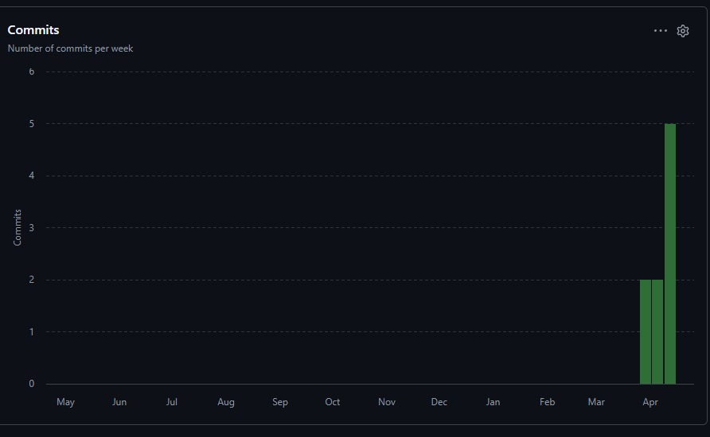
 
**Gráfico de red (network graph) de ramas en el repositorio de GitHub:**
 
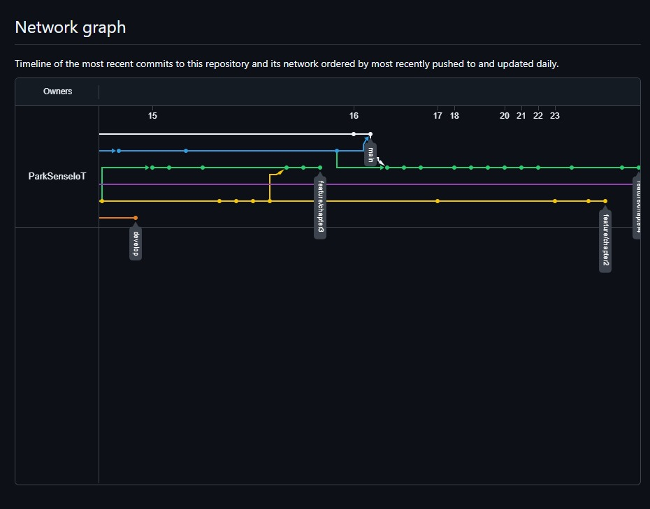
 
**Contribuciones de los integrantes:**
 
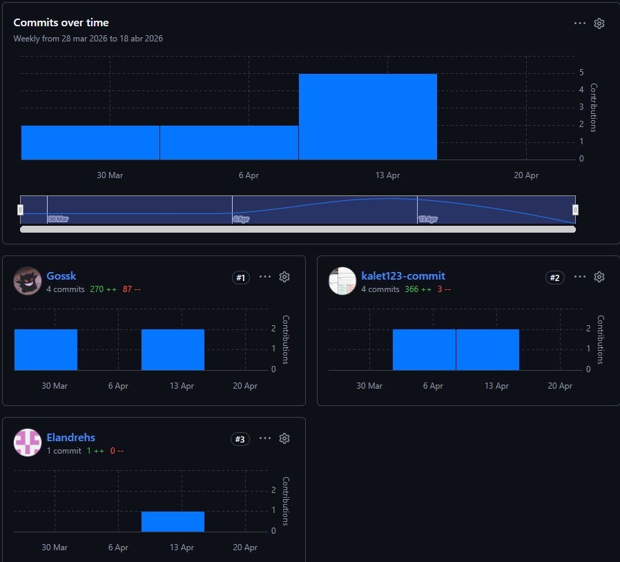

# Contenido

---
## Student Outcome
 
**Criterio:** La capacidad de funcionar efectivamente en un equipo cuyos miembros juntos proporcionan liderazgo, crean un entorno de colaboración e inclusivo, establecen objetivos, planifican tareas y cumplen objetivos.
 
En el siguiente cuadro se describe las acciones realizadas y enunciados de conclusiones por parte del grupo, que permiten sustentar el haber alcanzado el logro del ABET – EAC - Student Outcome 5.
 
| Criterio específico | Acciones realizadas | Conclusiones |
|---------------------|---------------------|--------------|
| **Comunica oralmente con efectividad a diferentes rangos de audiencia** | **Esteban Román, Henry Kalet** _**AV1:** Lideré las sesiones de Event Storming y Candidate Context Discovery con el equipo, explicando la metodología de los 10 pasos y guiando la identificación de bounded contexts. Presenté y justifiqué las decisiones de arquitectura DDD (clasificación Core/Supporting/Generic) utilizando un lenguaje accesible tanto para los integrantes técnicos como para la comprensión general del dominio de estacionamientos._    **Dueñas Canales, Leonardo Manuel** _**AV1:** Presenté los diagramas de arquitectura C4 (System Landscape, Context, Container, Deployment) al equipo, explicando las decisiones de diseño y las interacciones entre componentes del sistema IoT (ESP32, Edge Server, Cloud Backend). Adapté la explicación para que los compañeros sin experiencia en IoT comprendieran el flujo de datos desde los sensores hasta la app móvil._    **Vidal Castro, Miguel Angel** _**AV1:** Presenté y expliqué el Context Mapping al equipo, comunicando los patrones DDD elegidos (OHS, Customer/Supplier, ACL, Published Language) y las razones detrás de cada relación entre bounded contexts. Facilité la discusión de alternativas con el equipo, asegurando que todos comprendieran las implicaciones de cada patrón en la arquitectura._    **Allcca Guerrero, Irving Washington** _**AV1:** Comuniqué los hallazgos del Needfinding (User Personas, Empathy Maps) al equipo, explicando los perfiles de los conductores y administradores identificados en la investigación. Presenté los Bounded Context Canvases de los 3 contextos Core, detallando la comunicación inbound/outbound y las decisiones de negocio de cada contexto._    **Cruz Ibarra, Victor Andrés** _**AV1:** Conduje y presenté las entrevistas realizadas al segmento de administradores de estacionamientos, comunicando los hallazgos clave sobre la problemática actual (gestión manual, falta de analítica, costos operativos). Expliqué los Domain Message Flows al equipo, detallando los 4 escenarios de interacción entre bounded contexts con un lenguaje claro y orientado al negocio._ | **Conclusiones AV1:** El equipo logró comunicar efectivamente las decisiones técnicas y de diseño a diferentes audiencias. Las sesiones de Event Storming y las presentaciones de arquitectura DDD permitieron que todos los integrantes comprendieran el dominio del problema y las decisiones de diseño, independientemente de su nivel de experiencia previa con DDD o IoT. La comunicación oral efectiva fue clave para alinear criterios en la clasificación de bounded contexts y la definición de patrones de integración. |
| **Comunica por escrito con efectividad a diferentes rangos de audiencia** | **Esteban Román, Henry Kalet** _**AV1:** Redacté los capítulos I y III del informe, organizando de manera clara la problemática (5W+2H), el proceso Lean UX, las User Stories con formato Gherkin de 7 columnas, y el Product Backlog priorizado por valor de negocio. Documenté el Tactical DDD de los 7 bounded contexts con tablas detalladas de Domain Layer (aggregates, value objects, commands, queries, events, domain services), Interface Layer, Application Layer e Infrastructure Layer, asegurando consistencia y trazabilidad entre la documentación y la implementación._    **Dueñas Canales, Leonardo Manuel** _**AV1:** Documenté la arquitectura de software del sistema SpotFinder mediante diagramas C4 en Structurizr DSL, incluyendo código fuente replicable. Redacté las descripciones de los Component Level Diagrams para los bounded contexts, detallando las interacciones entre capas y sistemas externos con nomenclatura técnica precisa._    **Vidal Castro, Miguel Angel** _**AV1:** Redacté la sección de Context Mapping del informe, documentando las 7 relaciones entre bounded contexts con patrones DDD, análisis de alternativas (pros/contras) y decisiones sustentadas. También documenté las Technical Stories adicionales con formato estandarizado de 7 columnas, contribuyendo a la especificación completa de requisitos técnicos del backend._    **Allcca Guerrero, Irving Washington** _**AV1:** Redacté las secciones de Needfinding del Capítulo II, documentando los User Personas (Carlos Ramírez y Patricia Vega), User Task Matrix, y Empathy Maps con información extraída de las entrevistas. Documenté los Bounded Context Canvases siguiendo el template oficial de ddd-crew/bounded-context-canvas, detallando comunicación, ubiquitous language y business decisions para cada contexto._    **Cruz Ibarra, Victor Andrés** _**AV1:** Redacté el diseño y análisis de entrevistas del Capítulo II, sintetizando los hallazgos de 6 entrevistas (3 por segmento) en un análisis cruzado con validación de hipótesis Lean UX. Documenté el Candidate Context Discovery con la técnica Start-with-Value y los Domain Message Flows de 4 escenarios clave del sistema, además de los Database Design Diagrams con esquemas SQL para cada bounded context._ | **Conclusiones AV1:** La documentación escrita del proyecto refleja un alto nivel de detalle y consistencia técnica. El uso de formatos estandarizados (tablas de 7 columnas para User Stories, templates de Bounded Context Canvas, Structurizr DSL para diagramas C4, PlantUML para class diagrams, SQL para database design) aseguró que la información sea comprensible tanto para el equipo técnico como para evaluadores externos. La trazabilidad entre Event Storming, User Stories, Bounded Contexts y Tactical DDD demuestra coherencia en el diseño del sistema. |
  

# Capítulo I: Introducción

## 1.1. Startup Profile
### 1.1.1. Descripción de la Startup
**ParkSense** es una startup conformada por estudiantes de la carrera de Ingeniería de Software de la Universidad Peruana de Ciencias Aplicadas (UPC), enfocada en desarrollar soluciones tecnológicas basadas en **Internet de las Cosas (IoT)** para optimizar la gestión de estacionamientos en centros comerciales.

A través de su producto **SpotFinder**, ParkSense busca resolver la problemática del tiempo desperdiciado y la congestión vehicular que se genera dentro de los estacionamientos cerrados. El sistema proporciona una solución integral que combina:
* Sensores ultrasónicos.
* Reconocimiento automático de placas vehiculares (ANPR) para la automatización de entrada y salida de vehículos.
* Guiado visual por luces.
* Aplicación móvil para conductores.
* Panel de control para administradores de estacionamientos.

La propuesta consiste en el desarrollo de un sistema inteligente que permita monitorear en tiempo real los espacios disponibles y ocupados, brindando información útil tanto a usuarios como a administradores mediante plataformas digitales.

**Misión**
Transformar la experiencia de estacionamiento en centros comerciales del Perú mediante soluciones IoT innovadoras que reduzcan el tiempo de búsqueda de espacios, mejoren la seguridad vehicular y optimicen la operación administrativa de los estacionamientos.

**Visión**
Posicionarnos como una solución innovadora dentro del ámbito de ciudades inteligentes, integrando IoT y plataformas digitales para transformar la gestión de estacionamientos.
## 1.1.2. Perfiles de integrantes del equipo
 
| Foto | Nombres y Apellidos | Código | Carrera | Resumen de Conocimientos y Habilidades |
| :---: | :--- | :---: | :---: | :--- |
|  | Henry Kalet Esteban Román | U202310210 | Ingeniería de Software | Estudiante de 7° ciclo. Posee experiencia en desarrollo fullstack (Angular, Vue.js, Spring Boot, .NET) y aplicaciones móviles. Domina arquitecturas DDD y Clean Architecture, además de metodologías ágiles como Scrum y Lean UX. Cuenta con sólidos conocimientos en Java, TypeScript y bases de datos relacionales. |
|  | Leonardo Manuel Dueñas Canales | U202117475 | Ingeniería de Software | Estudiante de 7° ciclo. Cuenta con experiencia en desarrollo backend con Java y Spring Boot, así como en diseño de arquitecturas de software utilizando C4 Model y Structurizr. Posee conocimientos en bases de datos relacionales (PostgreSQL, MySQL), Docker y despliegue en la nube. Familiarizado con metodologías ágiles y control de versiones con Git/GitHub. |
|  | Miguel Angel Vidal Castro | U202314186 | Ingeniería de Software | Estudiante de 7° ciclo. Experiencia en desarrollo web con Angular y Spring Boot. Conocimientos en diseño orientado al dominio (DDD), patrones de integración entre bounded contexts y documentación técnica. Manejo de herramientas de gestión de proyectos (Trello, Jira) y metodologías Scrum. Habilidades en análisis competitivo y elaboración de estrategias de producto. |
|  | Irving Washington Allcca Guerrero | U202213241 | Ingeniería de Software | Estudiante de 7° ciclo. Posee experiencia en investigación de usuarios y diseño UX, incluyendo la elaboración de User Personas, Empathy Maps y Journey Maps. Conocimientos en desarrollo frontend con Angular y React, además de diseño de interfaces con Figma. Familiarizado con bases de datos relacionales y metodologías ágiles. |
|  | Victor Andrés Cruz Ibarra | U202311053 | Ingeniería de Software | Estudiante de 7° ciclo. Cuenta con experiencia en desarrollo backend con Spring Boot y diseño de bases de datos relacionales (PostgreSQL, MySQL). Conocimientos en modelado de datos, diagramas UML y documentación técnica. Habilidades en investigación cualitativa (entrevistas, análisis de usuarios) y redacción de informes técnicos. Familiarizado con Git/GitHub y Conventional Commits. |
## 1.2. Solution Profile

El proyecto consiste en el desarrollo de un sistema **IoT** para la gestión inteligente de estacionamientos, basado en el monitoreo en tiempo real de los espacios disponibles. El sistema utiliza sensores instalados en cada espacio para detectar si un lugar está ocupado o libre, permitiendo generar un mapa actualizado del estacionamiento que puede ser consultado por los usuarios a través de una aplicación móvil.

Adicionalmente, se incorpora el **reconocimiento de placas vehiculares (ALPR)** como un mecanismo de identificación, el cual permite asociar un vehículo a su ubicación dentro del estacionamiento. Esto facilita un acceso más fluido mediante la automatización de ingreso por barreras anti-intrusión, mientras que los conductores son guiados hacia su lugar de destino a través de indicadores LED.

La solución incluye dos plataformas principales:
* **Aplicación móvil (Usuarios):** Permite visualizar espacios disponibles, recibir notificaciones relacionadas al vehículo y realizar pagos digitales por el tiempo de uso.
* **Plataforma web (Administradores):** Panel para gestionar la información del estacionamiento, visualizar estadísticas de uso (como espacios con mayor demanda) y tomar decisiones basadas en datos.

### 1.2.1. Antecedentes y problemática

**¿Cuál es el problema? (What)**
El problema central es la ausencia de sistemas inteligentes de gestión en los estacionamientos de centros comerciales en Lima. Esto genera tiempos excesivos de búsqueda de espacios, congestión vehicular interna, cuellos de botella en los accesos e inseguridad por falta de trazabilidad. Actualmente, la mayoría opera con sistemas semi-automatizados limitados a tickets físicos, sin ofrecer información en tiempo real.

Según estudios de la Universidad de Piura (2019), los conductores en Lima pierden en promedio **cinco horas a la semana** buscando estacionamiento. Además, el Banco Central de Reserva del Perú (BCR) estima que la congestión genera pérdidas económicas de aproximadamente **S/ 23,300 millones anuales** (2.4% del PBI).

**¿Cuándo ocurre? (When)**
Se presenta de manera continua, intensificándose en horas punta, fines de semana y temporadas de alta afluencia como Navidad, Fiestas Patrias, Black Friday o Cyber Days.

**¿Dónde ocurre? (Where)**
Surge en los estacionamientos cerrados de centros comerciales en Lima Metropolitana, particularmente en aquellos con múltiples niveles subterráneos o estructuras elevadas.

**¿A quién afecta? (Who)**
* **Conductores:** Experimentan frustración, inseguridad y pérdida de tiempo.
* **Administradores y operadores:** Enfrentan altos costos operativos, dificultades para generar reportes de ocupación y limitaciones para responder ante emergencias.

**¿Por qué sucede? (Why)**
La raíz radica en la falta de infraestructura tecnológica IoT. La mayoría de los estacionamientos carece de detección de disponibilidad por espacio individual y de sistemas de guiado visual en tiempo real.

**¿Cómo se utilizará el producto? (How)**
* **Para conductores:** Mediante una aplicación móvil para ver disponibilidad en tiempo real, reserva de espacios, localización del auto y pago digital.
* **Para administradores:** A través de un dashboard web con métricas clave (tasa de ocupación, rotación, ingresos) y control remoto de barreras.
* **Componente IoT:** Nodos **ESP32** con sensores ultrasónicos **HC-SR04**, LEDs **WS2812B**, módulos **ESP32-CAM** para placas y sensores **MQ-2** para detección de gases, comunicados vía protocolo **MQTT**.

**¿Cuán grande es el impacto? (How much)**
* El 30% del tráfico en zonas comerciales proviene de vehículos buscando estacionamiento.
* Se generan **1.3 kg de CO₂** por cada 10 minutos de búsqueda.
* El 51% de los limeños reporta pérdida de calidad de vida debido a la congestión.

## 1.2.2. Lean UX Process

El Lean UX Process es un enfoque ágil centrado en diseñar soluciones que respondan a necesidades reales de los usuarios mediante ciclos cortos de validación, retroalimentación y mejora continua. Para este proyecto, utilizamos este enfoque para analizar los desafíos de la gestión de estacionamientos en centros comerciales de Lima y construir una solución IoT integral que mejore la experiencia del conductor y la eficiencia operativa del estacionamiento.

### 1.2.2.1. Lean UX Problem Statements

En estacionamientos de gran escala, los usuarios tienen dificultades para encontrar espacios disponibles de manera rápida, mientras que los administradores no cuentan con información estructurada sobre el uso del estacionamiento.

Actualmente, no existen soluciones accesibles que integren monitoreo en tiempo real con visualización clara y herramientas de análisis.

¿Cómo podríamos diseñar un sistema que permita conocer en tiempo real la disponibilidad de espacios, mejorar la experiencia del usuario y proporcionar datos útiles para la gestión del estacionamiento?

#### ¿Quién es el usuario?

El sistema está dirigido principalmente a dos tipos de usuarios. Por un lado, los conductores que utilizan estacionamientos de gran tamaño, como centros comerciales, quienes buscan estacionar de manera rápida, sencilla y sin perder tiempo. Por otro lado, los administradores del estacionamiento, quienes requieren herramientas que les permitan monitorear, analizar y gestionar el uso de los espacios de forma eficiente.

#### ¿Dónde encaja nuestro producto en su vida?

Para los conductores, el producto se integra en el momento en que necesita estacionar su vehículo, ayudándolos a identificar espacios disponibles antes o durante su recorrido dentro del estacionamiento. También forma parte de su experiencia al permitirles recibir notificaciones relevantes y realizar el pago de manera digital sin necesidad de desplazarse a puntos físicos.

Para los administradores, el sistema se integra en su flujo de trabajo diario, proporcionando información en tiempo real y datos históricos que facilitan la toma de decisiones, la optimización de recursos y la mejora del servicio.

#### ¿Qué problemas tiene nuestro producto y cómo se pueden resolver?

- Dificultad para encontrar espacios disponibles.  
  Solución: Implementación de un sistema de sensores que detecta la ocupación en tiempo real y lo refleja en un mapa digital accesible desde la aplicación móvil.

- Falta de información estructurada para la gestión.  
  Solución: Desarrollo de una plataforma web con paneles de control que muestran estadísticas como ocupación por zonas, horarios de mayor demanda y uso de espacios.

- Problemas relacionados con el vehículo (mal estacionamiento u otros incidentes).  
  Solución: Uso de reconocimiento de placas para asociar vehículos con espacios y enviar notificaciones al usuario en caso de incidencias.

- Dificultad en el proceso de pago.  
  Solución: Integración de pagos digitales dentro de la aplicación móvil, permitiendo al usuario pagar desde cualquier lugar sin necesidad de acudir a máquinas físicas.

#### ¿Cómo y cuándo es usado nuestro producto?

El sistema se utiliza en diferentes momentos de la experiencia del usuario. Antes o al ingresar al estacionamiento, el conductor puede consultar la disponibilidad de espacios. Durante su permanencia, el sistema puede enviar notificaciones relacionadas con su vehículo. Al finalizar, el usuario puede realizar el pago del tiempo de estacionamiento directamente desde la aplicación.

Por su parte, los administradores utilizan la plataforma de manera continua para supervisar el estado del estacionamiento, revisar reportes, analizar patrones de uso y gestionar la operación.

#### ¿Qué características son importantes?

- Detección de ocupación mediante sensores.
- Mapa en tiempo real de espacios disponibles.
- Reconocimiento de placas.
- Notificaciones al usuario.
- Plataforma web con estadísticas.
- Pago digital desde app móvil.

#### ¿Cómo debe verse nuestro producto y cómo comportarse?

SpotFinder tiene como objetivo proporcionar a los centros comerciales un sistema IoT integral que permita automatizar la gestión de sus estacionamientos, incluyendo la detección de disponibilidad de espacios en tiempo real, el control de acceso vehicular mediante reconocimiento de placas, el guiado visual hacia espacios libres, el procesamiento de pagos digitales y el monitoreo de seguridad.

El problema se manifiesta en la forma ineficiente con la que actualmente se gestionan los estacionamientos en centros comerciales de Lima. La mayoría de estos establecimientos depende de sistemas basados en tickets físicos, personal de orientación manual y barreras mecánicas sin integración digital. Esto genera una cadena de ineficiencias: los conductores pierden tiempo excesivo buscando espacios libres, se forman cuellos de botella en rampas y accesos, no existe trazabilidad del vehículo dentro del estacionamiento, los procesos de cobro son lentos y propensos a errores, y la capacidad de respuesta ante emergencias es limitada.

Hemos identificado que esta deficiencia operativa tiene un impacto directo en tres dimensiones: la experiencia del conductor (frustración, pérdida de tiempo, inseguridad), la rentabilidad del centro comercial (menor rotación de espacios, menor tiempo de permanencia en tiendas, satisfacción del visitante) y el impacto ambiental (emisiones de CO₂ por vehículos circulando innecesariamente). La ausencia de datos en tiempo real también impide a los administradores tomar decisiones informadas sobre tarificación dinámica, asignación de personal y planificación de capacidad.

¿Cómo podríamos optimizar la gestión de estacionamientos en centros comerciales mediante tecnología IoT, proporcionando a los conductores información en tiempo real sobre disponibilidad de espacios y a los administradores herramientas de monitoreo y control?

**Domain:** La gestión de estacionamientos en centros comerciales de Lima sigue siendo un proceso predominantemente manual y desconectado, que genera congestión vehicular, pérdida de tiempo para los conductores y costos operativos elevados para los administradores.

**Customer Segments:**
- Conductores: Personas que visitan centros comerciales y necesitan encontrar estacionamiento de forma rápida, segura y conveniente, con opciones de pago digital.
- Administradores de estacionamiento: Personal operativo y gerencial de centros comerciales u operadores tercerizados que requieren herramientas para monitorear la ocupación, controlar accesos, generar reportes analíticos y responder eficientemente ante emergencias.

**Pain Points:**
- Tiempo excesivo buscando espacios libres dentro del estacionamiento (15-30 minutos en horas punta).
- Congestión en rampas y accesos internos por falta de guiado inteligente hacia zonas con disponibilidad.
- Procesos de cobro manuales que generan colas en las salidas y retardan la evacuación.
- Falta de trazabilidad del vehículo: el conductor olvida dónde estacionó su auto en estructuras de múltiples niveles.
- Incapacidad de los administradores para acceder a métricas de ocupación, rotación e ingresos en tiempo real.
- Respuesta lenta ante emergencias (incendio, fuga de gas) por falta de protocolos automatizados.

**Gap:** Actualmente no existe en el mercado peruano una solución IoT integral y accesible que combine detección de disponibilidad por espacio individual, reconocimiento de placas para control de acceso, guiado visual con LEDs, aplicación móvil para conductores y dashboard analítico para administradores, diseñada específicamente para las condiciones y necesidades de los centros comerciales de Lima.

**Vision/Strategy:** Desarrollar un sistema IoT de gestión inteligente de estacionamientos basado en ESP32, sensores ultrasónicos y reconocimiento de placas vehiculares, que se integre con una aplicación móvil para conductores y un dashboard web para administradores. El sistema será modular, escalable y de bajo costo, diseñado para implementarse de forma progresiva en centros comerciales de Lima.

**Initial Segment:** El lanzamiento se enfocará en centros comerciales medianos y grandes de Lima Metropolitana (500-5,000 espacios de estacionamiento), particularmente aquellos ubicados en distritos con alta congestión vehicular como Santiago de Surco, San Isidro, Miraflores e Independencia.

### 1.2.2.2. Lean UX Assumptions

#### Business Assumptions

- Creemos que nuestros clientes necesitan un sistema IoT que les brinde visibilidad en tiempo real sobre la disponibilidad de espacios y control automatizado del acceso vehicular en sus estacionamientos.
- Estas necesidades se pueden resolver con una plataforma que integre sensores ultrasónicos para detección de espacios, reconocimiento de placas para control de acceso, guiado visual con LEDs, una app móvil para conductores y un dashboard web para administradores.
- Nuestros clientes iniciales serán los centros comerciales medianos y grandes de Lima que actualmente operan con sistemas manuales o semi-automatizados y buscan modernizar su infraestructura de estacionamiento.
- El valor más importante que el cliente (centro comercial) quiere de nuestro servicio es aumentar la rotación de vehículos, reducir la congestión interna y mejorar la satisfacción de sus visitantes, lo que se traduce en mayor tiempo de permanencia en tiendas y mayor consumo.
- El cliente también puede obtener beneficios adicionales como reducción de costos operativos por personal de orientación, datos analíticos para tarificación dinámica, cumplimiento de protocolos de seguridad automatizados y diferenciación competitiva frente a otros centros comerciales.
- Vamos a adquirir la mayoría de nuestros clientes mediante demostraciones piloto en estacionamientos seleccionados, participación en ferias de tecnología y retail, y marketing B2B dirigido a gerentes de operaciones de centros comerciales.
- Generamos ingresos a través de un modelo de suscripción mensual basado en la cantidad de espacios monitoreados, con tres planes: Starter (hasta 200 espacios, sensores + app), Business (hasta 1,000 espacios, sensores + ALPR + analytics), Enterprise (más de 1,000 espacios, solución completa con integraciones personalizadas).
- Nuestra competencia principal en el mercado peruano son los operadores tradicionales como Apparka (con ALPR básico), soluciones internacionales de alto costo como ParkHelp, y los sistemas manuales existentes basados en tickets y personal de orientación.
- Los venceremos debido a que ofrecemos una solución IoT integral de bajo costo, diseñada específicamente para el mercado peruano, con reconocimiento de placas peruanas, integración con pasarelas de pago locales (Culqi, Yape) y soporte técnico local.
- El mayor riesgo del producto es la resistencia al cambio por parte de los operadores de estacionamiento y el costo percibido de la inversión inicial en infraestructura IoT.
- Resolveremos esto a través de un modelo de implementación progresiva (comenzando con una zona piloto), demostración de ROI con métricas de impacto desde el primer mes, y un modelo de suscripción que elimine la necesidad de inversión inicial elevada.

#### User Assumptions

- ¿Quién es el usuario? Conductores que visitan centros comerciales en Lima y buscan una experiencia de estacionamiento rápida, segura y sin fricciones; y administradores de estacionamiento que necesitan herramientas de monitoreo, control y análisis para optimizar la operación diaria.
- ¿Qué problemas tiene nuestro producto que debe resolver? Para los conductores: eliminar el tiempo perdido buscando espacios, ofrecer pago digital sin colas, brindar seguridad mediante trazabilidad del vehículo y facilitar la localización del auto al regresar. Para los administradores: proporcionar visibilidad en tiempo real de la ocupación, automatizar el control de acceso, generar reportes analíticos y habilitar protocolos de emergencia automatizados.
- ¿Qué características son importantes? Mapa interactivo de disponibilidad en tiempo real, reserva anticipada de espacios, guiado visual con LEDs, reconocimiento automático de placas, pago digital integrado (Yape, Culqi), notificaciones push, localización del vehículo, dashboard con métricas de ocupación y rotación, alertas de emergencia y control remoto de barreras.
- ¿Dónde encaja nuestro producto en su trabajo o vida? Los conductores lo usarán cada vez que visiten un centro comercial, desde la planificación del viaje hasta la salida. Los administradores lo usarán durante toda la jornada operativa para monitorear la ocupación, gestionar incidencias y tomar decisiones basadas en datos.
- ¿Cuándo y cómo es nuestro producto usado? Los conductores accederán desde su smartphone (iOS/Android) antes y durante la visita al centro comercial. Los administradores accederán desde el dashboard web en computadoras o tablets en la oficina de operaciones del estacionamiento, con acceso 24/7 a métricas y alertas.
- ¿Cómo debe verse nuestro producto y cómo debe comportarse? Debe ser moderno, intuitivo y responsivo, con respuestas en tiempo real (latencia menor a 2 segundos en la actualización de estados de espacios). La app móvil debe priorizar la simplicidad y la rapidez de uso en contextos de conducción (pantallas grandes, acciones mínimas). El dashboard debe ser profesional, con visualizaciones claras de datos y capacidad de drill-down en métricas.

### 1.2.2.3. Lean UX Hypothesis Statements

- **Hypothesis 01:** Creemos que los conductores que visitan centros comerciales adoptarán la aplicación móvil SpotFinder para consultar la disponibilidad de espacios en tiempo real y recibir guiado hacia espacios libres, reduciendo significativamente su tiempo de búsqueda.  
  Sabremos que hemos tenido éxito cuando al menos el 60% de los conductores que descarguen la app la utilicen activamente durante sus visitas al centro comercial en el primer mes, y el tiempo promedio de búsqueda de estacionamiento se reduzca en al menos un 50%.

- **Hypothesis 02:** Creemos que la implementación del sistema de reconocimiento automático de placas (ALPR) en las barreras de acceso eliminará la necesidad de tickets físicos y agilizará el proceso de ingreso y salida del estacionamiento.  
  Sabremos que hemos tenido éxito cuando el tiempo promedio de procesamiento en barrera se reduzca de 30-45 segundos (sistema de tickets) a menos de 5 segundos (ALPR), y al menos el 90% de las placas peruanas sean reconocidas correctamente en el primer intento.

- **Hypothesis 03:** Creemos que el sistema de guiado visual con LEDs (verde/rojo) instalado sobre cada espacio de estacionamiento reducirá la congestión interna y mejorará la experiencia del conductor al eliminar la incertidumbre sobre la disponibilidad de espacios en cada nivel.  
  Sabremos que hemos tenido éxito cuando la congestión en rampas internas se reduzca en al menos un 40% y el índice de satisfacción de los conductores con la experiencia de estacionamiento aumente en al menos un 30% respecto a la línea base, medido mediante encuestas post-visita.

- **Hypothesis 04:** Creemos que los administradores de estacionamiento adoptarán el dashboard analítico para tomar decisiones basadas en datos sobre tarificación, asignación de personal y planificación de capacidad.  
  Sabremos que hemos tenido éxito cuando al menos el 80% de los administradores consulten el dashboard diariamente y reporten una mejora de al menos 20% en la eficiencia operativa.

- **Hypothesis 05:** Creemos que la integración del pago digital (Yape, Culqi) eliminará las colas en las cabinas de cobro y mejorará la experiencia de salida del estacionamiento.  
  Sabremos que hemos tenido éxito cuando al menos el 50% de los pagos se realicen de forma digital en los primeros tres meses de operación, y el tiempo promedio de salida del estacionamiento se reduzca en al menos un 60%.
#### 1.2.2.4. Lean UX Canvas.

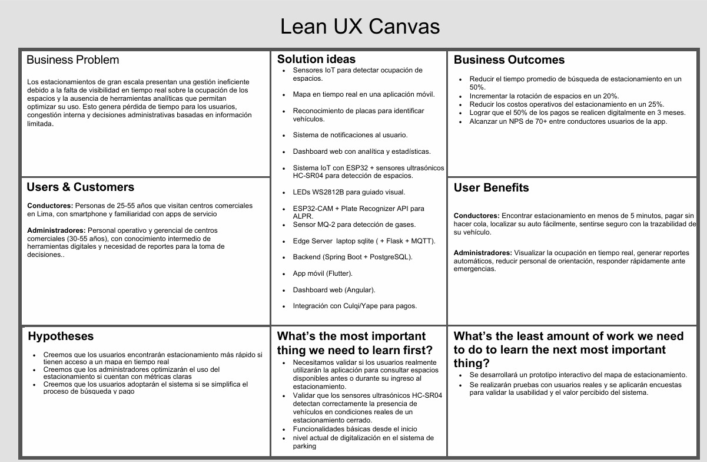

## 1.3. Segmentos objetivo.

En el desarrollo y despliegue de **SpotFinder**, hemos identificado dos grupos clave que se beneficiarán directamente de nuestra solución: los usuarios finales (conductores) y nuestros clientes corporativos (administradores).

#### Primer segmento Objetivo: Conductores que visitan centros comerciales

Los conductores constituyen el segmento principal de usuarios finales de SpotFinder. A nivel de infraestructura y adopción tecnológica, el mercado presenta un escenario ideal para la integración de la app:

> **Datos clave del mercado:**
> * Lima concentra aprox. **2.4 millones de vehículos** (68.6% del parque automotor nacional).
> * El parque automotor creció un **40%** en la última década, frente a un crecimiento vial de solo el **7%** (IPE y AAP).
> * El **93.2%** de los usuarios de internet en Lima Metropolitana accede a través de un smartphone (INEI, 2024).

Esta alta penetración móvil y la popularidad de billeteras digitales (como Yape y Plin) refuerzan la viabilidad de nuestra solución y sus pagos integrados.

##### Perfil del Usuario (Conductor)
* **Edad:** 25 a 55 años (mayor proporción de propietarios de vehículos y visitantes frecuentes).
* **Nivel Socioeconómico:** Segmentos A, B y C. *(Dato: El 70.1% del segmento A considera urgente incrementar la disponibilidad de estacionamientos).*
* **Necesidad Principal:** Encontrar espacio rápidamente, pagos sin fricciones, localización exacta del vehículo al regresar y seguridad/confianza durante su visita.
* **Adopción Tecnológica:** Alta familiaridad con apps de servicio (Yape, Rappi, Uber, Google Maps) y apertura hacia herramientas que simplifiquen su rutina diaria.

#### Segundo segmento objetivo: Administradores de Estacionamientos 

Este segmento engloba al personal operativo de los centros comerciales y a las empresas tercerizadas que gestionan la infraestructura. 

Actualmente, gran parte de los operadores en Perú (como Apparka, que lidera el mercado con ~300 estacionamientos) aún dependen de modelos semi-manuales: personal de orientación, tickets físicos y reportería artesanal. SpotFinder busca digitalizar y optimizar estas operaciones.

##### Perfil del Cliente (Administrador)
* **Edad:** 30 a 55 años (Personal operativo y gerencial).
* **Perfil Profesional:** Gerentes de operaciones, jefes de seguridad, coordinadores de mantenimiento y personal de TI. Formación técnica o universitaria en administración, ingeniería industrial o afines.
* **Necesidad Principal:** * Visibilidad en tiempo real de la ocupación.
  * Automatización del control de accesos.
  * Reducción de costos operativos (personal de orientación).
  * Generación de reportes analíticos para toma de decisiones.
  * Cumplimiento de protocolos de seguridad y emergencia.
* **Adopción Tecnológica:** Conocimiento intermedio/avanzado. Usuarios habituales de *dashboards*, ERPs y sistemas de gestión. Requieren interfaces visuales, intuitivas y accionables en web y tablets.

---

# Capítulo II: Requirements Elicitation & Analysis

## 2.1. Competidores.
### 2.1.1. Análisis competitivo
#### Competitive Analysis Landscape

| ¿Por qué llevar a cabo este análisis? | Evaluar el posicionamiento de SpotFinder frente a soluciones existentes de gestión de estacionamientos, identificar brechas en el mercado peruano y definir nuestro diferencial estratégico basado en tecnología IoT con detección por espacio individual, guiado visual y reconocimiento de placas. |
| :--- | :--- |

---

| | **SpotFinder (ParkSense)** | **Apparka (Los Portales)** | **ParkHelp** | **Quadra** |
| :--- | :--- | :--- | :--- | :--- |
| |  |  | 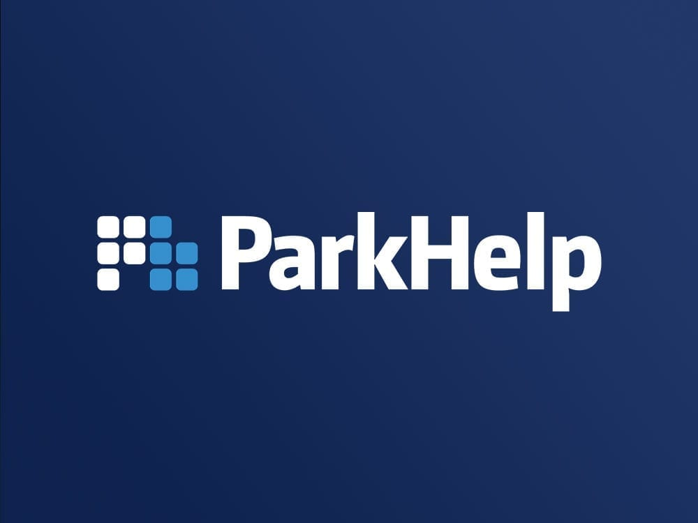 |  |
| **Perfil - Overview** | Sistema IoT integral para gestión inteligente de estacionamientos en centros comerciales, que combina sensores ultrasónicos por espacio, ALPR, guiado visual con LEDs, app móvil para conductores y dashboard analítico para administradores. | Operador líder de estacionamientos en Perú (~300 ubicaciones). Su app permite ubicar estacionamientos, ver disponibilidad general, pagar digitalmente y usar apertura automática de barreras por lectura de placas ("En Una"). | Líder global en sistemas de guiado de estacionamiento con más de 600,000 espacios monitoreados en 700+ ubicaciones en 50+ países. Ofrece sensores ultrasónicos, cámaras LPR, señalización digital y software ParkManager. | Marketplace peruano de estacionamientos peer-to-peer que permite a particulares alquilar sus cocheras privadas por horas. Usa IA para pricing dinámico y LPR para acceso. |
| **Ventaja competitiva** | Solución IoT integral de bajo costo diseñada para el mercado peruano, con detección por espacio individual, guiado visual, ALPR con soporte de placas peruanas e integración con pasarelas de pago locales (Yape, Culqi). | Red de estacionamientos más grande del Perú. Marca establecida con 60+ años de experiencia. App con funcionalidad "En Una" para ingreso/salida sin tickets. Presencia en aeropuertos a nivel nacional. | Tecnología madura con 20+ años de experiencia. Portfolio más amplio de sensores del mercado (ultrasónicos, cámara, wireless, LoRa, LTE-M). Software ParkManager con analytics avanzados. | Modelo innovador peer-to-peer que desbloquea inventario de estacionamiento no utilizado (cocheras privadas). Precio accesible por minuto. |
| **Perfil de Marketing** | | | | |
| **Mercado objetivo** | Centros comerciales medianos y grandes en Lima que buscan modernizar sus estacionamientos con IoT. Conductores que visitan estos centros comerciales. | Centros comerciales, aeropuertos, hospitales y edificios corporativos en Perú. Conductores que buscan estacionamiento en la red de Apparka. | Aeropuertos, centros comerciales, hospitales y universidades a nivel global. Operadores de estacionamiento y municipalidades. | Conductores en Lima que buscan cocheras privadas cerca de su destino. Propietarios de cocheras que desean generar ingresos extra. |
| **Estrategias de marketing** | Demostraciones piloto en centros comerciales, alianzas con operadores, marketing B2B a gerentes de operaciones, contenido técnico sobre IoT y smart parking. | Marketing masivo (TV, digital), alianzas con centros comerciales, presencia en aeropuertos, descarga gratuita de app. | Participación en ferias internacionales (ICSC, IPMI, EPICCA), partners regionales (AccessPark Colombia), cases studies y whitepapers técnicos. | Marketing digital en redes sociales, PR en medios de comunicación (El Comercio, Mercado Negro), alianzas con edificios y condominios. |
| **Perfil de Producto** | | | | |
| **Productos y servicios** | Sensores HC-SR04 por espacio, LEDs WS2812B de guiado, ESP32-CAM + Plate Recognizer para ALPR, sensor MQ-2 para emergencias, app móvil (Flutter), dashboard web (Angular), Edge Server (Flask + MQTT), backend (Spring Boot). | App móvil (iOS/Android) con buscador de estacionamientos, pago digital (tarjeta, Apparka Wallet), LPR para entrada/salida automática, gestión de abonados, integración con Google Maps/Waze. | Sensores U2 ultrasónicos indoor, sensores C2 con cámara LPR, sensores G4/G5 wireless outdoor, señalización digital, software ParkManager, iluminación LED inteligente. | App móvil para reservar cocheras por hora/semana/mes, mapa con cocheras disponibles, perfil de anfitrión con calificaciones, pago digital in-app, stickertag para acceso. |
| **Precios y costos** | Modelo SaaS por espacio monitoreado. Starter: hasta 200 espacios. Business: hasta 1,000 espacios + ALPR + analytics. Enterprise: 1,000+ espacios, solución completa con integraciones. (Precios por definir en validación). | Gratuita para conductores. El centro comercial/operador paga por la integración. Cobro por estacionamiento: S/ 5-20/hora según ubicación. Abonados mensuales disponibles. | Precios enterprise bajo cotización directa. Alto costo de implementación (hardware propietario + instalación + licencia de software). No disponible en modelo self-service. | Gratuita para conductores. Cobro de S/ 0.12/minuto. Los anfitriones reciben un porcentaje del alquiler. Modelo marketplace con comisión por transacción. |
| **Canales de distribución** | App móvil (iOS/Android), dashboard web, hardware IoT instalado en sitio. | App móvil (iOS/Android), presencia física en estacionamientos propios y operados. | Venta directa B2B, red de distribuidores certificados en 50+ países, partners regionales en LATAM. | App móvil (iOS/Android). |
| **Análisis SWOT** | | | | |
| **Fortalezas** | Solución IoT integral de bajo costo. Detección por espacio individual. ALPR con soporte de placas peruanas. Integración con Yape/Culqi. Guiado visual con LEDs. Dashboard analítico. | Red de 300+ estacionamientos. Marca consolidada. App funcional con 50,000+ usuarios. ALPR operativo en ubicaciones selectas. Presencia en aeropuertos nacionales. | Tecnología más madura del mercado (20+ años). Portfolio más amplio de sensores. 600,000+ espacios monitoreados. Presencia global en 50+ países. Software ParkManager robusto. | Modelo peer-to-peer innovador. Precio competitivo (S/ 0.12/min). Desbloquea inventario oculto de estacionamiento. Sin necesidad de infraestructura IoT propia. |
| **Debilidades** | Startup emergente sin track record comercial. Prototipo en desarrollo. Sin base de clientes instalada. Dependencia de WiFi para sensores. | No ofrece detección por espacio individual. Sin guiado visual interno. Disponibilidad mostrada es general (no por zona/nivel específico). App con reportes de crashes frecuentes. | Costo prohibitivo para el mercado peruano. Sin presencia directa en Perú. Implementación compleja que requiere integrador certificado. No cuenta con app para conductores consumer-facing. | No aplica a estacionamientos de centros comerciales. No tiene sensores IoT. Oferta limitada a cocheras privadas. Dependiente del inventario de anitrones. |
| **Oportunidades** | Mercado peruano sin solución IoT integral accesible. Creciente interés de centros comerciales en modernización. Alianzas con operadores como Apparka. Datos de BCR/IPE justifican inversión en smart parking. | Expansión tecnológica hacia detección por espacio. Integración con sistemas IoT de terceros. Expansión internacional (ya inició en Ecuador). | Entrada al mercado peruano vía partners locales. Modelo SaaS para mercados emergentes. Integración con apps locales de pago. | Expansión a estacionamientos comerciales. Alianza con centros comerciales para ofrecer cocheras cercanas como alternativa. |
| **Amenazas** | Entrada de ParkHelp u otros players globales al mercado peruano. Que Apparka desarrolle su propia solución IoT integral. Resistencia al cambio de operadores tradicionales. | Competencia de startups tecnológicas con soluciones IoT más avanzadas. Disrución por modelos peer-to-peer como Quadra. | Competidores locales con soluciones más baratas y adaptadas. Barreras arancelarias para hardware importado. | Regulación de estacionamientos informales. Desconfianza de usuarios en dejar su auto en cocheras privadas. |

### 2.1.2. Estrategias y tácticas frente a competidores

Para competir eficazmente en el mercado de soluciones de gestión inteligente de estacionamientos, ParkSense aplicará las siguientes estrategias y tácticas preliminares:

#### **1. Diferenciación por integración IoT completa a bajo costo**
* **Estrategia:** Posicionar a SpotFinder como la única solución en el mercado peruano que ofrece detección por espacio individual con guiado visual LED, ALPR y analytics en un solo paquete accesible, frente a Apparka (que no tiene detección por espacio) y ParkHelp (cuyo costo es prohibitivo para el mercado local).
* **Tácticas:**  Desarrollar un prototipo funcional con componentes de bajo costo que demuestre ROI medible. 
    * Ofrecer implementación progresiva comenzando con una zona piloto de 50-100 espacios para reducir la barrera de entrada.

#### **2. Alianzas estratégicas con operadores existentes**
* **Estrategia:** En lugar de competir directamente con Apparka por la operación de estacionamientos, posicionar a SpotFinder como un complemento tecnológico que potencia la oferta del operador existente.
* **Tácticas:**  Proponer integraciones API con el ecosistema de Apparka. 
    * Demostrar cómo la detección por espacio individual puede mejorar la experiencia "En Una" de Apparka añadiendo guiado visual hacia el espacio específico. 
    * Ofrecer un modelo *white-label* para que operadores comercialicen la solución bajo su propia marca.

#### **3. Experiencia del conductor como ventaja competitiva**
* **Estrategia:** Aprovechar que ParkHelp no ofrece una app *consumer-facing* y que la app de Apparka tiene reportes de crashes, para posicionar SpotFinder como la app de estacionamiento con la mejor experiencia de usuario para conductores en Lima.
* **Tácticas:**  Diseñar la app con UX enfocada en contexto de conducción (pantallas grandes, acciones mínimas, modo mapa). 
    * Integrar con Yape y Culqi (que Apparka no ofrece como método de pago nativo). 
    * Implementar función "Encuentra tu auto" con ubicación exacta del espacio.

#### **4. Modelo de datos como diferenciador frente a Quadra**
* **Estrategia:** Mientras Quadra resuelve el problema de estacionamiento público en calles con un modelo *peer-to-peer*, **SpotFinder** se diferencia atacando el segmento de centros comerciales con inteligencia basada en datos IoT de sensores propios.
* **Tácticas:** * Ofrecer dashboard con métricas que Quadra no puede proveer (tasa de rotación por espacio, heatmaps de ocupación, predicción de demanda). 
    * Generar reportes de impacto ambiental (CO₂ ahorrado por reducción de tiempo de búsqueda) como argumento de responsabilidad social para centros comerciales.

#### **5. Seguridad y respuesta a emergencias como valor agregado**
* **Estrategia:** Ninguno de los tres competidores ofrece detección de gases/humo integrada al sistema de estacionamiento. Esta funcionalidad diferenciadora responde a una preocupación real de los centros comerciales.
* **Tácticas:** * Implementar sensores MQ-2 conectados al mismo ecosistema IoT. 
    * Configurar protocolos automatizados: alerta a administradores, activación de señalización de evacuación vía LEDs, apertura automática de barreras.

## 2.2. Entrevistas.
En esta sección se aborda la investigación cualitativa realizada mediante entrevistas a representantes de los dos segmentos objetivo del proyecto: conductores que visitan centros comerciales y administradores de estacionamientos. El objetivo es comprender las herramientas, procesos y problemáticas actuales en la gestión de estacionamientos, así como validar las funcionalidades propuestas para SpotFinder.
### 2.2.1. Diseño de entrevistas.
Para diseñar las entrevistas, se elaboraron dos bloques de preguntas diferenciados según el segmento objetivo. Las preguntas buscan obtener tanto información objetiva (frecuencia de uso, herramientas actuales, tiempos) como información subjetiva (percepciones, frustraciones y expectativas). Se incluyen también preguntas para recolectar datos demográficos necesarios para construir los User Personas.

---

### Segmento 1: Conductores que visitan centros comerciales

#### **Datos demográficos (para construcción de arquetipos)**
* ¿Cuál es su nombre, edad y distrito de residencia?
* ¿A qué se dedica profesionalmente?
* ¿Qué tipo de vehículo conduce (auto, camioneta, moto)?
* ¿Qué marca de smartphone utiliza? ¿Con qué sistema operativo (Android/iOS)?
* ¿Qué aplicaciones de servicio usa frecuentemente en su día a día (Yape, Rappi, Uber, Waze, Google Maps, etc.)?

#### **Preguntas sobre la problemática**
* ¿Con qué frecuencia visita centros comerciales en Lima? ¿Cuáles visita más a menudo?
* Cuando va a un centro comercial, ¿cuánto tiempo aproximado le toma encontrar un espacio de estacionamiento?
* ¿Ha experimentado situaciones donde baje a un nivel del estacionamiento solo para descubrir que está lleno? ¿Con qué frecuencia le ocurre?
* ¿Cómo decide en qué zona o nivel del estacionamiento buscar? ¿Sigue alguna estrategia o es aleatorio?
* ¿Alguna vez ha olvidado dónde estacionó su auto dentro de un centro comercial? ¿Cómo lo resolvió?
* ¿Cómo paga actualmente el estacionamiento? ¿Usa ticket físico, app, efectivo? ¿Qué tan satisfecho está con ese proceso?
* ¿Ha tenido algún incidente de seguridad con su vehículo en un estacionamiento (robo de accesorios, rayones, etc.)?
* ¿Qué es lo que más le frustra de la experiencia de estacionamiento en centros comerciales?
* En una escala del 1 al 10, ¿qué tan satisfecho está con la experiencia actual de estacionamiento en los centros comerciales que visita?

#### **Preguntas sobre la solución**
* Si existiera una app que le mostrara en tiempo real los espacios disponibles por zona y nivel antes de entrar al estacionamiento, ¿la usaría? ¿Qué tan útil le parece?
* ¿Qué tan valioso sería para usted que luces LED (verde/rojo) sobre cada espacio le indicaran visualmente dónde hay lugares libres?
* ¿Le interesaría poder reservar un espacio de estacionamiento con anticipación desde su celular?
* Si pudiera pagar el estacionamiento directamente desde su celular con Yape o tarjeta, sin hacer cola en una cabina, ¿lo haría?
* ¿Qué tan importante sería recibir una notificación si se detecta algún movimiento inusual cerca de su vehículo?
* ¿Qué funcionalidad le parecería más valiosa: ver disponibilidad en tiempo real, reservar espacio, pagar desde el celular o localizar su auto al regresar?
* ¿Estaría dispuesto a descargar y usar una nueva app si mejora significativamente su experiencia de estacionamiento?

---

### Segmento 2: Administradores de estacionamientos de centros comerciales

#### **Datos demográficos (para construcción de arquetipos)**
* ¿Cuál es su nombre, edad y cargo actual?
* ¿Cuántos años de experiencia tiene en la gestión de estacionamientos o en operaciones de centros comerciales?
* ¿Cuántos espacios de estacionamiento gestiona actualmente? ¿Cuántos niveles tiene el estacionamiento?
* ¿Qué herramientas digitales utiliza en su trabajo diario (Excel, software de gestión, email, etc.)?

#### **Preguntas sobre la problemática**
* ¿Cómo gestionan actualmente la ocupación del estacionamiento? ¿Utilizan algún sistema automatizado o es manual?
* ¿Tienen visibilidad en tiempo real de cuántos espacios están ocupados y cuántos libres? ¿A nivel general o por zona/nivel?
* ¿Cuántas personas de su equipo se dedican a orientar el tráfico vehicular dentro del estacionamiento?
* ¿Qué problemas enfrentan con más frecuencia en la gestión diaria del estacionamiento?
* ¿Tienen acceso a estadísticas de uso como tasa de ocupación, rotación de espacios, horas punta o ingresos por espacio?
* ¿Cómo manejan el proceso de cobro actualmente? ¿Qué tan eficiente es?
* ¿Han tenido situaciones de emergencia (sismo, incendio, fuga de gas) en el estacionamiento? ¿Cómo fue la evacuación? ¿Qué protocolos tienen?
* ¿Cuáles son los principales costos operativos asociados al estacionamiento?
* ¿Han recibido quejas de clientes respecto a la experiencia de estacionamiento? ¿Cuáles son las más frecuentes?

#### **Preguntas sobre la solución**
* ¿Qué tan valioso sería para ustedes contar con un dashboard que muestre la ocupación en tiempo real de cada espacio del estacionamiento?
* ¿Les interesaría un sistema que genere reportes automáticos de ocupación, rotación e ingresos?
* ¿Considerarían implementar un sistema de guiado visual con LEDs que dirija a los conductores hacia espacios disponibles?
* ¿Qué tan importante es para ustedes que el sistema de control de acceso reconozca automáticamente las placas vehiculares?
* Si un sistema pudiera detectar gases o humo y activar automáticamente protocolos de emergencia (abrir barreras, cambiar LEDs a modo evacuación), ¿lo considerarían un valor agregado significativo?
* ¿Qué funcionalidad priorizarían: detección de disponibilidad por espacio, ALPR en barreras, pago digital, analytics o seguridad?
* ¿Estarían dispuestos a implementar una solución IoT si se demuestra un retorno de inversión medible en reducción de costos y mejora de satisfacción del cliente?
* ¿Qué presupuesto aproximado manejan o manejarían para modernizar el sistema de estacionamiento?
### 2.2.2. Registro de entrevistas

## Segmento Objetivo 1

#### **Entrevista 1**
| Atributo | **Datos Personales** |
| :--- | :--- |
| **Nombres** | Maria Fernanda |
| **Apellidos** | Esteban Román |
| **Distrito** | Surco |
| **Edad** | 21 años |
| **Fecha de entrevista** | 11/04/2026 |
| **Timing**              | 00:00-03:05 |
| **Enlace** | [🔗 Ver grabación de la entrevista](https://1drv.ms/v/c/e7943890401aebc7/IQCsVfJnUhn9RJWEkmDyCX2pAQnBlD9IkX-cMPJdZnQzPF0?e=uymIhe) |

**Evidencia**

**Resumen**
Estudiante universitaria que visita centros comerciales como el Jockey Plaza dos veces por semana. Su principal frustración es la pérdida de tiempo (15-20 minutos) buscando estacionamiento y la falta de información real sobre la disponibilidad en los sótanos. Usuario activo de herramientas tecnológicas como Waze y Yape, considera que un sistema de guiado por luces LED y una app con disponibilidad en tiempo real serían determinantes para mejorar su experiencia y reducir el estrés.

---

#### **Entrevista 2**
|Atributo | **Datos Personales** |
| :--- | :--- |
| **Nombres** | Freddy Carlos |
| **Apellidos** | Alvarez |
| **Distrito** | Miraflores |
| **Edad** | 22 años |
| **Fecha de entrevista** | 11/04/2026 |
| **Timing**              | 03:05-05:38 |
| **Enlace** | [🔗 Ver grabación de la entrevista](https://1drv.ms/v/c/e7943890401aebc7/IQCsVfJnUhn9RJWEkmDyCX2pAQnBlD9IkX-cMPJdZnQzPF0?e=uymIhe) |

**Evidencia**

  
**Resumen**
Usuario frecuente de estacionamientos en centros comerciales que prioriza la seguridad y la eficiencia en el pago. Reporta una alta frustración debido a las largas colas en los cajeros físicos y la dificultad de encontrar espacios en temporadas altas. Valora positivamente la automatización mediante el reconocimiento de placas vehiculares (ALPR) y la posibilidad de realizar pagos digitales a través de la app, lo cual considera una solución necesaria para modernizar el servicio actual.

---

#### **Entrevista 3**
| Atributo | **Datos Personales** |
| :--- | :--- |
| **Nombres** | Diego Ignacio |
| **Apellidos** | Ricra Falla |
| **Distrito** | San Borja |
| **Edad** | 24 años |
| **Fecha de entrevista** | 11/04/2026 |
| **Timing**              | 05:38-09:32|
| **Enlace** | [🔗 Ver grabación de la entrevista](https://1drv.ms/v/c/e7943890401aebc7/IQCsVfJnUhn9RJWEkmDyCX2pAQnBlD9IkX-cMPJdZnQzPF0?e=uymIhe) |

**Evidencia**

**Resumen**
Estudiante  joven que utiliza el vehículo para movilizarse a reuniones y recados, visitando malls hasta tres veces por semana. Su mayor problema es la desorientación dentro del estacionamiento (olvida la ubicación del vehículo) y la falta de métodos de pago prácticos cuando no cuenta con efectivo. [Se muestra muy interesado en las funciones de reserva de espacios con anticipación y en recibir notificaciones de seguridad en su smartphone para mayor tranquilidad durante su estancia.

## Segmento Objetivo 2

**Segmento Administradores de estacionamientos: Entrevistado 1**

| Atributo                | Detalle |
|-------------------------|--------|
| **Nombre**              | Fabian Oliva |
| **Edad**                | 26 |
| **Sexo**                | Masculino |
| **Distrito**            | Surquillo |
| **Ocupación**           | Administrador de estacionamiento (Mall Plaza Angamos) |
| **Fecha de entrevista** | 11/04/2026 |
| **Timing**              | 09:32-12:51|
| **Video**               | [Ver entrevista](https://1drv.ms/v/c/e7943890401aebc7/IQCsVfJnUhn9RJWEkmDyCX2pAQnBlD9IkX-cMPJdZnQzPF0?e=uymIhe) |
| **Captura**             |  |
| **Resumen**             | Fabian gestiona un estacionamiento de aproximadamente 850 espacios distribuidos en 5 niveles. Actualmente, la operación depende en gran medida de procesos manuales y herramientas básicas como Excel y sistemas de tickets, lo que limita la precisión y visibilidad en tiempo real. Enfrenta problemas de congestión en horas pico, dificultad de los usuarios para encontrar espacios y dependencia del personal para orientar el tráfico. No cuenta con analítica avanzada ni reportes automatizados. El sistema de cobro es parcialmente eficiente, pero presenta demoras. Considera valioso implementar soluciones como dashboards en tiempo real, guiado con LEDs, reconocimiento de placas (ALPR) y sistemas de seguridad automatizados. Está dispuesto a invertir si se demuestra un retorno claro. |

---

**Segmento Administradores de estacionamientos: Entrevistado 2**

| Atributo                | Detalle |
|-------------------------|--------|
| **Nombre**              | Nicole Requena Saiwa |
| **Edad**                | 28 |
| **Sexo**                | Femenino |
| **Distrito**            | Yanahuara, Arequipa |
| **Ocupación**           | Administradora de Operaciones de Estacionamiento |
| **Fecha de entrevista** | 9/04/2026 |
| **Timing**              | 12:51	19:36|
| **Video**               | [Ver entrevista](https://1drv.ms/v/c/e7943890401aebc7/IQCsVfJnUhn9RJWEkmDyCX2pAQnBlD9IkX-cMPJdZnQzPF0?e=uymIhe) |
| **Captura**             |  |
| **Resumen**             | Administradora con aproximadamente 7 a 8 años de experiencia en la gestión de estacionamientos. Supervisa operaciones en espacios que superan los mil estacionamientos distribuidos en varios niveles. Actualmente, la gestión es mixta: cuenta con sistemas de conteo en entradas y salidas, pero el control interno sigue siendo mayormente manual, lo que limita la visibilidad en tiempo real por zonas específicas.\n\nEnfrenta problemas frecuentes como congestión en horas pico, dificultad de los conductores para encontrar espacios, desorden en momentos de alta demanda y reclamos constantes de los usuarios. No cuenta con estadísticas detalladas ni herramientas avanzadas de análisis, lo que dificulta la toma de decisiones.\n\nEl proceso de cobro se realiza mediante tickets físicos, generando colas y demoras en horas de alta afluencia. En situaciones de emergencia, la evacuación depende principalmente del personal, ya que no existe un sistema automatizado de guía.\n\nConsidera muy valiosas soluciones tecnológicas como dashboards en tiempo real, reportes automáticos, guiado visual con LEDs y reconocimiento de placas (ALPR), destacando especialmente su impacto en la eficiencia operativa y experiencia del cliente. Está dispuesta a implementar una solución IoT siempre que se demuestre un retorno claro, con un presupuesto estimado entre 20,000 y 50,000 dólares. |

---

**Segmento Administradores de estacionamientos: Entrevistado 3**

| Atributo                | Detalle |
|-------------------------|--------|
| **Nombre**              | Carlos Ramírez |
| **Edad**                | 42 |
| **Sexo**                | Masculino |
| **Distrito**            |  Surco  |
| **Ocupación**           | Jefe de Operaciones de Estacionamiento |
| **Fecha de entrevista** |  12/04/2026  |
| **Timing**              | 19:36-22:56 |
| **Video**               | [Ver entrevista]() |
| **Captura**             |  |
| **Resumen**             | Jefe de operaciones con aproximadamente 12 años de experiencia en la gestión de estacionamientos y flujo vehicular en centros comerciales. Actualmente administra cerca de 850 espacios distribuidos en tres niveles, utilizando herramientas básicas como Excel, sistemas de tickets y correo electrónico para la gestión diaria.\n\nEl control de ocupación es parcialmente manual, apoyado por sensores en accesos, pero sin visibilidad en tiempo real de los espacios disponibles a nivel interno. Esto genera dependencia del personal (entre 4 y 6 personas en horas punta) para la orientación del tráfico.\n\nEntre los principales problemas destacan la congestión interna, dificultad de los usuarios para encontrar espacios, mala distribución del flujo vehicular y quejas frecuentes en horas pico. Además, la falta de estadísticas detalladas limita la toma de decisiones estratégicas.\n\nEl sistema de cobro se basa en tickets físicos y cajeros automáticos, lo que genera colas en momentos de alta demanda. En situaciones de emergencia, la evacuación depende principalmente del personal, sin sistemas automatizados de apoyo.\n\nValora altamente soluciones tecnológicas como dashboards en tiempo real, reportes automáticos, guiado visual con LEDs y reconocimiento de placas (ALPR), priorizando especialmente la disponibilidad por espacio y la automatización del ingreso y salida. También considera relevante la implementación de sistemas de detección de gases o humo.\n\nEstá dispuesto a implementar una solución IoT siempre que exista un retorno de inversión claro, estimando un presupuesto inicial entre 20,000 y 50,000 dólares. |

---

### 2.2.3. Análisis de entrevistas

Se realizaron un total de **6 entrevistas** distribuidas entre los dos segmentos objetivo del proyecto: 3 entrevistas a conductores que visitan centros comerciales (Segmento 1) y 3 entrevistas a administradores de estacionamientos (Segmento 2). Las entrevistas se llevaron a cabo entre el 9 y 12 de abril de 2026, utilizando el diseño de preguntas definido en la sección 2.2.1.

## Segmento 1: Conductores que visitan centros comerciales

### Perfil demográfico

Los tres entrevistados son jóvenes entre 21 y 24 años, residentes de distritos de Lima con alta densidad de centros comerciales (Surco, Miraflores, San Borja). Son estudiantes universitarios con uso intensivo de tecnología móvil. Utilizan aplicaciones de servicio como Yape, Waze y Google Maps de forma cotidiana, lo que indica una alta predisposición a adoptar nuevas herramientas digitales para resolver problemas de movilidad.
 
### Hallazgos sobre la problemática
 
**Tiempo de búsqueda de estacionamiento:** Los tres entrevistados coinciden en que la búsqueda de estacionamiento representa una fuente significativa de frustración. María Fernanda reporta entre 15 y 20 minutos de búsqueda en el Jockey Plaza, mientras que Diego Ignacio indica que visita centros comerciales hasta tres veces por semana y frecuentemente baja a niveles de estacionamiento solo para encontrarlos llenos. Esto confirma el dato estadístico citado en el Capítulo I sobre los conductores limeños perdiendo en promedio 5 horas semanales buscando estacionamiento.
 
**Desorientación dentro del estacionamiento:** Diego Ignacio destacó como problema principal que olvida dónde estacionó su vehículo y no tiene herramientas para localizarlo. Este hallazgo valida directamente la funcionalidad "Find My Car" (US07) como un diferenciador de alto valor percibido para los conductores.
 
**Métodos de pago insatisfactorios:** Freddy Alvarez expresó una alta frustración con las largas colas en los cajeros físicos de pago y la dificultad cuando no cuenta con efectivo. Este dolor confirma la necesidad del pago digital integrado (US05) como funcionalidad core. La familiaridad de los tres entrevistados con Yape refuerza la decisión de integrar Culqi como pasarela de pagos con soporte para Yape.
 
**Seguridad vehicular:** Freddy Alvarez prioriza la seguridad del vehículo y valora la trazabilidad que ofrece el reconocimiento de placas (ALPR). Aunque ninguno reportó incidentes graves, la preocupación por la seguridad es un tema recurrente que justifica las notificaciones de eventos del vehículo (US10).
 
### Hallazgos sobre la solución propuesta
 
**Funcionalidades más valoradas (por orden de mención):**
 
1. **Disponibilidad en tiempo real** — Los tres entrevistados la consideran la funcionalidad más valiosa. María Fernanda indicó que un mapa en tiempo real con LEDs sería "determinante" para mejorar su experiencia.
2. **Pago digital** — Freddy Alvarez lo considera una "solución necesaria para modernizar el servicio actual". Los tres están dispuestos a pagar desde el celular si esto elimina las colas.
3. **Reserva de espacios** — Diego Ignacio mostró alto interés en poder reservar con anticipación, especialmente en temporadas de alta demanda. Esta funcionalidad está vinculada al plan Pro (S/ 9.90/mes).
4. **Localización del vehículo (Find My Car)** — Diego Ignacio la señaló como una necesidad directa basada en su experiencia de desorientación.
5. **Notificaciones de seguridad** — Valorada por los tres pero no como primera prioridad. Diego Ignacio mencionó que le daría "mayor tranquilidad durante su estancia".
**Disposición a adoptar la app:** Los tres entrevistados indicaron que descargarían y usarían una nueva app si mejora significativamente su experiencia de estacionamiento, confirmando la viabilidad de la adopción del producto.
 
### Hallazgos clave para el diseño
 
Los conductores priorizan la inmediatez y la simplicidad. La interfaz debe mostrar la disponibilidad de forma clara y rápida, con mínima interacción necesaria (pantallas grandes, acciones en máximo 2 taps). La integración con Yape es crítica para la adopción en el mercado peruano. La funcionalidad de LEDs (verde/rojo) fue mencionada positivamente por María Fernanda como un complemento visual que reduce la incertidumbre sin depender del celular.
 
---
 
## Segmento 2: Administradores de estacionamientos
 
### Perfil demográfico
 
Los tres entrevistados tienen perfiles profesionales complementarios: Fabián Oliva (26 años, administrador en Mall Plaza Angamos), Nicole Requena (28 años, administradora de operaciones con 7-8 años de experiencia en Arequipa) y Carlos Ramírez (42 años, jefe de operaciones con 12 años de experiencia en Surco). Entre los tres gestionan estacionamientos de entre 850 y más de 1,000 espacios distribuidos en 3 a 5 niveles, lo que representa el perfil exacto de centros comerciales medianos y grandes que SpotFinder busca atender.
 
### Hallazgos sobre la problemática
 
**Gestión predominantemente manual:** Los tres entrevistados reportan una dependencia significativa de procesos manuales. Fabián utiliza Excel y sistemas de tickets, Nicole cuenta con sensores en accesos pero sin visibilidad interna por zonas, y Carlos usa tickets físicos y cajeros automáticos. Ninguno tiene detección de disponibilidad a nivel de espacio individual, confirmando el gap de mercado identificado en el análisis competitivo.
 
**Falta de visibilidad en tiempo real:** Los tres coinciden en que no tienen acceso a información en tiempo real sobre la ocupación por zona o nivel dentro del estacionamiento. Nicole mencionó que el control interno es "mayormente manual", lo que limita la toma de decisiones operativas. Carlos indicó que depende de 4 a 6 personas en horas punta solo para orientar el tráfico vehicular, representando un costo operativo significativo.
 
**Congestión en horas pico:** Es el problema más citado por los tres administradores. La falta de guiado inteligente genera cuellos de botella en rampas y accesos. Carlos reportó "mala distribución del flujo vehicular" como una queja frecuente de los usuarios.
 
**Ausencia de analítica:** Ninguno de los tres tiene acceso a estadísticas detalladas de ocupación, rotación o ingresos por espacio. Fabián indicó que no cuenta con "analítica avanzada ni reportes automatizados". Esta carencia valida el bounded context de Analytics & Reporting y las user stories US12 y US13.
 
**Cobro ineficiente:** Los tres reportan que el sistema de cobro basado en tickets físicos genera colas y demoras, especialmente en horas de alta afluencia. Nicole mencionó que las "colas y demoras en horas de alta afluencia" son un reclamo constante de los usuarios.
 
**Protocolos de emergencia manuales:** Los tres indican que la evacuación en emergencias depende exclusivamente del personal humano, sin sistemas automatizados de apoyo. Este hallazgo valida directamente el bounded context de Emergency & Safety (US14) como diferenciador competitivo, ya que ningún competidor ofrece esta funcionalidad.
 
### Hallazgos sobre la solución propuesta
 
**Funcionalidades priorizadas (por orden de valoración):**
 
1. **Dashboard en tiempo real** — Valorado como "muy valioso" por los tres administradores. La capacidad de ver la ocupación de cada espacio en tiempo real transformaría su capacidad operativa.
2. **Reconocimiento de placas (ALPR)** — Carlos lo priorizó especialmente para automatizar ingreso y salida, eliminando tickets físicos y reduciendo colas. Nicole también lo destacó por su impacto en la eficiencia operativa.
3. **Guiado visual con LEDs** — Los tres lo consideran un complemento valioso que reduciría la necesidad de personal de orientación (actualmente 4-6 personas en horas punta).
4. **Reportes automáticos** — Valorados por su impacto en la toma de decisiones. Fabián mencionó que actualmente no tiene forma de generar reportes de ocupación o ingresos de forma automatizada.
5. **Detección de gases/humo** — Carlos lo consideró "relevante" y Nicole lo destacó por su potencial de salvar vidas. Los tres lo ven como un valor agregado significativo diferenciador.
**Presupuesto y disposición a invertir:** Nicole y Carlos coinciden en un presupuesto estimado de USD 20,000 a 50,000 para modernizar sus estacionamientos, condicionado a demostrar un retorno de inversión claro. Fabián indicó que "está dispuesto a invertir si se demuestra un retorno claro". Esto valida la viabilidad económica del modelo B2B de SpotFinder y sugiere que el modelo de implementación progresiva (zona piloto) es la estrategia correcta para reducir la barrera de entrada.
 
### Hallazgos clave para el diseño
 
Los administradores necesitan un dashboard visualmente claro, con métricas accionables y alertas automáticas. La interfaz debe priorizar la visión general del estacionamiento con drill-down por zona/nivel. Los reportes deben ser exportables en PDF para presentar a gerencia. La implementación debe poder hacerse de forma progresiva (empezar con una zona piloto de 50-100 espacios) para demostrar ROI antes de escalar.
 
---
 
## Análisis cruzado: Patrones y convergencias entre segmentos
 
### Convergencias identificadas
 
1. **La frustración con la búsqueda de estacionamiento es universal.** Tanto conductores como administradores reconocen el problema: los conductores lo sufren directamente (15-20 min de búsqueda) y los administradores lo enfrentan como reclamos constantes y congestión operativa.
2. **El pago digital es una necesidad compartida.** Los conductores quieren eliminar colas y los administradores quieren agilizar el proceso de salida. La integración con Yape es el puente natural para el mercado peruano.
3. **La seguridad es un diferenciador clave.** Tanto conductores (tranquilidad sobre su vehículo) como administradores (protocolos de emergencia automatizados) valoran las funcionalidades de seguridad. El sistema de detección de gas/humo con evacuación automática no tiene equivalente en el mercado peruano.
4. **La información en tiempo real es el core del valor.** Los conductores quieren ver espacios disponibles antes de bajar a un nivel. Los administradores quieren ver la ocupación completa desde su oficina. Ambos necesitan que los datos se actualicen en menos de 3 segundos.
### Validación de hipótesis del Lean UX
 
| Hipótesis | Validación por entrevistas |
|---|---|
| H1: 60% de conductores usarán la app activamente | **Validada.** Los 3 conductores indicaron disposición a descargar y usar la app. La familiaridad con apps como Yape y Waze facilita la adopción. |
| H2: ALPR reducirá tiempo de procesamiento en barrera de 30-45s a < 5s | **Validada indirectamente.** Los administradores confirman que los tickets físicos generan demoras significativas y priorizan el ALPR como solución. |
| H3: LEDs reducirán congestión interna en 40% | **Validada cualitativamente.** Los 3 administradores confirman que la falta de guiado genera congestión. María Fernanda (conductora) calificó los LEDs como "determinantes". |
| H4: 80% de administradores consultarán el dashboard diariamente | **Validada.** Los 3 administradores lo consideran "muy valioso" y actualmente carecen de herramientas equivalentes. |
| H5: 50% de pagos serán digitales en 3 meses | **Validada parcialmente.** Los conductores muestran alta disposición pero la adopción dependerá de la facilidad de uso y la integración con Yape. |
 
### Funcionalidades no consideradas inicialmente (descubiertas en entrevistas)
 
1. **Indicadores de zonas llenas antes de bajar al nivel** — María Fernanda mencionó la frustración de bajar a un nivel solo para encontrarlo lleno. Esto refuerza la necesidad de mostrar la disponibilidad por nivel/zona en la app antes de que el conductor tome la decisión de bajar.
2. **Reducción medible de personal de orientación** — Carlos mencionó que emplea 4-6 personas solo para orientar tráfico. El guiado con LEDs podría reducir este personal a 1-2 personas, generando un ROI directo y cuantificable para la presentación comercial.
3. **Integración con protocolos de emergencia existentes** — Nicole mencionó que la evacuación depende del personal actual. El sistema de emergencia debería complementar (no reemplazar) los protocolos existentes del centro comercial.

## Conclusiones del análisis
 
Las entrevistas confirman que SpotFinder aborda un problema real y reconocido por ambos segmentos objetivo. Los conductores valoran principalmente la reducción del tiempo de búsqueda y el pago digital, mientras que los administradores priorizan la visibilidad en tiempo real y la automatización de procesos manuales.
 
El modelo de negocio B2B con presupuestos de USD 20,000-50,000 es viable según las entrevistas con administradores. La estrategia de implementación progresiva (zona piloto) se confirma como el enfoque correcto para superar la resistencia al cambio.
 
El diferenciador competitivo más fuerte de SpotFinder, validado por ambos segmentos, es la combinación de detección por espacio individual con guiado visual LED, ALPR para entrada/salida sin tickets, y detección de emergencias con protocolo automatizado. Ningún competidor en el mercado peruano ofrece esta integración completa.
 

## 2.3. Needfinding

En la siguiente sección, analizaremos a nuestros segmentos objetivos para identificar sus necesidades y de acuerdo a ello ofrecer una solución óptima a sus problemas.

### 2.3.1. User Personas
**Segmento 1: Conductores que visitan centros comerciales**

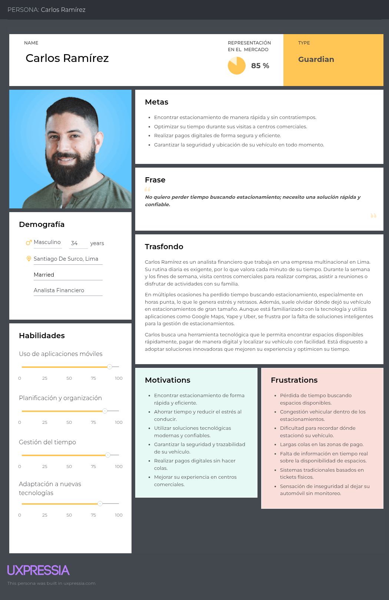
      

**Segmento 2: Administradores de estacionamientos de centros comerciales**

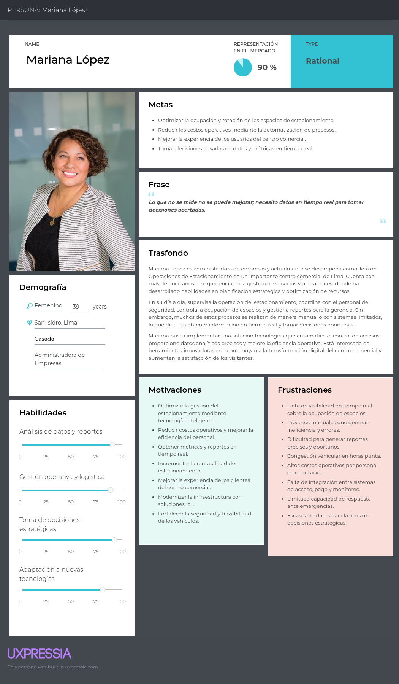

### 2.3.2. User Task Matrix

Esta sección presenta las tareas que realizan los segmentos objetivo para cumplir sus objetivos dentro del contexto de los estacionamientos en centros comerciales. Las tareas identificadas se basan en el análisis de los User Personas y reflejan la situación actual del mercado. Cada tarea se evalúa según su Frecuencia e Importancia, utilizando las categorías Alta, Media y Baja.

**Segmento 1: Conductores que visitan centros comerciales**

| **Task Matrix**                                                     | **Frecuencia** | **Importancia** |
| ------------------------------------------------------------------- | -------------- | --------------- |
| Supervisar la ocupación de los espacios de estacionamiento          | Alta           | Alta            |
| Coordinar el ingreso y salida de vehículos                          | Alta           | Alta            |
| Gestionar al personal de seguridad y orientación                    | Alta           | Alta            |
| Controlar el uso de tickets y sistemas de cobro                     | Alta           | Alta            |
| Generar reportes de ingresos y ocupación                            | Alta           | Alta            |
| Establecer y actualizar tarifas del estacionamiento                 | Media          | Alta            |
| Supervisar la infraestructura y el mantenimiento de equipos         | Media          | Alta            |
| Resolver incidencias operativas y reclamos de usuarios              | Alta           | Alta            |
| Monitorear la congestión vehicular en horas punta                   | Alta           | Alta            |
| Registrar datos operativos en hojas de cálculo o sistemas básicos   | Media          | Alta            |
| Coordinar con proveedores de tecnología y mantenimiento             | Media          | Media           |
| Implementar mejoras para optimizar la operación del estacionamiento | Media          | Alta            |
| Garantizar el cumplimiento de protocolos de seguridad y emergencia  | Alta           | Alta            |
| Analizar estadísticas para la toma de decisiones estratégicas       | Media          | Alta            |
| Evaluar e implementar nuevas soluciones tecnológicas                | Baja           | Alta            |

 

**Segmento 2: Administradores de estacionamientos de centros comerciales**

| **Task Matrix**                                                              | **Frecuencia** | **Importancia** |
| ---------------------------------------------------------------------------- | -------------- | --------------- |
| Coordinar y asignar rutas a los camiones                                     | Alta           | Alta            |
| Cotizar precios y responder solicitudes de transporte                        | Alta           | Alta            |
| Gestionar la documentación de envío (guías de remisión, contratos, facturas) | Alta           | Alta            |
| Supervisar el estado y mantenimiento de los camiones                         | Media          | Alta            |
| Contactar y negociar con nuevos clientes                                     | Alta           | Alta            |
| Hacer seguimiento del transporte y ubicación de las unidades en tiempo real  | Alta           | Alta            |
| Controlar pagos, ingresos y liquidaciones con clientes y transportistas      | Alta           | Alta            |
| Publicar y responder mensajes en Facebook, WhatsApp y otras plataformas      | Alta           | Media           |
| Registrar datos de viajes, pagos y clientes en hojas de cálculo o cuadernos  | Media          | Alta            |
| Capacitarse en nuevas herramientas tecnológicas para optimizar procesos      | Baja           | Alta            |

#### Análisis de la User Task Matrix

##### Tareas más críticas

- Conductores:
    - Buscar espacios disponibles.
    - Estacionar el vehículo.
    - Realizar pagos y salir del estacionamiento.
    - Recordar la ubicación del automóvil.

- Administradores:
    - Supervisar la ocupación del estacionamiento.
    - Controlar accesos e ingresos.
    - Generar reportes operativos.
    - Gestionar incidencias y garantizar la seguridad.

##### Principales diferencias

| Conductores                                                                     | Administradores                                                   |
| ------------------------------------------------------------------------------- | ----------------------------------------------------------------- |
| Se enfocan en encontrar estacionamiento rápidamente y pagar sin complicaciones. | Se enfocan en optimizar la operación y maximizar la rentabilidad. |
| Buscan comodidad y ahorro de tiempo.                                            | Buscan eficiencia operativa y control estratégico.                |
| Interactúan directamente con la infraestructura física.                         | Supervisan y gestionan el sistema en su totalidad.                |

### 2.3.3. User Journey Mapping

A continuación presentamos los User Journey Map que describen las experiencias actuales de nuestros segmentos objetivos. Se presenta el recorrido end-to-end desde la necesidad de visitar el establecimiento hasta la salida del estacionamiento. Este análisis permite identificar puntos críticos, frustraciones y oportunidades de mejora que justifican el desarrollo de SpotFinder.

**Segmento 1: Conductores que visitan centros comerciales**

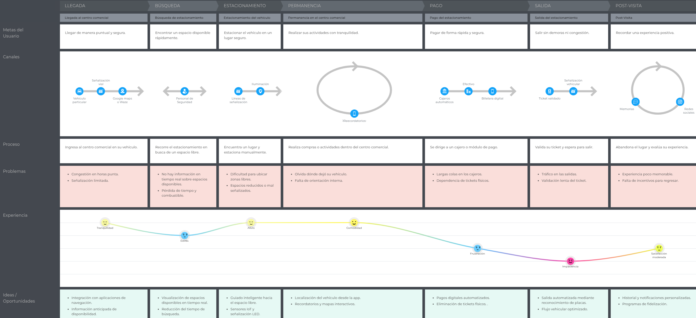
  
**Segmento 2: Administradores de estacionamientos de centros comerciales**

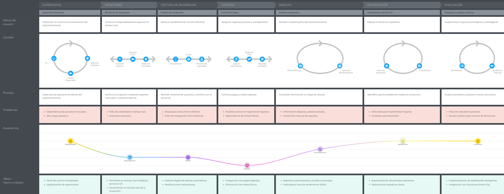  
### 2.3.4. Empathy Mapping

En esta sección se presenta el Empathy Map de nuestros segmentos objetivos. Este artefacto permite comprender sus pensamientos, emociones, necesidades y comportamientos. El análisis se basa en la información obtenida de entrevistas, observación del contexto actual y estudio de soluciones existentes en el mercado. Su propósito es identificar los principales pains y gains, los cuales servirán como base para el diseño de la solución SpotFinder.

**Segmento 1: Conductores que visitan centros comerciales**

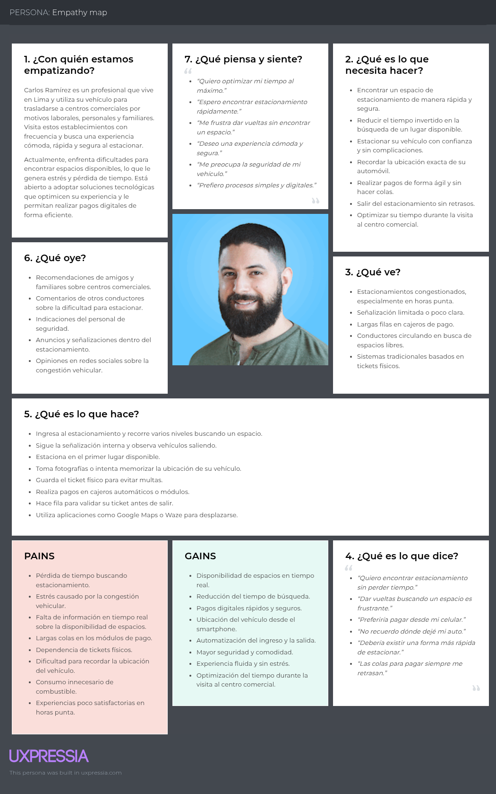
  

**Segmento 2: Administradores de estacionamientos de centros comerciales**

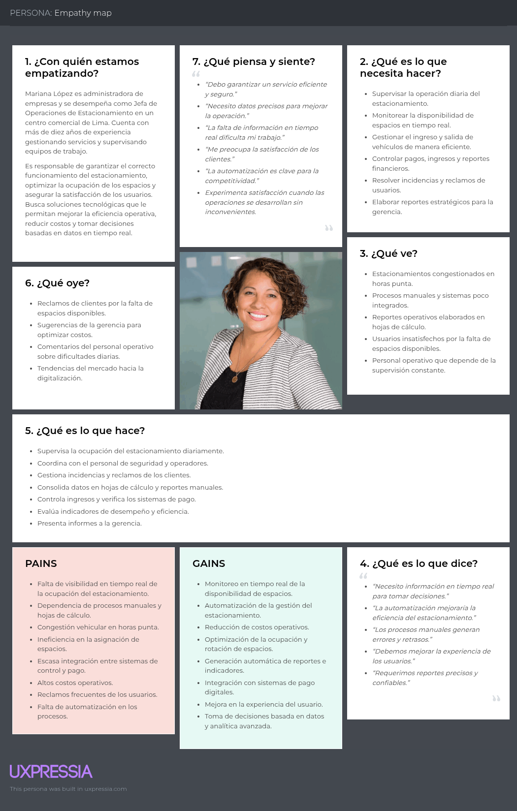

## 2.4. Big Picture Event Storming  

El Big Picture Event Storming es una técnica que permite identificar los eventos más relevantes dentro del sistema, los actores involucrados y la relación entre los distintos componentes. Su propósito es comprender de manera integral el flujo del negocio y detectar oportunidades de mejora en la gestión del estacionamiento.

En el contexto del sistema propuesto, se analizaron los eventos que ocurren desde que el usuario consulta la disponibilidad de espacios hasta que finaliza su experiencia dentro del estacionamiento. Asimismo, se incluyeron procesos adicionales como el monitoreo en tiempo real, la reserva de espacios, el pago digital y la solicitud de servicios.

---

## 2.4.1. EventStorming  

La actividad de Event Storming se realizó de forma colaborativa con la participación de los integrantes del equipo, utilizando un mural digital como soporte visual en la plataforma de Whiteboard. Durante la sesión se emplearon notas adhesivas para representar eventos de dominio, acciones del usuario, actores del sistema y otros elementos clave.

El objetivo principal fue construir una visión global del sistema, comprendiendo cómo interactúan sus componentes a lo largo del tiempo. Además, se buscó identificar puntos críticos del proceso y establecer una base para la definición de bounded contexts en etapas posteriores.

---

### Antes de la sesión  

Se habilitó un espacio de trabajo digital en el cual se organizaron los elementos necesarios para la dinámica. Se definieron lineamientos básicos para fomentar la participación activa y se estableció que todas las ideas propuestas serían consideradas. El enfoque estuvo orientado a promover la exploración libre del dominio.

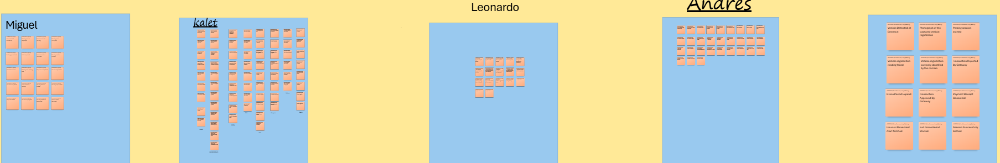

---

### Durante la sesión  

#### Unstructured Exploration  

Se inició con una fase de exploración libre, en la que los participantes identificaron eventos relevantes sin seguir un orden específico. Entre los eventos destacados se encuentran la detección de vehículos, la ocupación de espacios, el inicio de sesiones de estacionamiento, la generación de pagos y el envío de notificaciones. Esta etapa permitió obtener una visión amplia del sistema.

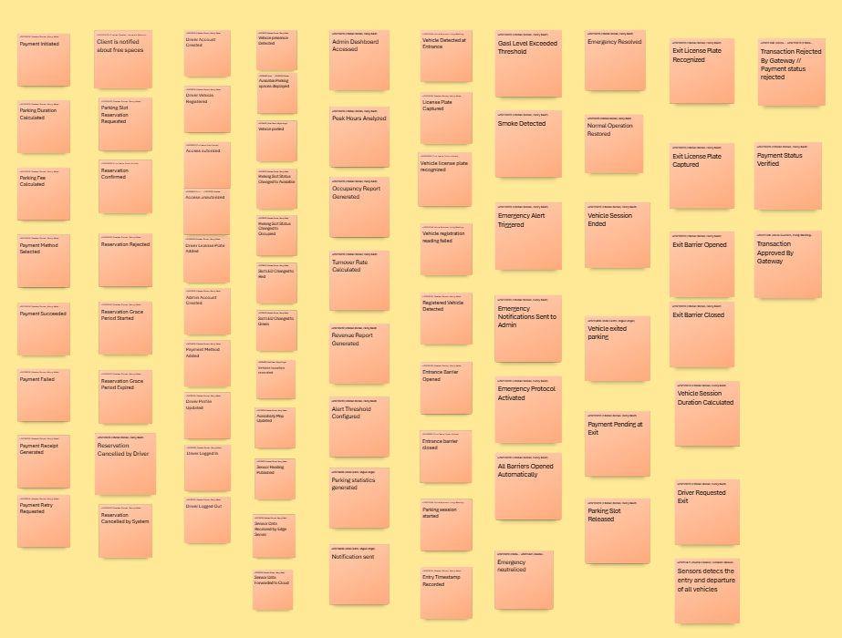

---

#### Timelines  

Una vez recopilados los eventos, se procedió a organizarlos en una secuencia temporal. Se estructuraron en diferentes etapas del sistema, tales como ingreso, monitoreo de espacios, reserva, pago y salida. Esto permitió visualizar claramente el flujo del proceso y las interacciones entre eventos.

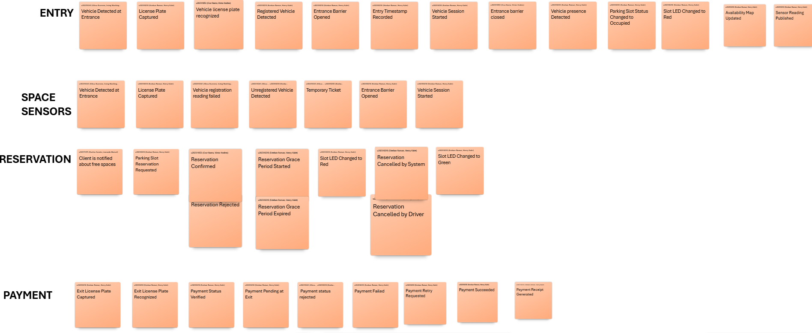
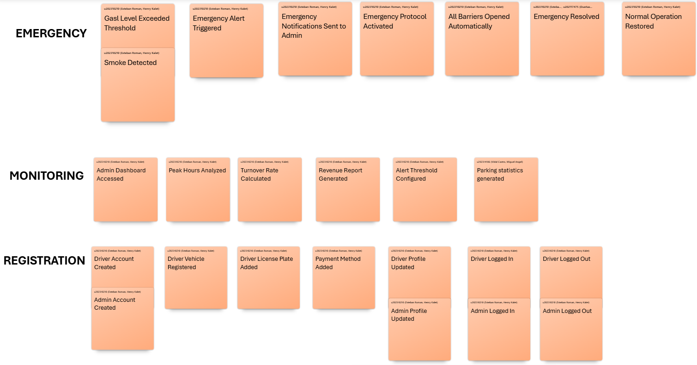

---

#### Pain Points  

Durante el análisis del flujo, se identificaron puntos problemáticos y áreas de incertidumbre. Entre ellos destacan la dificultad para encontrar espacios disponibles, la falta de información en tiempo real, posibles errores en sensores y limitaciones en el proceso de pago. Estos aspectos fueron señalados para su posterior mejora.

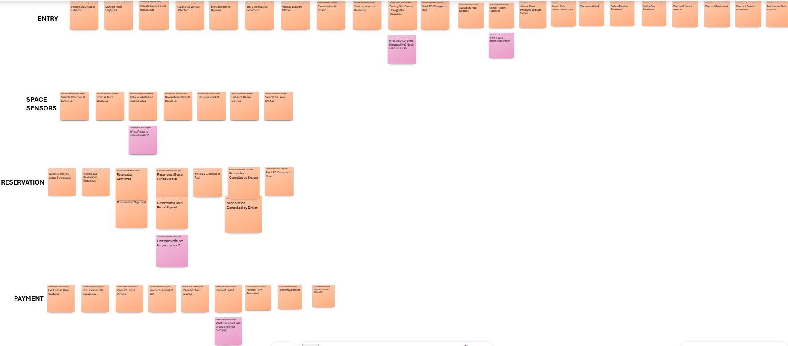
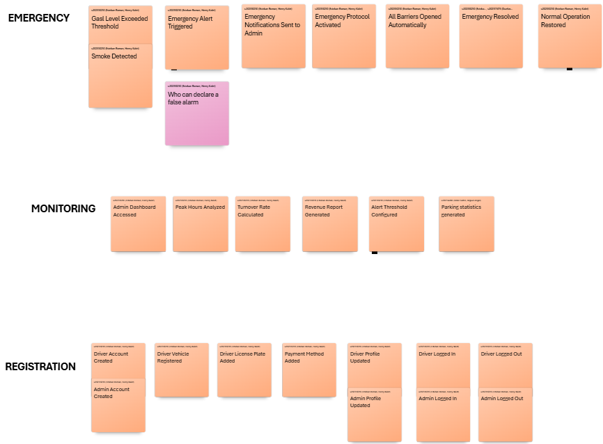

---

#### Pivotal Points  

Se identificaron eventos clave que representan cambios significativos en el sistema, como el inicio de la sesión de estacionamiento, la confirmación del pago y la liberación de un espacio. Estos eventos son fundamentales para comprender la dinámica del sistema y definir sus límites funcionales.

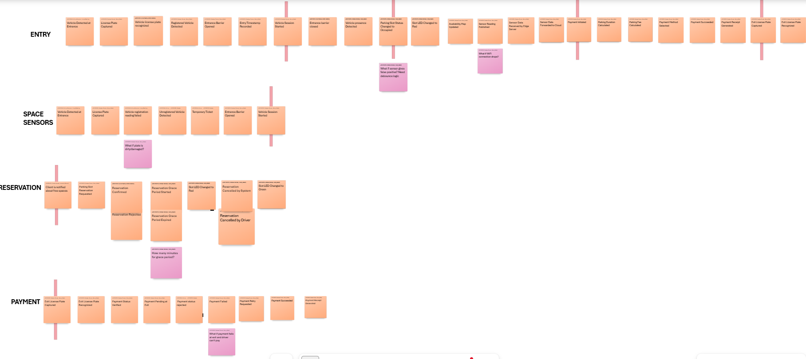
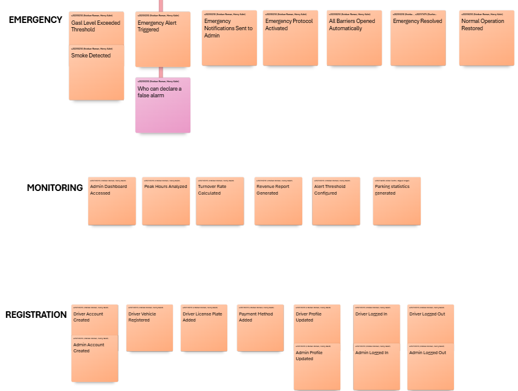

---

#### Commands  

Se determinaron las acciones que generan los eventos dentro del sistema. Entre ellas se incluyen consultar disponibilidad, estacionar un vehículo, realizar un pago y solicitar servicios adicionales. Esto permitió entender cómo interactúan los usuarios con la solución.

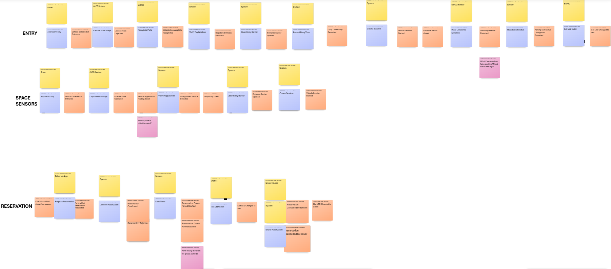
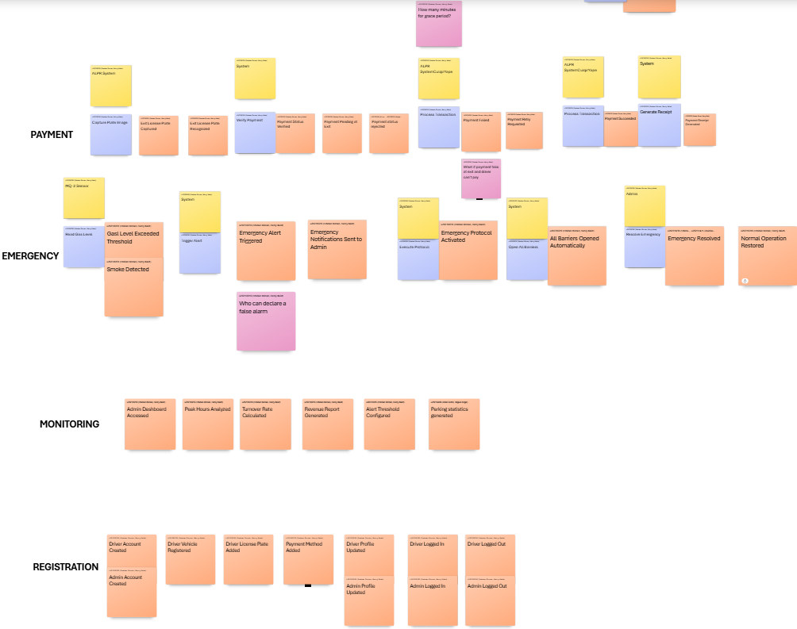

---

#### Policies  

Se establecieron reglas que controlan el comportamiento del sistema frente a ciertos eventos. Por ejemplo, el envío automático de notificaciones cuando el tiempo de estacionamiento está por finalizar, la validación de pagos antes de permitir la salida y la actualización del estado de los espacios en función de los sensores.

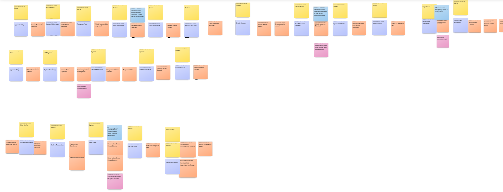
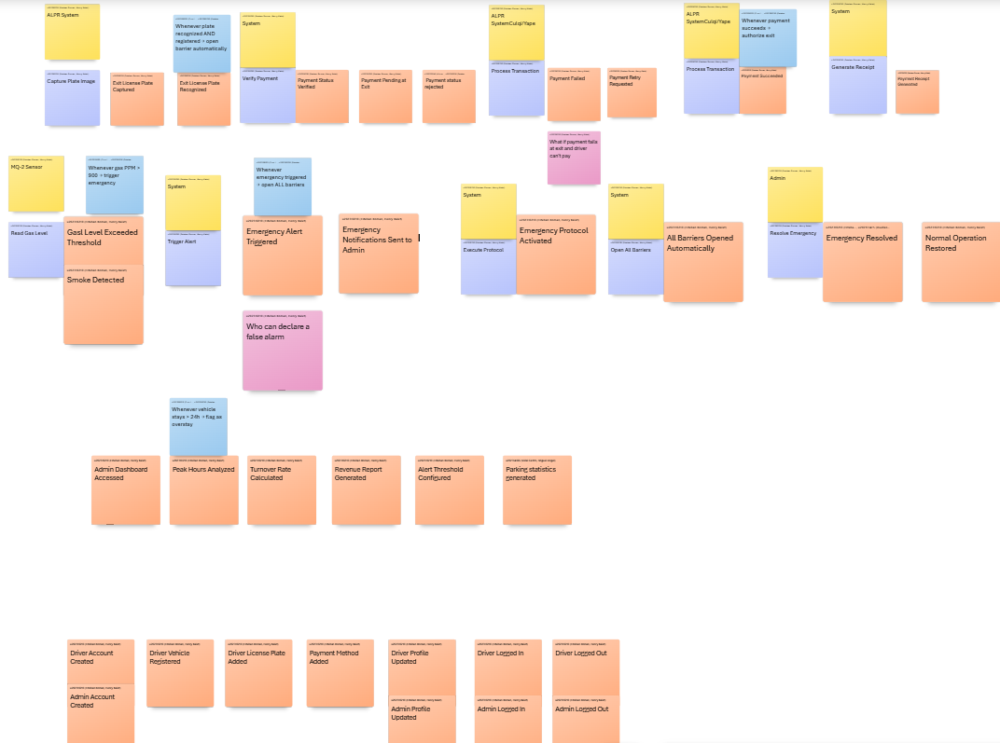

---

#### Read Models  

Se identificaron las vistas necesarias para mostrar información relevante a los usuarios. Estas incluyen el mapa de estacionamiento en tiempo real, el panel del administrador, el resumen de pagos y la visualización de servicios solicitados.

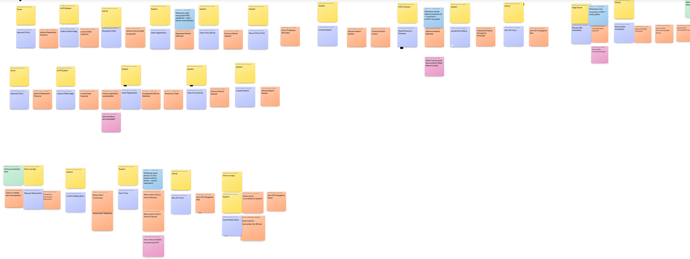
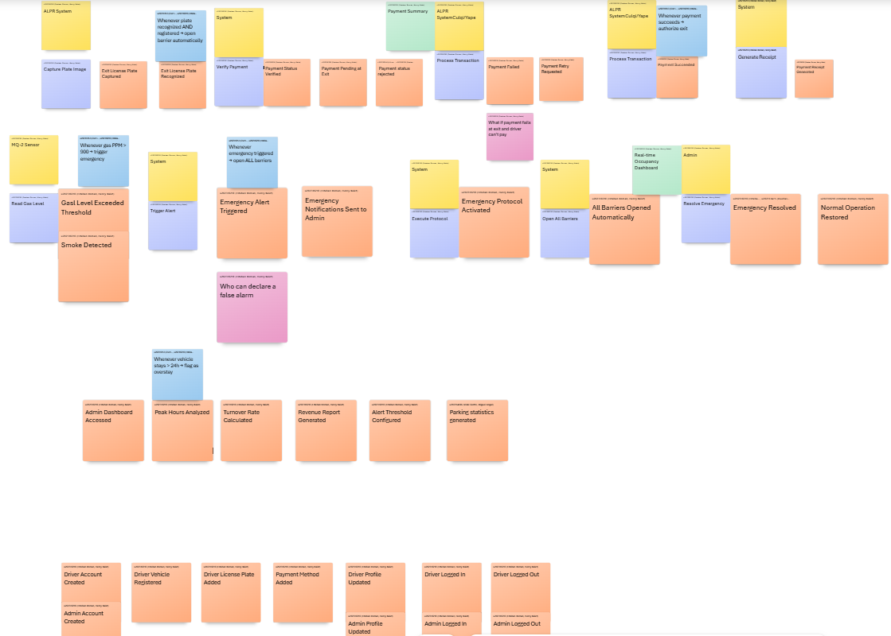

---

#### External Systems  

Se reconocieron los sistemas externos que interactúan con la solución, como las plataformas de pago, los sensores IoT y los servicios adicionales. Esto permitió identificar puntos de integración y dependencia.

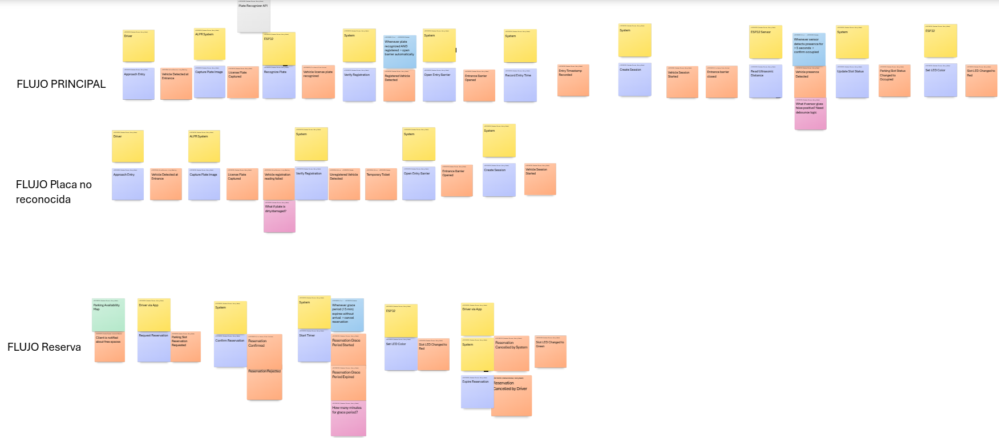
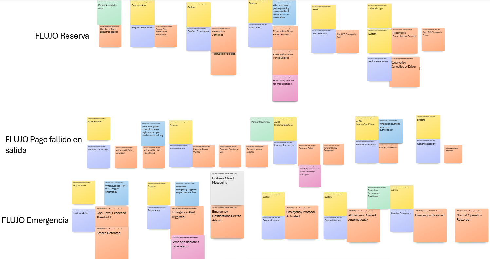
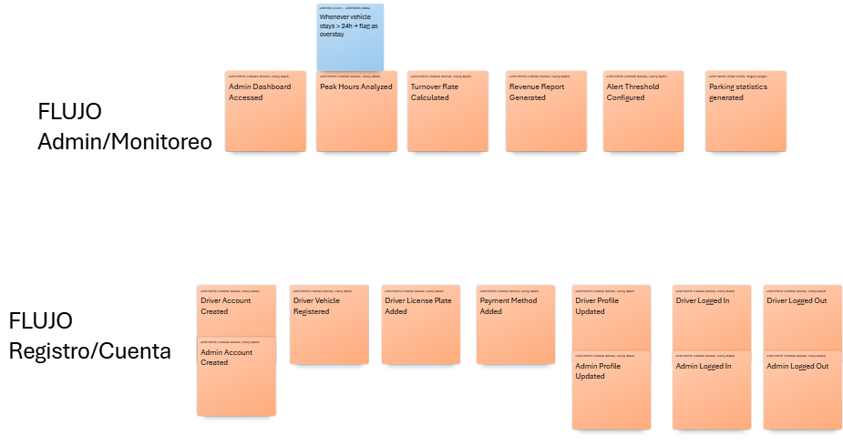

---

#### Aggregates  

Se agruparon los elementos del dominio en entidades principales, tales como usuario, vehículo, espacio de estacionamiento, sesión de estacionamiento, pago y servicio. Estas agrupaciones permiten definir unidades de consistencia dentro del sistema.

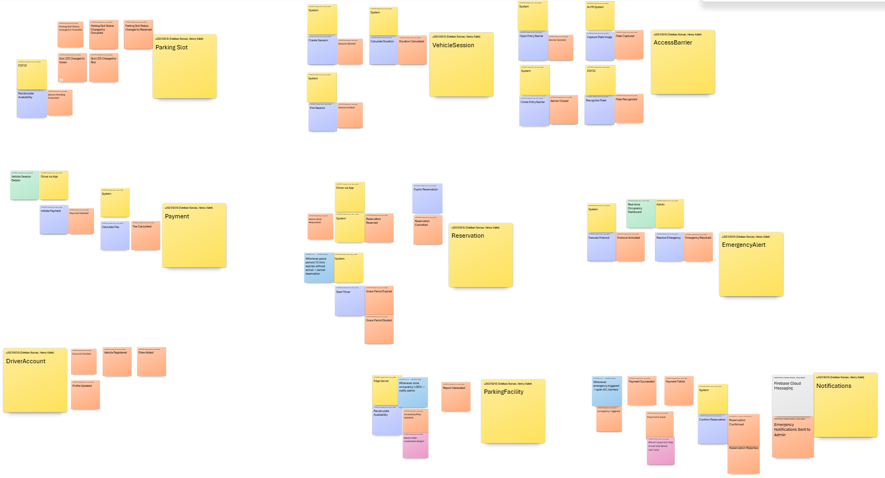

---

#### Bounded Contexts  

Finalmente, se delimitaron los bounded contexts a partir de los eventos, agregados y relaciones identificadas. Estos contextos representan diferentes áreas del sistema, como ingreso, monitoreo, reserva, pago y gestión administrativa, y servirán como base para el diseño de la arquitectura del software.

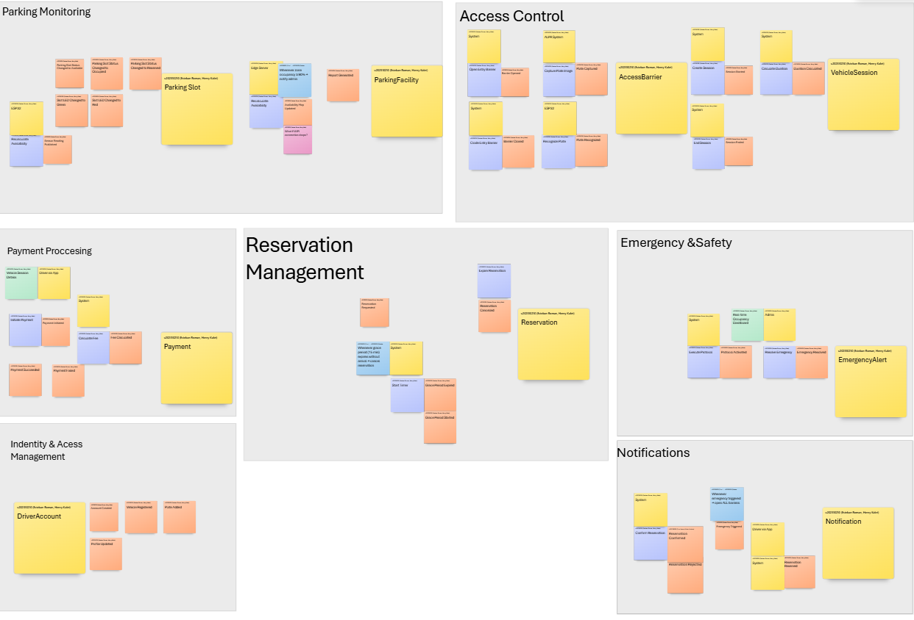

## 2.5. Ubiquitous Language.

| Término            | Equivalente                     | Definición                                                                 |
|--------------------|--------------------------------|---------------------------------------------------------------------------|
| Driver             | Conductor                      | Usuario que utiliza el estacionamiento para ubicar, estacionar y pagar.   |
| Administrator      | Administrador                  | Encargado de supervisar y gestionar el sistema de estacionamiento.        |
| Parking Space      | Espacio de estacionamiento     | Espacio físico donde un vehículo puede estacionarse.                      |
| Occupancy          | Estado de ocupación            | Estado de un espacio, indicando si está libre u ocupado.                  |
| Vehicle            | Vehículo                       | Medio de transporte registrado dentro del sistema.                        |
| License Plate      | Placa del vehículo             | Identificador único asociado a cada vehículo.                             |
| Parking Session    | Sesión de estacionamiento      | Periodo de tiempo en el que un vehículo permanece estacionado.            |
| Payment            | Pago del estacionamiento       | Proceso mediante el cual el usuario paga por el tiempo de estacionamiento.|
| Service            | Servicio adicional             | Servicio solicitado para el vehículo, como lavado u otros.                |
| Notification       | Notificación                   | Mensaje enviado al usuario con información relevante del sistema.         |
| IoT Sensor System  | Sistema de sensores IoT        | Dispositivos que detectan la ocupación de los espacios en tiempo real.    |
| Payment System     | Sistema de pagos               | Plataforma externa que procesa los pagos digitales.                       |
| Space Detection    | Detección de espacios          | Proceso de identificación de espacios libres u ocupados mediante sensores.|
| Availability Check | Consulta de disponibilidad     | Acción de verificar los espacios disponibles en el estacionamiento.       |
| Parking Management | Gestión de estacionamiento     | Proceso completo desde el ingreso hasta la salida del vehículo.           |
| Notification Handling | Gestión de notificaciones   | Proceso de envío y recepción de alertas dentro del sistema.               |
| Payment Processing | Procesamiento de pagos         | Gestión de transacciones digitales realizadas por los usuarios.           |
| Service Management | Gestión de servicios           | Proceso de solicitud y ejecución de servicios adicionales.                |
|Push Notification | Notificación push           | Mensaje enviado al dispositivo móvil del conductor a través de Firebase Cloud Messaging para informar sobre eventos del sistema                |
|Notification Channel | Canal de notificación          | Medio por el cual se envía una notificación: push (FCM), email, o in-app.                |
| Notification Template | Plantilla de notificación           | PFormato predefinido de mensaje para cada tipo de evento.                |
| Notification Preference| Preferencia de notificación          | Proceso de solicitud y ejecución de servicios adicionales.                |
---

# Capítulo III: Requirements Specification

## 3.1. User Stories.

## 3.2. Impact Mapping.

## 3.3. Product Backlog.

---

# Capítulo IV: Solution Software Design

## 4.1. Strategic-Level Domain-Driven Design.

### 4.1.1. Design-Level EventStorming.

#### 4.1.1.1 Candidate Context Discovery.

#### 4.1.1.2 Domain Message Flows Modeling.

#### 4.1.1.3 Bounded Context Canvases.

### 4.1.2. Context Mapping.

### 4.1.3. Software Architecture.
#### 4.1.3.1. Software Architecture System Landscape Diagram.

#### 4.1.3.2. Software Architecture Context Level Diagrams.

#### 4.1.3.3. Software Architecture Container Level Diagrams.

#### 4.1.3.4. Software Architecture Deployment Diagrams.

## 4.2. Tactical-Level Domain-Driven Design

### 4.2.X. Bounded Context: <Bounded Context Name>

#### 4.2.X.1. Domain Layer.

#### 4.2.X.2. Interface Layer.

#### 4.2.X.3. Application Layer.

#### 4.2.X.4. Infrastructure Layer.

#### 4.2.X.5. Bounded Context Software Architecture Component Level Diagrams.

#### 4.2.X.6. Bounded Context Software Architecture Code Level Diagrams.

##### 4.2.X.6.1. Bounded Context Domain Layer Class Diagrams.

##### 4.2.X.6.2. Bounded Context Database Design Diagram.

---

# Conclusiones
## Conclusiones y recomendaciones.
## Video About-the-Team.

---

# Bibliografía

---

# Anexos
